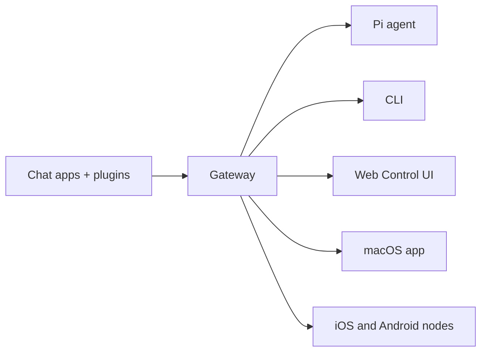

# OpenClaw 🦞

<p align="center">
    
    
</p>

> _"EXFOLIATE! EXFOLIATE!"_ - En rymdhummer, förmodligen

<p align="center"><strong>Alla OS-gateway för AI-agenter över WhatsApp, Telegram, Discord, iMessage, och mer.</strong><br />
  Skicka ett meddelande, få ett agentsvar från din ficka. Plugins lägga Mattermost och mer.
</p>

<Columns>
  <Card title="Get Started" href="/start/getting-started" icon="rocket">
    Installera OpenClaw och starta Gateway på några minuter.
  </Card>
  <Card title="Run the Wizard" href="/start/wizard" icon="sparkles">
    Guidad konfigurering med `openclaw onboard` och parningsflöden.
  </Card>
  <Card title="Open the Control UI" href="/web/control-ui" icon="layout-dashboard">
    Starta webbdashboarden för chatt, konfig och sessioner.
  </Card>
</Columns>

## Vad är OpenClaw?

OpenClaw är en **själv-värd gateway** som ansluter dina favoritchatt-appar — WhatsApp, Telegram, Discord, iMessage, och mer — till AI kodningsagenter som Pi. Du kör en enda Gateway process på din egen maskin (eller en server), och det blir bron mellan dina meddelandeappar och en alltid tillgänglig AI-assistent.

**Vem är det för?** Utvecklare och avancerade användare som vill ha en personlig AI-assistent som de kan skriva till var som helst — utan att ge upp kontrollen över sina data eller förlita sig på en hostad tjänst.

**Vad gör det annorlunda?**

- **Självhostad**: körs på din hårdvara, dina regler
- **Flerkanalig**: en Gateway betjänar WhatsApp, Telegram, Discord och mer samtidigt
- **Agent-native**: byggd för kodningsagenter med verktygsanvändning, sessioner, minne och routing mellan flera agenter
- **Öppen källkod**: MIT-licensierad, community-driven

**Vad behöver du?** Node 22+, en API-nyckel (Anthropic rekommenderas) och 5 minuter.

## Hur det fungerar



Gateway är den enda sanningskällan för sessioner, routing och kanalkopplingar.

## Viktiga funktioner

<Columns>
  <Card title="Multi-channel gateway" icon="network">
    WhatsApp, Telegram, Discord och iMessage med en enda Gateway-process.
  </Card>
  <Card title="Plugin channels" icon="plug">
    Lägg till Mattermost och mer med tilläggspaket.
  </Card>
  <Card title="Multi-agent routing" icon="route">
    Isolerade sessioner per agent, arbetsyta eller avsändare.
  </Card>
  <Card title="Media support" icon="image">
    Skicka och ta emot bilder, ljud och dokument.
  </Card>
  <Card title="Web Control UI" icon="monitor">
    Webbdashboard för chatt, konfig, sessioner och noder.
  </Card>
  <Card title="Mobile nodes" icon="smartphone">
    Para ihop iOS- och Android-noder med Canvas-stöd.
  </Card>
</Columns>

## Snabbstart

<Steps>
  <Step title="Install OpenClaw">
    ```bash
    npm install -g openclaw@latest
    ```
  </Step>
  <Step title="Onboard and install the service">
    ```bash
    openclaw onboard --install-daemon
    ```
  </Step>
  <Step title="Pair WhatsApp and start the Gateway">
    ```bash
    openclaw channels login
    openclaw gateway --port 18789
    ```
  </Step>
</Steps>

Behöver du den fullständiga installationen och utvecklarkonfigurationen? Se [Snabb start](/start/quickstart).

## Dashboard

Öppna webbaserade Control UI efter att Gateway har startat.

- Lokal standard: [http://127.0.0.1:18789/](http://127.0.0.1:18789/)
- Fjärråtkomst: [Webbytor](/web) och [Tailscale](/gateway/tailscale)

<p align="center">
  
</p>

## Konfiguration (valfritt)

Konfig finns på `~/.openclaw/openclaw.json`.

- Om du **inte gör någonting** använder OpenClaw den medföljande Pi-binären i RPC-läge med sessioner per avsändare.
- Om du vill låsa ned det, börja med `channels.whatsapp.allowFrom` och (för grupper) omnämnanderegler.

Exempel:

```json5
{
  channels: {
    whatsapp: {
      allowFrom: ["+15555550123"],
      groups: { "*": { requireMention: true } },
    },
  },
  messages: { groupChat: { mentionPatterns: ["@openclaw"] } },
}
```

## Börja här

<Columns>
  <Card title="Docs hubs" href="/start/hubs" icon="book-open">
    All dokumentation och guider, organiserade efter användningsfall.
  </Card>
  <Card title="Configuration" href="/gateway/configuration" icon="settings">
    Centrala Gateway-inställningar, token och leverantörskonfig.
  </Card>
  <Card title="Remote access" href="/gateway/remote" icon="globe">
    Åtkomstmönster via SSH och tailnet.
  </Card>
  <Card title="Channels" href="/channels/telegram" icon="message-square">
    Kanalspecifik konfigurering för WhatsApp, Telegram, Discord och mer.
  </Card>
  <Card title="Nodes" href="/nodes" icon="smartphone">
    iOS- och Android-noder med parning och Canvas.
  </Card>
  <Card title="Help" href="/help" icon="life-buoy">
    Vanliga lösningar och ingång till felsökning.
  </Card>
</Columns>

## Läs mer

<Columns>
  <Card title="Full feature list" href="/concepts/features" icon="list">
    Kompletta kanal-, routing- och mediakapaciteter.
  </Card>
  <Card title="Multi-agent routing" href="/concepts/multi-agent" icon="route">
    Isolering av arbetsytor och sessioner per agent.
  </Card>
  <Card title="Security" href="/gateway/security" icon="shield">
    Token, tillåtelselistor och säkerhetskontroller.
  </Card>
  <Card title="Troubleshooting" href="/gateway/troubleshooting" icon="wrench">
    Gateway-diagnostik och vanliga fel.
  </Card>
  <Card title="About and credits" href="/reference/credits" icon="info">
    Projektets ursprung, bidragsgivare och licens.
  </Card>
</Columns>
