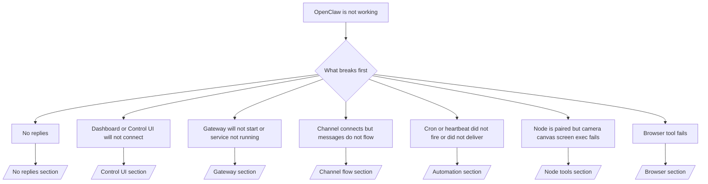

# การแก้ไขปัญหา

หากคุณมีเวลาเพียง 2 นาที ให้ใช้หน้านี้เป็นประตูหน้าในการคัดกรองปัญหา

## 60 วินาทีแรก

รันลำดับขั้นนี้ตามลำดับอย่างเคร่งครัด:

```bash
openclaw status
openclaw status --all
openclaw gateway probe
openclaw gateway status
openclaw doctor
openclaw channels status --probe
openclaw logs --follow
```

เอาต์พุตที่ดีในบรรทัดเดียว:

- `openclaw status` → แสดงช่องทางที่ตั้งค่าไว้และไม่มีข้อผิดพลาดด้านการยืนยันตัวตนที่ชัดเจน
- `openclaw status --all` → มีรายงานฉบับสมบูรณ์และสามารถแชร์ได้
- `openclaw gateway probe` → สามารถเข้าถึงเป้าหมายเกตเวย์ที่คาดหวังได้
- `openclaw gateway status` → `Runtime: running` และ `RPC probe: ok`
- `openclaw doctor` → ไม่มีข้อผิดพลาดด้านคอนฟิก/บริการที่บล็อกการทำงาน
- `openclaw channels status --probe` → ช่องทางรายงาน `connected` หรือ `ready`
- `openclaw logs --follow` → มีกิจกรรมสม่ำเสมอ ไม่มีข้อผิดพลาดร้ายแรงซ้ำๆ

## ผังการตัดสินใจ



<AccordionGroup>
  <Accordion title="No replies">
    ```bash
    openclaw status
    openclaw gateway status
    openclaw channels status --probe
    openclaw pairing list <channel>
    openclaw logs --follow
    ```

    ```
    เอาต์พุตที่ดีควรเป็นดังนี้:
    
    - `Runtime: running`
    - `RPC probe: ok`
    - ช่องทางของคุณแสดงสถานะเชื่อมต่อ/พร้อมใช้งานใน `channels status --probe`
    - ผู้ส่งปรากฏว่าได้รับการอนุมัติแล้ว(หรือนโยบาย DM เปิด/อยู่ใน allowlist)
    
    ลายเซ็นในบันทึกที่พบบ่อย:
    
    - `drop guild message (mention required` → การกรองด้วยการกล่าวถึงบล็อกข้อความใน Discord
    - `pairing request` → ผู้ส่งยังไม่ได้รับการอนุมัติและกำลังรอการอนุมัติการจับคู่ DM
    - `blocked` / `allowlist` ในบันทึกช่องทาง → ผู้ส่ง ห้อง หรือกลุ่มถูกกรอง
    
    หน้าลึก:
    
    - [/gateway/troubleshooting#no-replies](/gateway/troubleshooting#no-replies)
    - [/channels/troubleshooting](/channels/troubleshooting)
    - [/channels/pairing](/channels/pairing)
    ```

  </Accordion>

  <Accordion title="Dashboard or Control UI will not connect">
    ```bash
    openclaw status
    openclaw gateway status
    openclaw logs --follow
    openclaw doctor
    openclaw channels status --probe
    ```

    ```
    เอาต์พุตที่ดีควรเป็นดังนี้:
    
    - แสดง `Dashboard: http://...` ใน `openclaw gateway status`
    - `RPC probe: ok`
    - ไม่มีลูปการยืนยันตัวตนในบันทึก
    
    ลายเซ็นในบันทึกที่พบบ่อย:
    
    - `device identity required` → บริบท HTTP/ไม่ปลอดภัยไม่สามารถทำการยืนยันอุปกรณ์ให้เสร็จได้
    - `unauthorized` / ลูปการเชื่อมต่อใหม่ → โทเคน/รหัสผ่านผิดหรือโหมดการยืนยันตัวตนไม่ตรงกัน
    - `gateway connect failed:` → UI ชี้ไปยัง URL/พอร์ตที่ผิดหรือเกตเวย์ไม่สามารถเข้าถึงได้
    
    หน้าลึก:
    
    - [/gateway/troubleshooting#dashboard-control-ui-connectivity](/gateway/troubleshooting#dashboard-control-ui-connectivity)
    - [/web/control-ui](/web/control-ui)
    - [/gateway/authentication](/gateway/authentication)
    ```

  </Accordion>

  <Accordion title="Gateway will not start or service installed but not running">
    ```bash
    openclaw status
    openclaw gateway status
    openclaw logs --follow
    openclaw doctor
    openclaw channels status --probe
    ```

    ```
    เอาต์พุตที่ดีควรเป็นดังนี้:
    
    - `Service: ... (loaded)`
    - `Runtime: running`
    - `RPC probe: ok`
    
    ลายเซ็นในบันทึกที่พบบ่อย:
    
    - `Gateway start blocked: set gateway.mode=local` → โหมดเกตเวย์ยังไม่ถูกตั้งค่า/เป็น remote
    - `refusing to bind gateway ... without auth` → bind แบบ non-loopback โดยไม่มีโทเคน/รหัสผ่าน
    - `another gateway instance is already listening` หรือ `EADDRINUSE` → พอร์ตถูกใช้งานอยู่แล้ว
    
    หน้าลึก:
    
    - [/gateway/troubleshooting#gateway-service-not-running](/gateway/troubleshooting#gateway-service-not-running)
    - [/gateway/background-process](/gateway/background-process)
    - [/gateway/configuration](/gateway/configuration)
    ```

  </Accordion>

  <Accordion title="Channel connects but messages do not flow">
    ```bash
    openclaw status
    openclaw gateway status
    openclaw logs --follow
    openclaw doctor
    openclaw channels status --probe
    ```

    ```
    เอาต์พุตที่ดีควรเป็นดังนี้:
    
    - ทรานสปอร์ตของช่องทางเชื่อมต่อแล้ว
    - การตรวจสอบการจับคู่/allowlist ผ่าน
    - ตรวจพบการกล่าวถึงในกรณีที่จำเป็น
    
    ลายเซ็นในบันทึกที่พบบ่อย:
    
    - `mention required` → การกรองการกล่าวถึงกลุ่มบล็อกการประมวลผล
    - `pairing` / `pending` → ผู้ส่ง DM ยังไม่ได้รับการอนุมัติ
    - `not_in_channel`, `missing_scope`, `Forbidden`, `401/403` → ปัญหาโทเคนสิทธิ์ของช่องทาง
    
    หน้าลึก:
    
    - [/gateway/troubleshooting#channel-connected-messages-not-flowing](/gateway/troubleshooting#channel-connected-messages-not-flowing)
    - [/channels/troubleshooting](/channels/troubleshooting)
    ```

  </Accordion>

  <Accordion title="Cron or heartbeat did not fire or did not deliver">
    ```bash
    openclaw status
    openclaw gateway status
    openclaw cron status
    openclaw cron list
    openclaw cron runs --id <jobId> --limit 20
    openclaw logs --follow
    ```

    ```
    เอาต์พุตที่ดีควรเป็นดังนี้:
    
    - `cron.status` แสดงว่าเปิดใช้งานและมีเวลาปลุกครั้งถัดไป
    - `cron runs` แสดงรายการ `ok` ล่าสุด
    - เปิดใช้งาน heartbeat และไม่อยู่นอกช่วงเวลาที่กำหนด
    
    ลายเซ็นในบันทึกที่พบบ่อย:
    
    - `cron: scheduler disabled; jobs will not run automatically` → cron ถูกปิดใช้งาน
    - `heartbeat skipped` พร้อม `reason=quiet-hours` → อยู่นอกช่วงเวลาที่ตั้งค่าไว้
    - `requests-in-flight` → เลนหลักไม่ว่าง; การปลุกของ heartbeat ถูกเลื่อน
    - `unknown accountId` → ไม่มีบัญชีเป้าหมายการส่งมอบ heartbeat
    
    หน้าลึก:
    
    - [/gateway/troubleshooting#cron-and-heartbeat-delivery](/gateway/troubleshooting#cron-and-heartbeat-delivery)
    - [/automation/troubleshooting](/automation/troubleshooting)
    - [/gateway/heartbeat](/gateway/heartbeat)
    ```

  </Accordion>

  <Accordion title="Node is paired but tool fails camera canvas screen exec">
    ```bash
    openclaw status
    openclaw gateway status
    openclaw nodes status
    openclaw nodes describe --node <idOrNameOrIp>
    openclaw logs --follow
    ```

    ```
    เอาต์พุตที่ดีควรเป็นดังนี้:
    
    - โหนดแสดงเป็นเชื่อมต่อและจับคู่แล้วสำหรับบทบาท `node`
    - มีความสามารถสำหรับคำสั่งที่คุณเรียกใช้
    - สถานะสิทธิ์ได้รับการอนุญาตสำหรับเครื่องมือ
    
    ลายเซ็นในบันทึกที่พบบ่อย:
    
    - `NODE_BACKGROUND_UNAVAILABLE` → นำแอปโหนดขึ้นมาที่ foreground
    - `*_PERMISSION_REQUIRED` → สิทธิ์ของระบบปฏิบัติการถูกปฏิเสธ/ขาดหาย
    - `SYSTEM_RUN_DENIED: approval required` → การอนุมัติการรันคำสั่งยังค้างอยู่
    - `SYSTEM_RUN_DENIED: allowlist miss` → คำสั่งไม่อยู่ใน allowlist สำหรับ exec
    
    หน้าลึก:
    
    - [/gateway/troubleshooting#node-paired-tool-fails](/gateway/troubleshooting#node-paired-tool-fails)
    - [/nodes/troubleshooting](/nodes/troubleshooting)
    - [/tools/exec-approvals](/tools/exec-approvals)
    ```

  </Accordion>

  <Accordion title="Browser tool fails">
    ```bash
    openclaw status
    openclaw gateway status
    openclaw browser status
    openclaw logs --follow
    openclaw doctor
    ```

    ```
    เอาต์พุตที่ดีควรเป็นดังนี้:
    
    - สถานะเบราว์เซอร์แสดง `running: true` และมีเบราว์เซอร์/โปรไฟล์ที่เลือกไว้
    - โปรไฟล์ `openclaw` เริ่มทำงานหรือรีเลย์ `chrome` มีแท็บที่แนบอยู่
    
    ลายเซ็นในบันทึกที่พบบ่อย:
    
    - `Failed to start Chrome CDP on port` → การเปิดเบราว์เซอร์ภายในเครื่องล้มเหลว
    - `browser.executablePath not found` → พาธไบนารีที่ตั้งค่าไว้ไม่ถูกต้อง
    - `Chrome extension relay is running, but no tab is connected` → ส่วนขยายไม่ได้ถูกแนบ
    - `Browser attachOnly is enabled ... not reachable` → โปรไฟล์แบบ attach-only ไม่มีเป้าหมาย CDP ที่ใช้งานอยู่
    
    หน้าลึก:
    
    - [/gateway/troubleshooting#browser-tool-fails](/gateway/troubleshooting#browser-tool-fails)
    - [/tools/browser-linux-troubleshooting](/tools/browser-linux-troubleshooting)
    - [/tools/chrome-extension](/tools/chrome-extension)
    ```

  </Accordion>
</AccordionGroup>
