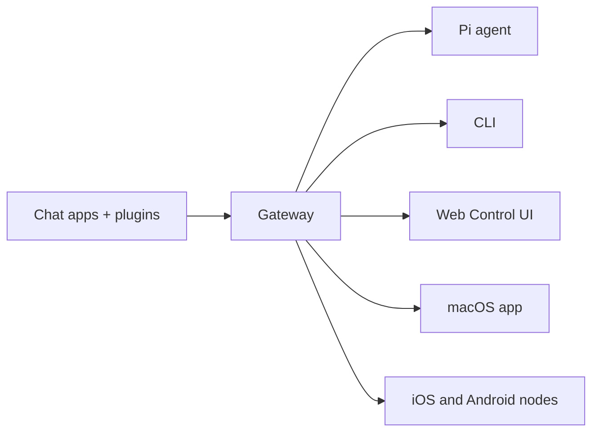

# OpenClaw 🦞

<p align="center">
    
    
</p>

> _"EXFOLIATE! EXFOLIATE!"_ — กุ้งล็อบสเตอร์อวกาศสักตัวหนึ่งน่าจะพูดแบบนี้

<p align="center"><strong>เกตเวย์ที่ใช้ได้บนทุกระบบปฏิบัติการสำหรับเอเจนต์AIผ่านWhatsApp, Telegram, Discord, iMessageและอื่นๆ</strong><br />
  ส่งข้อความครั้งเดียว รับคำตอบจากเอเจนต์ได้จากกระเป๋าคุณ ปลั๊กอินช่วยเพิ่ม Mattermostและอื่นๆ
<br />
  Send a message, get an agent response from your pocket. Plugins add Mattermost and more.
</p>

<Columns>
  <Card title="Get Started" href="/start/getting-started" icon="rocket">
    ติดตั้งOpenClawและเปิดใช้งานGatewayได้ภายในไม่กี่นาที
  </Card>
  <Card title="Run the Wizard" href="/start/wizard" icon="sparkles">
    การตั้งค่าแบบมีผู้ช่วยพร้อม `openclaw onboard` และขั้นตอนการจับคู่
  </Card>
  <Card title="Open the Control UI" href="/web/control-ui" icon="layout-dashboard">
    เปิดแดชบอร์ดบนเบราว์เซอร์สำหรับแชต คอนฟิก และเซสชัน
  </Card>
</Columns>

## What is OpenClaw?

OpenClawคือ **เกตเวย์แบบโฮสต์เอง** ที่เชื่อมต่อแอปแชตที่คุณชื่นชอบ—WhatsApp, Telegram, Discord, iMessageและอื่นๆ—เข้ากับเอเจนต์AIด้านการเขียนโค้ดอย่างPi คุณรันกระบวนการGatewayเพียงตัวเดียวบนเครื่องของคุณเอง(หรือบนเซิร์ฟเวอร์)และมันจะทำหน้าที่เป็นสะพานเชื่อมระหว่างแอปส่งข้อความกับผู้ช่วยAIที่พร้อมใช้งานตลอดเวลา You run a single Gateway process on your own machine (or a server), and it becomes the bridge between your messaging apps and an always-available AI assistant.

**เหมาะกับใคร?** นักพัฒนาและผู้ใช้ขั้นสูงที่ต้องการผู้ช่วยAIส่วนตัวซึ่งสามารถส่งข้อความหาได้จากทุกที่—โดยไม่ต้องสละการควบคุมข้อมูลหรือพึ่งพาบริการแบบโฮสต์

**อะไรที่ทำให้แตกต่าง?**

- **โฮสต์เอง**: รันบนฮาร์ดแวร์ของคุณ ภายใต้กติกาของคุณ
- **หลายช่องทาง**: Gatewayหนึ่งตัวให้บริการWhatsApp, Telegram, Discordและอื่นๆพร้อมกัน
- **ออกแบบเพื่อเอเจนต์โดยเฉพาะ**: สร้างมาสำหรับเอเจนต์เขียนโค้ดที่ใช้เครื่องมือ เซสชัน หน่วยความจำ และการกำหนดเส้นทางหลายเอเจนต์
- **โอเพนซอร์ส**: ใบอนุญาตMIT ขับเคลื่อนโดยชุมชน

**ต้องใช้อะไรบ้าง?** Node 22+, คีย์API(แนะนำAnthropic)และเวลาเพียง5นาที

## How it works



Gatewayเป็นแหล่งความจริงเดียวสำหรับเซสชัน การกำหนดเส้นทาง และการเชื่อมต่อช่องทางต่างๆ

## Key capabilities

<Columns>
  <Card title="Multi-channel gateway" icon="network">
    WhatsApp, Telegram, DiscordและiMessageด้วยกระบวนการGatewayเดียว
  </Card>
  <Card title="Plugin channels" icon="plug">
    เพิ่มMattermostและอื่นๆด้วยแพ็กเกจส่วนขยาย
  </Card>
  <Card title="Multi-agent routing" icon="route">
    เซสชันที่แยกจากกันต่อเอเจนต์ เวิร์กสเปซ หรือผู้ส่ง
  </Card>
  <Card title="Media support" icon="image">
    ส่งและรับรูปภาพ เสียง และเอกสาร
  </Card>
  <Card title="Web Control UI" icon="monitor">
    แดชบอร์ดบนเบราว์เซอร์สำหรับแชต คอนฟิก เซสชัน และโหนด
  </Card>
  <Card title="Mobile nodes" icon="smartphone">
    จับคู่โหนดiOSและAndroidพร้อมรองรับCanvas
  </Card>
</Columns>

## Quick start

<Steps>
  <Step title="Install OpenClaw">
    ```bash
    npm install -g openclaw@latest
    ```
  </Step>
  <Step title="Onboard and install the service">
    ```bash
    openclaw onboard --install-daemon
    ```
  </Step>
  <Step title="Pair WhatsApp and start the Gateway">
    ```bash
    openclaw channels login
    openclaw gateway --port 18789
    ```
  </Step>
</Steps>

Need the full install and dev setup? See [Quick start](/start/quickstart).

## Dashboard

เปิดControl UIบนเบราว์เซอร์หลังจากGatewayเริ่มทำงานแล้ว

- ค่าเริ่มต้นภายในเครื่อง: [http://127.0.0.1:18789/](http://127.0.0.1:18789/)
- การเข้าถึงระยะไกล: [Web surfaces](/web) และ [Tailscale](/gateway/tailscale)

<p align="center">
  
</p>

## Configuration (optional)

คอนฟิกจะอยู่ที่ `~/.openclaw/openclaw.json`.

- หากคุณ **ไม่ทำอะไรเลย** OpenClawจะใช้ไบนารีPiที่มาพร้อมกันในโหมดRPCพร้อมเซสชันแยกตามผู้ส่ง
- หากต้องการล็อกดาวน์ เริ่มต้นด้วย `channels.whatsapp.allowFrom` และ(สำหรับกลุ่ม)กฎการกล่าวถึง

ตัวอย่าง:

```json5
{
  channels: {
    whatsapp: {
      allowFrom: ["+15555550123"],
      groups: { "*": { requireMention: true } },
    },
  },
  messages: { groupChat: { mentionPatterns: ["@openclaw"] } },
}
```

## Start here

<Columns>
  <Card title="Docs hubs" href="/start/hubs" icon="book-open">
    เอกสารและคู่มือทั้งหมด จัดระเบียบตามกรณีการใช้งาน
  </Card>
  <Card title="Configuration" href="/gateway/configuration" icon="settings">
    การตั้งค่าGatewayหลัก โทเคน และคอนฟิกผู้ให้บริการ
  </Card>
  <Card title="Remote access" href="/gateway/remote" icon="globe">
    รูปแบบการเข้าถึงผ่านSSHและtailnet
  </Card>
  <Card title="Channels" href="/channels/telegram" icon="message-square">
    การตั้งค่าเฉพาะช่องทางสำหรับWhatsApp, Telegram, Discordและอื่นๆ
  </Card>
  <Card title="Nodes" href="/nodes" icon="smartphone">
    โหนดiOSและAndroidพร้อมการจับคู่และCanvas
  </Card>
  <Card title="Help" href="/help" icon="life-buoy">
    จุดเริ่มต้นสำหรับวิธีแก้ไขทั่วไปและการแก้ไขปัญหา
  </Card>
</Columns>

## Learn more

<Columns>
  <Card title="Full feature list" href="/concepts/features" icon="list">
    ความสามารถด้านช่องทาง การกำหนดเส้นทาง และสื่ออย่างครบถ้วน
  </Card>
  <Card title="Multi-agent routing" href="/concepts/multi-agent" icon="route">
    การแยกเวิร์กสเปซและเซสชันต่อเอเจนต์
  </Card>
  <Card title="Security" href="/gateway/security" icon="shield">
    โทเคน รายการอนุญาต และการควบคุมด้านความปลอดภัย
  </Card>
  <Card title="Troubleshooting" href="/gateway/troubleshooting" icon="wrench">
    การวินิจฉัยGatewayและข้อผิดพลาดที่พบบ่อย
  </Card>
  <Card title="About and credits" href="/reference/credits" icon="info">
    ที่มาของโครงการ ผู้มีส่วนร่วม และใบอนุญาต
  </Card>
</Columns>
