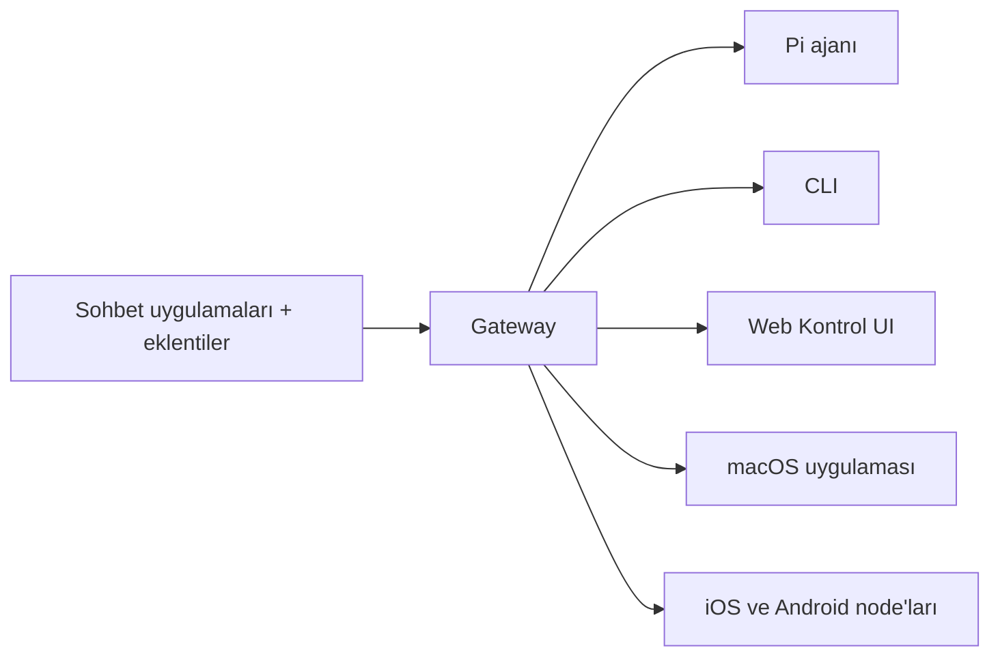

# OpenClaw 🦞

<p align="center">
    
    
</p>

> _"EXFOLIATE! EXFOLIATE!"_ — Muhtemelen bir uzay ıstakozu

<p align="center">
  <strong>WhatsApp, Telegram, Discord, iMessage ve daha fazlası arasında AI ajanları için herhangi bir işletim sistemi ağ geçidi.</strong><br />
  Bir mesaj gönderin, cepten bir ajan yanıtı alın. Eklentiler Mattermost ve daha fazlasını ekler.
</p>

<Columns>
  <Card title="Başlayın" href="/start/getting-started" icon="rocket">
    OpenClaw'u kurun ve Gateway'i dakikalar içinde çalıştırın.
  </Card>
  <Card title="Sihirbazı Çalıştırın" href="/start/wizard" icon="sparkles">
    `openclaw onboard` ve eşleştirme akışlarıyla rehberli kurulum.
  </Card>
  <Card title="Kontrol UI'yi Açın" href="/web/control-ui" icon="layout-dashboard">
    Sohbet, yapılandırma ve oturumlar için tarayıcı panosunu başlatın.
  </Card>
</Columns>

## OpenClaw Nedir?

OpenClaw, en sevdiğiniz sohbet uygulamalarını — WhatsApp, Telegram, Discord, iMessage ve daha fazlası — Pi gibi AI kodlama ajanlarına bağlayan **kendi kendine barındırılan bir ağ geçididir**. Tek bir Gateway işlemini kendi makinenizde (veya bir sunucuda) çalıştırırsınız ve bu, mesajlaşma uygulamalarınız ile her zaman kullanılabilir bir AI asistanı arasında köprü olur.

**Kimin için?** Verilerini kontrol etmekten veya barındırılan bir hizmete güvenmek istemeden, her yerden mesaj gönderebilecekleri kişisel bir AI asistanı isteyen geliştiriciler ve güçlü kullanıcılar.

**Onu farklı kılan nedir?**

- **Kendi kendine barındırılan**: donanımınızda çalışır, kurallar sizin
- **Çok kanallı**: Tek bir Gateway WhatsApp, Telegram, Discord ve daha fazlasını eşzamanlı olarak sunar
- **Ajan odaklı**: araç kullanımı, oturumlar, bellek ve çoklu ajan yönlendirmesi ile kodlama ajanları için inşa edilmiş
- **Açık kaynak**: MIT lisanslı, topluluk destekli

**Neye ihtiyacınız var?** Node 24 (önerilir) veya uyumluluk için Node 22 LTS (`22.16+`), seçtiğiniz sağlayıcıdan bir API anahtarı ve 5 dakika. En iyi kalite ve güvenlik için, mevcut en güçlü en son nesil modeli kullanın.

## Nasıl Çalışır



Gateway, oturumlar, yönlendirme ve kanal bağlantıları için tek doğru kaynaktır.

## Temel Özellikler

<Columns>
  <Card title="Çok kanallı ağ geçidi" icon="network">
    Tek bir Gateway işlemiyle WhatsApp, Telegram, Discord ve iMessage.
  </Card>
  <Card title="Eklenti kanalları" icon="plug">
    Uzantı paketleriyle Mattermost ve daha fazlasını ekleyin.
  </Card>
  <Card title="Çoklu ajan yönlendirme" icon="route">
    Ajan, çalışma alanı veya gönderici başına izole oturumlar.
  </Card>
  <Card title="Medya desteği" icon="image">
    Görsel, ses ve belge gönderme ve alma.
  </Card>
  <Card title="Web Kontrol UI" icon="monitor">
    Sohbet, yapılandırma, oturumlar ve node'lar için tarayıcı panosu.
  </Card>
  <Card title="Mobil node'lar" icon="smartphone">
    Canvas, kamera ve ses özellikli iş akışları için iOS ve Android node'larını eşleştirin.
  </Card>
</Columns>

## Hızlı Başlangıç

<Steps>
  <Step title="OpenClaw'u kurun">
    ```bash
    npm install -g openclaw@latest
    ```
  </Step>
  <Step title="Onboard yapın ve servisi kurun">
    ```bash
    openclaw onboard --install-daemon
    ```
  </Step>
  <Step title="WhatsApp'ı eşleştirin ve Gateway'i başlatın">
    ```bash
    openclaw channels login
    openclaw gateway --port 18789
    ```
  </Step>
</Steps>

Tam kurulum ve geliştirme ortamı mı gerekiyor? Bkz. [Hızlı başlangıç](/start/quickstart).

## Pano

Gateway başladıktan sonra tarayıcı Kontrol UI'yi açın.

- Yerel varsayılan: [http://127.0.0.1:18789/](http://127.0.0.1:18789/)
- Uzaktan erişim: [Web yüzeyleri](/web) ve [Tailscale](/gateway/tailscale)

<p align="center">
  
</p>

## Yapılandırma (isteğe bağlı)

Yapılandırma `~/.openclaw/openclaw.json` konumunda bulunur.

- **Hiçbir şey yapmazsanız**, OpenClaw, gönderici başına oturumlar ile RPC modunda paketlenmiş Pi ikilisini kullanır.
- Kısıtlamak istiyorsanız, `channels.whatsapp.allowFrom` ile başlayın ve (gruplar için) mention kuralları ile.

Örnek:

```json5
{
  channels: {
    whatsapp: {
      allowFrom: ["+15555550123"],
      groups: { "*": { requireMention: true } },
    },
  },
  messages: { groupChat: { mentionPatterns: ["@openclaw"] } },
}
```

## Buradan Başlayın

<Columns>
  <Card title="Belge hub'ları" href="/start/hubs" icon="book-open">
    Kullanım durumuna göre düzenlenmiş tüm belgeler ve kılavuzlar.
  </Card>
  <Card title="Yapılandırma" href="/gateway/configuration" icon="settings">
    Çekirdek Gateway ayarları, jetonlar ve sağlayıcı yapılandırması.
  </Card>
  <Card title="Uzaktan Erişim" href="/gateway/remote" icon="globe">
    SSH ve tailnet erişim kalıpları.
  </Card>
  <Card title="Kanallar" href="/channels/telegram" icon="message-square">
    WhatsApp, Telegram, Discord ve daha fazlası için kanal kurulumu.
  </Card>
  <Card title="Node'lar" href="/nodes" icon="smartphone">
    Eşleştirme, Canvas, kamera ve cihaz eylemleriyle iOS ve Android node'ları.
  </Card>
  <Card title="Yardım" href="/help" icon="life-buoy">
    Yaygın düzeltmeler ve sorun giderme giriş noktası.
  </Card>
</Columns>

## Daha Fazla Bilgi

<Columns>
  <Card title="Tam özellik listesi" href="/concepts/features" icon="list">
    Tam kanal, yönlendirme ve medya yetenekleri.
  </Card>
  <Card title="Çoklu ajan yönlendirme" href="/concepts/multi-agent" icon="route">
    Çalışma alanı izolasyonu ve ajan başına oturumlar.
  </Card>
  <Card title="Güvenlik" href="/gateway/security" icon="shield">
    Jetonlar, izin listeleri ve güvenlik kontrolleri.
  </Card>
  <Card title="Sorun Giderme" href="/gateway/troubleshooting" icon="wrench">
    Gateway tanılama ve yaygın hatalar.
  </Card>
  <Card title="Hakkında ve Katkılar" href="/reference/credits" icon="info">
    Proje kökenleri, katkıcılar ve lisans.
  </Card>
</Columns>
