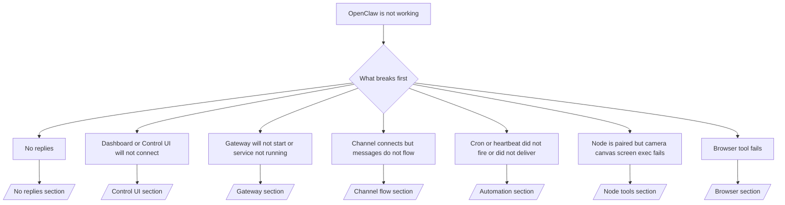

# Sorun Giderme

Yalnızca 2 dakikanız varsa, bu sayfayı triyaj için bir ön kapı olarak kullanın.

## İlk 60 saniye

Aşağıdaki adım dizisini sırayla ve aynen çalıştırın:

```bash
openclaw status
openclaw status --all
openclaw gateway probe
openclaw gateway status
openclaw doctor
openclaw channels status --probe
openclaw logs --follow
```

Tek satırda iyi çıktı:

- `openclaw status` → yapılandırılmış kanalları gösterir ve belirgin kimlik doğrulama hataları yoktur.
- `openclaw status --all` → tam rapor mevcuttur ve paylaşılabilir.
- `openclaw gateway probe` → beklenen gateway hedefi erişilebilirdir.
- `openclaw gateway status` → `Runtime: running` ve `RPC probe: ok`.
- `openclaw doctor` → engelleyici yapılandırma/hizmet hatası yoktur.
- `openclaw channels status --probe` → kanallar `connected` veya `ready` durumunu bildirir.
- `openclaw logs --follow` → istikrarlı etkinlik, tekrarlayan kritik hata yoktur.

## Karar ağacı



<AccordionGroup>
  <Accordion title="No replies">
    ```bash
    openclaw status
    openclaw gateway status
    openclaw channels status --probe
    openclaw pairing list <channel>
    openclaw logs --follow
    ```

    ```
    İyi çıktı şu şekildedir:
    
    - `Runtime: running`
    - `RPC probe: ok`
    - Kanalınız `channels status --probe` içinde bağlı/hazır olarak görünür
    - Gönderen onaylı görünür (veya DM politikası açık/izin listesinde)
    
    Yaygın günlük imzaları:
    
    - `drop guild message (mention required` → Discord’da bahsetme geçidi mesajı engelledi.
    - `pairing request` → gönderen onaylı değil ve DM eşleştirme onayını bekliyor.
    - Kanal günlüklerinde `blocked` / `allowlist` → gönderen, oda veya grup filtrelenmiş.
    
    Derinlemesine sayfalar:
    
    - [/gateway/troubleshooting#no-replies](/gateway/troubleshooting#no-replies)
    - [/channels/troubleshooting](/channels/troubleshooting)
    - [/channels/pairing](/channels/pairing)
    ```

  </Accordion>

  <Accordion title="Dashboard or Control UI will not connect">
    ```bash
    openclaw status
    openclaw gateway status
    openclaw logs --follow
    openclaw doctor
    openclaw channels status --probe
    ```

    ```
    İyi çıktı şu şekildedir:
    
    - `Dashboard: http://...` değeri `openclaw gateway status` içinde gösterilir
    - `RPC probe: ok`
    - Günlüklerde kimlik doğrulama döngüsü yoktur
    
    Yaygın günlük imzaları:
    
    - `device identity required` → HTTP/güvenli olmayan bağlam cihaz kimlik doğrulamasını tamamlayamaz.
    - `unauthorized` / yeniden bağlanma döngüsü → yanlış belirteç/parola veya kimlik doğrulama modu uyuşmazlığı.
    - `gateway connect failed:` → UI yanlış URL/portu hedefliyor veya gateway erişilemez.
    
    Derinlemesine sayfalar:
    
    - [/gateway/troubleshooting#dashboard-control-ui-connectivity](/gateway/troubleshooting#dashboard-control-ui-connectivity)
    - [/web/control-ui](/web/control-ui)
    - [/gateway/authentication](/gateway/authentication)
    ```

  </Accordion>

  <Accordion title="Gateway will not start or service installed but not running">
    ```bash
    openclaw status
    openclaw gateway status
    openclaw logs --follow
    openclaw doctor
    openclaw channels status --probe
    ```

    ```
    İyi çıktı şu şekildedir:
    
    - `Service: ... (loaded)`
    - `Runtime: running`
    - `RPC probe: ok`
    
    Yaygın günlük imzaları:
    
    - `Gateway start blocked: set gateway.mode=local` → gateway modu ayarlanmamış/uzak.
    - `refusing to bind gateway ... without auth` → belirteç/parola olmadan loopback olmayan bağlama.
    - `another gateway instance is already listening` veya `EADDRINUSE` → port zaten kullanımda.
    
    Derinlemesine sayfalar:
    
    - [/gateway/troubleshooting#gateway-service-not-running](/gateway/troubleshooting#gateway-service-not-running)
    - [/gateway/background-process](/gateway/background-process)
    - [/gateway/configuration](/gateway/configuration)
    ```

  </Accordion>

  <Accordion title="Channel connects but messages do not flow">
    ```bash
    openclaw status
    openclaw gateway status
    openclaw logs --follow
    openclaw doctor
    openclaw channels status --probe
    ```

    ```
    İyi çıktı şu şekildedir:
    
    - Kanal taşıması bağlı.
    - Eşleştirme/izin listesi kontrolleri geçiyor.
    - Gerekli olan yerlerde bahsetmeler algılanıyor.
    
    Yaygın günlük imzaları:
    
    - `mention required` → grup bahsetme geçidi işlemi engelledi.
    - `pairing` / `pending` → DM göndereni henüz onaylı değil.
    - `not_in_channel`, `missing_scope`, `Forbidden`, `401/403` → kanal izin belirteci sorunu.
    
    Derinlemesine sayfalar:
    
    - [/gateway/troubleshooting#channel-connected-messages-not-flowing](/gateway/troubleshooting#channel-connected-messages-not-flowing)
    - [/channels/troubleshooting](/channels/troubleshooting)
    ```

  </Accordion>

  <Accordion title="Cron or heartbeat did not fire or did not deliver">
    ```bash
    openclaw status
    openclaw gateway status
    openclaw cron status
    openclaw cron list
    openclaw cron runs --id <jobId> --limit 20
    openclaw logs --follow
    ```

    ```
    İyi çıktı şu şekildedir:
    
    - `cron.status` etkin olarak ve bir sonraki uyanma zamanı ile görünür.
    - `cron runs` yakın tarihli `ok` girdilerini gösterir.
    - Heartbeat etkindir ve aktif saatlerin dışındadır.
    
    Yaygın günlük imzaları:
    
    - `cron: scheduler disabled; jobs will not run automatically` → cron devre dışı.
    - `heartbeat skipped` ve `reason=quiet-hours` → yapılandırılmış aktif saatlerin dışında.
    - `requests-in-flight` → ana hat meşgul; heartbeat uyanışı ertelendi.
    - `unknown accountId` → heartbeat teslim hedefi hesabı mevcut değil.
    
    Derinlemesine sayfalar:
    
    - [/gateway/troubleshooting#cron-and-heartbeat-delivery](/gateway/troubleshooting#cron-and-heartbeat-delivery)
    - [/automation/troubleshooting](/automation/troubleshooting)
    - [/gateway/heartbeat](/gateway/heartbeat)
    ```

  </Accordion>

  <Accordion title="Node is paired but tool fails camera canvas screen exec">
    ```bash
    openclaw status
    openclaw gateway status
    openclaw nodes status
    openclaw nodes describe --node <idOrNameOrIp>
    openclaw logs --follow
    ```

    ```
    İyi çıktı şu şekildedir:
    
    - Düğüm, `node` rolü için bağlı ve eşleştirilmiş olarak listelenir.
    - Çağırdığınız komut için yetenek mevcuttur.
    - Araç için izin durumu verilmiştir.
    
    Yaygın günlük imzaları:
    
    - `NODE_BACKGROUND_UNAVAILABLE` → düğüm uygulamasını ön plana getirin.
    - `*_PERMISSION_REQUIRED` → işletim sistemi izni reddedildi/eksik.
    - `SYSTEM_RUN_DENIED: approval required` → çalıştırma onayı beklemede.
    - `SYSTEM_RUN_DENIED: allowlist miss` → komut çalıştırma izin listesinde değil.
    
    Derinlemesine sayfalar:
    
    - [/gateway/troubleshooting#node-paired-tool-fails](/gateway/troubleshooting#node-paired-tool-fails)
    - [/nodes/troubleshooting](/nodes/troubleshooting)
    - [/tools/exec-approvals](/tools/exec-approvals)
    ```

  </Accordion>

  <Accordion title="Browser tool fails">
    ```bash
    openclaw status
    openclaw gateway status
    openclaw browser status
    openclaw logs --follow
    openclaw doctor
    ```

    ```
    İyi çıktı şu şekildedir:
    
    - Tarayıcı durumu `running: true` ve seçili bir tarayıcı/profil gösterir.
    - `openclaw` profili başlar veya `chrome` aktarımı bağlı bir sekmeye sahiptir.
    
    Yaygın günlük imzaları:
    
    - `Failed to start Chrome CDP on port` → yerel tarayıcı başlatma başarısız oldu.
    - `browser.executablePath not found` → yapılandırılmış ikili dosya yolu yanlış.
    - `Chrome extension relay is running, but no tab is connected` → uzantı bağlı değil.
    - `Browser attachOnly is enabled ... not reachable` → yalnızca ekleme profili canlı bir CDP hedefi içermiyor.
    
    Derinlemesine sayfalar:
    
    - [/gateway/troubleshooting#browser-tool-fails](/gateway/troubleshooting#browser-tool-fails)
    - [/tools/browser-linux-troubleshooting](/tools/browser-linux-troubleshooting)
    - [/tools/chrome-extension](/tools/chrome-extension)
    ```

  </Accordion>
</AccordionGroup>
