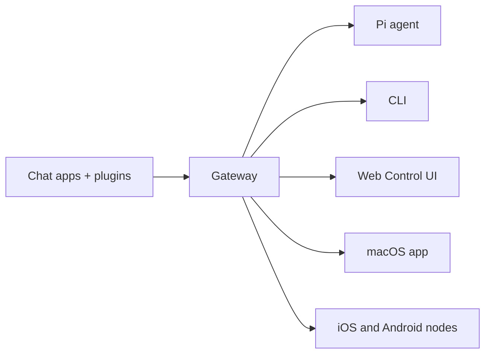

# OpenClaw 🦞

<p align="center">
    
    
</p>

> _"EXFOLIATE! EXFOLIATE!"_ — Muhtemelen bir uzay ıstakozu

<p align="center"><strong>WhatsApp, Telegram, Discord, iMessage ve daha fazlası için AI ajanlarına yönelik herhangi bir işletim sisteminde çalışan gateway.</strong><br />
  Bir mesaj gönderin, cebinizden bir ajan yanıtı alın. Eklentiler Mattermost ve daha fazlasını ekler.
</p>

<Columns>
  <Card title="Get Started" href="/start/getting-started" icon="rocket">
    OpenClaw’ı yükleyin ve Gateway’i dakikalar içinde ayağa kaldırın.
  </Card>
  <Card title="Run the Wizard" href="/start/wizard" icon="sparkles">
    `openclaw onboard` ve eşleştirme akışlarıyla yönlendirmeli kurulum.
  </Card>
  <Card title="Open the Control UI" href="/web/control-ui" icon="layout-dashboard">
    Sohbet, yapılandırma ve oturumlar için tarayıcı panosunu başlatın.
  </Card>
</Columns>

## OpenClaw nedir?

OpenClaw, favori sohbet uygulamalarınızı — WhatsApp, Telegram, Discord, iMessage ve daha fazlasını — Pi gibi AI kodlama ajanlarına bağlayan **self-hosted bir gateway**’dir. Kendi makinenizde (veya bir sunucuda) tek bir Gateway süreci çalıştırırsınız; bu süreç mesajlaşma uygulamalarınız ile her zaman erişilebilir bir AI asistanı arasında köprü görevi görür.

**Kimler için?** Verileri üzerinde kontrolü bırakmadan veya barındırılan bir hizmete güvenmeden, her yerden mesaj atabilecekleri kişisel bir AI asistanı isteyen geliştiriciler ve ileri düzey kullanıcılar.

**Onu farklı kılan nedir?**

- **Self-hosted**: Kendi donanımınızda, kendi kurallarınızla çalışır
- **Çok kanallı**: Tek bir Gateway aynı anda WhatsApp, Telegram, Discord ve daha fazlasını sunar
- **Ajan-odaklı**: Araç kullanımı, oturumlar, bellek ve çok ajanlı yönlendirme ile kodlama ajanları için tasarlanmıştır
- **Açık kaynak**: MIT lisanslı, topluluk odaklı

**Neye ihtiyacınız var?** Node 22+, bir API anahtarı (Anthropic önerilir) ve 5 dakika.

## Nasıl çalışır



Gateway, oturumlar, yönlendirme ve kanal bağlantıları için tek doğruluk kaynağıdır.

## Neler Kurulur

<Columns>
  <Card title="Multi-channel gateway" icon="network">
    Tek bir Gateway süreciyle WhatsApp, Telegram, Discord ve iMessage.
  </Card>
  <Card title="Plugin channels" icon="plug">
    Uzantı paketleriyle Mattermost ve daha fazlasını ekleyin.
  </Card>
  <Card title="Multi-agent routing" icon="route">
    Ajan, çalışma alanı veya gönderen başına yalıtılmış oturumlar.
  </Card>
  <Card title="Media support" icon="image">
    Görseller, ses ve belgeler gönderin ve alın.
  </Card>
  <Card title="Web Control UI" icon="monitor">
    Sohbet, yapılandırma, oturumlar ve düğümler için tarayıcı panosu.
  </Card>
  <Card title="Mobile nodes" icon="smartphone">
    Canvas desteğiyle iOS ve Android düğümlerini eşleştirin.
  </Card>
</Columns>

## Hızlı başlangıç

<Steps>
  <Step title="Install OpenClaw">
    ```bash
    npm install -g openclaw@latest
    ```
  </Step>
  <Step title="Onboard and install the service">
    ```bash
    openclaw onboard --install-daemon
    ```
  </Step>
  <Step title="Pair WhatsApp and start the Gateway">
    ```bash
    openclaw channels login
    openclaw gateway --port 18789
    ```
  </Step>
</Steps>

Tam kurulum ve geliştirme ayarları mı gerekiyor? [Hızlı başlangıç](/start/quickstart) bölümüne bakın.

## Gösterge Paneli

Gateway başladıktan sonra tarayıcı Kontrol UI’ını açın.

- Yerel varsayılan: [http://127.0.0.1:18789/](http://127.0.0.1:18789/)
- Uzaktan erişim: [Web yüzeyleri](/web) ve [Tailscale](/gateway/tailscale)

<p align="center">
  
</p>

## Yapılandırma (isteğe bağlı)

Yapılandırma `~/.openclaw/openclaw.json` konumunda bulunur.

- **Hiçbir şey yapmazsanız**, OpenClaw, RPC modunda paketlenmiş Pi ikilisini gönderen başına oturumlarla kullanır.
- Kısıtlamak isterseniz, `channels.whatsapp.allowFrom` ile başlayın ve (gruplar için) bahsetme kurallarını ayarlayın.

Örnek:

```json5
{
  channels: {
    whatsapp: {
      allowFrom: ["+15555550123"],
      groups: { "*": { requireMention: true } },
    },
  },
  messages: { groupChat: { mentionPatterns: ["@openclaw"] } },
}
```

## Buradan başlayın

<Columns>
  <Card title="Docs hubs" href="/start/hubs" icon="book-open">
    Kullanım senaryosuna göre düzenlenmiş tüm dokümanlar ve kılavuzlar.
  </Card>
  <Card title="Configuration" href="/gateway/configuration" icon="settings">
    Temel Gateway ayarları, belirteçler ve sağlayıcı yapılandırması.
  </Card>
  <Card title="Remote access" href="/gateway/remote" icon="globe">
    SSH ve tailnet erişim kalıpları.
  </Card>
  <Card title="Channels" href="/channels/telegram" icon="message-square">
    WhatsApp, Telegram, Discord ve daha fazlası için kanala özel kurulum.
  </Card>
  <Card title="Nodes" href="/nodes" icon="smartphone">
    Eşleştirme ve Canvas ile iOS ve Android düğümleri.
  </Card>
  <Card title="Help" href="/help" icon="life-buoy">
    Yaygın çözümler ve sorun giderme için giriş noktası.
  </Card>
</Columns>

## Daha fazlasını öğrenin

<Columns>
  <Card title="Full feature list" href="/concepts/features" icon="list">
    Kapsamlı kanal, yönlendirme ve medya yetenekleri.
  </Card>
  <Card title="Multi-agent routing" href="/concepts/multi-agent" icon="route">
    Çalışma alanı yalıtımı ve ajan başına oturumlar.
  </Card>
  <Card title="Security" href="/gateway/security" icon="shield">
    Belirteçler, izin listeleri ve güvenli kullanım denetimleri.
  </Card>
  <Card title="Troubleshooting" href="/gateway/troubleshooting" icon="wrench">
    Gateway tanılamaları ve yaygın hatalar.
  </Card>
  <Card title="About and credits" href="/reference/credits" icon="info">
    Projenin kökenleri, katkıda bulunanlar ve lisans.
  </Card>
</Columns>
