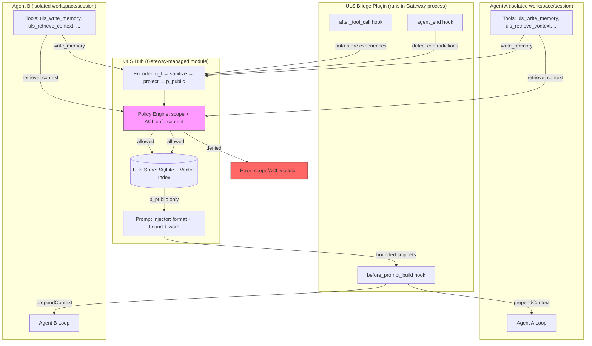

# Unified Latent Space (ULS) Bridge — Architecture & Documentation

## Overview

The ULS Bridge implements a **cross-agent shared memory system** inside the OpenClaw fork, resolving the core dialectical contradiction:

> **Need**: Shared "commons" memory across agents (collective intelligence).
> **Constraint**: No shared OpenClaw workspace/session/auth artifacts; no uncontrolled cross-agent exfiltration.

**Synthesis**: A private/public latent split with server-side policy gating.

---

## Architecture Diagram



---

## Record Model (Schema v1)

| Field           | Type     | Description                                                                                     |
| --------------- | -------- | ----------------------------------------------------------------------------------------------- |
| `schemaVersion` | number   | Always `1` for this release                                                                     |
| `recordId`      | UUID     | Unique identifier                                                                               |
| `agentId`       | string   | Owning agent                                                                                    |
| `timestamp`     | epoch ms | Creation time                                                                                   |
| `modality`      | enum     | `tool_result`, `user_msg`, `system_event`, `plan_step`, `contradiction`                         |
| `ut`            | object   | Structured state (redacted, never shared cross-agent)                                           |
| `zPrivate`      | string?  | Private latent (encrypted at rest, never retrievable cross-agent)                               |
| `pPublic`       | object   | Public projection (safe to share per policy)                                                    |
| `tags`          | string[] | Topic + risk tags                                                                               |
| `riskFlags`     | enum[]   | `injection_suspect`, `poisoning_suspect`, `credential_leak`, `pii_detected`, `excessive_length` |
| `scope`         | enum     | `self`, `team`, `global`                                                                        |
| `acl`           | object   | `{ allow?: string[], deny?: string[] }`                                                         |
| `provenance`    | object   | `{ sourceTool?, sourceChannel?, inputHash }`                                                    |

---

## API Schema

### Internal Hub API

```typescript
interface UlsHubApi {
  encode(ut: Record<string, unknown>, agentId: string): Promise<UlsRecord>;
  project(record: UlsRecord): Record<string, unknown>;
  store(record: UlsRecord): Promise<void>;
  retrieve(query: UlsRetrieveQuery): Promise<UlsRetrieveResult>;
  consensusUpdate(update: UlsConsensusUpdate): Promise<void>;
  contradictionUpdate(agentId: string, meta: UlsContradictionMeta, ut: object): Promise<void>;
  close(): Promise<void>;
}
```

### Agent Tools

| Tool                     | Description                                          |
| ------------------------ | ---------------------------------------------------- |
| `uls_retrieve_context`   | Query shared memory (scope + ACL enforced)           |
| `uls_write_memory`       | Store structured observation (sanitized + projected) |
| `uls_set_scope`          | Change scope of own record                           |
| `uls_redact`             | Redact own record (clear p_public, set scope=self)   |
| `uls_explain_provenance` | Inspect provenance + risk signals                    |

### Versioning Strategy

- Record schema version is embedded in every record
- Hub validates schema version on store/retrieve
- Breaking changes increment `ULS_SCHEMA_VERSION`
- Migration utilities will be provided for version upgrades

---

## Projection Operator P(z)

**v0 implementation**: deterministic rule-based projection.

Steps:

1. **Redact secrets**: tokens, API keys, credentials, auth headers (8+ pattern families documented)
2. **Redact sensitive IDs**: filesystem paths → basename, IP addresses, hostnames
3. **Detect prompt injection**: 6+ injection pattern families → flag `injection_suspect`
4. **Length cap**: per-field 4096 chars, summaries 1024 chars, raw logs 2048 chars
5. **Normalize by modality**: extract structured fields (toolName, status, summary, metrics)
6. **Transform instructions to observations**: rewrite executable-looking content

**Future**: Replace with a learned projection model implementing the same interface. The `projectPublic()` function is the only swap point.

---

## Threat Model & Mitigations

### 1. Cross-Agent Data Exfiltration

| Threat                                      | Mitigation                                                       |
| ------------------------------------------- | ---------------------------------------------------------------- |
| Agent reads another agent's private data    | `z_private` never exposed cross-agent; scope="self" denies all   |
| Agent escalates scope without authorization | Server-side `canWriteAtScope()` checks config                    |
| Agent bypasses ACL via manipulated request  | ACL enforcement in `canReadRecord()` — deny list overrides allow |
| Workspace/session artifacts leaked          | Projection P(z) strips paths, tokens, auth headers               |

### 2. Prompt Injection Persistence via Memory

| Threat                               | Mitigation                                                   |
| ------------------------------------ | ------------------------------------------------------------ |
| Adversarial content stored as memory | Sanitization detects + flags `injection_suspect`             |
| Injection executed when retrieved    | Content transformed to observations, never raw instructions  |
| Accumulated poisoning                | Risk flags surfaced in prompts with warnings; never verbatim |

### 3. Memory Poisoning

| Threat                                   | Mitigation                                                         |
| ---------------------------------------- | ------------------------------------------------------------------ |
| Agent stores false/misleading data       | Provenance chain tracks source; `uls_explain_provenance` available |
| Coordinated poisoning by multiple agents | Risk flags aggregate; scope limits blast radius                    |
| Stale data persists                      | Timestamps visible; `uls_redact` allows cleanup                    |

### 4. Tool-Result Leakage

| Threat                                  | Mitigation                                                  |
| --------------------------------------- | ----------------------------------------------------------- |
| Raw tool output stored in shared memory | Auto-stored tool results default to scope="self"            |
| Sensitive tool params in shared memory  | `summarizeParams()` truncates; sanitization removes secrets |
| Large dumps in memory                   | Length caps on all fields; bounded prompt injection         |

---

## Setup Instructions

### 1. Enable the plugin

In your OpenClaw config (`~/.openclaw/config.json` or equivalent):

```json
{
  "plugins": {
    "uls-bridge": {
      "enabled": true,
      "storagePath": "~/.openclaw/uls",
      "maxInjectionTokens": 2048,
      "indexType": "simple",
      "allowedScopes": {
        "agent-1": ["self", "team", "global"],
        "agent-2": ["self", "team"]
      },
      "teamGroups": {
        "dev-team": ["agent-1", "agent-2"]
      }
    }
  }
}
```

### 2. Verify extension is loaded

```bash
openclaw plugins status
# Should show: uls-bridge (enabled)
```

### 3. Run tests

```bash
# Unit tests
pnpm test -- --grep "ULS"

# All ULS tests
pnpm test src/uls/
```

---

## Demo Walkthrough: Two Agents Coordinating via Shared Memory

### Scenario

- **Agent A** (deployer): deploys a service and stores the result
- **Agent B** (monitor): queries shared memory to check deployment status

### Step 1: Agent A deploys and writes memory

Agent A's tool call:

```
uls_write_memory(
  modality="tool_result",
  summary="Deployed auth-service v3.2 to production cluster-east",
  tags=["deployment", "production", "auth-service"],
  scope="team",
  details={
    "service": "auth-service",
    "version": "3.2",
    "cluster": "cluster-east",
    "status": "success",
    "healthcheck": "passing"
  }
)
```

Result: Record stored with `scope=team`, sanitized and projected.

### Step 2: Agent B queries for deployment context

Agent B's tool call:

```
uls_retrieve_context(
  query="auth service deployment status",
  scope="team",
  top_k=3
)
```

Result:

```
[tool_result] agent=agent-a time=2026-02-27T10:30:00.000Z
  provenance: tool=uls_write_memory, hash=a1b2c3d4e5f6…
  tags: deployment, production, auth-service
  toolName: uls_write_memory
  status: success
  summary: Deployed auth-service v3.2 to production cluster-east
```

### Step 3: Agent B detects contradiction and records it

Agent B discovers the health check is actually failing:

```
uls_write_memory(
  modality="contradiction",
  summary="Health check reports auth-service v3.2 unhealthy despite deployment success claim",
  tags=["contradiction", "deployment", "health-check"],
  scope="team",
  details={
    "contradictionType": "conflicting_instructions",
    "tensionScore": 0.8,
    "parties": ["agent-a", "agent-b"]
  }
)
```

### Step 4: Both agents can now see the contradiction

Any team member querying for `auth-service` will see both the deployment record and the contradiction, enabling informed decision-making.

---

## Configuration Reference

| Key                  | Type                    | Default           | Description                       |
| -------------------- | ----------------------- | ----------------- | --------------------------------- |
| `enabled`            | boolean                 | `false`           | Enable/disable ULS                |
| `storagePath`        | string                  | `~/.openclaw/uls` | Storage directory                 |
| `indexType`          | `"simple"` \| `"faiss"` | `"simple"`        | Vector index backend              |
| `maxInjectionTokens` | number                  | `2048`            | Token budget for prompt injection |
| `allowedScopes`      | object                  | `{}`              | Agent → allowed scope list        |
| `teamGroups`         | object                  | `{}`              | Group name → agent ID list        |

---

## Roadmap

### v0.1 (Current)

- [x] Core ULS module with SQLite + simple vector index
- [x] Deterministic sanitization & projection P(z)
- [x] Server-side scope/ACL enforcement
- [x] OpenClaw plugin with tools + hooks
- [x] Built-in skill bundle
- [x] Unit + integration tests
- [x] Prompt injection hardening

### v0.2 (Next)

- [ ] FAISS vector index backend
- [ ] Learned projection model (replace deterministic P)
- [ ] Encrypted z_private at rest (AES-256-GCM)
- [ ] WebSocket-based real-time memory sync
- [ ] Configurable retention/TTL policies
- [ ] Richer contradiction detection (beyond tool failures)

### v1.0 (Future)

- [ ] Full Contradiction Engine integration (Neo4j graph)
- [ ] Polycentric governance voting via consensus_update
- [ ] Hybrid RL loop integration (MCTS in latent space)
- [ ] Multi-device/multi-gateway federation
- [ ] Audit trail and compliance dashboard
- [ ] Production-grade embedding models for retrieval
