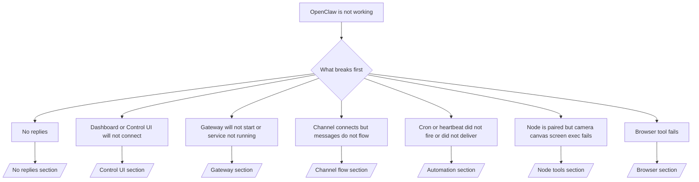

# خرابیوں کا ازالہ

اگر آپ کے پاس صرف 2 منٹ ہیں، تو اس صفحے کو ٹرائیج کے ابتدائی دروازے کے طور پر استعمال کریں۔

## پہلے 60 سیکنڈ

یہ عین یہی سیڑھی ترتیب وار چلائیں:

```bash
openclaw status
openclaw status --all
openclaw gateway probe
openclaw gateway status
openclaw doctor
openclaw channels status --probe
openclaw logs --follow
```

ایک سطر میں اچھا آؤٹ پٹ:

- `openclaw status` → کنفیگر کیے گئے چینلز دکھاتا ہے اور کوئی واضح تصدیقی خرابی نہیں۔
- `openclaw status --all` → مکمل رپورٹ موجود اور شیئر کے قابل ہے۔
- `openclaw gateway probe` → متوقع گیٹ وے ہدف قابلِ رسائی ہے۔
- `openclaw gateway status` → `Runtime: running` اور `RPC probe: ok`۔
- `openclaw doctor` → کوئی رکاوٹ ڈالنے والی کنفیگ/سروس کی خرابی نہیں۔
- `openclaw channels status --probe` → چینلز `connected` یا `ready` رپورٹ کرتے ہیں۔
- `openclaw logs --follow` → مستحکم سرگرمی، کوئی دہراتی مہلک خرابی نہیں۔

## فیصلہ جاتی درخت



<AccordionGroup>
  <Accordion title="No replies">
    ```bash
    openclaw status
    openclaw gateway status
    openclaw channels status --probe
    openclaw pairing list <channel>
    openclaw logs --follow
    ```

    ```
    اچھا آؤٹ پٹ اس طرح دکھتا ہے:
    
    - `Runtime: running`
    - `RPC probe: ok`
    - آپ کا چینل `channels status --probe` میں connected/ready دکھاتا ہے
    - ارسال کنندہ منظور شدہ نظر آتا ہے (یا DM پالیسی کھلی/allowlist ہے)
    
    عام لاگ دستخط:
    
    - `drop guild message (mention required` → Discord میں مینشن گیٹنگ نے پیغام کو بلاک کیا۔
    - `pairing request` → ارسال کنندہ غیر منظور شدہ ہے اور DM pairing منظوری کا منتظر ہے۔
    - چینل لاگز میں `blocked` / `allowlist` → ارسال کنندہ، کمرہ، یا گروپ فلٹر ہے۔
    
    گہرے صفحات:
    
    - [/gateway/troubleshooting#no-replies](/gateway/troubleshooting#no-replies)
    - [/channels/troubleshooting](/channels/troubleshooting)
    - [/channels/pairing](/channels/pairing)
    ```

  </Accordion>

  <Accordion title="Dashboard or Control UI will not connect">
    ```bash
    openclaw status
    openclaw gateway status
    openclaw logs --follow
    openclaw doctor
    openclaw channels status --probe
    ```

    ```
    اچھا آؤٹ پٹ اس طرح دکھتا ہے:
    
    - `Dashboard: http://...`، `openclaw gateway status` میں دکھایا جاتا ہے
    - `RPC probe: ok`
    - لاگز میں کوئی auth لوپ نہیں
    
    عام لاگ دستخط:
    
    - `device identity required` → HTTP/غیر محفوظ سیاق میں ڈیوائس auth مکمل نہیں ہو سکتی۔
    - `unauthorized` / reconnect لوپ → غلط ٹوکن/پاس ورڈ یا auth موڈ میں عدم مطابقت۔
    - `gateway connect failed:` → UI غلط URL/پورٹ کو ہدف بنا رہا ہے یا گیٹ وے ناقابلِ رسائی ہے۔
    
    گہرے صفحات:
    
    - [/gateway/troubleshooting#dashboard-control-ui-connectivity](/gateway/troubleshooting#dashboard-control-ui-connectivity)
    - [/web/control-ui](/web/control-ui)
    - [/gateway/authentication](/gateway/authentication)
    ```

  </Accordion>

  <Accordion title="Gateway will not start or service installed but not running">
    ```bash
    openclaw status
    openclaw gateway status
    openclaw logs --follow
    openclaw doctor
    openclaw channels status --probe
    ```

    ```
    اچھا آؤٹ پٹ اس طرح دکھتا ہے:
    
    - `Service: ... (loaded)`
    - `Runtime: running`
    - `RPC probe: ok`
    
    عام لاگ دستخط:
    
    - `Gateway start blocked: set gateway.mode=local` → گیٹ وے موڈ غیر سیٹ/ریموٹ ہے۔
    - `refusing to bind gateway ... without auth` → ٹوکن/پاس ورڈ کے بغیر non-loopback بائنڈ۔
    - `another gateway instance is already listening` یا `EADDRINUSE` → پورٹ پہلے سے استعمال میں ہے۔
    
    گہرے صفحات:
    
    - [/gateway/troubleshooting#gateway-service-not-running](/gateway/troubleshooting#gateway-service-not-running)
    - [/gateway/background-process](/gateway/background-process)
    - [/gateway/configuration](/gateway/configuration)
    ```

  </Accordion>

  <Accordion title="Channel connects but messages do not flow">
    ```bash
    openclaw status
    openclaw gateway status
    openclaw logs --follow
    openclaw doctor
    openclaw channels status --probe
    ```

    ```
    اچھا آؤٹ پٹ اس طرح دکھتا ہے:
    
    - چینل ٹرانسپورٹ کنیکٹڈ ہے۔
    - Pairing/allowlist چیکس پاس ہوتے ہیں۔
    - جہاں لازم ہو وہاں مینشنز شناخت ہو رہے ہیں۔
    
    عام لاگ دستخط:
    
    - `mention required` → گروپ مینشن گیٹنگ نے پروسیسنگ کو بلاک کیا۔
    - `pairing` / `pending` → DM ارسال کنندہ ابھی منظور شدہ نہیں۔
    - `not_in_channel`, `missing_scope`, `Forbidden`, `401/403` → چینل اجازت ٹوکن کا مسئلہ۔
    
    گہرے صفحات:
    
    - [/gateway/troubleshooting#channel-connected-messages-not-flowing](/gateway/troubleshooting#channel-connected-messages-not-flowing)
    - [/channels/troubleshooting](/channels/troubleshooting)
    ```

  </Accordion>

  <Accordion title="Cron or heartbeat did not fire or did not deliver">
    ```bash
    openclaw status
    openclaw gateway status
    openclaw cron status
    openclaw cron list
    openclaw cron runs --id <jobId> --limit 20
    openclaw logs --follow
    ```

    ```
    اچھا آؤٹ پٹ اس طرح دکھتا ہے:
    
    - `cron.status` فعال دکھاتا ہے اور اگلا wake موجود ہے۔
    - `cron runs` میں حالیہ `ok` اندراجات دکھتے ہیں۔
    - ہارٹ بیٹ فعال ہے اور فعال اوقات سے باہر نہیں۔
    
    عام لاگ دستخط:
    
    - `cron: scheduler disabled; jobs will not run automatically` → کرون غیر فعال ہے۔
    - `heartbeat skipped` مع `reason=quiet-hours` → کنفیگر کیے گئے فعال اوقات سے باہر۔
    - `requests-in-flight` → مرکزی لین مصروف؛ ہارٹ بیٹ ویک مؤخر ہوا۔
    - `unknown accountId` → ہارٹ بیٹ ڈیلیوری کا ہدف اکاؤنٹ موجود نہیں۔
    
    گہرے صفحات:
    
    - [/gateway/troubleshooting#cron-and-heartbeat-delivery](/gateway/troubleshooting#cron-and-heartbeat-delivery)
    - [/automation/troubleshooting](/automation/troubleshooting)
    - [/gateway/heartbeat](/gateway/heartbeat)
    ```

  </Accordion>

  <Accordion title="Node is paired but tool fails camera canvas screen exec">
    ```bash
    openclaw status
    openclaw gateway status
    openclaw nodes status
    openclaw nodes describe --node <idOrNameOrIp>
    openclaw logs --follow
    ```

    ```
    اچھا آؤٹ پٹ اس طرح دکھتا ہے:
    
    - نوڈ کردار `node` کے لیے connected اور paired کے طور پر درج ہے۔
    - جس کمانڈ کو آپ چلا رہے ہیں اس کے لیے قابلیت موجود ہے۔
    - ٹول کے لیے اجازت کی حالت منظور شدہ ہے۔
    
    عام لاگ دستخط:
    
    - `NODE_BACKGROUND_UNAVAILABLE` → نوڈ ایپ کو foreground میں لائیں۔
    - `*_PERMISSION_REQUIRED` → OS اجازت مسترد/غائب تھی۔
    - `SYSTEM_RUN_DENIED: approval required` → exec منظوری زیرِ التوا ہے۔
    - `SYSTEM_RUN_DENIED: allowlist miss` → کمانڈ exec allowlist میں نہیں۔
    
    گہرے صفحات:
    
    - [/gateway/troubleshooting#node-paired-tool-fails](/gateway/troubleshooting#node-paired-tool-fails)
    - [/nodes/troubleshooting](/nodes/troubleshooting)
    - [/tools/exec-approvals](/tools/exec-approvals)
    ```

  </Accordion>

  <Accordion title="Browser tool fails">
    ```bash
    openclaw status
    openclaw gateway status
    openclaw browser status
    openclaw logs --follow
    openclaw doctor
    ```

    ```
    اچھا آؤٹ پٹ اس طرح دکھتا ہے:
    
    - براؤزر اسٹیٹس `running: true` اور منتخب براؤزر/پروفائل دکھاتا ہے۔
    - `openclaw` پروفائل شروع ہوتا ہے یا `chrome` ریلے کے پاس منسلک ٹیب ہوتا ہے۔
    
    عام لاگ دستخط:
    
    - `Failed to start Chrome CDP on port` → مقامی براؤزر لانچ ناکام۔
    - `browser.executablePath not found` → کنفیگر کیا گیا بائنری پاتھ غلط ہے۔
    - `Chrome extension relay is running, but no tab is connected` → ایکسٹینشن منسلک نہیں۔
    - `Browser attachOnly is enabled ... not reachable` → attach-only پروفائل کے پاس کوئی live CDP ہدف نہیں۔
    
    گہرے صفحات:
    
    - [/gateway/troubleshooting#browser-tool-fails](/gateway/troubleshooting#browser-tool-fails)
    - [/tools/browser-linux-troubleshooting](/tools/browser-linux-troubleshooting)
    - [/tools/chrome-extension](/tools/chrome-extension)
    ```

  </Accordion>
</AccordionGroup>
