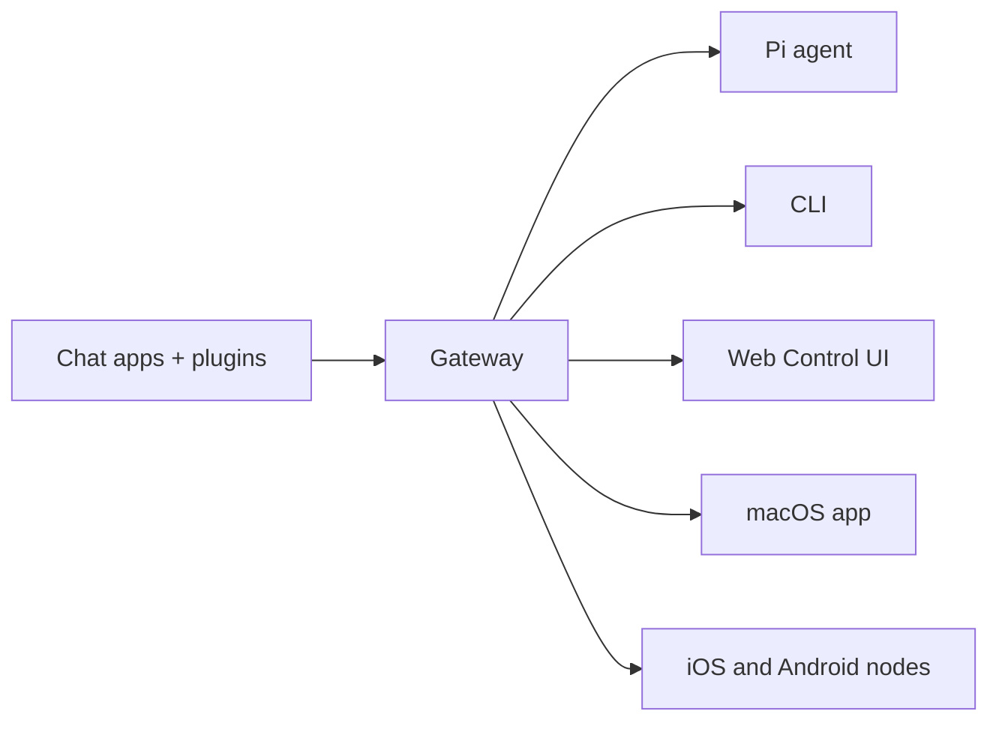

# OpenClaw 🦞

<p align="center">
    
    
</p>

> _"EXFOLIATE! EXFOLIATE!"_ — A space lobster, probably

<p align="center"><strong>Any OS gateway for AI agents across WhatsApp, Telegram, Discord, iMessage, and more.</strong><br />
  Send a message, get an agent response from your pocket. 35. پلگ اِنز Mattermost اور مزید شامل کرتے ہیں۔
</p>

<Columns>
  <Card title="Get Started" href="/start/getting-started" icon="rocket">
    OpenClaw انسٹال کریں اور چند منٹوں میں Gateway شروع کریں۔
  </Card>
  <Card title="Run the Wizard" href="/start/wizard" icon="sparkles">
    `openclaw onboard` اور pairing فلو کے ساتھ رہنمائی پر مبنی سیٹ اپ۔
  </Card>
  <Card title="Open the Control UI" href="/web/control-ui" icon="layout-dashboard">
    چیٹ، کنفیگ، اور سیشنز کے لیے براؤزر ڈیش بورڈ لانچ کریں۔
  </Card>
</Columns>

## What is OpenClaw?

OpenClaw is a **self-hosted gateway** that connects your favorite chat apps — WhatsApp, Telegram, Discord, iMessage, and more — to AI coding agents like Pi. You run a single Gateway process on your own machine (or a server), and it becomes the bridge between your messaging apps and an always-available AI assistant.

**یہ کس کے لیے ہے؟** ڈویلپرز اور پاور یوزرز کے لیے جو ایک ذاتی AI اسسٹنٹ چاہتے ہیں جسے وہ کہیں سے بھی پیغام بھیج سکیں — اپنے ڈیٹا پر کنٹرول چھوڑے بغیر یا کسی hosted سروس پر انحصار کیے بغیر۔

**یہ مختلف کیوں ہے؟**

- **Self-hosted**: آپ کے ہارڈویئر پر، آپ کے قواعد کے مطابق چلتا ہے
- **Multi-channel**: ایک Gateway بیک وقت WhatsApp، Telegram، Discord، اور مزید کو سروس دیتا ہے
- **Agent-native**: کوڈنگ ایجنٹس کے لیے تیار کیا گیا، جن میں ٹول استعمال، سیشنز، میموری، اور multi-agent routing شامل ہے
- **Open source**: MIT لائسنس یافتہ، کمیونٹی کے ذریعے تیار کردہ

**آپ کو کیا درکار ہے؟** Node 22+، ایک API کلید (Anthropic سفارش کردہ)، اور 5 منٹ۔

## How it works



Gateway سیشنز، routing، اور چینل کنکشنز کے لیے واحد source of truth ہے۔

## Key capabilities

<Columns>
  <Card title="Multi-channel gateway" icon="network">
    ایک واحد Gateway پروسیس کے ساتھ WhatsApp، Telegram، Discord، اور iMessage۔
  </Card>
  <Card title="Plugin channels" icon="plug">
    ایکسٹینشن پیکیجز کے ذریعے Mattermost اور مزید شامل کریں۔
  </Card>
  <Card title="Multi-agent routing" icon="route">
    ہر ایجنٹ، ورک اسپیس، یا ارسال کنندہ کے لیے الگ تھلگ سیشنز۔
  </Card>
  <Card title="Media support" icon="image">
    تصاویر، آڈیو، اور دستاویزات بھیجیں اور وصول کریں۔
  </Card>
  <Card title="Web Control UI" icon="monitor">
    چیٹ، کنفیگ، سیشنز، اور نوڈز کے لیے براؤزر ڈیش بورڈ۔
  </Card>
  <Card title="Mobile nodes" icon="smartphone">
    Canvas سپورٹ کے ساتھ iOS اور Android نوڈز کو pair کریں۔
  </Card>
</Columns>

## Quick start

<Steps>
  <Step title="Install OpenClaw">
    ```bash
    npm install -g openclaw@latest
    ```
  </Step>
  <Step title="Onboard and install the service">
    ```bash
    openclaw onboard --install-daemon
    ```
  </Step>
  <Step title="Pair WhatsApp and start the Gateway">
    ```bash
    openclaw channels login
    openclaw gateway --port 18789
    ```
  </Step>
</Steps>

Need the full install and dev setup? See [Quick start](/start/quickstart).

## Dashboard

Gateway شروع ہونے کے بعد براؤزر Control UI کھولیں۔

- لوکل ڈیفالٹ: [http://127.0.0.1:18789/](http://127.0.0.1:18789/)
- ریموٹ رسائی: [Web surfaces](/web) اور [Tailscale](/gateway/tailscale)

<p align="center">
  
</p>

## Configuration (optional)

کنفیگ `~/.openclaw/openclaw.json` پر موجود ہے۔

- اگر آپ **کچھ نہیں کرتے**، تو OpenClaw RPC موڈ میں bundled Pi بائنری کو فی-ارسال کنندہ سیشنز کے ساتھ استعمال کرتا ہے۔
- اگر آپ اسے محدود کرنا چاہتے ہیں، تو `channels.whatsapp.allowFrom` سے شروع کریں اور (گروپس کے لیے) mention قواعد استعمال کریں۔

مثال:

```json5
{
  channels: {
    whatsapp: {
      allowFrom: ["+15555550123"],
      groups: { "*": { requireMention: true } },
    },
  },
  messages: { groupChat: { mentionPatterns: ["@openclaw"] } },
}
```

## Start here

<Columns>
  <Card title="Docs hubs" href="/start/hubs" icon="book-open">
    تمام دستاویزات اور گائیڈز، استعمال کے کیس کے مطابق منظم۔
  </Card>
  <Card title="Configuration" href="/gateway/configuration" icon="settings">
    بنیادی Gateway سیٹنگز، ٹوکنز، اور فراہم کنندہ کی کنفیگ۔
  </Card>
  <Card title="Remote access" href="/gateway/remote" icon="globe">
    SSH اور tailnet رسائی کے پیٹرنز۔
  </Card>
  <Card title="Channels" href="/channels/telegram" icon="message-square">
    WhatsApp، Telegram، Discord، اور مزید کے لیے چینل مخصوص سیٹ اپ۔
  </Card>
  <Card title="Nodes" href="/nodes" icon="smartphone">
    pairing اور Canvas کے ساتھ iOS اور Android نوڈز۔
  </Card>
  <Card title="Help" href="/help" icon="life-buoy">
    عام حل اور خرابیوں کا ازالہ کرنے کا نقطۂ آغاز۔
  </Card>
</Columns>

## Learn more

<Columns>
  <Card title="Full feature list" href="/concepts/features" icon="list">
    چینلز، routing، اور میڈیا کی مکمل صلاحیتیں۔
  </Card>
  <Card title="Multi-agent routing" href="/concepts/multi-agent" icon="route">
    ورک اسپیس کی علیحدگی اور ہر ایجنٹ کے لیے سیشنز۔
  </Card>
  <Card title="Security" href="/gateway/security" icon="shield">
    ٹوکنز، اجازت فہرستیں، اور حفاظتی کنٹرولز۔
  </Card>
  <Card title="Troubleshooting" href="/gateway/troubleshooting" icon="wrench">
    Gateway کی تشخیص اور عام غلطیاں۔
  </Card>
  <Card title="About and credits" href="/reference/credits" icon="info">
    منصوبے کی ابتدا، معاونین، اور لائسنس۔
  </Card>
</Columns>
