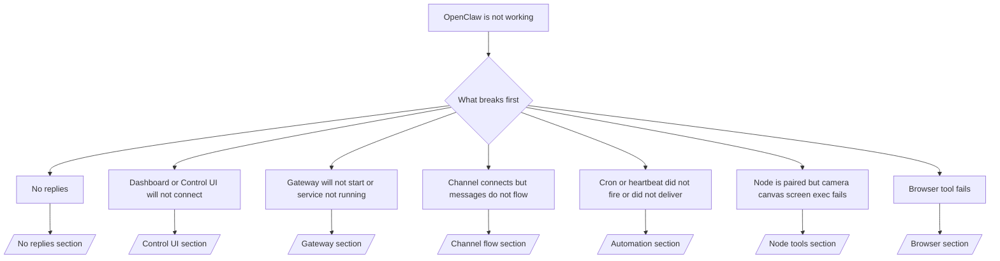

# Xử lý sự cố

Nếu bạn chỉ có 2 phút, hãy dùng trang này như cửa ngõ phân loại ban đầu.

## 60 giây đầu tiên

Chạy chính xác thang kiểm tra này theo đúng thứ tự:

```bash
openclaw status
openclaw status --all
openclaw gateway probe
openclaw gateway status
openclaw doctor
openclaw channels status --probe
openclaw logs --follow
```

Đầu ra tốt trong một dòng:

- `openclaw status` → hiển thị các kênh đã cấu hình và không có lỗi xác thực rõ ràng.
- `openclaw status --all` → báo cáo đầy đủ có sẵn và có thể chia sẻ.
- `openclaw gateway probe` → mục tiêu gateway mong đợi có thể truy cập.
- `openclaw gateway status` → `Runtime: running` và `RPC probe: ok`.
- `openclaw doctor` → không có lỗi cấu hình/dịch vụ gây chặn.
- `openclaw channels status --probe` → các kênh báo cáo `connected` hoặc `ready`.
- `openclaw logs --follow` → hoạt động ổn định, không lặp lại lỗi nghiêm trọng.

## Cây quyết định



<AccordionGroup>
  <Accordion title="No replies">
    ```bash
    openclaw status
    openclaw gateway status
    openclaw channels status --probe
    openclaw pairing list <channel>
    openclaw logs --follow
    ```

    ```
    Đầu ra tốt trông như sau:
    
    - `Runtime: running`
    - `RPC probe: ok`
    - Kênh của bạn hiển thị đã kết nối/sẵn sàng trong `channels status --probe`
    - Người gửi có vẻ đã được phê duyệt (hoặc chính sách DM đang mở/danh sách cho phép)
    
    Chữ ký log phổ biến:
    
    - `drop guild message (mention required` → chặn bởi cổng kiểm soát mention trong Discord.
    - `pairing request` → người gửi chưa được phê duyệt và đang chờ phê duyệt ghép cặp DM.
    - `blocked` / `allowlist` trong log kênh → người gửi, phòng hoặc nhóm bị lọc.
    
    Trang chuyên sâu:
    
    - [/gateway/troubleshooting#no-replies](/gateway/troubleshooting#no-replies)
    - [/channels/troubleshooting](/channels/troubleshooting)
    - [/channels/pairing](/channels/pairing)
    ```

  </Accordion>

  <Accordion title="Dashboard or Control UI will not connect">
    ```bash
    openclaw status
    openclaw gateway status
    openclaw logs --follow
    openclaw doctor
    openclaw channels status --probe
    ```

    ```
    Đầu ra tốt trông như sau:
    
    - `Dashboard: http://...` được hiển thị trong `openclaw gateway status`
    - `RPC probe: ok`
    - Không có vòng lặp xác thực trong log
    
    Chữ ký log phổ biến:
    
    - `device identity required` → ngữ cảnh HTTP/không bảo mật không thể hoàn tất xác thực thiết bị.
    - `unauthorized` / vòng lặp kết nối lại → sai token/mật khẩu hoặc không khớp chế độ xác thực.
    - `gateway connect failed:` → UI đang trỏ tới sai URL/cổng hoặc gateway không thể truy cập.
    
    Trang chuyên sâu:
    
    - [/gateway/troubleshooting#dashboard-control-ui-connectivity](/gateway/troubleshooting#dashboard-control-ui-connectivity)
    - [/web/control-ui](/web/control-ui)
    - [/gateway/authentication](/gateway/authentication)
    ```

  </Accordion>

  <Accordion title="Gateway will not start or service installed but not running">
    ```bash
    openclaw status
    openclaw gateway status
    openclaw logs --follow
    openclaw doctor
    openclaw channels status --probe
    ```

    ```
    Đầu ra tốt trông như sau:
    
    - `Service: ... (loaded)`
    - `Runtime: running`
    - `RPC probe: ok`
    
    Chữ ký log phổ biến:
    
    - `Gateway start blocked: set gateway.mode=local` → chế độ gateway chưa được đặt/đang ở chế độ remote.
    - `refusing to bind gateway ... without auth` → bind không phải loopback mà không có token/mật khẩu.
    - `another gateway instance is already listening` hoặc `EADDRINUSE` → cổng đã được sử dụng.
    
    Trang chuyên sâu:
    
    - [/gateway/troubleshooting#gateway-service-not-running](/gateway/troubleshooting#gateway-service-not-running)
    - [/gateway/background-process](/gateway/background-process)
    - [/gateway/configuration](/gateway/configuration)
    ```

  </Accordion>

  <Accordion title="Channel connects but messages do not flow">
    ```bash
    openclaw status
    openclaw gateway status
    openclaw logs --follow
    openclaw doctor
    openclaw channels status --probe
    ```

    ```
    Đầu ra tốt trông như sau:
    
    - Kết nối vận chuyển của kênh đã được thiết lập.
    - Kiểm tra ghép cặp/danh sách cho phép đều đạt.
    - Mention được phát hiện khi cần.
    
    Chữ ký log phổ biến:
    
    - `mention required` → chặn xử lý bởi cổng kiểm soát mention nhóm.
    - `pairing` / `pending` → người gửi DM chưa được phê duyệt.
    - `not_in_channel`, `missing_scope`, `Forbidden`, `401/403` → vấn đề token quyền của kênh.
    
    Trang chuyên sâu:
    
    - [/gateway/troubleshooting#channel-connected-messages-not-flowing](/gateway/troubleshooting#channel-connected-messages-not-flowing)
    - [/channels/troubleshooting](/channels/troubleshooting)
    ```

  </Accordion>

  <Accordion title="Cron or heartbeat did not fire or did not deliver">
    ```bash
    openclaw status
    openclaw gateway status
    openclaw cron status
    openclaw cron list
    openclaw cron runs --id <jobId> --limit 20
    openclaw logs --follow
    ```

    ```
    Đầu ra tốt trông như sau:
    
    - `cron.status` hiển thị đã bật với lần đánh thức tiếp theo.
    - `cron runs` hiển thị các mục `ok` gần đây.
    - Heartbeat được bật và không nằm ngoài giờ hoạt động.
    
    Chữ ký log phổ biến:
    
    - `cron: scheduler disabled; jobs will not run automatically` → cron bị tắt.
    - `heartbeat skipped` với `reason=quiet-hours` → ngoài khung giờ hoạt động đã cấu hình.
    - `requests-in-flight` → luồng chính đang bận; lần đánh thức heartbeat bị hoãn.
    - `unknown accountId` → tài khoản đích nhận heartbeat không tồn tại.
    
    Trang chuyên sâu:
    
    - [/gateway/troubleshooting#cron-and-heartbeat-delivery](/gateway/troubleshooting#cron-and-heartbeat-delivery)
    - [/automation/troubleshooting](/automation/troubleshooting)
    - [/gateway/heartbeat](/gateway/heartbeat)
    ```

  </Accordion>

  <Accordion title="Node is paired but tool fails camera canvas screen exec">
    ```bash
    openclaw status
    openclaw gateway status
    openclaw nodes status
    openclaw nodes describe --node <idOrNameOrIp>
    openclaw logs --follow
    ```

    ```
    Đầu ra tốt trông như sau:
    
    - Node được liệt kê là đã kết nối và ghép cặp cho vai trò `node`.
    - Có capability cho lệnh bạn đang gọi.
    - Trạng thái quyền đã được cấp cho công cụ.
    
    Chữ ký log phổ biến:
    
    - `NODE_BACKGROUND_UNAVAILABLE` → đưa ứng dụng node lên tiền cảnh.
    - `*_PERMISSION_REQUIRED` → quyền hệ điều hành bị từ chối/thiếu.
    - `SYSTEM_RUN_DENIED: approval required` → phê duyệt exec đang chờ.
    - `SYSTEM_RUN_DENIED: allowlist miss` → lệnh không nằm trong danh sách cho phép exec.
    
    Trang chuyên sâu:
    
    - [/gateway/troubleshooting#node-paired-tool-fails](/gateway/troubleshooting#node-paired-tool-fails)
    - [/nodes/troubleshooting](/nodes/troubleshooting)
    - [/tools/exec-approvals](/tools/exec-approvals)
    ```

  </Accordion>

  <Accordion title="Browser tool fails">
    ```bash
    openclaw status
    openclaw gateway status
    openclaw browser status
    openclaw logs --follow
    openclaw doctor
    ```

    ```
    Đầu ra tốt trông như sau:
    
    - Trạng thái trình duyệt hiển thị `running: true` và một trình duyệt/profile đã chọn.
    - Profile `openclaw` khởi động hoặc relay `chrome` có một tab được gắn.
    
    Chữ ký log phổ biến:
    
    - `Failed to start Chrome CDP on port` → khởi chạy trình duyệt cục bộ thất bại.
    - `browser.executablePath not found` → đường dẫn binary đã cấu hình sai.
    - `Chrome extension relay is running, but no tab is connected` → extension chưa được gắn.
    - `Browser attachOnly is enabled ... not reachable` → profile chỉ-gắn không có mục tiêu CDP đang hoạt động.
    
    Trang chuyên sâu:
    
    - [/gateway/troubleshooting#browser-tool-fails](/gateway/troubleshooting#browser-tool-fails)
    - [/tools/browser-linux-troubleshooting](/tools/browser-linux-troubleshooting)
    - [/tools/chrome-extension](/tools/chrome-extension)
    ```

  </Accordion>
</AccordionGroup>
