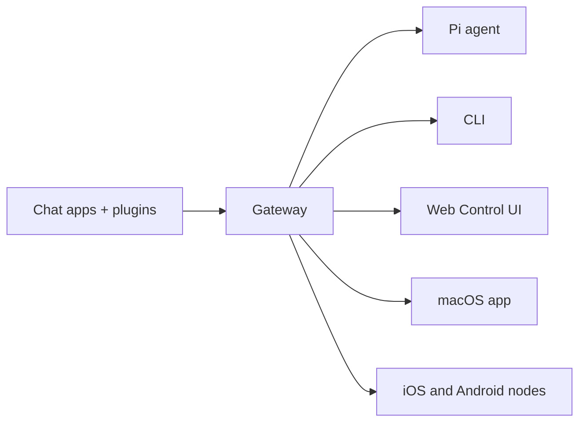

# OpenClaw 🦞

<p align="center">
    
    
</p>

> _"EXFOLIATE! EXFOLIATE!"_ — A space lobster, probably

<p align="center"><strong>Any OS gateway for AI agents across WhatsApp, Telegram, Discord, iMessage, and more.</strong><br />
  Send a message, get an agent response from your pocket. EXFOLIATE!"_ — Có lẽ là một con tôm hùm ngoài không gian
</p>

<Columns>
  <Card title="Get Started" href="/start/getting-started" icon="rocket">
    Cài đặt OpenClaw và khởi chạy Gateway chỉ trong vài phút.
  </Card>
  <Card title="Run the Wizard" href="/start/wizard" icon="sparkles">
    Thiết lập có hướng dẫn với `openclaw onboard` và các luồng ghép cặp.
  </Card>
  <Card title="Open the Control UI" href="/web/control-ui" icon="layout-dashboard">
    Khởi chạy bảng điều khiển trên trình duyệt để chat, cấu hình và quản lý phiên.
  </Card>
</Columns>

## OpenClaw là gì?

<strong>Cổng OS cho tác nhân AI trên WhatsApp, Telegram, Discord, iMessage, và hơn thế nữa.</strong> You run a single Gateway process on your own machine (or a server), and it becomes the bridge between your messaging apps and an always-available AI assistant.

**Dành cho ai?** Nhà phát triển và người dùng nâng cao muốn có một trợ lý AI cá nhân mà họ có thể nhắn tin từ bất kỳ đâu — mà không phải từ bỏ quyền kiểm soát dữ liệu hay phụ thuộc vào dịch vụ lưu trữ bên ngoài.

**Điều gì làm nó khác biệt?**

- **Tự host**: chạy trên phần cứng của bạn, theo quy tắc của bạn
- **Đa kênh**: một Gateway phục vụ đồng thời WhatsApp, Telegram, Discord và nhiều kênh khác
- **Thiết kế cho tác tử**: xây dựng cho các tác tử lập trình với công cụ, phiên, bộ nhớ và định tuyến đa tác tử
- **Mã nguồn mở**: giấy phép MIT, phát triển bởi cộng đồng

**Bạn cần gì?** Node 22+, một khóa API (khuyến nghị Anthropic) và 5 phút.

## Cách hoạt động



Gateway là nguồn sự thật duy nhất cho các phiên, định tuyến và kết nối kênh.

## Năng lực chính

<Columns>
  <Card title="Multi-channel gateway" icon="network">
    WhatsApp, Telegram, Discord và iMessage với một tiến trình Gateway duy nhất.
  </Card>
  <Card title="Plugin channels" icon="plug">
    Thêm Mattermost và nhiều kênh khác bằng các gói mở rộng.
  </Card>
  <Card title="Multi-agent routing" icon="route">
    Phiên được cô lập theo từng tác tử, workspace hoặc người gửi.
  </Card>
  <Card title="Media support" icon="image">
    Gửi và nhận hình ảnh, âm thanh và tài liệu.
  </Card>
  <Card title="Web Control UI" icon="monitor">
    Bảng điều khiển trên trình duyệt cho chat, cấu hình, phiên và node.
  </Card>
  <Card title="Mobile nodes" icon="smartphone">
    Ghép cặp node iOS và Android với hỗ trợ Canvas.
  </Card>
</Columns>

## Khởi động nhanh

<Steps>
  <Step title="Install OpenClaw">
    ```bash
    npm install -g openclaw@latest
    ```
  </Step>
  <Step title="Onboard and install the service">
    ```bash
    openclaw onboard --install-daemon
    ```
  </Step>
  <Step title="Pair WhatsApp and start the Gateway">
    ```bash
    openclaw channels login
    openclaw gateway --port 18789
    ```
  </Step>
</Steps>

Plugins bổ sung Mattermost và nhiều hơn nữa. See [Quick start](/start/quickstart).

## Dashboard

Mở Control UI trên trình duyệt sau khi Gateway khởi động.

- Mặc định cục bộ: [http://127.0.0.1:18789/](http://127.0.0.1:18789/)
- Truy cập từ xa: [Web surfaces](/web) và [Tailscale](/gateway/tailscale)

<p align="center">
  
</p>

## Cấu hình (tùy chọn)

Cấu hình nằm tại `~/.openclaw/openclaw.json`.

- Nếu bạn **không làm gì**, OpenClaw sẽ dùng binary Pi đi kèm ở chế độ RPC với các phiên theo từng người gửi.
- Nếu bạn muốn siết chặt bảo mật, hãy bắt đầu với `channels.whatsapp.allowFrom` và (đối với nhóm) các quy tắc mention.

Ví dụ:

```json5
{
  channels: {
    whatsapp: {
      allowFrom: ["+15555550123"],
      groups: { "*": { requireMention: true } },
    },
  },
  messages: { groupChat: { mentionPatterns: ["@openclaw"] } },
}
```

## Bắt đầu từ đây

<Columns>
  <Card title="Docs hubs" href="/start/hubs" icon="book-open">
    Tất cả tài liệu và hướng dẫn, được tổ chức theo từng trường hợp sử dụng.
  </Card>
  <Card title="Configuration" href="/gateway/configuration" icon="settings">
    Thiết lập Gateway cốt lõi, token và cấu hình nhà cung cấp.
  </Card>
  <Card title="Remote access" href="/gateway/remote" icon="globe">
    Các mô hình truy cập qua SSH và tailnet.
  </Card>
  <Card title="Channels" href="/channels/telegram" icon="message-square">
    Thiết lập theo từng kênh cho WhatsApp, Telegram, Discord và nhiều kênh khác.
  </Card>
  <Card title="Nodes" href="/nodes" icon="smartphone">
    Node iOS và Android với ghép cặp và Canvas.
  </Card>
  <Card title="Help" href="/help" icon="life-buoy">
    Các bản sửa lỗi phổ biến và điểm vào xử lý sự cố.
  </Card>
</Columns>

## Tìm hiểu thêm

<Columns>
  <Card title="Full feature list" href="/concepts/features" icon="list">
    Toàn bộ khả năng về kênh, định tuyến và media.
  </Card>
  <Card title="Multi-agent routing" href="/concepts/multi-agent" icon="route">
    Cô lập workspace và phiên theo từng tác tử.
  </Card>
  <Card title="Security" href="/gateway/security" icon="shield">
    Token, danh sách cho phép và các kiểm soát an toàn.
  </Card>
  <Card title="Troubleshooting" href="/gateway/troubleshooting" icon="wrench">
    Chẩn đoán Gateway và các lỗi thường gặp.
  </Card>
  <Card title="About and credits" href="/reference/credits" icon="info">
    Nguồn gốc dự án, người đóng góp và giấy phép.
  </Card>
</Columns>
