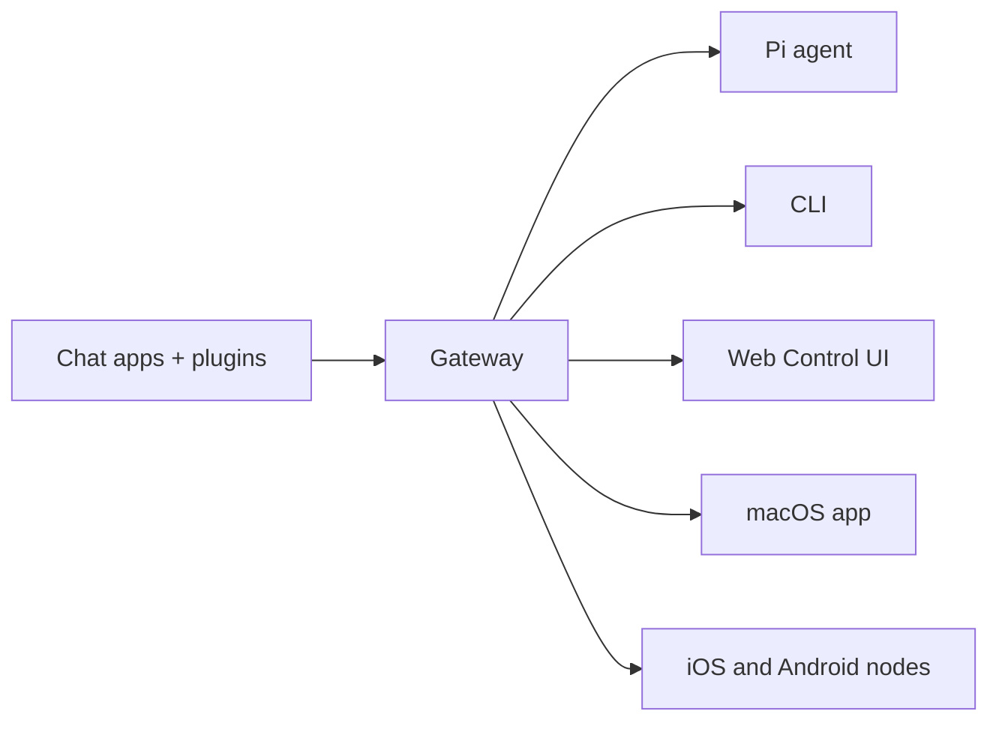

# OpenClaw 🦞

<p align="center">
    
    
</p>

> _"EXFOLIATE! EXFOLIATE!"_ — Một con tôm hùm ngoài không gian, có lẽ vậy

<p align="center">
  <strong>Gateway cho tác tử AI chạy trên mọi OS, kết nối WhatsApp, Telegram, Discord, iMessage và nhiều nền tảng khác.</strong><br />
  Gửi một tin nhắn, nhận phản hồi từ tác tử ngay trong túi bạn. Plugin có thể thêm Mattermost và nhiều kênh khác.
</p>

<Columns>
  <Card title="Bắt đầu" href="/start/getting-started" icon="rocket">
    Cài đặt OpenClaw và khởi chạy Gateway chỉ trong vài phút.
  </Card>
  <Card title="Chạy trình hướng dẫn" href="/start/wizard" icon="sparkles">
    Thiết lập có hướng dẫn với `openclaw onboard` và các luồng ghép cặp.
  </Card>
  <Card title="Mở Control UI" href="/web/control-ui" icon="layout-dashboard">
    Khởi chạy bảng điều khiển trên trình duyệt để chat, cấu hình và quản lý phiên.
  </Card>
</Columns>

## OpenClaw là gì?

OpenClaw là một **gateway tự host** kết nối các ứng dụng chat yêu thích của bạn — WhatsApp, Telegram, Discord, iMessage và nhiều nền tảng khác — với các tác tử AI lập trình như Pi. Bạn chạy một tiến trình Gateway duy nhất trên máy của mình (hoặc trên máy chủ), và nó trở thành cầu nối giữa các ứng dụng nhắn tin và một trợ lý AI luôn sẵn sàng.

**Dành cho ai?** Nhà phát triển và người dùng nâng cao muốn có một trợ lý AI cá nhân mà họ có thể nhắn tin từ bất kỳ đâu — mà không phải từ bỏ quyền kiểm soát dữ liệu hay phụ thuộc vào dịch vụ lưu trữ bên ngoài.

**Điều gì làm nó khác biệt?**

- **Tự host**: chạy trên phần cứng của bạn, theo quy tắc của bạn
- **Đa kênh**: một Gateway phục vụ đồng thời WhatsApp, Telegram, Discord và nhiều kênh khác
- **Thiết kế cho tác tử**: xây dựng cho các tác tử lập trình với công cụ, phiên, bộ nhớ và định tuyến đa tác tử
- **Mã nguồn mở**: giấy phép MIT, phát triển bởi cộng đồng

**Bạn cần gì?** Node 22+, một khóa API (khuyến nghị Anthropic) và 5 phút.

## Cách hoạt động



Gateway là nguồn sự thật duy nhất cho các phiên, định tuyến và kết nối kênh.

## Năng lực chính

<Columns>
  <Card title="Gateway đa kênh" icon="network">
    WhatsApp, Telegram, Discord và iMessage với một tiến trình Gateway duy nhất.
  </Card>
  <Card title="Kênh dạng plugin" icon="plug">
    Thêm Mattermost và nhiều kênh khác bằng các gói mở rộng.
  </Card>
  <Card title="Định tuyến đa tác tử" icon="route">
    Phiên được cô lập theo từng tác tử, workspace hoặc người gửi.
  </Card>
  <Card title="Hỗ trợ media" icon="image">
    Gửi và nhận hình ảnh, âm thanh và tài liệu.
  </Card>
  <Card title="Web Control UI" icon="monitor">
    Bảng điều khiển trên trình duyệt cho chat, cấu hình, phiên và node.
  </Card>
  <Card title="Node di động" icon="smartphone">
    Ghép cặp node iOS và Android với hỗ trợ Canvas.
  </Card>
</Columns>

## Khởi động nhanh

<Steps>
  <Step title="Cài đặt OpenClaw">
    ```bash
    npm install -g openclaw@latest
    ```
  </Step>
  <Step title="Hướng dẫn ban đầu và cài đặt dịch vụ">
    ```bash
    openclaw onboard --install-daemon
    ```
  </Step>
  <Step title="Ghép cặp WhatsApp và khởi động Gateway">
    ```bash
    openclaw channels login
    openclaw gateway --port 18789
    ```
  </Step>
</Steps>

Cần hướng dẫn cài đặt đầy đủ và thiết lập dev? Xem [Khởi động nhanh](/start/quickstart).

## Dashboard

Mở Control UI trên trình duyệt sau khi Gateway khởi động.

- Mặc định cục bộ: [http://127.0.0.1:18789/](http://127.0.0.1:18789/)
- Truy cập từ xa: [Web surfaces](/web) và [Tailscale](/gateway/tailscale)

<p align="center">
  
</p>

## Cấu hình (tùy chọn)

Cấu hình nằm tại `~/.openclaw/openclaw.json`.

- Nếu bạn **không làm gì**, OpenClaw sẽ dùng binary Pi đi kèm ở chế độ RPC với các phiên theo từng người gửi.
- Nếu bạn muốn siết chặt bảo mật, hãy bắt đầu với `channels.whatsapp.allowFrom` và (đối với nhóm) các quy tắc mention.

Ví dụ:

```json5
{
  channels: {
    whatsapp: {
      allowFrom: ["+15555550123"],
      groups: { "*": { requireMention: true } },
    },
  },
  messages: { groupChat: { mentionPatterns: ["@openclaw"] } },
}
```

## Bắt đầu từ đây

<Columns>
  <Card title="Trung tâm tài liệu" href="/start/hubs" icon="book-open">
    Tất cả tài liệu và hướng dẫn, được tổ chức theo từng trường hợp sử dụng.
  </Card>
  <Card title="Cấu hình" href="/gateway/configuration" icon="settings">
    Thiết lập Gateway cốt lõi, token và cấu hình nhà cung cấp.
  </Card>
  <Card title="Truy cập từ xa" href="/gateway/remote" icon="globe">
    Các mô hình truy cập qua SSH và tailnet.
  </Card>
  <Card title="Kênh" href="/channels/telegram" icon="message-square">
    Thiết lập theo từng kênh cho WhatsApp, Telegram, Discord và nhiều kênh khác.
  </Card>
  <Card title="Node" href="/nodes" icon="smartphone">
    Node iOS và Android với ghép cặp và Canvas.
  </Card>
  <Card title="Trợ giúp" href="/help" icon="life-buoy">
    Các bản sửa lỗi phổ biến và điểm vào xử lý sự cố.
  </Card>
</Columns>

## Tìm hiểu thêm

<Columns>
  <Card title="Danh sách tính năng đầy đủ" href="/concepts/features" icon="list">
    Toàn bộ khả năng về kênh, định tuyến và media.
  </Card>
  <Card title="Định tuyến đa tác tử" href="/concepts/multi-agent" icon="route">
    Cô lập workspace và phiên theo từng tác tử.
  </Card>
  <Card title="Bảo mật" href="/gateway/security" icon="shield">
    Token, danh sách cho phép và các kiểm soát an toàn.
  </Card>
  <Card title="Xử lý sự cố" href="/gateway/troubleshooting" icon="wrench">
    Chẩn đoán Gateway và các lỗi thường gặp.
  </Card>
  <Card title="Giới thiệu và ghi công" href="/reference/credits" icon="info">
    Nguồn gốc dự án, người đóng góp và giấy phép.
  </Card>
</Columns>
