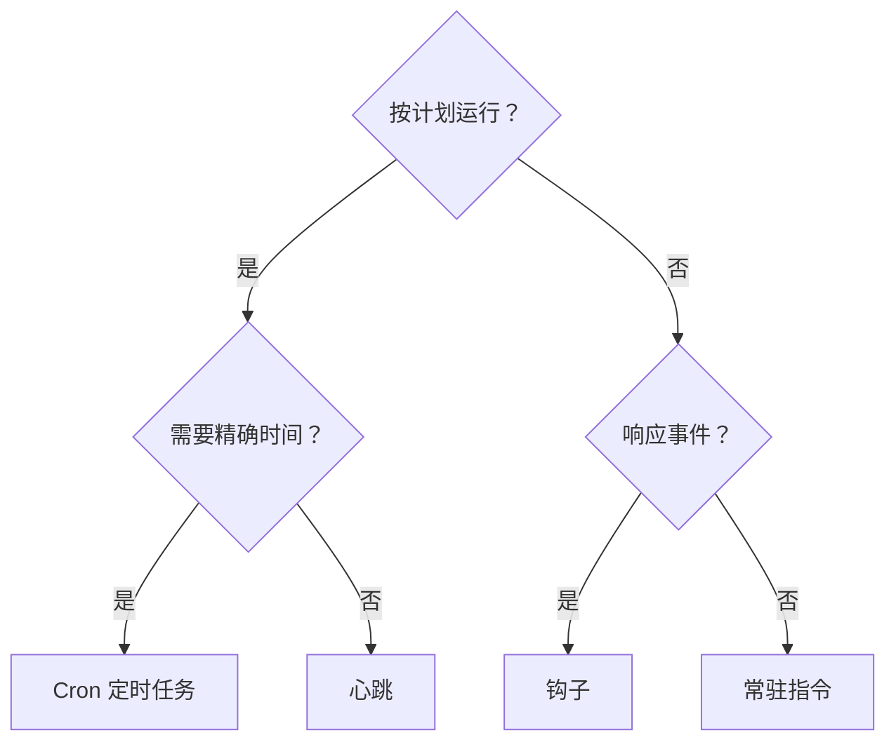

# 自动化

OpenClaw 提供多种自动化机制，每种适用于不同的使用场景。本页帮助你选择合适的方案。

## 快速决策指南

## 机制一览

| 机制                                    | 功能                                     | 运行环境         | 创建任务记录   |
| --------------------------------------- | ---------------------------------------- | ---------------- | -------------- |
| [心跳](/gateway/heartbeat)              | 周期性主会话轮次 — 批量合并多项检查      | 主会话           | 否             |
| [Cron 定时任务](/automation/cron-jobs)  | 精确计时的计划任务                       | 主会话或隔离会话 | 是（所有类型） |
| [后台任务](/automation/tasks)           | 跟踪分离的工作（cron、ACP、子代理、CLI） | 不适用（账本）   | 不适用         |
| [钩子](/automation/hooks)               | 由代理生命周期事件触发的事件驱动脚本     | 钩子运行器       | 否             |
| [常驻指令](/automation/standing-orders) | 注入到系统提示词中的持久化指令           | 主会话           | 否             |
| [Webhook](/automation/webhook)          | 接收入站 HTTP 事件并路由给代理           | Gateway HTTP     | 否             |

### 专业化自动化

| 机制                                     | 功能                                   |
| ---------------------------------------- | -------------------------------------- |
| [Gmail PubSub](/automation/gmail-pubsub) | 通过 Google PubSub 实时接收 Gmail 通知 |
| [轮询](/automation/poll)                 | 周期性数据源检查（RSS、API 等）        |
| [认证监控](/automation/auth-monitoring)  | 凭据健康状态和过期提醒                 |

## 它们如何协同工作

最有效的配置通常结合多种机制：

1. **心跳**处理常规监控（收件箱、日历、通知），每 30 分钟批量执行一次。
2. **Cron 定时任务**处理精确计划（每日报告、每周回顾）和一次性提醒。
3. **钩子**响应特定事件（工具调用、会话重置、压缩）执行自定义脚本。
4. **常驻指令**给代理提供持久化上下文（"每次回复前先检查项目看板"）。
5. **后台任务**自动跟踪所有分离的工作，便于检查和审计。

详细对比请参阅 [Cron 与心跳的对比](/automation/cron-vs-heartbeat)。

## 旧版 ClawFlow 引用

较早的版本说明和文档可能提到 `ClawFlow` 或 `openclaw flows`，但当前仓库中的 CLI 命令为 `openclaw tasks`。

请参阅[后台任务](/automation/tasks)了解支持的任务账本命令，以及 [ClawFlow](/automation/clawflow) 和 [CLI: flows](/cli/flows) 了解兼容性说明。

## 相关文档

- [Cron 与心跳的对比](/automation/cron-vs-heartbeat) — 详细对比指南
- [ClawFlow](/automation/clawflow) — 旧版文档和版本说明的兼容性说明
- [故障排除](/automation/troubleshooting) — 调试自动化问题
- [配置参考](/gateway/configuration-reference) — 所有配置键
