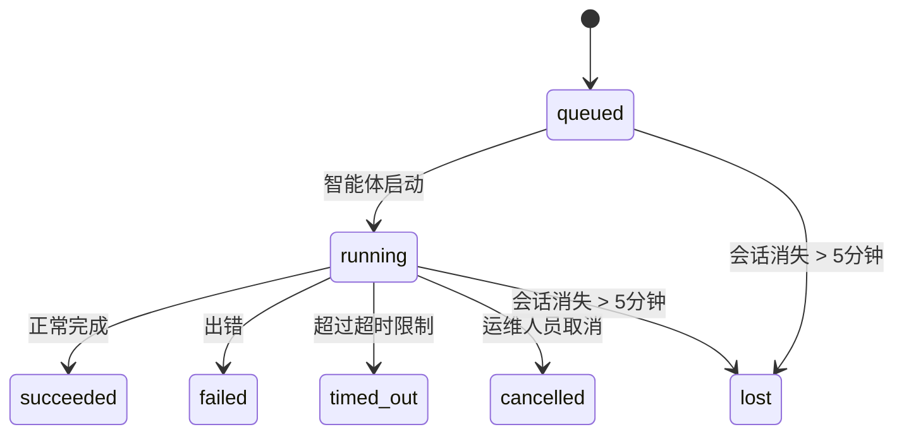

# 后台任务

> **想了解调度方式？** 请参阅[自动化与任务](/zh-CN/automation)选择合适的机制。本页面涵盖**追踪**后台工作，而非调度。

后台任务追踪在**主会话之外**运行的工作：ACP 运行、子智能体派生、隔离定时任务执行和 CLI 发起操作。

任务**不替代**会话、定时任务或心跳——它们是**活动账本**，记录了哪些分离式工作发生了、何时发生、是否成功。

<Note>
并非所有智能体运行都会创建任务。心跳轮次和普通交互式聊天不会。定时任务执行、ACP 派生、子智能体派生和 CLI 智能体命令都会创建任务。
</Note>

## TL;DR 摘要

- 任务是**记录**，不是调度器——定时任务和心跳决定工作何时运行，任务追踪发生了什么。
- ACP、子智能体、所有定时任务和 CLI 操作创建任务。心跳轮次不创建。
- 每个任务经历 `queued → running → terminal`（succeeded、failed、timed_out、cancelled 或 lost）。
- 完成通知直接投递给指定渠道，或进入下一心跳的队列等待。
- `openclaw tasks list` 显示所有任务；`openclaw tasks audit` 暴露问题。
- 终态记录保留 7 天，之后自动清理。

## 快速开始

```bash
# 列出所有任务（最新优先）
openclaw tasks list

# 按运行时类型或状态筛选
openclaw tasks list --runtime acp
openclaw tasks list --status running

# 显示特定任务的详情（支持任务ID、运行ID或会话Key）
openclaw tasks show <lookup>

# 取消运行中的任务（杀死子会话）
openclaw tasks cancel <lookup>

# 修改任务通知策略
openclaw tasks notify <lookup> state_changes

# 运行健康审计
openclaw tasks audit
```

## 什么会创建任务

| 来源 | 运行时类型 | 何时创建任务记录 | 默认通知策略 |
| ---- | --------- | ---------------- | ----------- |
| ACP 后台运行 | `acp` | 派生子 ACP 会话时 | `done_only` |
| 子智能体编排 | `subagent` | 通过 `sessions_spawn` 派生子智能体时 | `done_only` |
| 定时任务（所有类型）| `cron` | 每次定时任务执行时（主会话和隔离式）| `silent` |
| CLI 操作 | `cli` | 通过 Gateway 运行的 `openclaw agent` 命令 | `silent` |

主会话定时任务默认使用 `silent` 通知策略——它们为追踪创建记录，但不生成通知。隔离定时任务同样默认 `silent`，但因运行在独立会话中而更可见。

**不会创建任务的操作：**
- 心跳轮次（主会话；参见[心跳](/zh-CN/gateway/heartbeat)）
- 普通交互式聊天轮次
- 直接的 `/命令` 响应

## 任务生命周期



| 状态 | 含义 |
| ---- | ---- |
| `queued` | 已创建，等待智能体启动 |
| `running` | 智能体轮次正在执行 |
| `succeeded` | 成功完成 |
| `failed` | 执行出错 |
| `timed_out` | 超过配置的超时时间 |
| `cancelled` | 运维人员通过 `openclaw tasks cancel` 停止 |
| `lost` | 后端子会话消失（5分钟宽限期后检测到）|

状态转换自动发生——关联的智能体运行结束时，任务状态自动更新。

## 投递与通知

任务到达终态时，OpenClaw 会发送通知。有两条投递路径：

**直接投递** — 如果任务有渠道目标（`requesterOrigin`），完成消息直接发送至该渠道（Telegram、Discord、Slack 等）。

**会话队列入投** — 如果直接投递失败或未设置来源，完成更新作为系统事件进入请求者的会话队列，在下次心跳时浮现。

<Tip>
任务完成会触发立即心跳唤醒，让你快速看到结果——无需等待下次计划心跳。
</Tip>

### 通知策略

控制每个任务的通知频率：

| 策略 | 投递内容 |
| ---- | -------- |
| `done_only`（默认）| 仅终态（succeeded、failed 等）——**这是默认值** |
| `state_changes` | 每个状态转换和进度更新 |
| `silent` | 什么都不发 |

在任务运行中修改策略：

```bash
openclaw tasks notify <lookup> state_changes
```

## CLI 参考

### `tasks list`

```bash
openclaw tasks list [--runtime <acp|subagent|cron|cli>] [--status <status>] [--json]
```

输出列：任务ID、类型、状态、投递方式、运行ID、子会话、摘要。

### `tasks show`

```bash
openclaw tasks show <lookup>
```

lookup 标识接受任务ID、运行ID或会话Key。显示完整记录，包括时间轴、投递状态、错误和终态摘要。

### `tasks cancel`

```bash
openclaw tasks cancel <lookup>
```

对于 ACP 和子智能体任务，这会杀死子会话。状态转换为 `cancelled` 并发送投递通知。

### `tasks notify`

```bash
openclaw tasks notify <lookup> <done_only|state_changes|silent>
```

### `tasks audit`

```bash
openclaw tasks audit [--json]
```

暴露运维问题。发现的问题也会出现在 `openclaw status` 中。

| 发现项 | 严重级别 | 触发条件 |
| ------ | -------- | -------- |
| `stale_queued` | warn | 排队超过10分钟 |
| `stale_running` | error | 运行超过30分钟 |
| `lost` | error | 后端会话已消失 |
| `delivery_failed` | warn | 投递失败且通知策略非 `silent` |
| `missing_cleanup` | warn | 终态任务无清理时间戳 |
| `inconsistent_timestamps` | warn | 时间轴违规（例如结束时间早于开始时间）|

## 聊天任务看板（`/tasks`）

在任何聊天会话中使用 `/tasks` 可查看链接到该会话的后台任务。看板显示活跃和最近完成的任务，包含运行时类型、状态、时间轴以及进度或错误详情。

当当前会话无可见链接任务时，`/tasks` 回退到智能体本地的任务计数，让你无需泄露其他会话详情也能看到概览。

完整运维账本请使用 CLI：`openclaw tasks list`。

## 状态集成（任务压力）

`openclaw status` 包含一目了然的任务摘要：

```
Tasks: 3 queued · 2 running · 1 issues
```

摘要报告：
- **active** — `queued` + `running` 的计数
- **failures** — `failed` + `timed_out` + `lost` 的计数
- **byRuntime** — 按 `acp`、`subagent`、`cron`、`cli` 的分类

`/status` 和 `session_status` 工具都使用清理感知任务快照：优先显示活跃任务，隐藏过期的已完成行，最近失败仅在无活跃工作时才浮现。这保证了状态卡片聚焦于当前真正重要的事。

## 存储与维护

### 任务存储位置

任务记录持久化在 SQLite 中：

```
$OPENCLAW_STATE_DIR/tasks/runs.sqlite
```

注册表在 Gateway 启动时加载到内存，并在更改时同步写入 SQLite 以在重启间保持持久性。

### 自动维护

清理器每 **60 秒**运行一次，处理三件事：

1. **协调** — 检查活跃任务的后端会话是否仍然存在。如果子会话消失超过5分钟，任务标记为 `lost`。
2. **清理标记** — 在终态任务上设置 `cleanupAfter` 时间戳（endedAt + 7天）。
3. **修剪** — 删除超过 `cleanupAfter` 日期的记录。

**保留期**：终态任务记录保留 **7 天**，之后自动修剪。无需配置。

## 任务与其他系统的关系

### 任务与任务流

[任务流](/zh-CN/automation/taskflow)是位于后台任务之上的流程编排层。单个流程可能在其生命周期内协调多个任务（使用托管或镜像同步模式）。使用 `openclaw tasks` 检查单个任务记录，使用 `openclaw tasks flow` 检查编排流程。

参见[任务流](/zh-CN/automation/taskflow)。

### 任务与定时任务

定时任务**定义**存储在 `~/.openclaw/cron/jobs.json`。**每次**定时任务执行都创建任务记录——包括主会话和隔离式。主会话定时任务默认使用 `silent` 通知策略，以追踪但不产生通知。

参见[定时任务](/zh-CN/automation/cron-jobs)。

### 任务与心跳

心跳运行是主会话轮次——不创建任务记录。当任务完成时，它可以触发心跳唤醒，让你快速看到结果。

参见[心跳](/zh-CN/gateway/heartbeat)。

### 任务与会话

任务可能引用 `childSessionKey`（工作运行位置）和 `requesterSessionKey`（发起者）。会话是对话上下文；任务是在其上构建的活动追踪。

### 任务与智能体运行

任务的 `runId` 链接到执行工作的智能体运行。智能体生命周期事件（启动、结束、错误）自动更新任务状态——无需手动管理生命周期。

## 相关文档

- [自动化与任务](/zh-CN/automation) — 所有自动化机制一览
- [任务流](/zh-CN/automation/taskflow) — 基于任务之上的流程编排
- [定时任务](/zh-CN/automation/cron-jobs) — 后台工作调度
- [心跳](/zh-CN/gateway/heartbeat) — 周期性主会话轮次
- [CLI：任务](/zh-CN/cli/index#tasks) — CLI 命令参考
