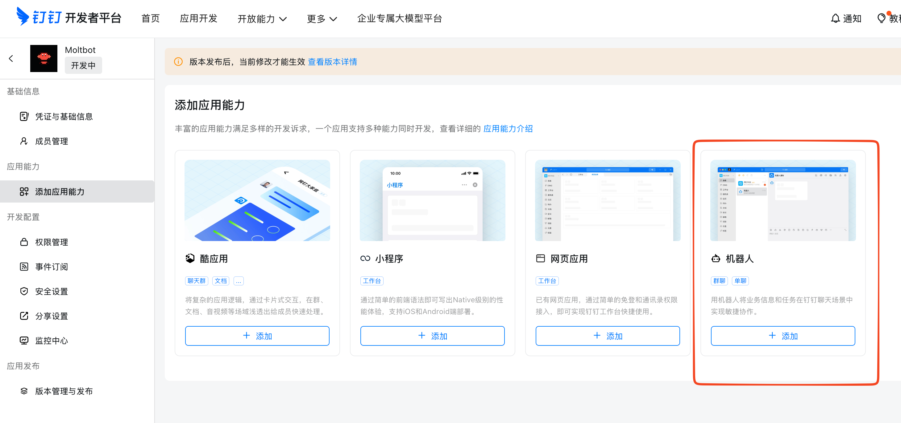
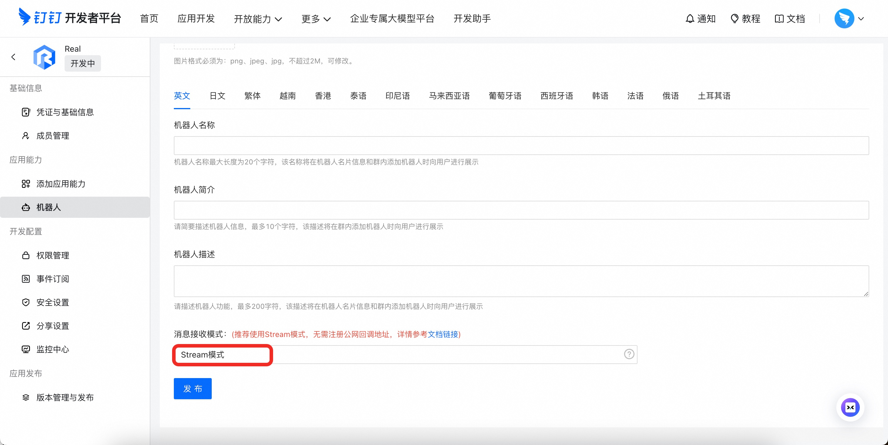
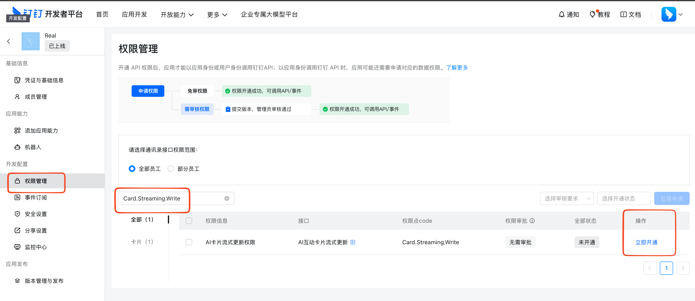
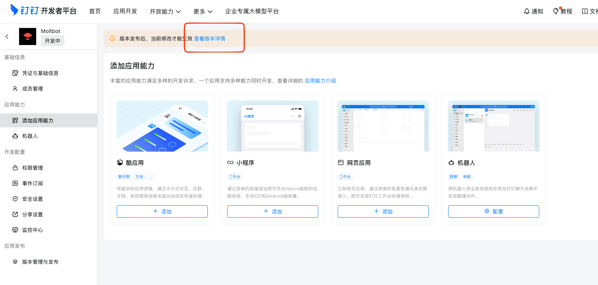
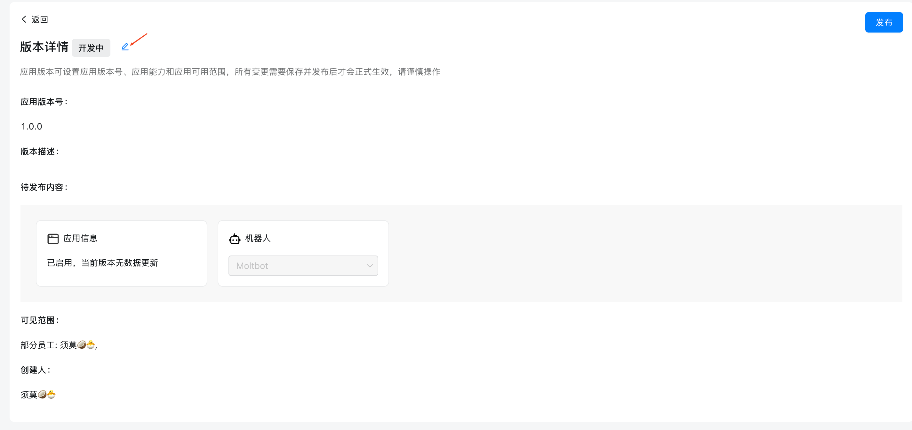
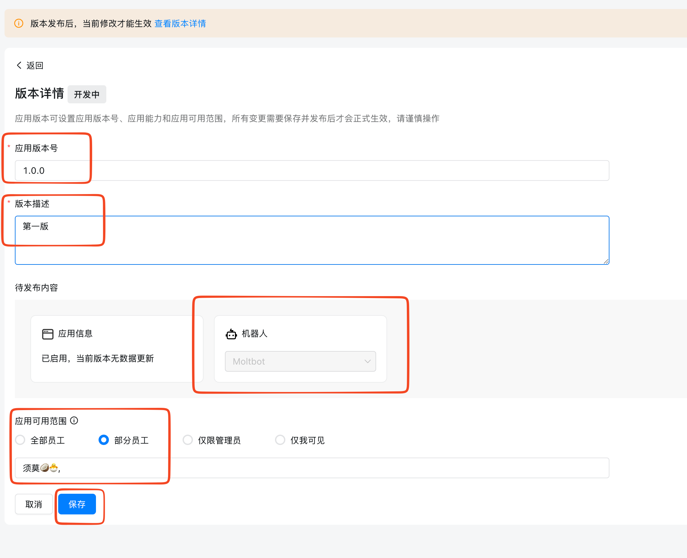
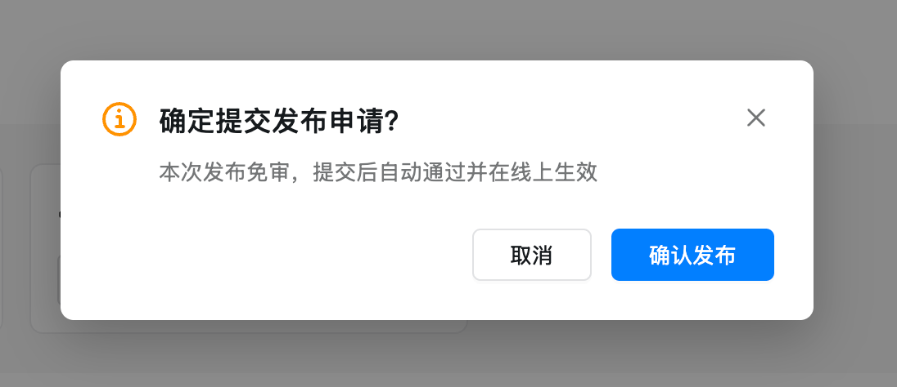
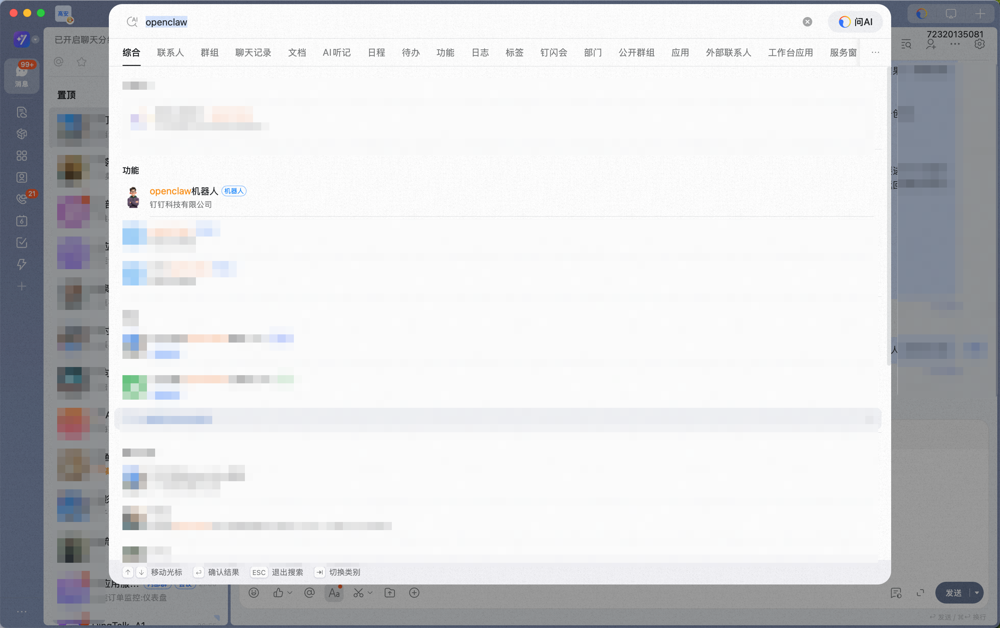
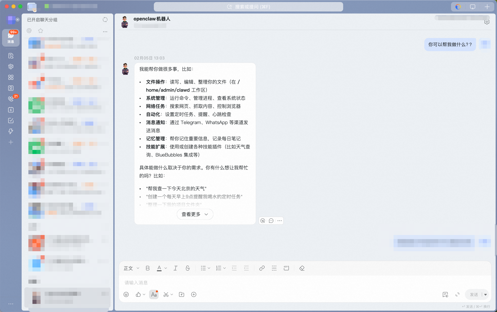

# 钉钉机器人

钉钉（DingTalk）是中国广泛使用的企业协作平台，提供即时通讯和办公协作功能。此插件通过钉钉的 Stream 模式（WebSocket）将 OpenClaw 连接到钉钉机器人，无需暴露公网 webhook URL 即可接收消息。

---

## 需要插件

安装 DingTalk 插件：

```bash
openclaw plugins install @openclaw/dingtalk
```

本地 checkout（在 git 仓库内运行）：

```bash
openclaw plugins install ./extensions/dingtalk
```

---

## 快速开始

添加钉钉渠道有两种方式：

### 方式一：通过安装向导添加（推荐）

如果您刚安装完 OpenClaw，可以直接运行向导，根据提示添加钉钉：

```bash
openclaw onboard
```

向导会引导您完成：

1. 创建钉钉应用并获取凭证
2. 配置应用凭证
3. 启动网关

✅ **完成配置后**，您可以使用以下命令检查网关状态：

- `openclaw gateway status` - 查看网关运行状态
- `openclaw logs --follow` - 查看实时日志

### 方式二：通过命令行添加

如果您已经完成了初始安装，可以用以下命令添加钉钉渠道：

```bash
openclaw channels add
```

然后根据交互式提示选择 DingTalk，输入 App Key 和 App Secret 即可。

✅ **完成配置后**，您可以使用以下命令管理网关：

- `openclaw gateway status` - 查看网关运行状态
- `openclaw gateway restart` - 重启网关以应用新配置
- `openclaw logs --follow` - 查看实时日志

---

## 第一步：申请钉钉机器人

1. 打开 [钉钉开放平台](https://open.dingtalk.com/)

2. 登录后进入 **应用开发** → **企业内部开发**

3. 创建应用，在应用详情页获取 **AppKey** 和 **AppSecret**

4. **应用能力** → **添加应用能力**，选择 **机器人** 类型


5. 配置机器人的消息接收模式为 **Stream 模式**



6. **发布钉钉机器人**

---

## 第二步：钉钉企业应用权限开通

非管理员用户需管理员审批。

逐个搜索打开下列权限：

- `Card.Streaming.Write`
- `Card.Instance.Write`
- `qyapi_robot_sendmsg`



---

## 第三步：发布企业应用









确认可见范围仅自己，启用了机器人后，点 **发布**。

---

## 第四步：配置 OpenClaw

### 通过向导配置（推荐）

运行以下命令，根据提示粘贴 App Key 和 App Secret：

```bash
openclaw channels add
```

选择 **DingTalk**，然后输入您在第一步获取的凭证即可。

### 通过配置文件配置

编辑 `~/.openclaw/openclaw.json`：

```json5
{
  channels: {
    dingtalk: {
      enabled: true,
      clientId: "dingxxx",
      clientSecret: "xxx",
      dmPolicy: "open",
      groupPolicy: "open",
    },
  },
}
```

---

## 第五步：启动并测试

### 1. 启动网关

```bash
openclaw gateway
```

### 2. 发送测试消息

在钉钉中搜索找到您创建的机器人，发送一条消息。





### 3. 配对授权（仅当启用 `dmPolicy: "pairing"`）

如果将私聊策略设为 `pairing`，机器人会回复 **配对码**，需要管理员批准：

```bash
openclaw pairing approve dingtalk <配对码>
```

---

## 介绍

- **钉钉机器人渠道**：由网关管理的钉钉机器人
- **确定性路由**：回复始终返回钉钉，模型不会选择渠道
- **会话隔离**：私聊共享主会话；群组独立隔离
- **Stream 模式连接**：使用钉钉 SDK 的 WebSocket 连接，无需公网 URL

---

## 访问控制

### 私聊访问

- **默认**：`dmPolicy: "open"`
- **白名单模式**：通过 `channels.dingtalk.allowFrom` 配置允许的用户 ID

### 群组访问

**群组策略**（`channels.dingtalk.groupPolicy`）：

- `"open"` = 允许群组中所有人（默认）
- `"allowlist"` = 仅允许 `groupAllowFrom` 中的用户
- `"disabled"` = 禁用群组消息

---

## 获取用户 ID（staffId/userId）

用户 ID 可以通过以下方式获取：

**方法一**（推荐）：

1. 启动网关并给机器人发消息
2. 运行 `openclaw logs --follow` 查看日志中的 `senderStaffId` 或 `senderId`

**方法二**：
查看配对请求列表，其中包含用户 ID：

```bash
openclaw pairing list dingtalk
```

---

## 常用命令

| 命令      | 说明           |
| --------- | -------------- |
| `/status` | 查看机器人状态 |
| `/reset`  | 重置对话会话   |
| `/model`  | 查看/切换模型  |

> 注意：钉钉目前不支持原生命令菜单，命令需要以文本形式发送。

## 网关管理命令

在配置和使用钉钉渠道时，您可能需要使用以下网关管理命令：

| 命令                       | 说明              |
| -------------------------- | ----------------- |
| `openclaw gateway status`  | 查看网关运行状态  |
| `openclaw gateway install` | 安装/启动网关服务 |
| `openclaw gateway stop`    | 停止网关服务      |
| `openclaw gateway restart` | 重启网关服务      |
| `openclaw logs --follow`   | 实时查看日志输出  |

---

## 故障排除

### 机器人在群组中不响应

1. 检查机器人是否已添加到群组
2. 检查是否 @了机器人（默认需要 @提及）
3. 检查 `groupPolicy` 是否为 `"disabled"`
4. 查看日志：`openclaw logs --follow`

### 机器人收不到消息

1. 检查应用是否已发布并审批通过
2. 检查是否启用了 Stream 模式
3. 检查应用权限是否完整
4. 检查网关是否正在运行：`openclaw gateway status`
5. 查看实时日志：`openclaw logs --follow`

### App Secret 泄露怎么办

1. 在钉钉开放平台重置 App Secret
2. 更新配置文件中的 App Secret
3. 重启网关

### 发送消息失败

1. 检查应用是否有 `qyapi_robot_sendmsg` 权限
2. 检查应用是否已发布
3. 查看日志获取详细错误信息

---

## 配置参考

完整配置请参考：[网关配置](/gateway/configuration)

主要选项：

| 配置项                                                      | 说明                       | 默认值    |
| ----------------------------------------------------------- | -------------------------- | --------- |
| `channels.dingtalk.enabled`                                 | 启用/禁用渠道              | `true`    |
| `channels.dingtalk.clientId`                                | 应用 App Key（Client ID）  | -         |
| `channels.dingtalk.clientSecret`                            | 应用 App Secret            | -         |
| `channels.dingtalk.dmPolicy`                                | 私聊策略                   | `open`    |
| `channels.dingtalk.allowFrom`                               | 私聊白名单（用户 ID 列表） | -         |
| `channels.dingtalk.groupPolicy`                             | 群组策略                   | `open`    |
| `channels.dingtalk.groupAllowFrom`                          | 群组白名单                 | -         |

---

## 支持的消息类型

### 接收

- ✅ 文本消息
- ✅ 图片
- ✅ 文件
- ✅ 音频
- ✅ 视频
- ⚠️ 富文本（部分支持）

### 发送

- ✅ 文本消息
- ✅ 图片
- ✅ 文件
- ✅ Markdown
- ⚠️ 互动卡片（部分支持）
