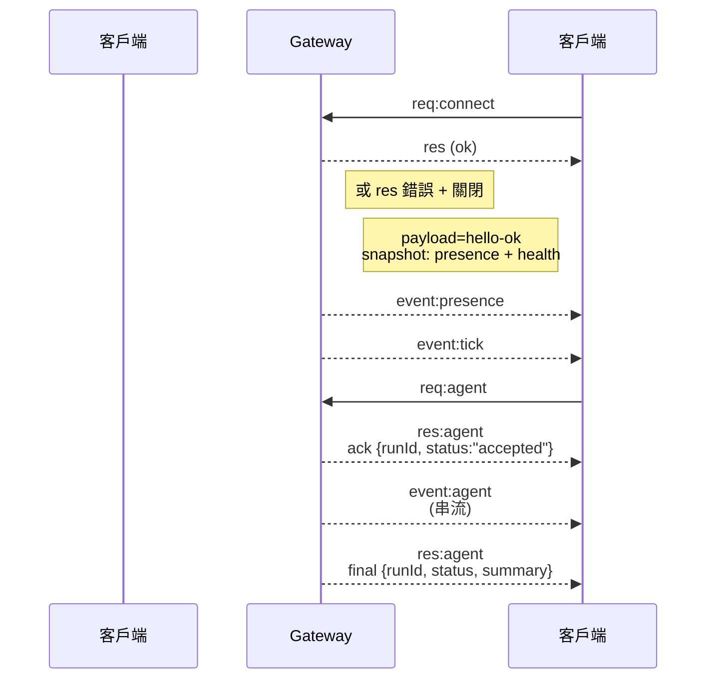

# Gateway 架構

上次更新日期：2026-01-22

## 概述

- 單一、長效的 **Gateway** 擁有所有訊息傳送介面（透過 Baileys 的 WhatsApp、透過 grammY 的 Telegram、Slack、Discord、Signal、iMessage、WebChat）。
- 控制平面客戶端（macOS 應用程式、CLI、網頁使用者介面、自動化）透過已設定的綁定主機（預設 `127.0.0.1:18789`）以 **WebSocket** 連接到 Gateway。
- **節點**（macOS/iOS/Android/無頭模式）也透過 **WebSocket** 連接，但宣告 `role: node` 並附帶明確的權限/指令。
- 每台主機一個 Gateway；它是唯一開啟 WhatsApp 會話的地方。
- **canvas 主機**（預設 `18793`）提供代理可編輯的 HTML 和 A2UI。

## 元件與流程

### Gateway (守護程式)

- 維護提供者連接。
- 暴露一個類型化的 WS API（請求、回應、伺服器推播事件）。
- 根據 JSON Schema 驗證入站框架。
- 發出 `agent`、`chat`、`presence`、`health`、`heartbeat`、`cron` 等事件。

### 客戶端 (mac 應用程式 / CLI / 網頁管理介面)

- 每個客戶端一個 WS 連接。
- 傳送請求（`health`、`status`、`send`、`agent`、`system-presence`）。
- 訂閱事件（`tick`、`agent`、`presence`、`shutdown`）。

### 節點 (macOS / iOS / Android / 無頭模式)

- 以 `role: node` 連接到**相同的 WS 伺服器**。
- 在 `connect` 中提供裝置身份；配對是**基於裝置**的（角色 `node`），並且核准儲存在裝置配對儲存中。
- 暴露 `canvas.*`、`camera.*`、`screen.record`、`location.get` 等指令。

協定細節：

- [Gateway 協定](/gateway/protocol)

### WebChat

- 靜態使用者介面，使用 Gateway WS API 進行聊天記錄和傳送。
- 在遠端設定中，透過與其他客戶端相同的 SSH/Tailscale 隧道連接。

## 連接生命週期 (單一客戶端)



## 線路協定 (摘要)

- 傳輸：WebSocket，帶有 JSON payload 的文字框架。
- 第一個框架**必須**是 `connect`。
- 握手後：
  - 請求：`{type:"req", id, method, params}` → `{type:"res", id, ok, payload|error}`
  - 事件：`{type:"event", event, payload, seq?, stateVersion?}`
- 如果設定了 `OPENCLAW_GATEWAY_TOKEN`（或 `--token`），`connect.params.auth.token` 必須匹配，否則 socket 將關閉。
- 冪等鍵對於有副作用的方法（`send`、`agent`）是必需的，以安全地重試；伺服器保留一個短期的去重複快取。
- 節點必須在 `connect` 中包含 `role: "node"` 以及權限/指令/許可。

## 配對 + 本機信任

- 所有 WS 客戶端（操作員 + 節點）在 `connect` 上都包含一個**裝置身份**。
- 新的裝置 ID 需要配對核准；Gateway 發出一個**裝置權杖**用於後續連接。
- **本機**連接（迴路或 Gateway 主機自己的 tailnet 位址）可以自動核准，以保持同主機的使用者體驗流暢。
- **非本機**連接必須簽署 `connect.challenge` nonce 並需要明確核准。
- Gateway 驗證（`gateway.auth.*`）仍然適用於**所有**連接，無論是本機還是遠端。

細節：[Gateway 協定](/gateway/protocol)、[配對](/channels/pairing)、
[安全性](/gateway/security)。

## 協定類型化與程式碼生成

- TypeBox 綱要定義了協定。
- JSON Schema 是從這些綱要生成的。
- Swift 模型是從 JSON Schema 生成的。

## 遠端存取

- 建議：Tailscale 或 VPN。
- 替代方案：SSH 隧道

  ```bash
  ssh -N -L 18789:127.0.0.1:18789 user @refactor/exec-host.md
  ```

- 相同的握手 + 驗證權杖適用於隧道。
- 在遠端設定中，WS 可以啟用 TLS + 選項性憑證綁定。

## 操作快照

- 啟動：`openclaw gateway`（前景執行，日誌輸出到 stdout）。
- 健康狀態：透過 WS `health`（也包含在 `hello-ok` 中）。
- 監管：用於自動重啟的 launchd/systemd。

## 不變式

- 每個主機只有一個 Gateway 控制一個 Baileys 會話。
- 握手是強制性的；任何非 JSON 或非連接的第一個框架都會導致硬關閉。
- 事件不會重播；客戶端必須在有間隙時重新整理。
