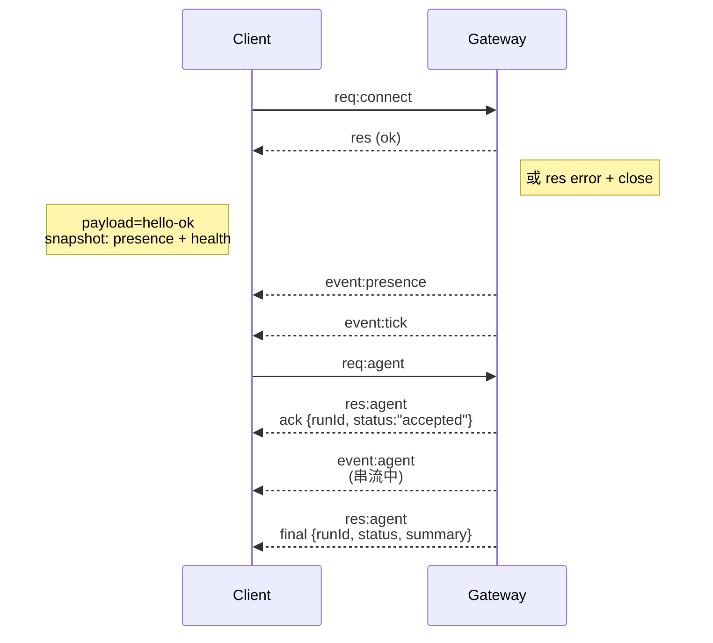

# Gateway 架構

最後更新：2026-01-22

## 總覽

- 單一長效運行的 **Gateway** 擁有所有訊息介面 (WhatsApp 透過 Baileys、Telegram 透過 grammY、Slack、Discord、Signal、iMessage、WebChat)。
- 控制平面用戶端 (macOS 應用程式、CLI、網頁 UI、自動化) 透過 **WebSocket** 連接至 Gateway，使用設定的綁定主機 (預設為 `127.0.0.1:18789`)。
- **Nodes** (macOS/iOS/Android/headless) 亦透過 **WebSocket** 連接，但宣告 `role: node` 並附帶明確的能力 (caps)/指令。
- 每個主機一個 Gateway；它是唯一開啟 WhatsApp 工作階段的地方。
- **Canvas 主機** (預設為 `18793`) 提供智慧代理可編輯的 HTML 與 A2UI。

## 組件與流程

### Gateway (守護行程)

- 維護供應商連線。
- 公開具型別的 WS API (請求、回應、伺服器推送事件)。
- 根據 JSON Schema 驗證傳入的框架 (frames)。
- 發出如 `agent`、`chat`、`presence`、`health`、`heartbeat`、`cron` 等事件。

### 用戶端 (mac 應用程式 / CLI / 網頁管理員)

- 每個用戶端一個 WS 連線。
- 傳送請求 (`health`、`status`、`send`、`agent`、`system-presence`)。
- 訂閱事件 (`tick`、`agent`、`presence`、`shutdown`)。

### Node (macOS / iOS / Android / headless)

- 以 `role: node` 連接至**同一個 WS 伺服器**。
- 在 `connect` 中提供裝置識別；配對是**基於裝置的** (role 為 `node`)，核准資訊儲存於裝置配對儲存空間中。
- 公開如 `canvas.*`、`camera.*`、`screen.record`、`location.get` 等指令。

協定詳情：

- [Gateway 協定](/gateway/protocol)

### WebChat

- 靜態 UI，使用 Gateway WS API 獲取對話紀錄與進行傳送。
- 在遠端設定中，透過與其他用戶端相同的 SSH/Tailscale 通道進行連接。

## 連線生命週期 (單一用戶端)



## 傳輸協定 (摘要)

- 傳輸方式：WebSocket，帶有 JSON 負載的文字框架。
- 第一個框架**必須**是 `connect`。
- 握手之後：
  - 請求：`{type:"req", id, method, params}` → `{type:"res", id, ok, payload|error}`
  - 事件：`{type:"event", event, payload, seq?, stateVersion?}`
- 若設定了 `OPENCLAW_GATEWAY_TOKEN` (或 `--token`)，`connect.params.auth.token` 必須相符，否則通訊端 (socket) 將關閉。
- 具副作用的方法 (`send`、`agent`) 需要冪等鍵 (Idempotency keys) 以安全地進行重試；伺服器會保留短效的去重快取。
- Node 必須在 `connect` 中包含 `role: "node"` 以及能力/指令/權限。

## 配對 + 本地信任

- 所有 WS 用戶端 (操作者 + Node) 在 `connect` 時皆須包含**裝置識別**。
- 新裝置 ID 需要配對核准；Gateway 會為後續連線核發**裝置權杖 (device token)**。
- **本地**連線 (loopback 或 Gateway 主機自身的 tailnet 位址) 可自動核准，以保持同主機使用者體驗順暢。
- **非本地**連線必須對 `connect.challenge` nonce 進行簽署，且需要明確核准。
- Gateway 認證 (`gateway.auth.*`) 仍適用於**所有**連線，不論是本地或遠端。

詳情：[Gateway 協定](/gateway/protocol), [配對](/channels/pairing), [安全性](/gateway/security)。

## 協定型別與程式碼生成

- 使用 TypeBox schema 定義協定。
- 從這些 schema 生成 JSON Schema。
- 從 JSON Schema 生成 Swift 模型。

## 遠端存取

- 首選：Tailscale 或 VPN。
- 替代方案：SSH 通道

  ```bash
  ssh -N -L 18789:127.0.0.1:18789 user@host
  ```

- 相同的握手 + 認證權杖適用於此通道。
- 在遠端設定中，可為 WS 啟用 TLS + 選用固定 (pinning)。

## 維運快照

- 啟動：`openclaw gateway` (前景執行，日誌輸出至 stdout)。
- 健康檢查：透過 WS 進行 `health` (也包含在 `hello-ok` 中)。
- 監控：使用 launchd/systemd 進行自動重啟。

## 不變量 (Invariants)

- 每個主機僅由一個 Gateway 控制單一 Baileys 工作階段。
- 握手是強制性的；任何非 JSON 或第一個框架不是 `connect` 的連線都會被強制關閉。
- 事件不會重播；用戶端必須在出現間隔時進行重新整理。
