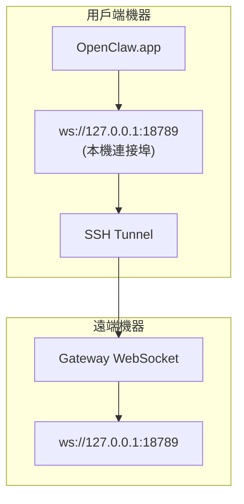

# 搭配遠端 Gateway 執行 OpenClaw.app

OpenClaw.app 使用 SSH 通道連接到遠端 Gateway。本指南將說明如何設定。

## 概述



## 快速開始

### 步驟 1: 新增 SSH 設定

編輯 `~/.ssh/config` 並加入：

```ssh
Host remote-gateway
    HostName <REMOTE_IP>          # e.g., 172.27.187.184
    User <REMOTE_USER>            # e.g., jefferson
    LocalForward 18789 127.0.0.1:18789
    IdentityFile ~/.ssh/id_rsa
```

將 `<REMOTE_IP>` 和 `<REMOTE_USER>` 取代為您的值。

### 步驟 2: 複製 SSH 金鑰

將您的公開金鑰複製到遠端機器 (只需輸入一次密碼)：

```bash
ssh-copy-id -i ~/.ssh/id_rsa <REMOTE_USER> @<REMOTE_IP>
```

### 步驟 3: 設定 Gateway 權杖

```bash
launchctl setenv OPENCLAW_GATEWAY_TOKEN "<your-token>"
```

### 步驟 4: 啟動 SSH 通道

```bash
ssh -N remote-gateway &
```

### 步驟 5: 重新啟動 OpenClaw.app

```bash
# 結束 OpenClaw.app (⌘Q)，然後重新開啟：
open /path/to/OpenClaw.app
```

應用程式現在將透過 SSH 通道連接到遠端 Gateway。

---

## 登入時自動啟動通道

若要讓 SSH 通道在您登入時自動啟動，請建立一個 Launch Agent。

### 建立 PLIST 檔案

將此檔案儲存為 `~/Library/LaunchAgents/bot.molt.ssh-tunnel.plist`：

```xml
<?xml version="1.0" encoding="UTF-8"?>
<!DOCTYPE plist PUBLIC "-//Apple//DTD PLIST 1.0//EN" "http://www.apple.com/DTDs/PropertyList-1.0.dtd">
<plist version="1.0">
<dict>
    <key>Label</key>
    <string>bot.molt.ssh-tunnel</string>
    <key>ProgramArguments</key>
    <array>
        <string>/usr/bin/ssh</string>
        <string>-N</string>
        <string>remote-gateway</string>
    </array>
    <key>KeepAlive</key>
    <true/>
    <key>RunAtLoad</key>
    <true/>
</dict>
</plist>
```

### 載入 Launch Agent

```bash
launchctl bootstrap gui/$UID ~/Library/LaunchAgents/bot.molt.ssh-tunnel.plist
```

通道現在將：

- 在您登入時自動啟動
- 如果發生崩潰則重新啟動
- 在背景持續執行

舊版注意事項：如果存在任何殘留的 `com.openclaw.ssh-tunnel` LaunchAgent，請將其移除。

---

## 疑難排解

**檢查通道是否正在執行：**

```bash
ps aux | grep "ssh -N remote-gateway" | grep -v grep
lsof -i :18789
```

**重新啟動通道：**

```bash
launchctl kickstart -k gui/$UID/bot.molt.ssh-tunnel
```

**停止通道：**

```bash
launchctl bootout gui/$UID/bot.molt.ssh-tunnel
```

---

## 運作原理

| 元件                                 | 功能                                  |
| ------------------------------------ | ------------------------------------- |
| `LocalForward 18789 127.0.0.1:18789` | 將本機連接埠 18789 轉發至遠端連接埠 18789 |
| `ssh -N`                             | SSH 不執行遠端命令 (僅用於連接埠轉發) |
| `KeepAlive`                          | 如果通道發生崩潰則自動重新啟動        |
| `RunAtLoad`                          | 在代理載入時啟動通道                  |

OpenClaw.app 連接到您的用戶端機器上的 `ws://127.0.0.1:18789`。SSH 通道將該連接轉發到執行 Gateway 的遠端機器上的連接埠 18789。
