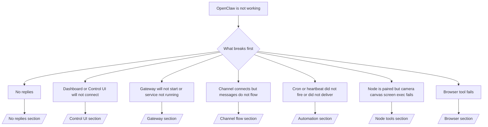

# Troubleshooting

如果你只有 2 分鐘，請將此頁作為分流的入口。

## 前 60 秒

依序執行以下精確階梯：

```bash
openclaw status
openclaw status --all
openclaw gateway probe
openclaw gateway status
openclaw doctor
openclaw channels status --probe
openclaw logs --follow
```

一行內的良好輸出：

- `openclaw status` → 顯示已設定的頻道，且沒有明顯的身分驗證錯誤。
- `openclaw status --all` → 完整報告已存在，且可分享。
- `openclaw gateway probe` → 可到達預期的 Gateway 閘道器 目標。
- `openclaw gateway status` → `Runtime: running` 與 `RPC probe: ok`。
- `openclaw doctor` → 沒有阻擋性的設定／服務錯誤。
- `openclaw channels status --probe` → 頻道回報 `connected` 或 `ready`。
- `openclaw logs --follow` → 活動穩定，沒有重複的致命錯誤。

## 決策樹



<AccordionGroup>
  <Accordion title="No replies">
    ```bash
    openclaw status
    openclaw gateway status
    openclaw channels status --probe
    openclaw pairing list <channel>
    openclaw logs --follow
    ```

    ```
    良好輸出看起來像：
    
    - `Runtime: running`
    - `RPC probe: ok`
    - 你的頻道在 `channels status --probe` 中顯示為已連線／就緒
    - 寄件者顯示為已核准（或私訊政策為開放／允許清單）
    
    常見的日誌特徵：
    
    - `drop guild message (mention required` → 在 Discord 中，提及（mention）門控阻擋了訊息。
    - `pairing request` → 寄件者尚未核准，正在等待私訊配對核准。
    - `blocked` / `allowlist` 於頻道日誌中 → 寄件者、房間或群組被過濾。
    
    深入頁面：
    
    - [/gateway/troubleshooting#no-replies](/gateway/troubleshooting#no-replies)
    - [/channels/troubleshooting](/channels/troubleshooting)
    - [/channels/pairing](/channels/pairing)
    ```

  </Accordion>

  <Accordion title="Dashboard or Control UI will not connect">
    ```bash
    openclaw status
    openclaw gateway status
    openclaw logs --follow
    openclaw doctor
    openclaw channels status --probe
    ```

    ```
    良好輸出看起來像：
    
    - `Dashboard: http://...` 顯示於 `openclaw gateway status`
    - `RPC probe: ok`
    - 日誌中沒有身分驗證循環
    
    常見的日誌特徵：
    
    - `device identity required` → HTTP／非安全內容無法完成裝置驗證。
    - `unauthorized`／重新連線循環 → 權杖／密碼錯誤，或驗證模式不相符。
    - `gateway connect failed:` → UI 指向錯誤的 URL／連接埠，或 Gateway 閘道器 無法到達。
    
    深入頁面：
    
    - [/gateway/troubleshooting#dashboard-control-ui-connectivity](/gateway/troubleshooting#dashboard-control-ui-connectivity)
    - [/web/control-ui](/web/control-ui)
    - [/gateway/authentication](/gateway/authentication)
    ```

  </Accordion>

  <Accordion title="Gateway will not start or service installed but not running">
    ```bash
    openclaw status
    openclaw gateway status
    openclaw logs --follow
    openclaw doctor
    openclaw channels status --probe
    ```

    ```
    良好輸出看起來像：
    
    - `Service: ... (loaded)`
    - `Runtime: running`
    - `RPC probe: ok`
    
    常見的日誌特徵：
    
    - `Gateway start blocked: set gateway.mode=local` → Gateway 閘道器 模式未設定／為遠端。
    - `refusing to bind gateway ... without auth` → 非 local loopback 綁定，且未提供權杖／密碼。
    - `another gateway instance is already listening` 或 `EADDRINUSE` → 連接埠已被佔用。
    
    深入頁面：
    
    - [/gateway/troubleshooting#gateway-service-not-running](/gateway/troubleshooting#gateway-service-not-running)
    - [/gateway/background-process](/gateway/background-process)
    - [/gateway/configuration](/gateway/configuration)
    ```

  </Accordion>

  <Accordion title="Channel connects but messages do not flow">
    ```bash
    openclaw status
    openclaw gateway status
    openclaw logs --follow
    openclaw doctor
    openclaw channels status --probe
    ```

    ```
    良好輸出看起來像：
    
    - 頻道傳輸已連線。
    - 配對／允許清單檢查通過。
    - 在需要時可偵測到提及（mention）。
    
    常見的日誌特徵：
    
    - `mention required` → 群組提及門控阻擋了處理。
    - `pairing`／`pending` → 私訊寄件者尚未核准。
    - `not_in_channel`、`missing_scope`、`Forbidden`、`401/403` → 頻道權限權杖問題。
    
    深入頁面：
    
    - [/gateway/troubleshooting#channel-connected-messages-not-flowing](/gateway/troubleshooting#channel-connected-messages-not-flowing)
    - [/channels/troubleshooting](/channels/troubleshooting)
    ```

  </Accordion>

  <Accordion title="Cron or heartbeat did not fire or did not deliver">
    ```bash
    openclaw status
    openclaw gateway status
    openclaw cron status
    openclaw cron list
    openclaw cron runs --id <jobId> --limit 20
    openclaw logs --follow
    ```

    ```
    良好輸出看起來像：
    
    - `cron.status` 顯示為已啟用，且有下一次喚醒。
    - `cron runs` 顯示最近的 `ok` 項目。
    - 心跳已啟用，且未超出啟用時段。
    
    常見的日誌特徵：
    
    - `cron: scheduler disabled; jobs will not run automatically` → cron 已停用。
    - `heartbeat skipped` 搭配 `reason=quiet-hours` → 超出設定的啟用時段。
    - `requests-in-flight` → 主通道忙碌；心跳喚醒被延後。
    - `unknown accountId` → 心跳投遞目標帳戶不存在。
    
    深入頁面：
    
    - [/gateway/troubleshooting#cron-and-heartbeat-delivery](/gateway/troubleshooting#cron-and-heartbeat-delivery)
    - [/automation/troubleshooting](/automation/troubleshooting)
    - [/gateway/heartbeat](/gateway/heartbeat)
    ```

  </Accordion>

  <Accordion title="Node is paired but tool fails camera canvas screen exec">
    ```bash
    openclaw status
    openclaw gateway status
    openclaw nodes status
    openclaw nodes describe --node <idOrNameOrIp>
    openclaw logs --follow
    ```

    ```
    良好輸出看起來像：
    
    - 節點列為已連線，且已為角色 `node` 配對。
    - 你呼叫的指令具備相應能力。
    - 工具的權限狀態已授予。
    
    常見的日誌特徵：
    
    - `NODE_BACKGROUND_UNAVAILABLE` → 將節點應用程式帶到前景。
    - `*_PERMISSION_REQUIRED` → 作業系統權限被拒絕／缺失。
    - `SYSTEM_RUN_DENIED: approval required` → exec 核准仍在等待中。
    - `SYSTEM_RUN_DENIED: allowlist miss` → 指令不在 exec 允許清單中。
    
    深入頁面：
    
    - [/gateway/troubleshooting#node-paired-tool-fails](/gateway/troubleshooting#node-paired-tool-fails)
    - [/nodes/troubleshooting](/nodes/troubleshooting)
    - [/tools/exec-approvals](/tools/exec-approvals)
    ```

  </Accordion>

  <Accordion title="Browser tool fails">
    ```bash
    openclaw status
    openclaw gateway status
    openclaw browser status
    openclaw logs --follow
    openclaw doctor
    ```

    ```
    良好輸出看起來像：
    
    - 瀏覽器狀態顯示 `running: true`，且已選擇瀏覽器／設定檔。
    - `openclaw` 設定檔啟動，或 `chrome` 中繼具有已附加的分頁。
    
    常見的日誌特徵：
    
    - `Failed to start Chrome CDP on port` → 本機瀏覽器啟動失敗。
    - `browser.executablePath not found` → 設定的二進位路徑錯誤。
    - `Chrome extension relay is running, but no tab is connected` → 擴充功能未附加。
    - `Browser attachOnly is enabled ... not reachable` → 僅附加的設定檔沒有即時的 CDP 目標。
    
    深入頁面：
    
    - [/gateway/troubleshooting#browser-tool-fails](/gateway/troubleshooting#browser-tool-fails)
    - [/tools/browser-linux-troubleshooting](/tools/browser-linux-troubleshooting)
    - [/tools/chrome-extension](/tools/chrome-extension)
    ```

  </Accordion>
</AccordionGroup>
