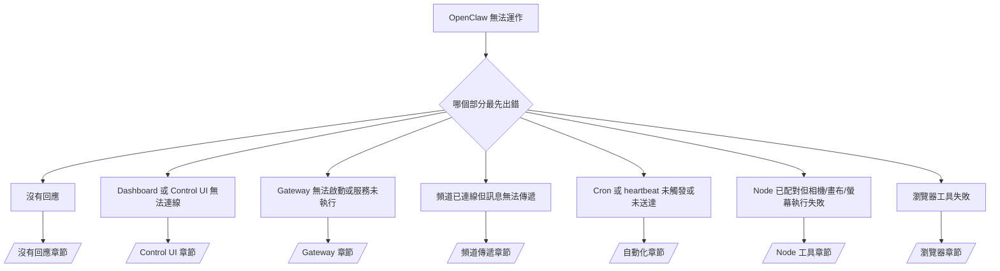

# 疑難排解

如果您只有 2 分鐘，請將此頁面視為初步檢測的入口。

## 最初的六十秒

請依序執行以下步驟：

```bash
openclaw status
openclaw status --all
openclaw gateway probe
openclaw gateway status
openclaw doctor
openclaw channels status --probe
openclaw logs --follow
```

正常的輸出結果應如下：

- `openclaw status` → 顯示已設定的頻道且無明顯的驗證錯誤。
- `openclaw status --all` → 完整報告已產生且可供分享。
- `openclaw gateway probe` → 預期的 Gateway 目標可連線。
- `openclaw gateway status` → `Runtime: running` 且 `RPC probe: ok`。
- `openclaw doctor` → 無阻礙運作的設定或服務錯誤。
- `openclaw channels status --probe` → 頻道回報 `connected`（已連線）或 `ready`（就緒）。
- `openclaw logs --follow` → 活動穩定，無重複的嚴重錯誤。

## 決策樹



<AccordionGroup>
  <Accordion title="沒有回應">
    ```bash
    openclaw status
    openclaw gateway status
    openclaw channels status --probe
    openclaw pairing list <channel>
    openclaw logs --follow
    ```

    正常的輸出應如下：

    - `Runtime: running`
    - `RPC probe: ok`
    - 您的頻道在 `channels status --probe` 中顯示為 connected/ready
    - 發送者顯示為已核准（或私訊政策為開放/白名單）

    常見日誌特徵：

    - `drop guild message (mention required` → Discord 中的提及限制阻擋了該訊息。
    - `pairing request` → 發送者尚未核准，正在等待私訊配對核准。
    - 頻道日誌中出現 `blocked` / `allowlist` → 發送者、房間或群組已被過濾。

    深度內容頁面：

    - [/gateway/troubleshooting#no-replies](/gateway/troubleshooting#no-replies)
    - [/channels/troubleshooting](/channels/troubleshooting)
    - [/channels/pairing](/channels/pairing)

  </Accordion>

  <Accordion title="Dashboard 或 Control UI 無法連線">
    ```bash
    openclaw status
    openclaw gateway status
    openclaw logs --follow
    openclaw doctor
    openclaw channels status --probe
    ```

    正常的輸出應如下：

    - `openclaw gateway status` 顯示 `Dashboard: http://...`
    - `RPC probe: ok`
    - 日誌中無驗證迴圈

    常見日誌特徵：

    - `device identity required` → HTTP/非安全環境無法完成裝置驗證。
    - `unauthorized` / 重新連線迴圈 → 錯誤的權杖/密碼或驗證模式不匹配。
    - `gateway connect failed:` → UI 指向錯誤的 URL/連接埠或無法存取的 Gateway。

    深度內容頁面：

    - [/gateway/troubleshooting#dashboard-control-ui-connectivity](/gateway/troubleshooting#dashboard-control-ui-connectivity)
    - [/web/control-ui](/web/control-ui)
    - [/gateway/authentication](/gateway/authentication)

  </Accordion>

  <Accordion title="Gateway 無法啟動或服務已安裝但未執行">
    ```bash
    openclaw status
    openclaw gateway status
    openclaw logs --follow
    openclaw doctor
    openclaw channels status --probe
    ```

    正常的輸出應如下：

    - `Service: ... (loaded)`
    - `Runtime: running`
    - `RPC probe: ok`

    常見日誌特徵：

    - `Gateway start blocked: set gateway.mode=local` → Gateway 模式未設定或為遠端模式。
    - `refusing to bind gateway ... without auth` → 非 local loopback 綁定且未提供權杖/密碼。
    - `another gateway instance is already listening` 或 `EADDRINUSE` → 連接埠已被佔用。

    深度內容頁面：

    - [/gateway/troubleshooting#gateway-service-not-running](/gateway/troubleshooting#gateway-service-not-running)
    - [/gateway/background-process](/gateway/background-process)
    - [/gateway/configuration](/gateway/configuration)

  </Accordion>

  <Accordion title="頻道已連線但訊息無法傳遞">
    ```bash
    openclaw status
    openclaw gateway status
    openclaw logs --follow
    openclaw doctor
    openclaw channels status --probe
    ```

    正常的輸出應如下：

    - 頻道傳輸協定已連線。
    - 配對/白名單檢查通過。
    - 在需要的地方偵測到提及 (@mention)。

    常見日誌特徵：

    - `mention required` → 群組提及限制阻擋了處理程序。
    - `pairing` / `pending` → 私訊發送者尚未被核准。
    - `not_in_channel`, `missing_scope`, `Forbidden`, `401/403` → 頻道權限權杖問題。

    深度內容頁面：

    - [/gateway/troubleshooting#channel-connected-messages-not-flowing](/gateway/troubleshooting#channel-connected-messages-not-flowing)
    - [/channels/troubleshooting](/channels/troubleshooting)

  </Accordion>

  <Accordion title="Cron 或 heartbeat 未觸發或未送達">
    ```bash
    openclaw status
    openclaw gateway status
    openclaw cron status
    openclaw cron list
    openclaw cron runs --id <jobId> --limit 20
    openclaw logs --follow
    ```

    正常的輸出應如下：

    - `cron.status` 顯示已啟用且有下次喚醒時間。
    - `cron runs` 顯示最近有 `ok` 的項目。
    - Heartbeat 已啟用且不在設定的非活動時間內。

    常見日誌特徵：

    - `cron: scheduler disabled; jobs will not run automatically` → Cron 已停用。
    - `heartbeat skipped` 帶有 `reason=quiet-hours` → 在設定的活動時間之外。
    - `requests-in-flight` → 主通道忙碌；heartbeat 喚醒已推遲。
    - `unknown accountId` → Heartbeat 傳送目標帳號不存在。

    深度內容頁面：

    - [/gateway/troubleshooting#cron-and-heartbeat-delivery](/gateway/troubleshooting#cron-and-heartbeat-delivery)
    - [/automation/troubleshooting](/automation/troubleshooting)
    - [/gateway/heartbeat](/gateway/heartbeat)

  </Accordion>

  <Accordion title="Node 已配對但工具執行相機/畫布/螢幕操作失敗">
    ```bash
    openclaw status
    openclaw gateway status
    openclaw nodes status
    openclaw nodes describe --node <idOrNameOrIp>
    openclaw logs --follow
    ```

    正常的輸出應如下：

    - Node 列為已連線，且已配對 `node` 角色。
    - 存在您所調用指令的功能。
    - 工具的權限狀態已獲授權。

    常見日誌特徵：

    - `NODE_BACKGROUND_UNAVAILABLE` → 請將 Node 應用程式移至前景。
    - `*_PERMISSION_REQUIRED` → 作業系統權限被拒絕或缺失。
    - `SYSTEM_RUN_DENIED: approval required` → 執行核准尚在等待中。
    - `SYSTEM_RUN_DENIED: allowlist miss` → 指令不在執行白名單中。

    深度內容頁面：

    - [/gateway/troubleshooting#node-paired-tool-fails](/gateway/troubleshooting#node-paired-tool-fails)
    - [/nodes/troubleshooting](/nodes/troubleshooting)
    - [/tools/exec-approvals](/tools/exec-approvals)

  </Accordion>

  <Accordion title="瀏覽器工具失敗">
    ```bash
    openclaw status
    openclaw gateway status
    openclaw browser status
    openclaw logs --follow
    openclaw doctor
    ```

    正常的輸出應如下：

    - 瀏覽器狀態顯示 `running: true` 且已選取瀏覽器/設定檔。
    - `openclaw` 設定檔啟動或 `chrome` 轉接器已附加分頁。

    常見日誌特徵：

    - `Failed to start Chrome CDP on port` → 本地瀏覽器啟動失敗。
    - `browser.executablePath not found` → 設定的執行檔路徑錯誤。
    - `Chrome extension relay is running, but no tab is connected` → 擴充功能未附加。
    - `Browser attachOnly is enabled ... not reachable` → attach-only 設定檔無動態 CDP 目標。

    深度內容頁面：

    - [/gateway/troubleshooting#browser-tool-fails](/gateway/troubleshooting#browser-tool-fails)
    - [/tools/browser-linux-troubleshooting](/tools/browser-linux-troubleshooting)
    - [/tools/chrome-extension](/tools/chrome-extension)

  </Accordion>
</AccordionGroup>
