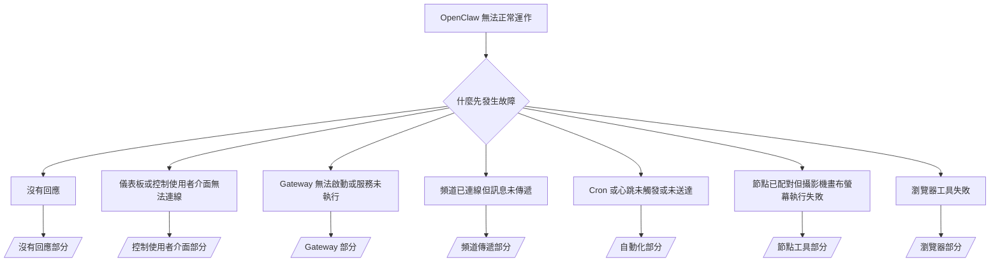

# 故障診斷

如果您只有 2 分鐘，請將此頁面作為初步分類的入口。

## 最初的六十秒

請按照以下順序執行此精確的步驟：

```bash
openclaw status
openclaw status --all
openclaw gateway probe
openclaw gateway status
openclaw doctor
openclaw channels status --probe
openclaw logs --follow
```

一行好的輸出範例：

- `openclaw status` → 顯示已設定的頻道且沒有明顯的憑證錯誤。
- `openclaw status --all` → 完整的報告已顯示且可分享。
- `openclaw gateway probe` → 預期的 Gateway 目標可達。
- `openclaw gateway status` → `Runtime: running` 且 `RPC probe: ok`。
- `openclaw doctor` → 沒有阻擋性的設定/服務錯誤。
- `openclaw channels status --probe` → 頻道報告 `connected` 或 `ready`。
- `openclaw logs --follow` → 活動穩定，沒有重複的嚴重錯誤。

## 決策樹



<AccordionGroup>
  <Accordion title="沒有回應">
    ```bash
    openclaw status
    openclaw gateway status
    openclaw channels status --probe
    openclaw pairing list <channel>
    openclaw logs --follow
    ```

    好的輸出應如下所示：

    - `Runtime: running`
    - `RPC probe: ok`
    - 您的頻道在 `channels status --probe` 中顯示已連線/準備就緒
    - 傳送者顯示已批准（或私訊政策是開放/允許清單）

    常見的日誌簽名：

    - `drop guild message (mention required` → 提及限制阻止了 Discord 中的訊息。
    - `pairing request` → 傳送者未經批准且正在等待私訊配對批准。
    - 頻道日誌中的 `blocked` / `allowlist` → 傳送者、聊天室或群組被過濾。

    深入頁面：

    - [/gateway/troubleshooting#no-replies](/gateway/troubleshooting#no-replies)
    - [/channels/troubleshooting](/channels/troubleshooting)
    - [/channels/pairing](/channels/pairing)

  </Accordion>

  <Accordion title="儀表板或控制使用者介面無法連線">
    ```bash
    openclaw status
    openclaw gateway status
    openclaw logs --follow
    openclaw doctor
    openclaw channels status --probe
    ```

    好的輸出應如下所示：

    - `Dashboard: http://...` 顯示在 `openclaw gateway status` 中
    - `RPC probe: ok`
    - 日誌中沒有憑證循環

    常見的日誌簽名：

    - `device identity required` → HTTP/非安全環境無法完成裝置憑證。
    - `unauthorized` / reconnect loop → 錯誤的權杖/密碼或憑證模式不匹配。
    - `gateway connect failed:` → 使用者介面目標的 URL/連接埠錯誤或 Gateway 無法到達。

    深入頁面：

    - [/gateway/troubleshooting#dashboard-control-ui-connectivity](/gateway/troubleshooting#dashboard-control-ui-connectivity)
    - [/web/control-ui](/web/control-ui)
    - [/gateway/authentication](/gateway/authentication)

  </Accordion>

  <Accordion title="Gateway 無法啟動或服務已安裝但未執行">
    ```bash
    openclaw status
    openclaw gateway status
    openclaw logs --follow
    openclaw doctor
    openclaw channels status --probe
    ```

    好的輸出應如下所示：

    - `Service: ... (loaded)`
    - `Runtime: running`
    - `RPC probe: ok`

    常見的日誌簽名：

    - `Gateway start blocked: set gateway.mode=local` → Gateway 模式未設定/遠端。
    - `refusing to bind gateway ... without auth` → 沒有權杖/密碼的非 local loopback 綁定。
    - `another gateway instance is already listening` 或 `EADDRINUSE` → 連接埠已被佔用。

    深入頁面：

    - [/gateway/troubleshooting#gateway-service-not-running](/gateway/troubleshooting#gateway-service-not-running)
    - [/gateway/background-process](/gateway/background-process)
    - [/gateway/configuration](/gateway/configuration)

  </Accordion>

  <Accordion title="頻道已連線但訊息未傳遞">
    ```bash
    openclaw status
    openclaw gateway status
    openclaw logs --follow
    openclaw doctor
    openclaw channels status --probe
    ```

    好的輸出應如下所示：

    - 頻道傳輸已連線。
    - 配對/允許清單檢查通過。
    - 在需要時偵測到提及。

    常見的日誌簽名：

    - `mention required` → 群組提及限制阻止處理。
    - `pairing` / `pending` → 私訊傳送者尚未獲批准。
    - `not_in_channel`、`missing_scope`、`Forbidden`、`401/403` → 頻道權限權杖問題。

    深入頁面：

    - [/gateway/troubleshooting#channel-connected-messages-not-flowing](/gateway/troubleshooting#channel-connected-messages-not-flowing)
    - [/channels/troubleshooting](/channels/troubleshooting)

  </Accordion>

  <Accordion title="Cron 或心跳未觸發或未送達">
    ```bash
    openclaw status
    openclaw gateway status
    openclaw cron status
    openclaw cron list
    openclaw cron runs --id <jobId> --limit 20
    openclaw logs --follow
    ```

    好的輸出應如下所示：

    - `cron.status` 顯示已啟用並有下一個喚醒時間。
    - `cron runs` 顯示最近的 `ok` 條目。
    - 心跳已啟用且不在活動時間之外。

    常見的日誌簽名：

    - `cron: scheduler disabled; jobs will not run automatically` → Cron 已停用。
    - `heartbeat skipped` with `reason=quiet-hours` → 在設定的活動時間之外。
    - `requests-in-flight` → 主線路忙碌；心跳喚醒被延遲。
    - `unknown accountId` → 心跳傳遞目標帳戶不存在。

    深入頁面：

    - [/gateway/troubleshooting#cron-and-heartbeat-delivery](/gateway/troubleshooting#cron-and-heartbeat-delivery)
    - [/automation/troubleshooting](/automation/troubleshooting)
    - [/gateway/heartbeat](/gateway/heartbeat)

  </Accordion>

  <Accordion title="節點已配對但工具執行攝影機畫布螢幕失敗">
    ```bash
    openclaw status
    openclaw gateway status
    openclaw nodes status
    openclaw nodes describe --node <idOrNameOrIp>
    openclaw logs --follow
    ```

    好的輸出應如下所示：

    - 節點顯示為已連線且已配對為 `node` 角色。
    - 您正在調用的命令具有此功能。
    - 工具已獲授予權限。

    常見的日誌簽名：

    - `NODE_BACKGROUND_UNAVAILABLE` → 將節點應用程式帶到前景。
    - `*_PERMISSION_REQUIRED` → 作業系統權限被拒絕/遺失。
    - `SYSTEM_RUN_DENIED: approval required` → 執行批准待定。
    - `SYSTEM_RUN_DENIED: allowlist miss` → 命令不在執行允許清單中。

    深入頁面：

    - [/gateway/troubleshooting#node-paired-tool-fails](/gateway/troubleshooting#node-paired-tool-fails)
    - [/nodes/troubleshooting](/nodes/troubleshooting)
    - [/tools/exec-approvals](/tools/exec-approvals)

  </Accordion>

  <Accordion title="瀏覽器工具失敗">
    ```bash
    openclaw status
    openclaw gateway status
    openclaw browser status
    openclaw logs --follow
    openclaw doctor
    ```

    好的輸出應如下所示：

    - 瀏覽器狀態顯示 `running: true` 和選定的瀏覽器/設定檔。
    - `openclaw` 設定檔啟動或 `chrome` 轉發器有附加分頁。

    常見的日誌簽名：

    - `Failed to start Chrome CDP on port` → 本機瀏覽器啟動失敗。
    - `browser.executablePath not found` → 設定的二進位路徑錯誤。
    - `Chrome extension relay is running, but no tab is connected` → 擴充功能未附加。
    - `Browser attachOnly is enabled ... not reachable` → 僅附加設定檔沒有即時 CDP 目標。

    深入頁面：

    - [/gateway/troubleshooting#browser-tool-fails](/gateway/troubleshooting#browser-tool-fails)
    - [/tools/browser-linux-troubleshooting](/tools/browser-linux-troubleshooting)
    - [/tools/chrome-extension](/tools/chrome-extension)

  </Accordion>
</AccordionGroup>
