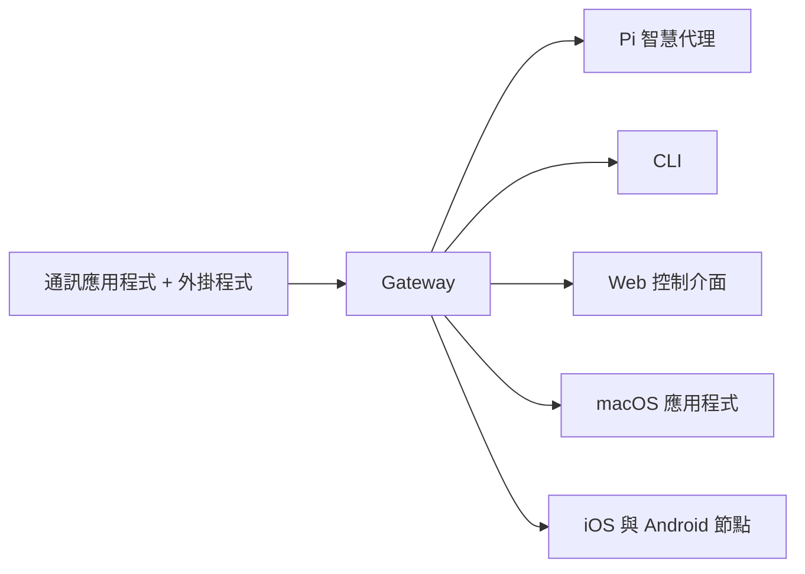

# OpenClaw 🦞

<p align="center">
    
    
</p>

> _「去角質！去角質！」_ —— 大概是一隻太空龍蝦說的

<p align="center">
  <strong>適用於任何作業系統的 Gateway，可將 AI 智慧代理連結至 WhatsApp、Telegram、Discord、iMessage 等平台。</strong><br />
  傳送訊息，即可從口袋中獲得智慧代理的回應。外掛程式可新增 Mattermost 等更多功能。
</p>

<Columns>
  <Card title="入門指南" href="/start/getting-started" icon="rocket">
    在幾分鐘內安裝 OpenClaw 並啟動 Gateway。
  </Card>
  <Card title="執行精靈" href="/start/wizard" icon="sparkles">
    透過 `openclaw onboard` 和配對流程進行引導式設定。
  </Card>
  <Card title="開啟控制介面" href="/web/control-ui" icon="layout-dashboard">
    啟動瀏覽器儀表板以進行聊天、設定和工作階段。
  </Card>
</Columns>

## 什麼是 OpenClaw？

OpenClaw 是一個**自行代管的 Gateway**，可將您喜愛的通訊應用程式（如 WhatsApp、Telegram、Discord、iMessage 等）連接到 Pi 等 AI 程式碼撰寫智慧代理。您在自己的電腦（或伺服器）上執行單個 Gateway 程序，它就會成為通訊應用程式與全天候 AI 助理之間的橋樑。

**適合誰？** 想要一個可以隨時隨地傳送訊息的個人 AI 助理，且不想放棄數據控制權或依賴代管服務的開發者和進階使用者。

**有什麼不同之處？**

- **自行代管**：在您的硬體上執行，由您制定規則
- **多通道**：一個 Gateway 可同時支援 WhatsApp、Telegram、Discord 等多個平台
- **智慧代理原生**：專為程式碼撰寫智慧代理打造，具備工具呼叫、工作階段、記憶體和多智慧代理路由功能
- **開源**：採用 MIT 授權，由社群驅動

**需要什麼？** Node 22+、API 金鑰（推薦使用 Anthropic）以及 5 分鐘的時間。

## 運作方式



Gateway 是工作階段、路由和通道連線的唯一事實來源。

## 核心功能

<Columns>
  <Card title="多通道 Gateway" icon="network">
    使用單個 Gateway 程序即可支援 WhatsApp、Telegram、Discord 和 iMessage。
  </Card>
  <Card title="外掛程式通道" icon="plug">
    透過擴充套件新增 Mattermost 等更多通道。
  </Card>
  <Card title="多智慧代理路由" icon="route">
    根據智慧代理、工作區或傳送者隔離工作階段。
  </Card>
  <Card title="多媒體支援" icon="image">
    傳送與接收圖片、音訊和文件。
  </Card>
  <Card title="Web 控制介面" icon="monitor">
    用於聊天、設定、工作階段和節點的瀏覽器儀表板。
  </Card>
  <Card title="行動裝置節點" icon="smartphone">
    配對支援 Canvas 的 iOS 和 Android 節點。
  </Card>
</Columns>

## 快速開始

<Steps>
  <Step title="安裝 OpenClaw">
    ```bash
    npm install -g openclaw @latest
    ```
  </Step>
  <Step title="新手導覽與安裝服務">
    ```bash
    openclaw onboard --install-daemon
    ```
  </Step>
  <Step title="配對 WhatsApp 並啟動 Gateway">
    ```bash
    openclaw channels login
    openclaw gateway --port 18789
    ```
  </Step>
</Steps>

需要完整的安裝和開發設定？請參閱 [快速開始](/start/quickstart)。

## 儀表板

啟動 Gateway 後，開啟瀏覽器控制介面。

- 本機預設：[http://127.0.0.1:18789/](http://127.0.0.1:18789/)
- 遠端存取：[Web 介面](/web) 和 [Tailscale](/gateway/tailscale)

<p align="center">
  
</p>

## 設定（選填）

設定檔位於 `~/.openclaw/openclaw.json`。

- 如果您**不進行任何操作**，OpenClaw 將以 RPC 模式使用內建的 Pi 執行檔，並為每個傳送者建立獨立的工作階段。
- 如果您想加強安全性，可以從 `channels.whatsapp.allowFrom` 以及（針對群組的）提及規則開始。

範例：

```json5
{
  channels: {
    whatsapp: {
      allowFrom: ["+15555550123"],
      groups: { "*": { requireMention: true } },
    },
  },
  messages: { groupChat: { mentionPatterns: [" @openclaw"] } },
}
```

## 從這裡開始

<Columns>
  <Card title="文件中心" href="/start/hubs" icon="book-open">
    所有文件與指南，按使用案例分類。
  </Card>
  <Card title="設定" href="/gateway/configuration" icon="settings">
    核心 Gateway 設定、權杖和供應商設定。
  </Card>
  <Card title="遠端存取" href="/gateway/remote" icon="globe">
    SSH 和 tailnet 存取模式。
  </Card>
  <Card title="通道" href="/channels/telegram" icon="message-square">
    WhatsApp、Telegram、Discord 等特定通道的設定。
  </Card>
  <Card title="節點" href="/nodes" icon="smartphone">
    支援配對和 Canvas 的 iOS 與 Android 節點。
  </Card>
  <Card title="說明" href="/help" icon="life-buoy">
    常見修復方法與疑難排解入口。
  </Card>
</Columns>

## 深入了解

<Columns>
  <Card title="完整功能列表" href="/concepts/features" icon="list">
    完整的通道、路由和媒體功能。
  </Card>
  <Card title="多智慧代理路由" href="/concepts/multi-agent" icon="route">
    工作區隔離與各智慧代理專屬的工作階段。
  </Card>
  <Card title="安全性" href="/gateway/security" icon="shield">
    權杖、允許清單和安全控制。
  </Card>
  <Card title="疑難排解" href="/gateway/troubleshooting" icon="wrench">
    Gateway 診斷與常見錯誤。
  </Card>
  <Card title="關於與致謝" href="/reference/credits" icon="info">
    專案起源、貢獻者與授權。
  </Card>
</Columns>
