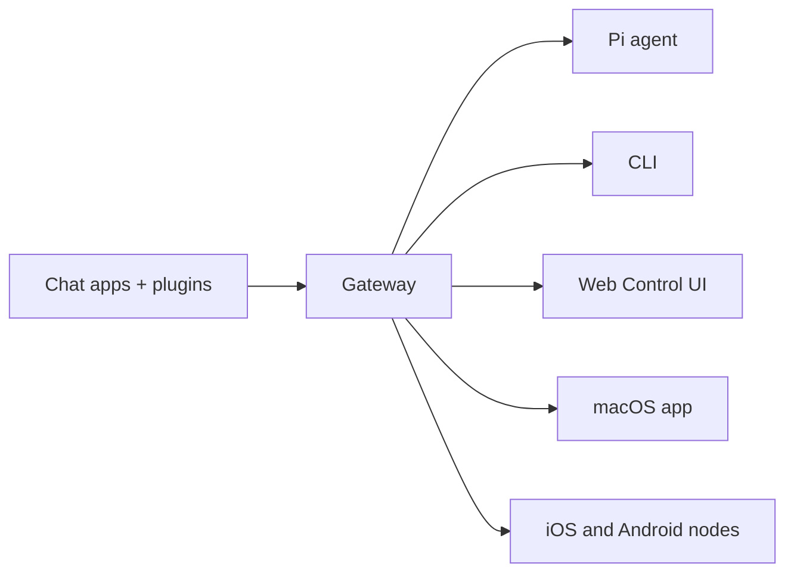

# OpenClaw 🦞

<p align="center">
    
    
</p>

> _"去角質！去角質！"_ — 一隻太空龍蝦，大概吧

<p align="center">
  <strong>適用於 AI 智慧代理的任何作業系統 Gateway，橫跨 WhatsApp、Telegram、Discord、iMessage 等。</strong><br />
  傳送訊息，隨時隨地從您的口袋取得智慧代理的回應。外掛程式可新增 Mattermost 及更多功能。
</p>

<Columns>
  <Card title="入門指南" href="/start/getting-started" icon="rocket">
    在幾分鐘內安裝 OpenClaw 並啟動 Gateway。
  </Card>
  <Card title="執行精靈" href="/start/wizard" icon="sparkles">
    透過 `openclaw onboard` 和配對流程進行引導式設定。
  </Card>
  <Card title="開啟控制 UI" href="/web/control-ui" icon="layout-dashboard">
    啟動瀏覽器儀表板以進行聊天、設定和工作階段管理。
  </Card>
</Columns>

## 什麼是 OpenClaw？

OpenClaw 是一個**自我託管的 Gateway**，可將您最喜愛的聊天應用程式 — WhatsApp、Telegram、Discord、iMessage 等 — 連接到像 Pi 這樣的 AI 程式碼智慧代理。您在自己的機器（或伺服器）上執行單一 Gateway 處理程序，它會成為您的訊息應用程式與隨時可用的 AI 助理之間的橋樑。

**它是為誰而設計的？** 想要一個可以隨時隨地發送訊息的個人 AI 助理，而無需放棄資料控制權或依賴託管服務的開發人員和高階使用者。

**有何不同之處？**

- **自我託管**：在您的硬體上執行，由您掌握規則
- **多頻道**：一個 Gateway 同時服務 WhatsApp、Telegram、Discord 等
- **智慧代理原生**：為具備工具使用、工作階段、記憶體和多智慧代理路由功能的程式碼智慧代理而設計
- **開源**：MIT 授權，社群驅動

**您需要什麼？** Node 22+、一個 API 金鑰（建議使用 Anthropic），以及 5 分鐘。

## 運作方式



Gateway 是工作階段、路由和頻道連接的單一事實來源。

## 主要功能

<Columns>
  <Card title="多頻道 Gateway" icon="network">
    單一 Gateway 處理程序即可連接 WhatsApp、Telegram、Discord 和 iMessage。
  </Card>
  <Card title="外掛程式頻道" icon="plug">
    透過擴充套件新增 Mattermost 及更多功能。
  </Card>
  <Card title="多智慧代理路由" icon="route">
    每個智慧代理、工作區或發送者都有獨立的工作階段。
  </Card>
  <Card title="媒體支援" icon="image">
    發送和接收圖片、音訊和文件。
  </Card>
  <Card title="Web 控制 UI" icon="monitor">
    瀏覽器儀表板，用於聊天、設定、工作階段和節點。
  </Card>
  <Card title="行動節點" icon="smartphone">
    配對支援 Canvas 的 iOS 和 Android 節點。
  </Card>
</Columns>

## 快速開始

<Steps>
  <Step title="安裝 OpenClaw">
    ```bash
    npm install -g openclaw @skills/stock-analysis/cache/hot_scan_latest.json
    ```
  </Step>
  <Step title="新手導覽並安裝服務">
    ```bash
    openclaw onboard --install-daemon
    ```
  </Step>
  <Step title="配對 WhatsApp 並啟動 Gateway">
    ```bash
    openclaw channels login
    openclaw gateway --port 18789
    ```
  </Step>
</Steps>

需要完整的安裝和開發設定？請參閱[快速開始](/start/quickstart)。

## 儀表板

Gateway 啟動後開啟瀏覽器控制 UI。

- 本機預設：[http://127.0.0.1:18789/](http://127.0.0.1:18789/)
- 遠端存取：[Web surfaces](/web) 和 [Tailscale](/gateway/tailscale)

<p align="center">
  
</p>

## 設定（選填）

設定儲存在 `~/.openclaw/openclaw.json`。

- 如果您**不做任何事情**，OpenClaw 會以 RPC 模式使用內建的 Pi 二進位檔案，每個發送者都有獨立的工作階段。
- 如果您想鎖定它，請從 `channels.whatsapp.allowFrom` 和（針對群組）提及規則開始。

範例：

```json5
{
  channels: {
    whatsapp: {
      allowFrom: ["+15555550123"],
      groups: { "*": { requireMention: true } },
    },
  },
  messages: { groupChat: { mentionPatterns: [" @openclaw"] } },
}
```

## 從這裡開始

<Columns>
  <Card title="文件中心" href="/start/hubs" icon="book-open">
    所有文件和指南，按使用案例分類。
  </Card>
  <Card title="設定" href="/gateway/configuration" icon="settings">
    核心 Gateway 設定、權杖和供應商設定。
  </Card>
  <Card title="遠端存取" href="/gateway/remote" icon="globe">
    SSH 和 tailnet 存取模式。
  </Card>
  <Card title="頻道" href="/channels/telegram" icon="message-square">
    WhatsApp、Telegram、Discord 等的頻道特定設定。
  </Card>
  <Card title="節點" href="/nodes" icon="smartphone">
    支援配對和 Canvas 的 iOS 和 Android 節點。
  </Card>
  <Card title="說明" href="/help" icon="life-buoy">
    常見修正和疑難排解的入口點。
  </Card>
</Columns>

## 了解更多

<Columns>
  <Card title="完整功能列表" href="/concepts/features" icon="list">
    完整的頻道、路由和媒體功能。
  </Card>
  <Card title="多智慧代理路由" href="/concepts/multi-agent" icon="route">
    工作區隔離和每個智慧代理的工作階段。
  </Card>
  <Card title="安全性" href="/gateway/security" icon="shield">
    權杖、允許清單和安全控制。
  </Card>
  <Card title="疑難排解" href="/gateway/troubleshooting" icon="wrench">
    Gateway 診斷和常見錯誤。
  </Card>
  <Card title="關於和致謝" href="/reference/credits" icon="info">
    專案來源、貢獻者和授權。
  </Card>
</Columns>
