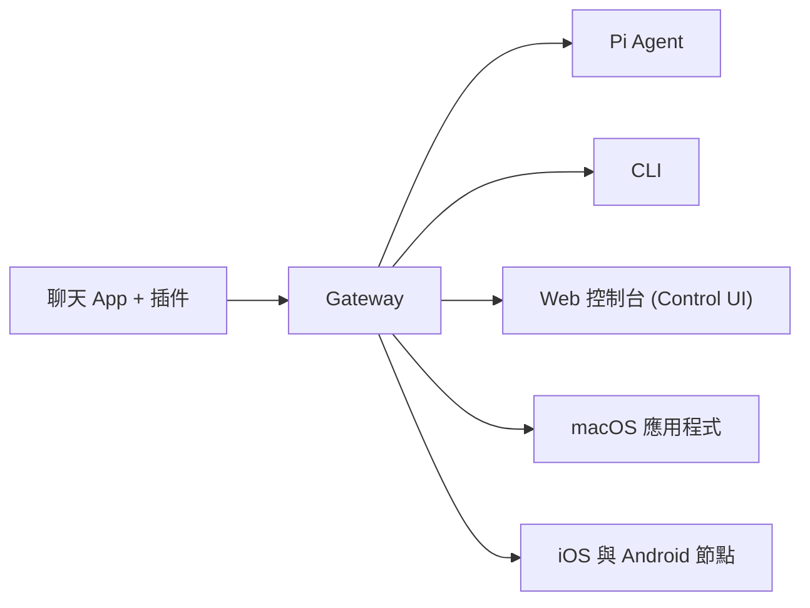

# OpenClaw 🦞

<p align="center">
    
    
</p>

> _"EXFOLIATE! EXFOLIATE!"_ — 大概是某隻太空龍蝦說的

<p align="center">
  <strong>支援任何作業系統的 AI Agent 閘道器，橫跨 WhatsApp、Telegram、Discord、iMessage 等多種平台。</strong><br />
  發送訊息，隨時隨地從口袋獲得 Agent 的回應。透過插件還能加入 Mattermost 等更多功能。
</p>

<Columns>
  <Card title="入門指南" href="/start/getting-started" icon="rocket">
    在幾分鐘內安裝 OpenClaw 並啟動 Gateway。
  </Card>
  <Card title="執行精靈" href="/start/wizard" icon="sparkles">
    透過 `openclaw onboard` 與配對流程進行引導式設定。
  </Card>
  <Card title="開啟控制台" href="/web/control-ui" icon="layout-dashboard">
    啟動瀏覽器儀表板進行聊天、設定與會話管理。
  </Card>
</Columns>

## 什麼是 OpenClaw？

OpenClaw 是一個 **自行代管的閘道器 (self-hosted gateway)**，能將你喜愛的聊天 App（如 WhatsApp、Telegram、Discord、iMessage 等）連接到像 Pi 這樣的 AI 編碼 Agent。你只需在自己的機器（或伺服器）上運行一個 Gateway 程序，它就會成為通訊 App 與隨時待命的 AI 助手之間的橋樑。

**適合誰？** 想要一個可以從任何地方發送訊息、且不願放棄數據控制權或依賴代管服務的開發者與進階使用者。

**有什麼不同？**

- **自行代管**：運行在你的硬體上，遵循你的規則
- **多頻道支援**：一個 Gateway 同時服務 WhatsApp、Telegram、Discord 等
- **Agent 原生設計**：專為編碼 Agent 打造，支援工具使用、會話紀錄、記憶與多 Agent 路由
- **開源軟體**：MIT 授權，由社群驅動

**需要什麼？** Node 22+、API 金鑰（推薦 Anthropic）以及 5 分鐘的時間。

## 運作原理



Gateway 是會話管理、路由與頻道連接的單一事實來源。

## 核心能力

<Columns>
  <Card title="多頻道閘道器" icon="network">
    單一 Gateway 程序支援 WhatsApp、Telegram、Discord 與 iMessage。
  </Card>
  <Card title="插件式頻道" icon="plug">
    透過擴充套件加入 Mattermost 與更多功能。
  </Card>
  <Card title="多 Agent 路由" icon="route">
    為每個 Agent、工作區或發送者提供隔離的會話。
  </Card>
  <Card title="多媒體支援" icon="image">
    發送與接收圖片、音訊以及文件。
  </Card>
  <Card title="Web 控制台" icon="monitor">
    瀏覽器儀表板，用於管理聊天、設定、會話與節點。
  </Card>
  <Card title="行動節點" icon="smartphone">
    配對 iOS 與 Android 節點，並支援 Canvas 功能。
  </Card>
</Columns>

## 快速上手

<Steps>
  <Step title="安裝 OpenClaw">
    ```bash
    npm install -g openclaw@latest
    ```
  </Step>
  <Step title="引導設定與安裝服務">
    ```bash
    openclaw onboard --install-daemon
    ```
  </Step>
  <Step title="配對 WhatsApp 並啟動 Gateway">
    ```bash
    openclaw channels login
    openclaw gateway --port 18789
    ```
  </Step>
</Steps>

需要完整的安裝與開發設定？請參閱 [快速上手](/start/quickstart)。

## 儀表板

Gateway 啟動後，開啟瀏覽器進入控制台。

- 本地預設：[http://127.0.0.1:18789/](http://127.0.0.1:18789/)
- 遠端存取：[Web 介面](/web) 與 [Tailscale](/gateway/tailscale)

<p align="center">
  
</p>

## 設定 (選配)

設定檔位於 `~/.openclaw/openclaw.json`。

- 如果你 **不做任何事**，OpenClaw 將以 RPC 模式使用內建的 Pi 二進位檔，並為每個發送者提供獨立會話。
- 如果你想進行權限控管，請從 `channels.whatsapp.allowFrom` 以及（針對群組）提及規則開始設定。

範例：

```json5
{
  channels: {
    whatsapp: {
      allowFrom: ["+15555550123"],
      groups: { "*": { requireMention: true } },
    },
  },
  messages: { groupChat: { mentionPatterns: ["@openclaw"] } },
}
```

## 從這裡開始

<Columns>
  <Card title="文件中心" href="/start/hubs" icon="book-open">
    依使用情境分類的所有文件與指南。
  </Card>
  <Card title="配置設定" href="/gateway/configuration" icon="settings">
    核心 Gateway 設定、權杖與供應商配置。
  </Card>
  <Card title="遠端存取" href="/gateway/remote" icon="globe">
    SSH 與 Tailscale 網路存取模式。
  </Card>
  <Card title="通訊頻道" href="/channels/telegram" icon="message-square">
    WhatsApp、Telegram、Discord 等頻道的特定設定。
  </Card>
  <Card title="節點 (Nodes)" icon="smartphone" href="/nodes">
    支援配對與 Canvas 的 iOS 與 Android 節點。
  </Card>
  <Card title="說明" href="/help" icon="life-buoy">
    常見修正與故障排除入口。
  </Card>
</Columns>

## 了解更多

<Columns>
  <Card title="完整功能清單" href="/concepts/features" icon="list">
    完整的頻道、路由與多媒體能力。
  </Card>
  <Card title="多 Agent 路由" href="/concepts/multi-agent" icon="route">
    工作區隔離與每位 Agent 的專屬會話。
  </Card>
  <Card title="安全性" href="/gateway/security" icon="shield">
    權杖、白名單與安全控制項。
  </Card>
  <Card title="故障排除" href="/gateway/troubleshooting" icon="wrench">
    Gateway 診斷與常見錯誤處理。
  </Card>
  <Card title="關於與致謝" href="/reference/credits" icon="info">
    專案起源、貢獻者與授權資訊。
  </Card>
</Columns>
