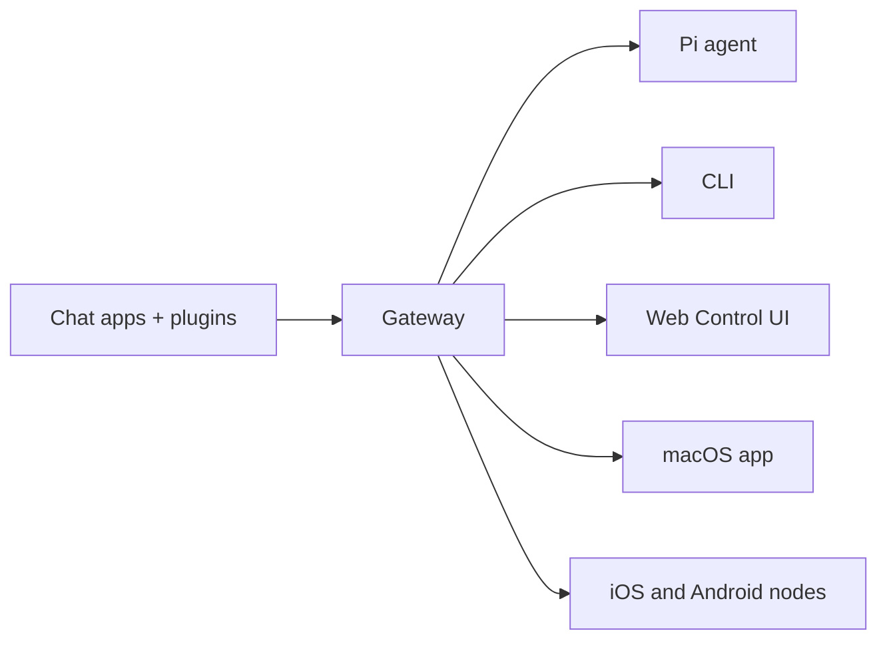

# OpenClaw 🦞

<p align="center">
    
    
</p>

> _「EXFOLIATE! EXFOLIATE!」_ — 可能是一隻太空龍蝦

<p align="center">
  <strong>跨 WhatsApp、Telegram、Discord、iMessage 等的任何 OS AI 代理程式 Gateway 閘道器。</strong><br />
  傳送一則訊息，從口袋裡就能取得代理程式回應。外掛可加入 Mattermost 等更多通道。
</p>

<Columns>
  <Card title="Get Started" href="/start/getting-started" icon="rocket">
    安裝 OpenClaw，數分鐘內啟動 Gateway 閘道器。
  </Card>
  <Card title="Run the Wizard" href="/start/wizard" icon="sparkles">
    使用 `openclaw onboard` 與配對流程進行引導式設定。
  </Card>
  <Card title="Open the Control UI" href="/web/control-ui" icon="layout-dashboard">
    啟動瀏覽器儀表板，用於聊天、設定與工作階段。
  </Card>
</Columns>

## What is OpenClaw?

OpenClaw 是一個 **自架的 Gateway 閘道器**，可將你喜愛的聊天應用程式——WhatsApp、Telegram、Discord、iMessage 等——連接到像 Pi 這樣的 AI 程式設計代理程式。你只需在自己的機器（或伺服器）上執行單一 Gateway 閘道器程序，它就會成為你的訊息應用程式與隨時可用的 AI 助手之間的橋樑。

**適合誰使用？** 想要隨時隨地傳訊與個人 AI 助手互動的開發者與進階使用者——同時不放棄對資料的控制，也不依賴託管服務。

**有何不同？**

- **自架**：在你的硬體上執行，遵循你的規則
- **多通道**：單一 Gateway 閘道器可同時服務 WhatsApp、Telegram、Discord 等
- **以代理程式為核心**：為程式設計代理程式打造，支援工具使用、工作階段、記憶與多代理路由
- **開放原始碼**：MIT 授權，社群驅動

**需要什麼？** Node 22+、一把 API 金鑰（建議使用 Anthropic），以及 5 分鐘。

## How it works



Gateway 閘道器是工作階段、路由與通道連線的單一事實來源。

## Key capabilities

<Columns>
  <Card title="Multi-channel gateway" icon="network">
    單一 Gateway 閘道器程序即可支援 WhatsApp、Telegram、Discord 與 iMessage。
  </Card>
  <Card title="Plugin channels" icon="plug">
    透過擴充套件加入 Mattermost 等更多通道。
  </Card>
  <Card title="Multi-agent routing" icon="route">
    依代理程式、工作區或寄件者提供隔離的工作階段。
  </Card>
  <Card title="Media support" icon="image">
    傳送與接收圖片、音訊與文件。
  </Card>
  <Card title="Web Control UI" icon="monitor">
    用於聊天、設定、工作階段與節點的瀏覽器儀表板。
  </Card>
  <Card title="Mobile nodes" icon="smartphone">
    配對 iOS 與 Android 節點，支援 Canvas。
  </Card>
</Columns>

## Quick start

<Steps>
  <Step title="Install OpenClaw">
    ```bash
    npm install -g openclaw@latest
    ```
  </Step>
  <Step title="Onboard and install the service">
    ```bash
    openclaw onboard --install-daemon
    ```
  </Step>
  <Step title="Pair WhatsApp and start the Gateway">
    ```bash
    openclaw channels login
    openclaw gateway --port 18789
    ```
  </Step>
</Steps>

需要完整安裝與開發設定嗎？請參閱 [Quick start](/start/quickstart)。

## Dashboard

Gateway 閘道器啟動後，開啟瀏覽器 Control UI。

- 本機預設：[http://127.0.0.1:18789/](http://127.0.0.1:18789/)
- 遠端存取：[Web surfaces](/web) 與 [Tailscale](/gateway/tailscale)

<p align="center">
  
</p>

## Configuration (optional)

設定位於 `~/.openclaw/openclaw.json`。

- 若你 **什麼都不做**，OpenClaw 會以 RPC 模式使用隨附的 Pi 二進位檔，並為每位寄件者建立工作階段。
- 若你想加強限制，請從 `channels.whatsapp.allowFrom` 開始，並（針對群組）設定提及規則。

範例：

```json5
{
  channels: {
    whatsapp: {
      allowFrom: ["+15555550123"],
      groups: { "*": { requireMention: true } },
    },
  },
  messages: { groupChat: { mentionPatterns: ["@openclaw"] } },
}
```

## Start here

<Columns>
  <Card title="Docs hubs" href="/start/hubs" icon="book-open">
    依使用情境整理的所有文件與指南。
  </Card>
  <Card title="Configuration" href="/gateway/configuration" icon="settings">
    核心 Gateway 閘道器設定、權杖與提供者設定。
  </Card>
  <Card title="Remote access" href="/gateway/remote" icon="globe">
    SSH 與 tailnet 的存取模式。
  </Card>
  <Card title="Channels" href="/channels/telegram" icon="message-square">
    WhatsApp、Telegram、Discord 等通道的專屬設定。
  </Card>
  <Card title="Nodes" href="/nodes" icon="smartphone">
    具備配對與 Canvas 的 iOS 與 Android 節點。
  </Card>
  <Card title="Help" href="/help" icon="life-buoy">
    常見修復方式與疑難排解入口。
  </Card>
</Columns>

## Learn more

<Columns>
  <Card title="Full feature list" href="/concepts/features" icon="list">
    完整的通道、路由與媒體功能。
  </Card>
  <Card title="Multi-agent routing" href="/concepts/multi-agent" icon="route">
    工作區隔離與每個代理程式的工作階段。
  </Card>
  <Card title="Security" href="/gateway/security" icon="shield">
    權杖、允許清單與安全控制。
  </Card>
  <Card title="Troubleshooting" href="/gateway/troubleshooting" icon="wrench">
    Gateway 閘道器診斷與常見錯誤。
  </Card>
  <Card title="About and credits" href="/reference/credits" icon="info">
    專案起源、貢獻者與授權。
  </Card>
</Columns>
