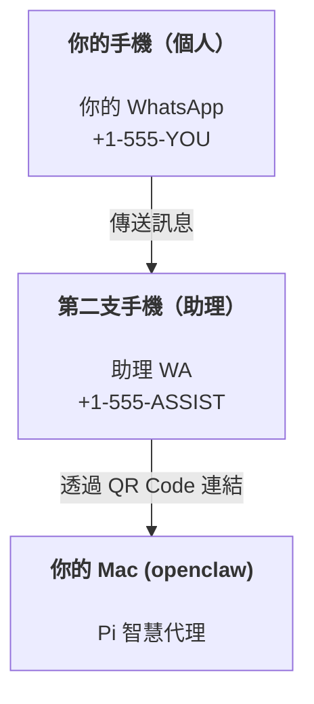

# 使用 OpenClaw 打造個人助理

OpenClaw 是適用於 **Pi** 智慧代理的 WhatsApp + Telegram + Discord + iMessage Gateway。外掛程式還增加了 Mattermost 支援。本指南介紹「個人助理」設定：一個專屬的 WhatsApp 號碼，運作方式就像你全天候在線的智慧代理。

## ⚠️ 安全第一

你正賦予智慧代理以下權限：

- 在你的機器上執行指令（取決於你的 Pi 工具設定）
- 在你的工作空間中讀取/寫入檔案
- 透過 WhatsApp/Telegram/Discord/Mattermost (外掛程式) 傳送回覆訊息

建議從保守的設定開始：

- 務必設定 `channels.whatsapp.allowFrom`（切勿在你的個人 Mac 上開放給全世界運行）。
- 為助理使用專用的 WhatsApp 號碼。
- 心跳檢查 (Heartbeats) 現在預設為每 30 分鐘一次。在信任此設定之前，請透過設定 `agents.defaults.heartbeat.every: "0m"` 來停用它。

## 必要條件

- 已安裝 OpenClaw 並完成新手導覽 — 如果尚未完成，請參閱 [入門指南](/start/getting-started)
- 助理專用的第二個電話號碼（SIM/eSIM/預付卡）

## 雙手機設定（推薦）

建議配置如下：



如果你將個人 WhatsApp 連結到 OpenClaw，傳送給你的每則訊息都會變成「智慧代理輸入」。這通常不是你想要的。

## 5 分鐘快速開始

1. 配對 WhatsApp Web（會顯示 QR Code；請用助理手機掃描）：

```bash
openclaw channels login
```

2. 啟動 Gateway（保持運行）：

```bash
openclaw gateway --port 18789
```

3. 在 `~/.openclaw/openclaw.json` 中放入最簡設定：

```json5
{
  channels: { whatsapp: { allowFrom: ["+15555550123"] } },
}
```

現在從你的白名單電話傳送訊息給助理號碼。

當新手導覽結束後，我們會自動開啟儀表板並列印一個乾淨的（不含 Token 的）連結。如果提示需要驗證，請將 `gateway.auth.token` 中的 Token 貼到 Control UI 設定中。稍後要重新開啟請執行：`openclaw dashboard`。

## 為智慧代理提供工作空間 (AGENTS)

OpenClaw 會從其工作空間目錄讀取操作指令和「記憶體」。

預設情況下，OpenClaw 使用 `~/.openclaw/workspace` 作為智慧代理工作空間，並會在設定或第一次智慧代理運行時自動建立它（加上初始的 `AGENTS.md`、`SOUL.md`、`TOOLS.md`、`IDENTITY.md`、`USER.md`、`HEARTBEAT.md`）。`BOOTSTRAP.md` 僅在工作空間全新時建立（刪除後不應再出現）。`MEMORY.md` 是選用的（不會自動建立）；若存在，則會在一般工作階段中載入。子智慧代理 (Subagent) 工作階段僅會注入 `AGENTS.md` 和 `TOOLS.md`。

提示：將此資料夾視為 OpenClaw 的「記憶體」，並將其設為 Git 存放庫（建議設為私有），以便備份你的 `AGENTS.md` 和記憶體檔案。如果已安裝 Git，全新的工作空間將會自動初始化。

```bash
openclaw setup
```

完整工作空間佈局 + 備份指南：[智慧代理工作空間](/concepts/agent-workspace)
記憶體工作流程：[記憶體](/concepts/memory)

選用：透過 `agents.defaults.workspace` 選擇不同的工作空間（支援 `~`）。

```json5
{
  agent: {
    workspace: "~/.openclaw/workspace",
  },
}
```

如果你已經從存放庫提供自己的工作空間檔案，可以完全停用引導檔案 (bootstrap file) 的建立：

```json5
{
  agent: {
    skipBootstrap: true,
  },
}
```

## 將其轉換為「助理」的設定

OpenClaw 預設已具備良好的助理設定，但你通常會想要調整：

- `SOUL.md` 中的人格/指令
- 思考預設值（如果需要）
- 心跳檢查（在你信任它之後）

範例：

```json5
{
  logging: { level: "info" },
  agent: {
    model: "anthropic/claude-opus-4-6",
    workspace: "~/.openclaw/workspace",
    thinkingDefault: "high",
    timeoutSeconds: 1800,
    // 先設為 0；稍後再啟用。
    heartbeat: { every: "0m" },
  },
  channels: {
    whatsapp: {
      allowFrom: ["+15555550123"],
      groups: {
        "*": { requireMention: true },
      },
    },
  },
  routing: {
    groupChat: {
      mentionPatterns: [" @openclaw", "openclaw"],
    },
  },
  session: {
    scope: "per-sender",
    resetTriggers: ["/new", "/reset"],
    reset: {
      mode: "daily",
      atHour: 4,
      idleMinutes: 10080,
    },
  },
}
```

## 工作階段與記憶體

- 工作階段檔案：`~/.openclaw/agents/<agentId>/sessions/{{SessionId}}.jsonl`
- 工作階段詮釋資料（Token 使用量、最後路由等）：`~/.openclaw/agents/<agentId>/sessions/sessions.json`（舊版：`~/.openclaw/sessions/sessions.json`）
- `/new` 或 `/reset` 會為該聊天開啟新的工作階段（可透過 `resetTriggers` 設定）。如果單獨傳送，智慧代理會回覆簡短的問候以確認重設。
- `/compact [instructions]` 會壓縮工作階段內容並報告剩餘的內容額度。

## 心跳檢查（主動模式）

預設情況下，OpenClaw 每 30 分鐘執行一次心跳檢查，提示字元如下：
`如果 HEARTBEAT.md 存在（工作空間內容），請閱讀它。嚴格遵守。不要推斷或重複先前聊天的舊任務。如果不需要關注任何事項，請回覆 HEARTBEAT_OK。`
設定 `agents.defaults.heartbeat.every: "0m"` 即可停用。

- 如果 `HEARTBEAT.md` 存在但實際上是空的（僅包含空白行和 Markdown 標題，如 `# Heading`），OpenClaw 會跳過心跳執行以節省 API 呼叫。
- 如果檔案缺失，心跳檢查仍會執行，並由模型決定要做什麼。
- 如果智慧代理回覆 `HEARTBEAT_OK`（可選帶有簡短填充；參見 `agents.defaults.heartbeat.ackMaxChars`），OpenClaw 會抑制該次心跳的對外傳送。
- 心跳檢查會執行完整的智慧代理輪次 — 間隔越短，消耗的 Token 越多。

```json5
{
  agent: {
    heartbeat: { every: "30m" },
  },
}
```

## 媒體輸入與輸出

傳入的附件（圖片/音訊/文件）可以透過模板呈現在你的指令中：

- `{{MediaPath}}`（本地暫存檔案路徑）
- `{{MediaUrl}}`（虛擬 URL）
- `{{Transcript}}`（如果啟用了音訊轉錄）

智慧代理傳出的附件：在獨立的一行中包含 `MEDIA:<path-or-url>`（不含空格）。範例：

```
這是螢幕截圖。
MEDIA:https://example.com/screenshot.png
```

OpenClaw 會提取這些內容，並將其作為媒體與文字一起傳送。

## 操作檢查清單

```bash
openclaw status          # 本地狀態（憑證、工作階段、排隊中的事件）
openclaw status --all    # 完整診斷（唯讀，可直接貼出）
openclaw status --deep   # 增加 Gateway 健康檢查探針 (Telegram + Discord)
openclaw health --json   # Gateway 健康快照 (WS)
```

日誌儲存在 `/tmp/openclaw/` 下（預設：`openclaw-YYYY-MM-DD.log`）。

## 後續步驟

- WebChat：[WebChat](/web/webchat)
- Gateway 操作：[Gateway 運行手冊](/gateway)
- Cron + 喚醒：[Cron 任務](/automation/cron-jobs)
- macOS 選單列配套應用：[OpenClaw macOS 應用程式](/platforms/macos)
- iOS 節點應用程式：[iOS 應用程式](/platforms/ios)
- Android 節點應用程式：[Android 應用程式](/platforms/android)
- Windows 狀態：[Windows (WSL2)](/platforms/windows)
- Linux 狀態：[Linux 應用程式](/platforms/linux)
- 安全性：[安全性](/gateway/security)
