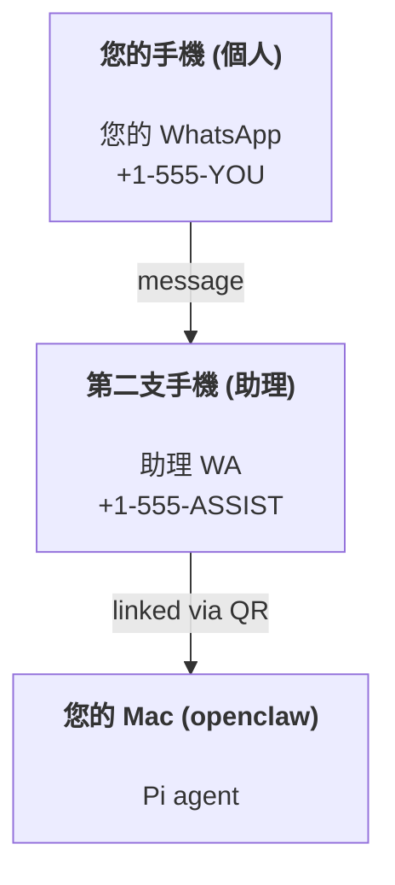

# 使用 OpenClaw 建構個人助理

OpenClaw 是一個適用於 **Pi** 智慧代理的 WhatsApp + Telegram + Discord + iMessage Gateway。外掛程式可新增 Mattermost。本指南是「個人助理」的設定方式：一個專用的 WhatsApp 號碼，如同您的常駐智慧代理。

## ⚠️ 安全第一

您將讓智慧代理具備以下能力：

- 在您的機器上執行指令（取決於您的 Pi 工具設定）
- 在您的工作區讀取/寫入檔案
- 透過 WhatsApp/Telegram/Discord/Mattermost（外掛程式）傳送訊息

從保守的設定開始：

- 務必設定 `channels.whatsapp.allowFrom`（切勿在您的個人 Mac 上執行開放式服務）。
- 為助理使用專用的 WhatsApp 號碼。
- 心跳現在預設為每 30 分鐘一次。在您信任此設定之前，可透過設定 `agents.defaults.heartbeat.every: "0m"` 來停用它。

## 先決條件

- 已安裝並完成 OpenClaw 新手導覽 — 如果您尚未完成，請參閱 [入門指南](/start/getting-started)
- 一個用於助理的第二電話號碼 (SIM/eSIM/預付卡)

## 雙手機設定（建議）

您會需要這樣做：



如果您將個人 WhatsApp 連結至 OpenClaw，傳送給您的每則訊息都將成為「智慧代理輸入」。這通常不是您想要的。

## 5 分鐘快速開始

1. 配對 WhatsApp 網頁版（顯示 QR 碼；用助理手機掃描）：

```bash
openclaw channels login
```

2. 啟動 Gateway（讓它保持執行）：

```bash
openclaw gateway --port 18789
```

3. 在 `~/.openclaw/openclaw.json` 中放入最小設定：

```json5
{
  channels: { whatsapp: { allowFrom: ["+15555550123"] } },
}
```

現在從您的允許清單中的手機向助理號碼傳送訊息。

當新手導覽完成時，我們會自動開啟儀表板並列印一個乾淨（未代幣化）的連結。如果它提示進行驗證，請將 `gateway.auth.token` 中的權杖貼到控制 UI 設定中。若要稍後重新開啟：`openclaw dashboard`。

## 為智慧代理提供工作區 (AGENTS)

OpenClaw 從其工作區目錄讀取操作說明和「記憶體」。

預設情況下，OpenClaw 使用 `~/.openclaw/workspace` 作為智慧代理工作區，並會在設定/首次執行智慧代理時自動建立它（以及入門檔案 `AGENTS.md`、`SOUL.md`、`TOOLS.md`、`IDENTITY.md`、`USER.md`、`HEARTBEAT.md`）。`BOOTSTRAP.md` 僅在工作區全新時建立（刪除後不應重新出現）。`MEMORY.md` 是可選的（不會自動建立）；如果存在，它會載入到正常工作階段。子智慧代理工作階段僅注入 `AGENTS.md` 和 `TOOLS.md`。

提示：將此資料夾視為 OpenClaw 的「記憶體」，並將其設為 git 儲存庫（最好是私人的），以便備份您的 `AGENTS.md` + 記憶體檔案。如果已安裝 git，全新的工作區將自動初始化。

```bash
openclaw setup
```

完整工作區佈局 + 備份指南：[智慧代理工作區](/concepts/agent-workspace)
記憶體工作流程：[記憶體](/concepts/memory)

選用：使用 `agents.defaults.workspace` 選擇不同的工作區（支援 `~`）。

```json5
{
  agent: {
    workspace: "~/.openclaw/workspace",
  },
}
```

如果您已經從儲存庫發佈自己的工作區檔案，您可以完全停用啟動檔案建立：

```json5
{
  agent: {
    skipBootstrap: true,
  },
}
```

## 將其轉變為「助理」的設定

OpenClaw 預設為良好的助理設定，但您通常會想要調整：

- `SOUL.md` 中的角色/指示
- 思考預設值（如果需要）
- 心跳（一旦您信任它）

範例：

```json5
{
  logging: { level: "info" },
  agent: {
    model: "anthropic/claude-opus-4-6",
    workspace: "~/.openclaw/workspace",
    thinkingDefault: "high",
    timeoutSeconds: 1800,
    // Start with 0; enable later.
    heartbeat: { every: "0m" },
  },
  channels: {
    whatsapp: {
      allowFrom: ["+15555550123"],
      groups: {
        "*": { requireMention: true },
      },
    },
  },
  routing: {
    groupChat: {
      mentionPatterns: [" @openclaw", "openclaw"],
    },
  },
  session: {
    scope: "per-sender",
    resetTriggers: ["/new", "/reset"],
    reset: {
      mode: "daily",
      atHour: 4,
      idleMinutes: 10080,
    },
  },
}
```

## 工作階段和記憶體

- 工作階段檔案：`~/.openclaw/agents/<agentId>/sessions/{{SessionId}}.jsonl`
- 工作階段中繼資料（權杖使用量、最後路由等）：`~/.openclaw/agents/<agentId>/sessions/sessions.json` (舊版：`~/.openclaw/sessions/sessions.json`)
- `/new` 或 `/reset` 為該聊天開始一個新的工作階段（可透過 `resetTriggers` 設定）。如果單獨傳送，智慧代理會回覆簡短的問候以確認重設。
- `/compact [指示]` 會壓縮工作階段上下文並報告剩餘的上下文預算。

## 心跳（主動模式）

預設情況下，OpenClaw 會每 30 分鐘執行一次心跳，並提示：`如果 HEARTBEAT.md 存在（工作區上下文），請嚴格遵循。不要從先前的聊天中推斷或重複舊任務。如果沒有需要注意的事項，請回覆 HEARTBEAT_OK。`
設定 `agents.defaults.heartbeat.every: "0m"` 以停用。

- 如果 `HEARTBEAT.md` 存在但實際上是空的（只有空白行和像 `# 標題` 這樣的 Markdown 標頭），OpenClaw 會跳過心跳執行以節省 API 呼叫。
- 如果檔案遺失，心跳仍會執行，並由模型決定要怎麼做。
- 如果智慧代理回覆 `HEARTBEAT_OK`（可選地帶有短填充；請參閱 `agents.defaults.heartbeat.ackMaxChars`），OpenClaw 會抑制該心跳的向外傳遞。
- 心跳會執行完整的智慧代理回合 — 較短的間隔會消耗更多權杖。

```json5
{
  agent: {
    heartbeat: { every: "30m" },
  },
}
```

## 媒體輸入與輸出

傳入的附件（圖片/音訊/檔案）可以透過範本呈現在您的指令中：

- `{{MediaPath}}` (本地暫存檔案路徑)
- `{{MediaUrl}}` (虛擬 URL)
- `{{Transcript}}` (如果啟用音訊轉錄)

來自智慧代理的向外附件：在單獨一行中包含 `MEDIA:<path-or-url>`（沒有空格）。範例：

```
Here’s the screenshot.
MEDIA:https://example.com/screenshot.png
```

OpenClaw 會提取這些內容並將它們作為媒體與文字一同傳送。

## 操作檢查清單

```bash
openclaw status          # 本地狀態（憑證、工作階段、佇列事件）
openclaw status --all    # 完整診斷（唯讀，可貼上）
openclaw status --deep   # 新增 Gateway 健康探測（Telegram + Discord）
openclaw health --json   # Gateway 健康快照 (WS)
```

日誌位於 `/tmp/openclaw/` 下（預設：`openclaw-YYYY-MM-DD.log`）。

## 後續步驟

- WebChat：[WebChat](/web/webchat)
- Gateway 操作：[Gateway 操作手冊](/gateway)
- Cron + 喚醒：[Cron 工作](/automation/cron-jobs)
- macOS 選單列配套應用：[OpenClaw macOS 應用程式](/platforms/macos)
- iOS 節點應用程式：[iOS 應用程式](/platforms/ios)
- Android 節點應用程式：[Android 應用程式](/platforms/android)
- Windows 狀態：[Windows (WSL2)](/platforms/windows)
- Linux 狀態：[Linux 應用程式](/platforms/linux)
- 安全：[安全](/gateway/security)
