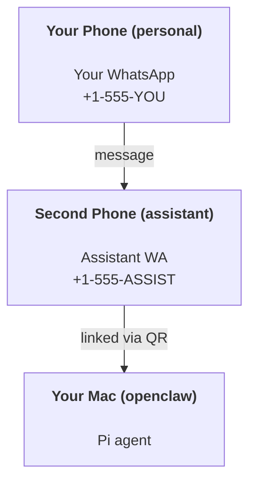

# 使用 OpenClaw 建立個人助理

OpenClaw 是一個支援 **Pi** 代理人的 WhatsApp + Telegram + Discord + iMessage 閘道。插件則新增 Mattermost 支援。本指南為「個人助理」設定：一個專用的 WhatsApp 號碼，作為你隨時在線的代理人。

## ⚠️ 安全第一

你將讓代理人具備以下能力：

- 在你的機器上執行指令（視你的 Pi 工具設定而定）
- 讀取/寫入你的工作區檔案
- 透過 WhatsApp/Telegram/Discord/Mattermost（插件）發送訊息回覆

建議從保守開始：

- 永遠設定 `channels.whatsapp.allowFrom`（切勿在你的個人 Mac 上開放給全世界執行）。
- 為助理使用專用的 WhatsApp 號碼。
- 心跳訊號預設為每 30 分鐘一次。若尚未信任此設定，請透過設定 `agents.defaults.heartbeat.every: "0m"` 來停用。

## 前置條件

- 已安裝並完成 OpenClaw 上線流程 — 若尚未完成，請參考 [快速入門](/start/getting-started)
- 第二支電話號碼（SIM/eSIM/預付卡）供助理使用

## 雙機設定（推薦）

你需要這樣：


```mermaid
flowchart TB
    A["<b>Your Phone (personal)<br></b><br>Your WhatsApp<br>+1-555-YOU"] -- message --> B["<b>Second Phone (assistant)<br></b><br>Assistant WA<br>+1-555-ASSIST"]
    B -- linked via QR --> C["<b>Your Mac (openclaw)<br></b><br>Pi agent"]
```

如果你將個人 WhatsApp 連結到 OpenClaw，所有發給你的訊息都會變成「代理人輸入」。這通常不是你想要的。

## 5 分鐘快速開始

1. 配對 WhatsApp Web（會顯示 QR 碼；用助理手機掃描）：

```bash
openclaw channels login
```

2. 啟動 Gateway（保持執行狀態）：

```bash
openclaw gateway --port 18789
```

3. 在 `~/.openclaw/openclaw.json` 放入最簡設定：

```json5
{
  channels: { whatsapp: { allowFrom: ["+15555550123"] } },
}
```

現在，從你允許的電話號碼發送訊息給助理。

當啟動完成後，我們會自動開啟儀表板並列印一個乾淨的（非 token 化）連結。如果系統要求驗證，請將 `gateway.auth.token` 中的 token 貼到 Control UI 設定中。之後要重新開啟：`openclaw dashboard`。

## 給代理一個工作區（AGENTS）

OpenClaw 從其工作區目錄讀取操作指令和「記憶」。

預設情況下，OpenClaw 使用 `~/.openclaw/workspace` 作為代理的工作區，並會在設定或首次執行代理時自動建立該目錄（以及起始的 `AGENTS.md`、`SOUL.md`、`TOOLS.md`、`IDENTITY.md`、`USER.md`、`HEARTBEAT.md`）。`BOOTSTRAP.md` 僅在工作區全新建立時產生（刪除後不會再出現）。`MEMORY.md` 是可選的（不會自動建立）；存在時會在一般會話中載入。子代理會話只注入 `AGENTS.md` 和 `TOOLS.md`。

提示：將此資料夾視為 OpenClaw 的「記憶」，並將其設為 git 倉庫（建議設為私有），以便備份你的 `AGENTS.md` 和記憶檔案。如果已安裝 git，則全新工作區會自動初始化。

```bash
openclaw setup
```

完整工作區結構與備份指南：[Agent workspace](/concepts/agent-workspace)  
記憶工作流程：[Memory](/concepts/memory)

可選：使用 `agents.defaults.workspace` 選擇不同的工作區（支援 `~`）。

```json5
{
  agent: {
    workspace: "~/.openclaw/workspace",
  },
}
```

如果你已經從倉庫中發佈自己的工作區檔案，可以完全停用啟動檔案的建立：

```json5
{
  agent: {
    skipBootstrap: true,
  },
}
```

## 將其轉變為「助理」的設定

OpenClaw 預設為良好的助理設定，但你通常會想要調整：

- `SOUL.md` 中的人格/指令
- 思考預設（如有需要）
- 心跳（當你信任它後）

範例：

```json5
{
  logging: { level: "info" },
  agent: {
    model: "anthropic/claude-opus-4-6",
    workspace: "~/.openclaw/workspace",
    thinkingDefault: "high",
    timeoutSeconds: 1800,
    // Start with 0; enable later.
    heartbeat: { every: "0m" },
  },
  channels: {
    whatsapp: {
      allowFrom: ["+15555550123"],
      groups: {
        "*": { requireMention: true },
      },
    },
  },
  routing: {
    groupChat: {
      mentionPatterns: ["@openclaw", "openclaw"],
    },
  },
  session: {
    scope: "per-sender",
    resetTriggers: ["/new", "/reset"],
    reset: {
      mode: "daily",
      atHour: 4,
      idleMinutes: 10080,
    },
  },
}
```

## 工作階段與記憶

- 工作階段檔案：`~/.openclaw/agents/<agentId>/sessions/{{SessionId}}.jsonl`
- 工作階段元資料（token 使用量、最後路由等）：`~/.openclaw/agents/<agentId>/sessions/sessions.json`（舊版：`~/.openclaw/sessions/sessions.json`）
- `/new` 或 `/reset` 會為該聊天啟動新的工作階段（可透過 `resetTriggers` 設定）。若單獨發送，代理會以簡短問候回覆以確認重置。
- `/compact [instructions]` 會壓縮工作階段上下文並回報剩餘的上下文預算。

## 心跳（主動模式）

預設情況下，OpenClaw 每 30 分鐘執行一次心跳，使用的提示為：
`Read HEARTBEAT.md if it exists (workspace context). Follow it strictly. Do not infer or repeat old tasks from prior chats. If nothing needs attention, reply HEARTBEAT_OK.`
設定 `agents.defaults.heartbeat.every: "0m"` 可停用。

- 如果 `HEARTBEAT.md` 存在但實際上是空的（只有空白行和像 `# Heading` 這樣的 Markdown 標題），OpenClaw 會跳過心跳執行以節省 API 呼叫。
- 如果該檔案遺失，心跳仍會執行，由模型決定下一步。
- 如果代理以 `HEARTBEAT_OK` 回覆（可選擇帶有短暫填充；參見 `agents.defaults.heartbeat.ackMaxChars`），OpenClaw 會抑制該次心跳的外發傳送。
- 預設允許心跳傳送到 DM 風格的 `user:<id>` 目標。設定 `agents.defaults.heartbeat.directPolicy: "block"` 可抑制直接目標傳送，同時保持心跳執行。
- 心跳執行完整代理回合 — 間隔越短，消耗的 token 越多。

```json5
{
  agent: {
    heartbeat: { every: "30m" },
  },
}
```

## 媒體輸入與輸出

可透過範本將傳入的附件（圖片／音訊／文件）呈現給你的指令：

- `{{MediaPath}}`（本地暫存檔案路徑）
- `{{MediaUrl}}`（偽 URL）
- `{{Transcript}}`（如果啟用了語音轉錄）

代理端的外發附件：請在獨立一行（無空格）中包含 `MEDIA:<path-or-url>`。範例：

```
Here’s the screenshot.
MEDIA:https://example.com/screenshot.png
```

OpenClaw 會擷取這些並將它們作為媒體與文字一同發送。

## 操作檢查清單

```bash
openclaw status          # local status (creds, sessions, queued events)
openclaw status --all    # full diagnosis (read-only, pasteable)
openclaw status --deep   # adds gateway health probes (Telegram + Discord)
openclaw health --json   # gateway health snapshot (WS)
```

日誌即時存放於 `/tmp/openclaw/`（預設：`openclaw-YYYY-MM-DD.log`）。

## 下一步

- WebChat: [WebChat](/web/webchat)
- Gateway 操作: [Gateway runbook](/gateway)
- 定時任務與喚醒: [Cron jobs](/automation/cron-jobs)
- macOS 功能列伴侶程式: [OpenClaw macOS app](/platforms/macos)
- iOS 節點應用程式: [iOS app](/platforms/ios)
- Android 節點應用程式: [Android app](/platforms/android)
- Windows 狀態: [Windows (WSL2)](/platforms/windows)
- Linux 狀態: [Linux app](/platforms/linux)
- 安全性: [Security](/gateway/security)
