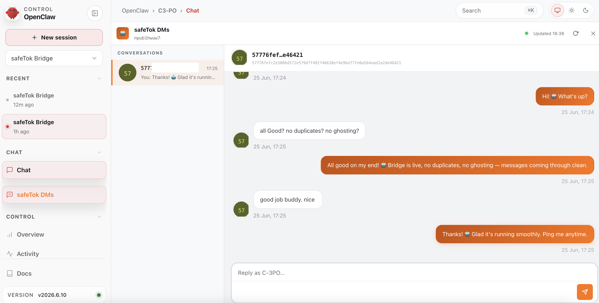

# safeTok ↔ OpenClaw Bridge

> **Using a Claude monthly subscription and want to DM your AI agent from your phone?**
> This bridge lets you do exactly that — via safeTok, a privacy-first Nostr client.
> No API keys required beyond what OpenClaw already has.

A bidirectional DM bridge that connects [safeTok](https://safetok.app) to OpenClaw via the Gateway WebSocket API. Incoming safeTok DMs are routed to a dedicated OpenClaw session; the assistant's reply is encrypted and published back to the Nostr relays — end-to-end encrypted, decentralized, no middleman.



## How it works

```
safeTok user
    │  NIP-44 DM (kind:4) on Nostr relays
    ▼
bridge.mjs
    │  gateway WebSocket (chat.send / chat.history)
    ▼
OpenClaw session  →  assistant reply
    │  NIP-44 encrypted response
    ▼
safeTok user
```

safeTok uses a **custom NIP-44 variant** (documented in `nip44.mjs`):

| Parameter       | Standard NIP-44 v2 | safeTok variant         |
| --------------- | ------------------ | ----------------------- |
| ECDH            | SHA256 of raw-x    | SHA256 of compressed pt |
| Nonce           | 32 bytes           | 12 bytes                |
| Padding         | Yes                | None                    |
| Conv key        | HKDF extract-only  | HKDF extract + expand   |
| Parity fallback | No                 | Yes (both tried)        |

## Prerequisites

- Node.js ≥ 22
- A running OpenClaw gateway
- A Nostr keypair for the bot account

## Setup

### 1. Generate a keypair (if you don't have one)

```js
// one-liner — paste into node REPL
import { generatePrivKey, privToXOnlyPub } from "./nip44.mjs";
const priv = generatePrivKey();
console.log("priv:", priv);
console.log("pub: ", privToXOnlyPub(priv));
```

### 2. Install dependencies

```bash
npm install @noble/curves
```

### 3. Set environment variables

```bash
export OPENCLAW_TOKEN="your-gateway-token"      # from gateway.token in config
export SAFETOK_PRIVATE_KEY="your-hex-priv-key"  # 64-char hex
```

Optional overrides:

```bash
export OPENCLAW_GW_URL="ws://127.0.0.1:18789"                        # default
export SAFETOK_RELAYS="wss://relay.damus.io,wss://nos.lol"           # default
export SAFETOK_SESSION="agent:dev:safetok-bridge"                     # default
```

### 4. Start the bridge

```bash
npm start
```

You should see:

```
╔═══════════════════════════════════════════════╗
║   safeTok ↔ OpenClaw Bridge                  ║
╚═══════════════════════════════════════════════╝
pubkey : <your-bot-pubkey>
session: agent:dev:safetok-bridge
relays : wss://relay.damus.io, wss://nos.lol

[bridge] connecting to OpenClaw gateway…
[bridge] gateway ready ✓
[bridge] created dedicated session: agent:dev:safetok-bridge
[bridge] subscribed to wss://relay.damus.io
[bridge] subscribed to wss://nos.lol
```

## Finding your gateway token

```bash
openclaw config get gateway.token
```

## Production tips

- Run under a process manager (`pm2`, `systemd`, etc.) for auto-restart.
- Use an `.env` file or secret manager — never commit your private key.
- Set `dmPolicy` to `allowlist` and `allowFrom` to your own pubkey for a private bot.
- Add more relays via `SAFETOK_RELAYS` for redundancy.

## Files

| File               | Purpose                                                      |
| ------------------ | ------------------------------------------------------------ |
| `bridge.mjs`       | Main bridge process                                          |
| `nip44.mjs`        | safeTok NIP-44 crypto primitives (encrypt/decrypt/sign)      |
| `seen-events.json` | Auto-generated; persists processed event IDs across restarts |
