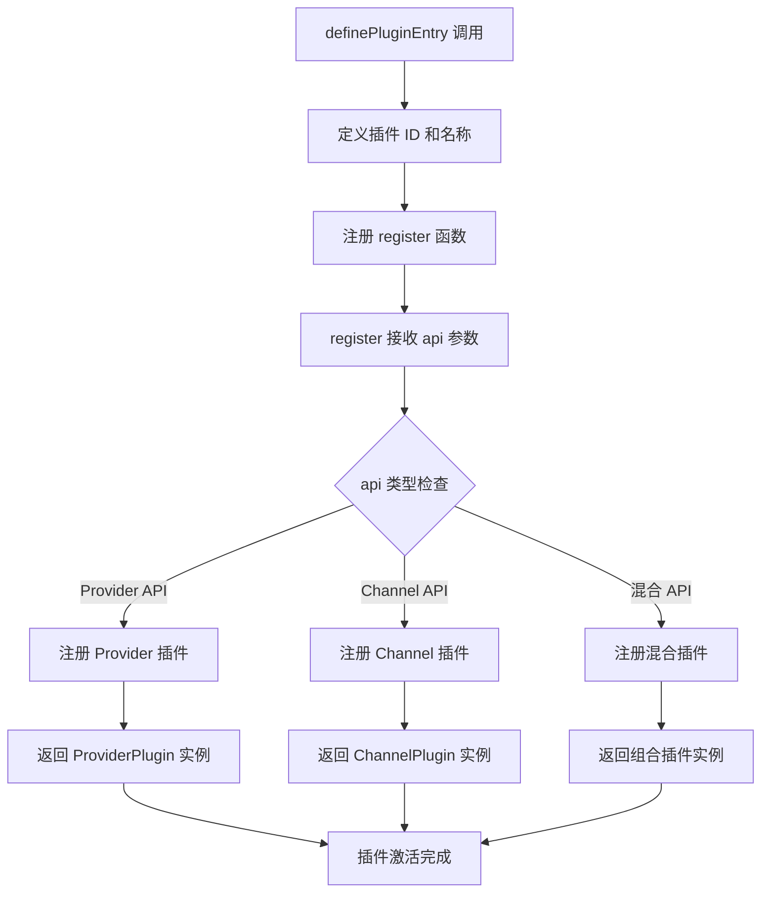
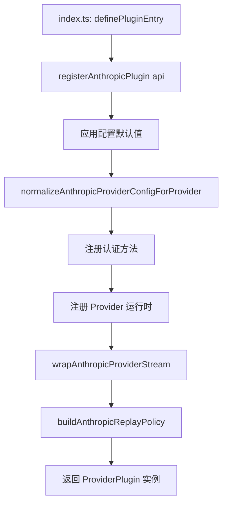
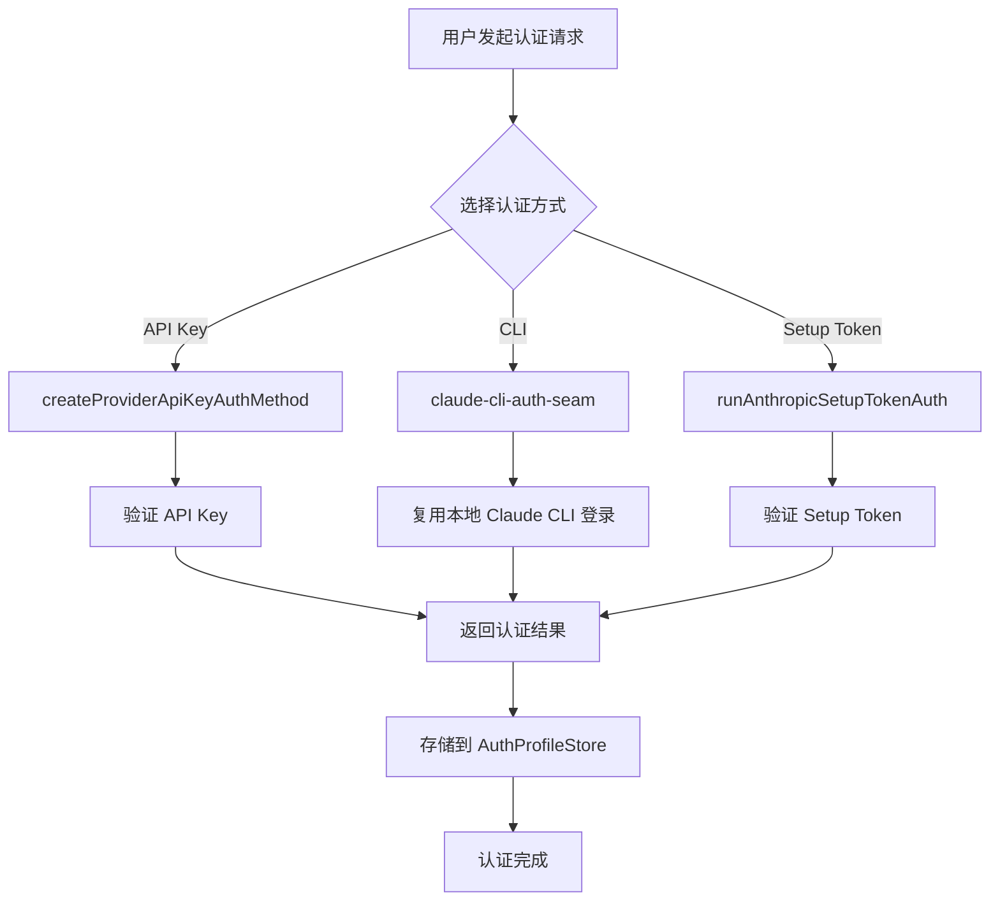
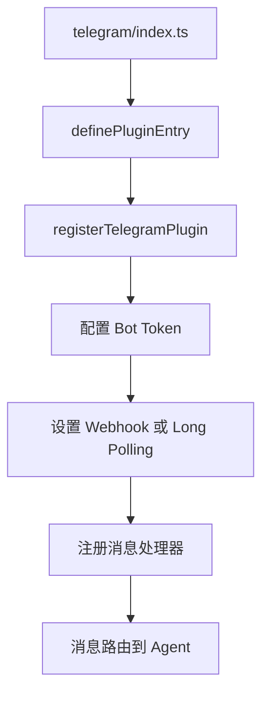
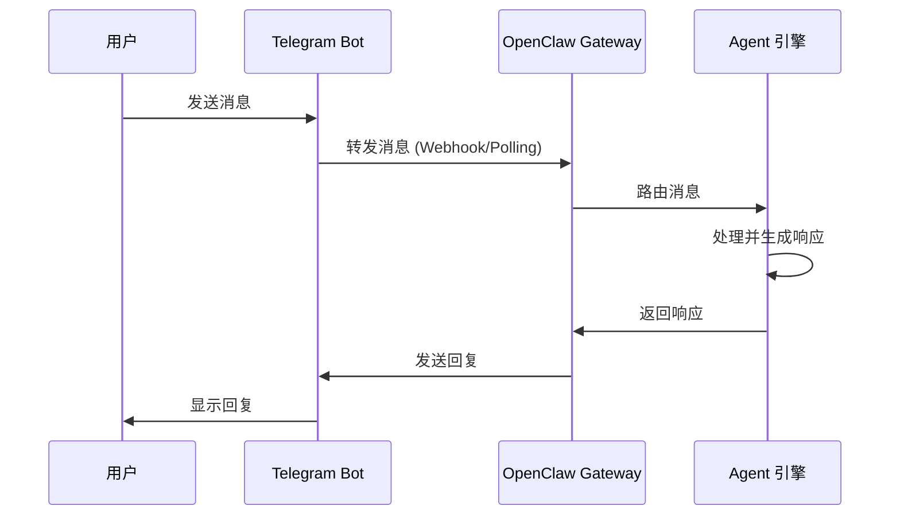
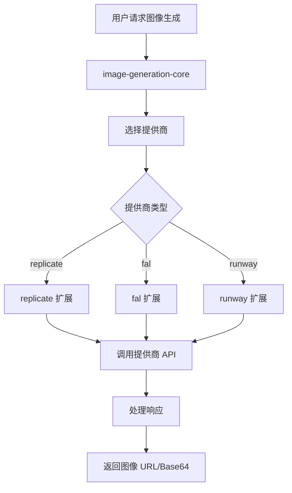
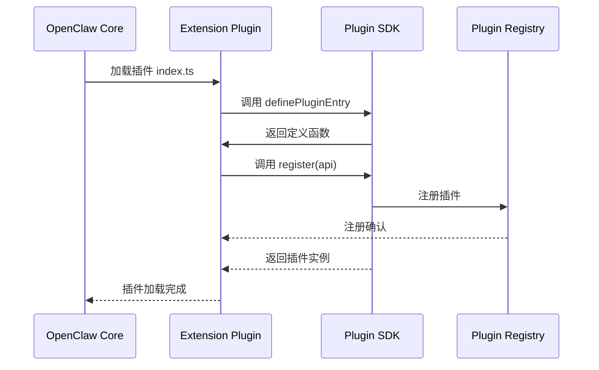

# OpenClaw Extensions 扩展模块流程文档

## 概述

Extensions 目录包含 120+ 个扩展插件，分为以下主要类别：
- AI 模型提供者 (Providers)
- 渠道集成 (Channels)
- 工具服务 (Services)
- 记忆和知识 (Memory)

## 1. 扩展模块分类

### 1.1 扩展分类表

| 类别 | 扩展列表 |
|------|---------|
| **AI 模型** | anthropic, openai, google, deepseek, ollama, mistral, qwen, groq, perplexity, xai, fireworks, cloudflare-ai-gateway, litellm, openrouter, voyage, nvidia, cerebras, deepinfra, moonshot, kimi-coding, stepfun, bytedance,小米,vllm, sglang, together, amazon-bedrock, amazon-bedrock-mantle, arcee, huggingface, openai-o1 |
| **渠道** | telegram, discord, slack, msteams, whatsapp, line, matrix, signal, irc, nostr, zulip, mattermost, synology-chat, feishu, googlechat, nexmo, twilio, vonage, звонок, ringcentral |
| **工具服务** | image-generation-core, video-generation-core, speech-core, fal, runway,.replicate, open-prose, browser, duckduckgo, exa, searxng, tavily, brave, firecrawl, web-readability, document-extract |
| **记忆知识** | memory-core, memory-wiki, memory-lancedb, active-memory |
| **TTS/语音** | elevenlabs, deepgram, azure-speech, senseaudio, speech-core, talk-voice |
| **设备控制** | phone-control, device-pair |

## 2. 插件架构

### 2.1 插件结构

```
extension/
├── index.ts              # 插件入口点
├── openclaw.plugin.json  # 插件元数据
├── api.ts               # 公共 API
├── runtime-api.ts       # 运行时 API
├── src/                 # 源代码
├── config-*.ts          # 配置相关
└── manifest.json        # 清单文件
```

### 2.2 插件入口流程



## 3. Anthropic 扩展详解

### 3.1 Anthropic 插件注册流程



### 3.2 认证流程



### 3.3 Anthropic 插件代码注释

```typescript
// extensions/anthropic/index.ts
// 插件入口点 - 定义插件的基本信息
export default definePluginEntry({
  id: "anthropic",  // 插件唯一标识符
  name: "Anthropic Provider",  // 插件显示名称
  description: "Bundled Anthropic provider plugin",  // 插件描述
  // register 函数接收 OpenClaw API 并返回插件实例
  register(api) {
    return registerAnthropicPlugin(api);  // 调用运行时注册函数
  },
});

// extensions/anthropic/register.runtime.ts
// Provider ID 常量定义
const PROVIDER_ID = "anthropic";
// 默认模型配置
const DEFAULT_ANTHROPIC_MODEL = "anthropic/claude-opus-4-7";

// 注册函数 - 核心插件注册逻辑
export function registerAnthropicPlugin(
  api: OpenClawPluginApi  // OpenClaw 提供的插件 API
): ProviderPlugin {
  return {
    // 模型前缀支持列表
    modelPrefixes: ["claude-"],
    // 模型 ID 别名映射
    modelIdAliases: {
      "opus-4.6": "claude-opus-4-6",
      "sonnet-4.6": "claude-sonnet-4-6",
    },
    // 认证方法注册
    auth: {
      methods: [
        // API Key 认证
        createProviderApiKeyAuthMethod({
          provider: PROVIDER_ID,
          keyEnvVar: "ANTHROPIC_API_KEY",
        }),
        // CLI 认证
        {
          id: "anthropic-cli",
          name: "Anthropic Claude CLI",
          async authenticate(ctx) {
            // 调用 Claude CLI 获取凭证
            return await claudeCliAuth.authenticate(ctx);
          },
        },
      ],
    },
    // 运行时模型解析
    resolveModel(modelId, ctx) {
      // 解析模型 ID 并返回模型配置
      return resolveClaudeModel(modelId, ctx);
    },
    // 流式响应包装
    wrapStream: wrapAnthropicProviderStream,
    // 回放策略
    replayPolicy: buildAnthropicReplayPolicy,
  };
}
```

## 4. 渠道扩展流程 (Telegram 为例)

### 4.1 Telegram 插件结构



### 4.2 消息处理流程



## 5. 工具服务扩展

### 5.1 图像生成扩展流程



## 6. 扩展注册时序图



## 7. 扩展清单文件格式

```json
// extensions/<name>/openclaw.plugin.json
{
  "id": "扩展唯一ID",
  "activation": {
    "onStartup": false  // 是否在启动时激活
  },
  "enabledByDefault": true,  // 默认启用
  "providers": ["provider-id"],  // 提供的 Provider
  "channels": ["channel-id"],  // 提供的 Channel
  "modelSupport": {
    "modelPrefixes": ["gpt-", "claude-"]  // 支持的模型前缀
  },
  "providerAuthEnvVars": {
    "provider-id": ["API_KEY_ENV_VAR"]  // 认证环境变量
  },
  "providerEndpoints": [
    {
      "endpointClass": "openai-public",
      "hosts": ["api.openai.com"]
    }
  ]
}
```

## 8. 关键扩展文件索引

| 扩展 | 入口文件 | 主要功能 |
|-----|---------|---------|
| `anthropic` | `index.ts` | Anthropic Claude 模型提供者 |
| `openai` | `index.ts` | OpenAI GPT 模型提供者 |
| `telegram` | `index.ts` | Telegram 渠道集成 |
| `discord` | `index.ts` | Discord 渠道集成 |
| `memory-core` | `index.ts` | 核心记忆系统 |
| `image-generation-core` | `index.ts` | 图像生成核心 |
| `speech-core` | `index.ts` | 语音处理核心 |

## 9. 扩展边界规则

根据 `extensions/AGENTS.md` 的规定：

1. **导入限制**: 扩展代码只能从 `openclaw/plugin-sdk/*` 和本地 barrel 文件导入
2. **禁止深层导入**: 不能导入 `src/**`、`src/channels/**` 或其他扩展的内部代码
3. **相对导入限制**: 不能使用逃逸当前扩展包根目录的相对导入
4. **元数据准确性**: 保持 `openclaw.plugin.json` 和包 `openclaw` 块准确
5. **私有文件**: `src/**`、`onboard.ts` 等视为私有文件
