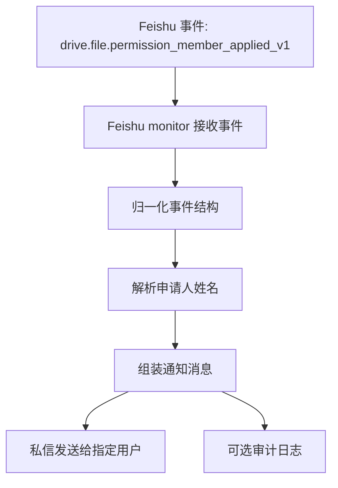

# 飞书文档权限申请转发技术设计

更新时间：2026-03-12
状态：Draft

## 1. 目标

沉淀一份技术设计，用于支持下面这类能力：

- 有人向某篇飞书文档申请权限
- OpenClaw 接收到该事件
- OpenClaw 提取申请人、文档、权限、备注等信息
- OpenClaw 把整理后的信息通过私信发给指定用户

本文档仅用于方案留档，不代表功能已实现。

## 2. 可行性结论

飞书开放平台在 SDK 事件类型中提供了直接相关的事件：

- `drive.file.permission_member_applied_v1`

从类型定义看，该事件已包含实现所需的核心字段：

- `file_type`
- `file_token`
- `permission`
- `approver_id`
- `application_user_list`
- `application_chat_list`
- `application_department_list`
- `application_remark`

结论：

- 该需求技术上可实现
- 不需要依赖 UI 抓取或系统通知文案解析
- 可以基于正式事件流来做

## 3. 当前 OpenClaw 状态

现有飞书监控入口：

- `extensions/feishu/src/monitor.ts`
- `extensions/feishu/src/monitor.account.ts`
- `extensions/feishu/src/monitor.transport.ts`

当前已经注册的飞书事件主要包括：

- IM 消息
- 已读回执
- bot 被加入/移出群
- reaction
- 卡片交互

当前还没有注册：

- `drive.file.permission_member_applied_v1`

现有可复用能力：

- 用户显示名解析：`extensions/feishu/src/bot.ts`
- 目录/用户查询辅助：`extensions/feishu/src/directory.ts`
- Feishu 发消息能力：`extensions/feishu/src/send.ts`

## 4. 目标行为

当 Feishu 发出 `drive.file.permission_member_applied_v1` 事件时：

1. OpenClaw 在 Feishu monitor 中接收到事件
2. OpenClaw 对事件做结构化归一
3. OpenClaw 尝试把申请人的 ID 解析为人名
4. OpenClaw 组织一条消息并私信给指定接收人
5. 可选写入一条审计日志

建议通知内容包含：

- 文档类型与 token
- 申请的权限等级
- 申请人姓名与 ID
- 申请备注
- 审批人 ID
- 事件时间

示例通知：

```text
飞书文档权限申请

文档：docx / EYs4dtmJboA62qxsbXociL4on7f
申请权限：edit
申请人：
- Alice (ou_xxx)
备注：需要查看并补充内容
审批人：ou_owner
```

## 5. 数据流



## 6. 接入点设计

### 6.1 事件注册

主要改动点：

- `extensions/feishu/src/monitor.account.ts`

在 `eventDispatcher.register` 中新增：

- `drive.file.permission_member_applied_v1`

建议延续现有风格，按 fire-and-forget 方式处理，避免阻塞其他事件流。

### 6.2 事件归一化

建议新增一个小型辅助模块：

- `extensions/feishu/src/permission-application.ts`

职责：

- 定义内部使用的事件结构
- 统一处理 `application_user_list`、`application_chat_list`、`application_department_list`
- 从 `open_id`、`user_id`、`union_id` 中选取稳定标识
- 产出适合发消息的中间结构

### 6.3 人名解析

建议复用现有用户查询模式：

- `extensions/feishu/src/bot.ts`
- `extensions/feishu/src/directory.ts`

建议策略：

- 优先使用 `open_id`
- 无 `open_id` 时回退 `user_id`
- 查不到名字时，不丢通知，直接保留原始 ID

### 6.4 出站通知

建议复用现有 Feishu 发送链路：

- `extensions/feishu/src/send.ts`

推荐目标格式：

- `user:open_id`

这样路由最明确，也更适合这种敏感信息通知。

## 7. 配置设计建议

建议在 Feishu channel 配置下增加一小块能力配置：

```yaml
channels:
  feishu:
    permissionApplications:
      enabled: true
      notifyUser: "user:ou_xxx"
      includeFileToken: true
      resolveApplicantNames: true
      watchedFileTokens:
        - "EYs4dtmJboA62qxsbXociL4on7f"
```

字段建议语义：

- `enabled`：总开关
- `notifyUser`：接收通知的人
- `includeFileToken`：是否在通知里包含原始 token
- `resolveApplicantNames`：是否尝试解析申请人姓名
- `watchedFileTokens`：可选文档白名单；不填则处理所有可见事件

## 8. 过滤策略

第一版建议默认行为：

- 接收所有当前应用可见的权限申请事件

可选过滤维度：

- 文档 token 白名单
- 审批人白名单
- 权限类型过滤：`view` / `edit` / `full_access`

这样可以先快速上线最小版本，后续再压噪音。

## 9. 投递策略

第一版建议：

- 一条事件发一条私信

不建议一开始就做批量 digest，因为这类事件通常不是高频洪水型事件，单条通知更清晰。

建议去重键：

- `event_id`
- 回退 `uuid`

如果后续发现有重复投递问题，可复用现有 monitor 侧的轻量 dedupe 模式。

## 10. 风险与限制

### 10.1 事件可见性

该方案默认假设应用对相关文档仍具备足够可见性。

潜在限制：

- 如果 owner 已转移，且应用对文档不再具备足够关系或权限，Feishu 后续未必还会继续投递这类事件

这意味着：

- 如果希望 owner 转移后仍能持续监控权限申请，应用最好保留协作者身份
- 理想情况下至少保留较高权限，确保仍在文档的权限链路中

### 10.2 人名解析失败

用户信息查询可能因以下原因失败：

- scope 不足
- 租户侧策略限制
- 事件里只有部分 ID

回退策略应为：

- 查不到名字也照样发通知
- 直接展示原始 ID

### 10.3 通知噪音

某些租户下可能会有大量低价值权限申请事件。

缓解方式：

- 文档白名单
- 审批人白名单
- 后续增加 digest 或 rate limit

## 11. 安全考虑

- 将权限申请事件视为敏感元数据
- 默认不要发群聊
- 优先私信给单个操作人
- 第一版可以只带文档 token，不强依赖文档标题
- 如需带标题，需确认获取标题的权限与接收人的信息边界都合理

## 12. 分阶段建议

### Phase 1

- 接入事件
- 把结构化摘要转发给固定接收人
- 标题不做强依赖
- 人名解析采用 best-effort

### Phase 2

- 增加配置项
- 支持文档白名单
- 优化通知文案和审计日志

### Phase 3

- 可选接入审批动作
- 可选卡片交互
- 可选自动化 triage

## 13. 待确认问题

- Feishu 是否会对所有目标文件类型稳定投递 `drive.file.permission_member_applied_v1`？
- owner 转移后，仅保留协作者身份是否足以持续收到事件？
- 第一版通知里是否需要带文档标题，还是 token-only 更稳？
- 后续是否要把“通知”扩展到“自动审批/自动加权限”？

## 14. 最小实现清单

- 在 `extensions/feishu/src/monitor.account.ts` 注册 `drive.file.permission_member_applied_v1`
- 新增权限申请事件归一化 helper
- 复用现有人名解析逻辑
- 通过现有 Feishu 发送链路私信给指定用户
- 增加测试：
  - payload 归一化
  - 人名解析失败回退
  - 路由到指定接收人
  - 文档白名单过滤
