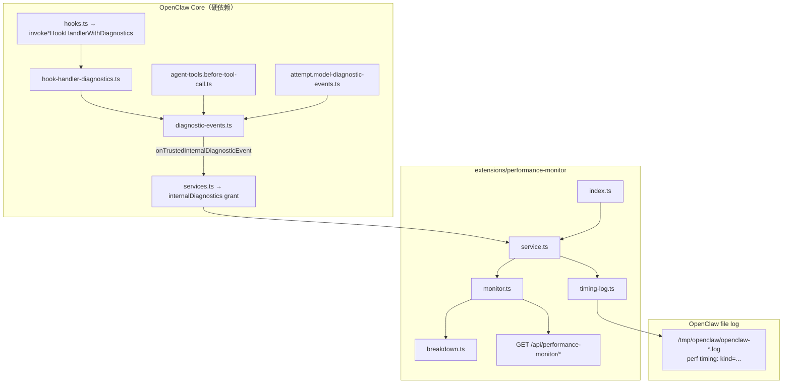

# Performance Monitor 插件设计文档

> **插件 ID**: `performance-monitor`  
> **包名**: `@openclaw/performance-monitor`  
> **最低 OpenClaw 版本**: `>=2026.4.25`（`pluginApi >= 2026.6.10`）  
> **文档版本**: 与 `openclaw_performance_monitor` 分支实现同步（含 `timing-log`、`logTimingEvents`、batch 聚合脚本）

---

## 0. 如何使用本文档（给复现者 / 大模型）

本文档是 **唯一规格来源**。复现目标 = **插件运行时 + Core 硬依赖 + 测试 + 可选运维脚本**。

**复现顺序（严格）：**

1. 读 §4 → 在 OpenClaw Core 实现/合并 hook/tool/llm 诊断埋点
2. 读 §5–§11 → 创建 `extensions/performance-monitor/` 全部源文件
3. 读 §14 → 编写并通过测试
4. 读 §15 → 集成 catalog / labeler
5. 读 §16 → Gateway 运行时验证

**禁止：**

- 插件 prod 代码 `import` Core `src/**` 或其它 extension `src/**`
- 在插件内自行 wrap hook 做近似计时（必须消费 Core `hook.handler.completed`）
- 在 `--local` agent 进程期望 HTTP 报告（service 仅 Gateway 启动）

**SDK 入口（插件只允许）：**

- `openclaw/plugin-sdk/plugin-entry` — `definePluginEntry`, `registerService`, `registerHttpRoute`
- `openclaw/plugin-sdk/diagnostic-runtime` — `DiagnosticEventPayload`, `isInternalDiagnosticEventMetadata`
- `openclaw/plugin-sdk/logging-core` — `createSubsystemLogger`（文件日志）

---

## 1. 目标与范围

### 1.1 产品目标

在 **Gateway 进程** 内，订阅 OpenClaw **trusted internal diagnostics** 事件流，按 **agent run（一轮对话 / 一次 agent turn）** 聚合：

| 维度             | 说明                                        | 数据来源                              |
| ---------------- | ------------------------------------------- | ------------------------------------- |
| **phase**        | Core pipeline 阶段                          | `diagnostic.phase.completed`          |
| **hook_handler** | 每个插件、每个 hook 点位的 **单个 handler** | `hook.handler.completed`（Core 埋点） |
| **tool**         | 每次 tool execution                         | `tool.execution.completed` / `error`  |
| **llm**          | 每次 model call                             | `model.call.completed` / `error`      |
| **harness**      | 外部 harness 运行                           | `harness.run.completed` / `error`     |
| **run**          | 整轮起止                                    | `run.started` / `run.completed`       |

**双输出：**

1. **进程内存** — 有界 ring buffer + HTTP JSON API（重启丢失）
2. **共享文件日志（可选）** — `logTimingEvents: true`（默认）时，每条终态事件写一行 `perf timing:` 到 OpenClaw 文件日志（默认 `/tmp/openclaw/openclaw-YYYY-MM-DD.log`），与 Gateway 其它日志同管道，便于 `runId` / `traceId` 关联排查

### 1.2 非目标

- 不把 monitor 内存 trace **持久化到 SQLite**（重启 Gateway 即丢失内存数据；文件日志行可保留）
- 不订阅 untrusted 外部 diagnostic 事件
- 不在 `openclaw agent --local` 独立进程工作
- 不替代 `diagnostics-prometheus` / `diagnostics-otel`
- 聚合脚本（§12）是 **运维/测试工具**，不是插件运行时必需

### 1.3 Run 定义

- **主键**: `runId`（diagnostic 事件字段；缺失时 fallback `sessionKey`，再缺 `"unknown"`）
- 用户一条消息 → agent 完成回复 ≈ **一个** `runId`
- **traceId** / **spanId**：来自 diagnostic `event.trace`，写入 `PerformanceEvent` 与文件日志 meta，用于跨 turn / 跨子系统关联（不替代 `runId`）

---

## 2. 系统架构



### 2.1 单轮事件时序（典型）

```
run.started
  → diagnostic.phase.completed × N
  → hook.handler.completed × M        （每个 plugin handler 一次）
  → model.call.completed × K
  → tool.execution.completed × T      （可能穿插在 model 之间）
  → harness.run.*                     （可选）
  → run.completed → finalizeRun()
```

### 2.2 部署约束

| 组件                        | 位置                           | 说明                                    |
| --------------------------- | ------------------------------ | --------------------------------------- |
| Diagnostic 发射             | Gateway 或 embedded agent 进程 | 同进程 `emitDiagnosticEvent`            |
| performance-monitor service | **仅 Gateway**                 | `startPluginServices()`                 |
| HTTP 路由                   | Gateway HTTP                   | `auth: gateway` + `trusted-operator`    |
| 文件 `perf timing:`         | Gateway 日志子系统             | subsystem=`plugins/performance-monitor` |
| `agent --local`             | 独立进程                       | **无** plugin service → 无 monitor      |

---

## 3. 目录结构与文件契约

```
extensions/performance-monitor/
├── DESIGN.md                              # 本文档
├── index.ts                               # 插件入口
├── api.ts                                 # 对外 barrel（SDK re-export）
├── openclaw.plugin.json                   # manifest
├── package.json                           # npm + openclaw.extensions
├── scripts/                               # 非运行时；测试/运维
│   ├── run-batch-with-monitor.mjs         # N 条 query + 导出 TSV
│   ├── aggregate-run-timing-from-logs.mjs # 从文件日志聚合
│   ├── demo-user-turn.mjs                 # 单轮演示
│   └── lib/
│       └── aggregate-run-timing.mjs       # 日志/monitor trace → TSV
└── src/
    ├── types.ts                           # JSON / 内存契约
    ├── monitor.ts                         # PerformanceMonitor 类
    ├── breakdown.ts                       # buildRunPerformanceBreakdown
    ├── service.ts                         # 订阅 + HTTP + service 生命周期
    ├── timing-log.ts                      # perf timing: 文件日志
    ├── monitor.test.ts
    ├── breakdown.test.ts
    ├── timing-log.test.ts
    ├── aggregate-run-timing.test.ts
    └── demo.simulate.test.ts
```

### 3.1 各文件职责与对外导出

| 文件            | 必须实现                                  | 关键导出                                                                                                     |
| --------------- | ----------------------------------------- | ------------------------------------------------------------------------------------------------------------ |
| `index.ts`      | `definePluginEntry` 注册 service + HTTP   | `default` plugin entry                                                                                       |
| `api.ts`        | SDK 类型 re-export，禁止 deep import core | `DiagnosticEventPayload`, `OpenClawPluginService`, …                                                         |
| `types.ts`      | 全部数据结构                              | `PerformanceEvent`, `RunPerformanceTrace`, `PerformanceMonitorConfig`, …                                     |
| `monitor.ts`    | 有界存储                                  | `PerformanceMonitor`, `createPerformanceMonitor`, `__test__`                                                 |
| `breakdown.ts`  | 纯聚合                                    | `buildRunPerformanceBreakdown`, `__test__`                                                                   |
| `service.ts`    | 映射 + HTTP + lifecycle                   | `createPerformanceMonitorService`, `__test__`                                                                |
| `timing-log.ts` | 文件日志                                  | `createPerformanceTimingLogger`, `diagnosticEventToTimingLogFields`, `logPerformanceTimingEvent`, `__test__` |

---

## 4. OpenClaw Core 硬依赖（必须先做）

插件 **无法单独** 产生 per-handler hook 计时与 tool/llm `handlerRef`。复现时对照以下文件 **逐行实现或 cherry-pick**。

### 4.1 Hook handler 计时 — `src/plugins/hook-handler-diagnostics.ts`

**导出：**

- `buildHookHandlerRef({ pluginId, hookName, handlerName?, handlerSource? })`
- `resolveHookHandlerDiagnosticIdentity(hook)`
- `invokeSyncHookHandlerWithDiagnostics({ hook, event, ctx, invoke })`
- `invokeHookHandlerWithDiagnostics({ hook, event, ctx, invoke })` — async

**行为：**

- `performance.now()` 计时，`roundMs = Math.round(x*10)/10`
- 仅 `areDiagnosticsEnabledForProcess()` 为 true 时发射
- 事件类型 **`hook.handler.completed`**

**handlerRef 规则（Core 生成，插件只消费）：**

```
base = hook:{pluginId}:{hookName}
若 handlerName 非空 → {base}@{handlerName}
否则若 handlerSource 非空 → {base}#{basename(source)}
否则 → base
```

**handlerName**：`fn.name`，跳过 `anonymous`；`bound foo` → `foo`  
**handlerSource**：注册源文件 `path.basename(source)`

**emit 字段：**

```typescript
{
  type: "hook.handler.completed";
  pluginId: string;
  hookName: string;
  handlerName?: string;
  handlerSource?: string;
  handlerRef: string;
  durationMs: number;
  outcome: "completed" | "error";
  runId?: string;
  sessionKey?: string;
  sessionId?: string;
}
```

**接入：** `src/plugins/hooks.ts` 所有 handler 执行路径调用上述 wrapper（搜索 `invokeHookHandlerWithDiagnostics`）。

**测试：** `src/plugins/hook-handler-diagnostics.test.ts`

### 4.2 Diagnostic 类型 — `src/infra/diagnostic-events.ts`

- 增加 `DiagnosticHookHandlerCompletedEvent`（含 `handlerName`, `handlerSource`, `handlerRef`）
- `tool.execution.*` 扩展：`handlerName`, `handlerRef`, `mcpServerName`, `mcpToolName`
- `model.call.*` 扩展：`providerPluginId`, `harnessId`, `handlerRef`
- `hook.handler.completed` 加入 **`ASYNC_DIAGNOSTIC_EVENT_TYPES`**（与 tool/model 一样异步 dispatch）

### 4.3 Tool 归属 — `src/agents/agent-tools.before-tool-call.ts`

- `resolveToolDiagnosticIdentity(tool)` → `toolSource`, `toolOwner`, `handlerName`, `handlerRef`, `mcp*`
- `buildToolHandlerRef()`:

| toolSource | handlerRef                       |
| ---------- | -------------------------------- |
| `core`     | `core:{toolName}`                |
| `plugin`   | `plugin:{pluginId}:{toolName}`   |
| `channel`  | `channel:{channelId}:{toolName}` |
| `mcp`      | `mcp:{serverName}:{mcpToolName}` |

- spread 进 `tool.execution.started|completed|error|blocked`

### 4.4 LLM 归属 — `src/agents/embedded-agent-runner/run/attempt.model-diagnostic-events.ts`

- `buildModelCallHandlerRef()` 优先级：`harnessId` > `providerPluginId` > `provider`
- 格式：`harness:{id}/{surface}` | `provider-plugin:{id}/{surface}` | `provider:{id}/{surface}`
- `surface = api || transport || "stream"`
- `attempt.ts` / `compact.ts` 注入 `providerPluginId`, `harnessId`

### 4.5 internalDiagnostics 授权 — `src/plugins/services.ts`

`createServiceContext()` 对 **`performance-monitor`**（与 otel/prometheus 同等门控）授予：

```typescript
internalDiagnostics: {
  emit: emitTrustedDiagnosticEventWithPrivateData,
  onEvent: onTrustedInternalDiagnosticEvent,
}
```

**条件：** `pluginId === service.id === "performance-monitor"` 且 `origin === "bundled"` 或 `trustedOfficialInstall === true`

**测试：** `src/plugins/services.test.ts`

### 4.6 Stability 日志（可选）— `src/logging/diagnostic-stability.ts`

- `hook.handler.completed` → `record.pluginId`, `record.phase`（hookName）, `record.durationMs`, `record.handler`
- tool/model → `record.handler` = handlerRef 或 handlerName

---

## 5. 插件实现规格

### 5.1 `openclaw.plugin.json`

```json
{
  "id": "performance-monitor",
  "name": "Performance Monitor",
  "description": "Tracks per-plugin hook handler, tool, and LLM call timing.",
  "activation": { "onStartup": true },
  "configSchema": {
    "type": "object",
    "additionalProperties": false,
    "properties": {
      "maxRuns": { "type": "integer", "minimum": 1, "maximum": 1000, "default": 100 },
      "maxEventsPerRun": { "type": "integer", "minimum": 10, "maximum": 10000, "default": 500 },
      "logTimingEvents": {
        "type": "boolean",
        "default": true,
        "description": "Write hook/tool/llm timing lines to the shared OpenClaw file log (/tmp/openclaw by default)."
      }
    }
  }
}
```

### 5.2 `package.json` 要点

```json
{
  "name": "@openclaw/performance-monitor",
  "type": "module",
  "devDependencies": { "@openclaw/plugin-sdk": "workspace:*" },
  "openclaw": {
    "extensions": ["./index.ts"],
    "compat": { "pluginApi": ">=2026.6.10" }
  }
}
```

### 5.3 `index.ts`

```typescript
export default definePluginEntry({
  id: "performance-monitor",
  register(api) {
    const exporter = createPerformanceMonitorService(api.pluginConfig);
    api.registerService(exporter.service); // id: "performance-monitor"
    api.registerHttpRoute({
      path: "/api/performance-monitor",
      auth: "gateway",
      match: "prefix",
      gatewayRuntimeScopeSurface: "trusted-operator",
      handler: exporter.handler,
    });
  },
});
```

### 5.4 `types.ts` — 完整契约

见源码 `extensions/performance-monitor/src/types.ts`。复现时 **逐字段复制**，包括：

- `PerformanceMonitorConfig`: `maxRuns`, `maxEventsPerRun`, `logTimingEvents`
- `PerformanceEvent`: `kind`, `at`, `durationMs`, `extensionId`, `hookName`, `handlerName`, `handlerSource`, `handlerRef`, `toolName`, `toolSource`, `mcp*`, `provider`, `model`, `providerPluginId`, `harnessId`, `api`, `transport`, `phaseName`, `callId`, `toolCallId`, `traceId`, `spanId`, `metadata`
- `RunPerformanceSummary`, `RunPerformanceBreakdown`, `RunPerformanceTrace`, `PerformanceMonitorReport`

### 5.5 `monitor.ts` — 内存模型

**类 `PerformanceMonitor`：**

- 内部 `#runs: Map<string, StoredRunTrace>`, `#runOrder: string[]`（FIFO）
- `recordEvent(params)`:
  - `runId = resolveRunId(params.runId, params.sessionKey)`
  - 若 `events.length >= maxEventsPerRun` → **静默丢弃**
  - 构造 `PerformanceEvent`，`durationMs` 经 `roundMs`
  - `bumpSummary` 仅对 hook/phase/tool/llm 累计
- `finalizeRun({ runId, durationMs, outcome })` — 在 `run.completed` 后调用，然后 `#trimRuns()`
- `getRunTrace(runId)` — clone + `attachBreakdown`
- `getReport()` — 所有 run 的 summary + breakdown（**无 events**）
- `reset()` — service stop 时清空

**默认配置：** `maxRuns=100`, `maxEventsPerRun=500`（`logTimingEvents` 在 service 层 parse）

### 5.6 `breakdown.ts` — 聚合算法

`buildRunPerformanceBreakdown(trace)` 纯函数：

1. 遍历 `trace.events`，按 `kind` 分流到 `phases` / `hookHandlers` / `tools` / `llmCalls` / `byExtension` Map
2. **Key 规则：**
   - phase: `phaseName || "phase"`
   - hook: `handlerRef` 或 `hook:{pluginId}:{hookName}`
   - tool: `handlerRef` 或 `tool:{extensionId}:{toolName}`
   - llm: `handlerRef` 或 `llm:{provider}/{model}`
   - byExtension: `{extensionId}:{kind}`，仅 `durationMs>0` 且 kind ∈ `{hook_handler,tool,llm,harness}`
3. **Label 规则：** hook 优先 `{pluginId} → {hookName} → {handlerName}`
4. `categoryTotals.measuredMs = phase + hook + tool + llm + harness`
5. `unaccountedMs = max(0, totalDurationMs - measuredMs)`（当 `run.completed` 提供了 `totalDurationMs`）
6. 各数组 `sortedEntries`：`totalMs` 降序，tie → `label` 字典序

### 5.7 `service.ts` — 事件映射与 HTTP

#### 信任过滤

```typescript
function shouldRecordDiagnosticEvent(metadata): boolean {
  return metadata.trusted || isInternalDiagnosticEventMetadata(metadata);
}
```

#### `parsePluginConfig`

- `maxRuns`: clamp `[1, 1000]`，默认 100
- `maxEventsPerRun`: clamp `[10, 10000]`，默认 500
- `logTimingEvents`: 默认 **true**（仅显式 `false` 关闭）

#### Diagnostic → PerformanceEvent 完整映射表

| Diagnostic `type`            | `kind`         | 字段映射要点                                                                                                                                                                     |
| ---------------------------- | -------------- | -------------------------------------------------------------------------------------------------------------------------------------------------------------------------------- |
| `hook.handler.completed`     | `hook_handler` | `extensionId←pluginId`, `hookName`, `handlerName`, `handlerSource`, `handlerRef`（fallback `hook:{pluginId}:{hookName}`）, `durationMs`, `outcome`, `traceId/spanId←event.trace` |
| `diagnostic.phase.completed` | `phase`        | `phaseName←name`, `at←endedAt??startedAt`, `metadata←details`                                                                                                                    |
| `tool.execution.completed`   | `tool`         | `extensionId←toolOwner??toolSource`, `toolName`, `handlerRef`, `toolCallId`, `outcome=completed`                                                                                 |
| `tool.execution.error`       | `tool`         | 同上 + `outcome=error`, `metadata.errorCategory`                                                                                                                                 |
| `model.call.completed`       | `llm`          | `extensionId←providerPluginId??harnessId??provider`, `handlerRef`, `callId`, `metadata.timeToFirstByteMs?`                                                                       |
| `model.call.error`           | `llm`          | 同上 + `outcome=error`                                                                                                                                                           |
| `run.started`                | `run`          | 无 duration                                                                                                                                                                      |
| `run.completed`              | `run`          | `durationMs`, `outcome` + **`finalizeRun()`**                                                                                                                                    |
| `harness.run.completed`      | `harness`      | `extensionId←pluginId??harnessId`, `metadata.harnessId`                                                                                                                          |
| `harness.run.error`          | `harness`      | 同上 + error metadata                                                                                                                                                            |
| 其它                         | —              | 忽略                                                                                                                                                                             |

**未订阅：** `tool.execution.started`, `model.call.started`（仅终态）

**每条映射后：** 若 `diagnosticEventToTimingLogFields(event)` 非空且 `logTimingEvents` → `logPerformanceTimingEvent(timingLogger, fields)`

#### HTTP 路由

| 路径                                   | 方法     | 响应                                   |
| -------------------------------------- | -------- | -------------------------------------- |
| `/api/performance-monitor/report`      | GET/HEAD | `PerformanceMonitorReport`             |
| `/api/performance-monitor/runs/:runId` | GET/HEAD | `RunPerformanceTrace`（含 `events[]`） |
| 其它                                   | —        | 404 `{ error: "not_found" }`           |
| 非 GET/HEAD                            | —        | 405                                    |

`:runId` 需 URL 编码。响应头：`Cache-Control: no-store`, `Content-Type: application/json; charset=utf-8`

#### Service 生命周期

- `start(ctx)`: 订阅 `ctx.internalDiagnostics.onEvent`；缺失则 `logger.warn("internal diagnostics unavailable...")`
- `stop()`: unsubscribe + `monitor.reset()`

### 5.8 `timing-log.ts` — 文件日志

**子系统 logger：**

```typescript
createSubsystemLogger("plugins/performance-monitor");
```

**消息格式（单行）：**

```
perf timing: kind=tool toolName=exec handlerRef=core:exec durationMs=2482 outcome=completed runId=... traceId=... sessionKey=...
```

- 前缀常量：`PERF_TIMING_PREFIX = "perf timing:"`
- KV 顺序见 `buildPerformanceTimingLogMessage`
- **Meta 对象**（结构化日志字段）：`perfTiming: true`, `runId`, `traceId`, `spanId`, `trace: { traceId, spanId?, parentSpanId? }`, …

**`diagnosticEventToTimingLogFields`：** 与 `service.ts` 映射表同构，将 diagnostic payload 转为 `PerformanceTimingLogFields`；不支持的 type 返回 `undefined`

**默认日志路径：** 与 Gateway 相同 — 通常 `/tmp/openclaw/openclaw-YYYY-MM-DD.log`（或 `logging.file` 配置）

---

## 6. 用户配置

```json
{
  "diagnostics": { "enabled": true },
  "plugins": {
    "entries": {
      "performance-monitor": {
        "enabled": true,
        "config": {
          "maxRuns": 100,
          "maxEventsPerRun": 500,
          "logTimingEvents": true
        }
      }
    }
  }
}
```

| 项                    | 默认 | 说明                                       |
| --------------------- | ---- | ------------------------------------------ |
| `diagnostics.enabled` | true | false → Core 不发射 hook/tool/model 计时   |
| 插件 `enabled`        | —    | 必须 true                                  |
| `logTimingEvents`     | true | false → 仅内存 + HTTP，不写 `perf timing:` |
| `maxRuns`             | 100  | FIFO 淘汰最旧 run                          |
| `maxEventsPerRun`     | 500  | 超出后静默丢弃新事件                       |

### 6.1 正常运行时何时有数据

| 场景                             | hook                        | tool               | llm             | 文件日志                |
| -------------------------------- | --------------------------- | ------------------ | --------------- | ----------------------- |
| Gateway + 插件启用 + diagnostics | 有 plugin lifecycle hook 时 | agent 调用 tool 时 | 每次 model call | `perf timing:` 实时追加 |
| 纯问答、无 tool                  | 取决于已启用插件            | 0                  | 有              | llm/run 行              |
| `plugins.slots.memory: "none"`   | 通常 **0**                  | —                  | 有              | 无 hook 行              |
| `agent --local`                  | ✗                           | ✗                  | ✗               | ✗                       |
| 全局 npm Gateway 未装本插件      | ✗                           | ✗                  | ✗               | ✗                       |

---

## 7. 安全模型

| 风险                         | 缓解                                                          |
| ---------------------------- | ------------------------------------------------------------- |
| 伪造 diagnostic              | 仅 `metadata.trusted \|\| internal`                           |
| 非官方插件读 internal stream | `services.ts` pluginId===service.id + bundled/trustedOfficial |
| HTTP 泄露                    | Gateway Bearer token + trusted-operator surface               |
| 内存耗尽                     | maxRuns + maxEventsPerRun 硬上限                              |

---

## 8. 运维脚本（非运行时，复现可选）

### 8.1 `scripts/run-batch-with-monitor.mjs`

- 克隆用户 config → 隔离 state（`.tmp/perf-batch-monitor/state`）
- 强制 `diagnostics.enabled: true`，启用 performance-monitor
- **`node openclaw.mjs`** 启动 gateway + agent（避免 `run-node.mjs` dirty-tree 重建竞态）
- 默认 10 条 query（含 exec/read tool 用例）
- 输出：`per-run-stage-summary.tsv`, `stage-average.tsv`, `breakdown.tsv`, `events.tsv`, `monitor-traces.json`

### 8.2 `scripts/lib/aggregate-run-timing.mjs`

- 解析 OpenClaw 文件日志中的 `perf timing:` 行
- 合并 monitor trace JSON
- 导出 TSV：`formatPerRunStageSummaryTsv`, `formatStageAverageTsv`, `formatBreakdownTsv`, `formatEventsTsv`

### 8.3 `scripts/aggregate-run-timing-from-logs.mjs`

CLI 包装：从 `/tmp/openclaw` 日志聚合

---

## 9. 测试规范

```bash
pnpm test extensions/performance-monitor
pnpm test src/plugins/hook-handler-diagnostics.test.ts
pnpm test src/plugins/services.test.ts -t "grants internal diagnostics"
```

| 文件                                  | 覆盖                                            |
| ------------------------------------- | ----------------------------------------------- |
| `monitor.test.ts`                     | recordEvent, summary, maxRuns 淘汰, roundMs     |
| `breakdown.test.ts`                   | 四类聚合, 排序, unaccountedMs                   |
| `service.test.ts`                     | 完整 diagnostic 链, trust 过滤, logTimingEvents |
| `timing-log.test.ts`                  | 消息格式, diagnostic→fields, meta.trace         |
| `aggregate-run-timing.test.ts`        | perf timing 日志解析, TSV formatter             |
| `demo.simulate.test.ts`               | 多插件 hook + tool + llm 场景                   |
| Core hook-handler-diagnostics.test.ts | emit 字段, error 路径, diagnostics off          |
| Core services.test.ts                 | internalDiagnostics grant                       |

---

## 10. 从零复现检查清单

### Phase A — Core

- [ ] `hook-handler-diagnostics.ts` + hooks.ts 全路径接入
- [ ] `diagnostic-events.ts` 类型 + async 队列
- [ ] tool `handlerRef` + model `handlerRef`
- [ ] `services.ts` performance-monitor internalDiagnostics
- [ ] Core 测试绿

### Phase B — 插件包

- [ ] `types.ts`, `monitor.ts`, `breakdown.ts`, `service.ts`, `timing-log.ts`
- [ ] `index.ts`, `api.ts`, manifest, package.json
- [ ] 插件测试绿

### Phase C — 仓库集成

- [ ] `scripts/lib/official-external-plugin-catalog.json`
- [ ] `.github/labeler.yml`

### Phase D — 运行时

- [ ] Gateway 启用插件 + diagnostics
- [ ] `curl .../api/performance-monitor/report` 非空
- [ ] `grep 'perf timing:' /tmp/openclaw/openclaw-*.log` 有输出

### Phase E — Hook 路径验证（可选）

- [ ] batch config 启用 memory 类插件（非 `memory: none`）
- [ ] breakdown.hookHandlers 非空

---

## 11. HTTP 示例

`GET /api/performance-monitor/runs/{runId}` 节选：

```json
{
  "runId": "d0cb098a-e07a-4cad-819c-640454a40861",
  "sessionKey": "agent:main:demo",
  "summary": {
    "hookHandlerCount": 0,
    "totalHookHandlerMs": 0,
    "toolCallCount": 2,
    "totalToolMs": 4964,
    "llmCallCount": 4,
    "totalLlmMs": 9528
  },
  "breakdown": {
    "tools": [
      {
        "key": "core:exec",
        "label": "core → exec",
        "count": 2,
        "totalMs": 4964,
        "avgMs": 2482,
        "maxMs": 2482
      }
    ],
    "llmCalls": [
      {
        "key": "harness:openclaw/openai-completions",
        "label": "harness:openclaw/openai-completions",
        "count": 4,
        "totalMs": 9528,
        "avgMs": 2382,
        "maxMs": 2612
      }
    ],
    "categoryTotals": {
      "toolMs": 4964,
      "llmMs": 9528,
      "harnessMs": 0,
      "measuredMs": 14492,
      "totalDurationMs": 7988,
      "unaccountedMs": 0
    }
  },
  "events": []
}
```

文件日志行示例：

```
perf timing: kind=tool toolName=exec handlerRef=core:exec durationMs=2482 outcome=completed runId=d0cb098a-... traceId=abc123... sessionKey=agent:main:demo
```

---

## 12. 与 sibling 对比

| 能力                | diagnostics-prometheus | performance-monitor      |
| ------------------- | ---------------------- | ------------------------ |
| internalDiagnostics | ✓                      | ✓                        |
| 输出                | Prometheus text        | JSON HTTP + 可选文件日志 |
| 粒度                | metrics                | 每 run 事件 + breakdown  |
| Per-hook handler    | ✗                      | ✓                        |
| 持久化              | 进程内                 | 内存；文件日志行可保留   |

---

## 13. 参考源码索引

| 主题            | 路径                                                                      |
| --------------- | ------------------------------------------------------------------------- |
| 插件入口        | `extensions/performance-monitor/index.ts`                                 |
| 事件映射        | `extensions/performance-monitor/src/service.ts`                           |
| 文件日志        | `extensions/performance-monitor/src/timing-log.ts`                        |
| HTTP 契约       | `extensions/performance-monitor/src/types.ts`                             |
| Hook 计时       | `src/plugins/hook-handler-diagnostics.ts`                                 |
| Diagnostic 类型 | `src/infra/diagnostic-events.ts`                                          |
| Tool 归属       | `src/agents/agent-tools.before-tool-call.ts`                              |
| LLM 归属        | `src/agents/embedded-agent-runner/run/attempt.model-diagnostic-events.ts` |
| Service 授权    | `src/plugins/services.ts`                                                 |
| SDK barrel      | `src/plugin-sdk/diagnostic-runtime.ts`                                    |

---

_文档与 `extensions/performance-monitor/` 源码一致；Core 依赖以 `src/` 当前实现为准。_
