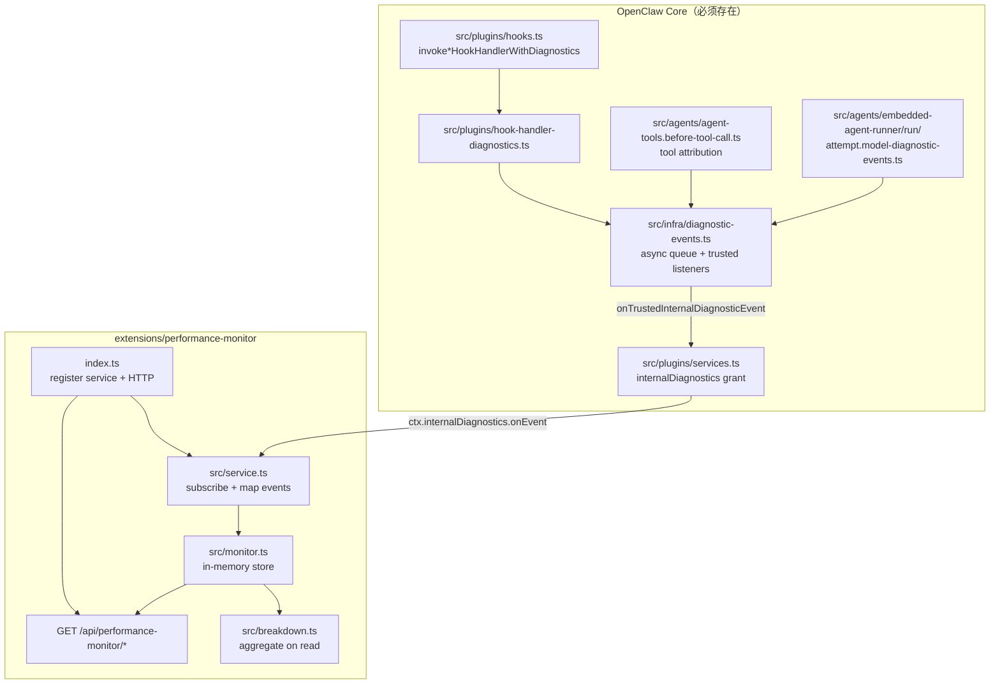

# Performance Monitor 插件设计文档

> **插件 ID**: `performance-monitor`  
> **包名**: `@openclaw/performance-monitor`  
> **最低 OpenClaw 版本**: `>=2026.4.25`（`pluginApi >= 2026.6.10`）  
> **文档目的**: 仅依赖本文档 + OpenClaw 源码，即可完整复现插件功能与 HTTP 接口协议。

---

## 1. 目标与范围

### 1.1 产品目标

在 **Gateway 进程** 内，订阅 OpenClaw **trusted internal diagnostics** 事件流，按 **agent run（一轮对话 / 一次 agent turn）** 聚合以下耗时数据：

| 维度                 | 说明                                                     |
| -------------------- | -------------------------------------------------------- |
| **环节（phase）**    | Core pipeline 阶段，来自 `diagnostic.phase.completed`    |
| **插件 Hook**        | 每个插件、每个 hook 点位的 **单个 handler** 耗时         |
| **工具调用（tool）** | 每次 tool execution 耗时，含 extension / handlerRef 归属 |
| **模型调用（LLM）**  | 每次 model call 耗时，含 provider plugin / harness 归属  |
| **Harness**          | 外部 harness 运行耗时（可选）                            |
| **Run 汇总**         | 整轮 wall-clock 与分类汇总、breakdown 分析               |

数据存储在 **进程内存** 的有界 ring 结构中，通过 **HTTP JSON API** 暴露给 trusted operator（Gateway Bearer Token）。

### 1.2 非目标

- 不持久化到 SQLite / 文件（重启 Gateway 即丢失）。
- 不订阅 untrusted 外部 diagnostic 事件（防伪造）。
- 不在 `--local` 独立 agent 进程内工作（plugin service 仅 Gateway 启动）。
- 不替代 `diagnostics-prometheus` / `diagnostics-otel` 的全局 metrics 导出。
- 不自行注册 hook 观察者做近似计时（per-handler 计时由 **Core 埋点** 提供）。

### 1.3 一轮对话的定义

- **主键**: `runId`（来自 `run.started` / `run.completed` 及各 diagnostic 事件的 `runId` 字段）。
- 若事件缺少 `runId` 但有 `sessionKey`，fallback 为 `sessionKey`；再缺则为 `"unknown"`。
- 用户发送一条消息 → Agent 完成回复，通常对应 **一个** `runId`。

---

## 2. 系统架构

### 2.1 总体架构



### 2.2 数据流（单轮 run）

```
run.started
  → diagnostic.phase.completed (若干)
  → hook.handler.completed (每个插件 handler 一次)
  → model.call.completed / error (每轮 LLM 一次或多次)
  → tool.execution.completed / error (每次 tool 一次)
  → harness.run.* (可选)
  → run.completed → finalizeRun(totalDurationMs)
```

Gateway HTTP 读取时：

```
StoredRunTrace (events + summary)
  → buildRunPerformanceBreakdown()
  → RunPerformanceTrace (含 breakdown)
```

### 2.3 进程与部署约束

| 组件                          | 运行位置                           | 说明                                                |
| ----------------------------- | ---------------------------------- | --------------------------------------------------- |
| Core diagnostic 发射          | Gateway **或** embedded agent 进程 | 同进程 `emitDiagnosticEvent`                        |
| `performance-monitor` service | **仅 Gateway**                     | `startPluginServices()` 在 `src/gateway/server*.ts` |
| HTTP 路由                     | Gateway HTTP server                | `auth: gateway` + `trusted-operator` surface        |
| Agent `--local`               | 独立进程                           | **不会** 启动 plugin service；报告为空              |

**复现要求**: 必须通过 Gateway 跑 agent turn，且 Gateway 启用本插件。

---

## 3. 目录结构

```
extensions/performance-monitor/
├── DESIGN.md                          # 本文档
├── index.ts                           # 插件入口：registerService + registerHttpRoute
├── api.ts                             # 对外 barrel：SDK 类型 re-export
├── openclaw.plugin.json               # manifest：id、configSchema、activation
├── package.json                       # npm 包 + openclaw.extensions 声明
├── scripts/
│   └── demo-user-turn.mjs             # 可选：live / simulate 演示脚本（非运行时必需）
└── src/
    ├── types.ts                       # 全部 JSON 契约类型
    ├── monitor.ts                     # PerformanceMonitor 内存存储
    ├── breakdown.ts                   # 按 run 聚合 breakdown
    ├── service.ts                     # diagnostic 订阅 + HTTP handler + service 生命周期
    ├── monitor.test.ts                # monitor + service 单测
    ├── breakdown.test.ts              # breakdown 单测
    └── demo.simulate.test.ts          # 端到端模拟场景单测（可选）

# OpenClaw 仓库级集成（发布/CI，非运行时逻辑）
.github/labeler.yml                    # label: extensions: performance-monitor
scripts/lib/official-external-plugin-catalog.json  # 官方插件目录条目
```

### 3.1 模块职责

| 文件           | 职责                                                                                                                                              |
| -------------- | ------------------------------------------------------------------------------------------------------------------------------------------------- |
| `index.ts`     | `definePluginEntry`；创建 `createPerformanceMonitorService()`；注册 service id=`performance-monitor`；注册 HTTP prefix `/api/performance-monitor` |
| `api.ts`       | 从 `openclaw/plugin-sdk` re-export `DiagnosticEventPayload`、`OpenClawPluginService` 等，避免插件 prod 代码 import core `src/**`                  |
| `types.ts`     | `PerformanceEvent`、`RunPerformanceTrace`、`PerformanceMonitorReport` 等 **HTTP 响应契约**                                                        |
| `monitor.ts`   | 有界存储、`recordEvent`、`finalizeRun`、`getRunTrace`、`getReport`；读取时 attach `breakdown`                                                     |
| `breakdown.ts` | 纯函数 `buildRunPerformanceBreakdown(trace)`                                                                                                      |
| `service.ts`   | `recordDiagnosticEvent` 映射表；`shouldRecordDiagnosticEvent`；HTTP 路由分发                                                                      |

---

## 4. OpenClaw Core 依赖（复现必读）

插件 **单独无法** 产生 per-plugin hook 计时；以下 Core 改动是 **硬依赖**。复现时需对照源码实现或 cherry-pick。

### 4.1 Hook handler 计时

**文件**: `src/plugins/hook-handler-diagnostics.ts`

- `invokeSyncHookHandlerWithDiagnostics()` — 同步 hook（`tool_result_persist`、`before_message_write`）
- `invokeHookHandlerWithDiagnostics()` — 异步 hook（void / modifying / claiming / reply_payload 等）
- 使用 `performance.now()` 计时，精度四舍五入到 0.1ms
- 仅当 `areDiagnosticsEnabledForProcess()` 为 true 时发射
- 发射事件类型: `**hook.handler.completed`\*\*

**接入点**: `src/plugins/hooks.ts` — 所有 hook handler 执行路径替换为上述 wrapper（搜索 `invokeHookHandlerWithDiagnostics` / `invokeSyncHookHandlerWithDiagnostics`）。

**单测**: `src/plugins/hook-handler-diagnostics.test.ts`

### 4.2 Diagnostic 事件类型扩展

**文件**: `src/infra/diagnostic-events.ts`

新增 / 扩展类型：

```typescript
// hook.handler.completed
export type DiagnosticHookHandlerCompletedEvent = DiagnosticBaseEvent & {
  type: "hook.handler.completed";
  hookName: string;
  pluginId: string;
  durationMs: number;
  outcome: "completed" | "error";
  runId?: string;
  sessionKey?: string;
  sessionId?: string;
};

// tool.execution.* 基类扩展字段
handlerName?: string;
handlerRef?: string;
mcpServerName?: string;
mcpToolName?: string;

// model.call.* 基类扩展字段
providerPluginId?: string;
harnessId?: string;
handlerRef?: string;
```

**Async 队列**: `hook.handler.completed` 必须加入 `ASYNC_DIAGNOSTIC_EVENT_TYPES`（与 tool/model 事件一样异步 dispatch 到 trusted listeners）。

### 4.3 Tool 归属与 handlerRef

**文件**: `src/agents/agent-tools.before-tool-call.ts`

- `resolveToolDiagnosticIdentity(tool)` 返回 `toolSource`、`toolOwner`、`handlerName`、`handlerRef`、`mcp`\*
- `buildToolHandlerRef()` 规则见 [§6.3](#63-handlerref-规范)
- spread 进 `tool.execution.started|completed|error|blocked` 的 `eventBase`

### 4.4 LLM 归属与 handlerRef

**文件**: `src/agents/embedded-agent-runner/run/attempt.model-diagnostic-events.ts`

- `ModelCallDiagnosticContext` 增加 `providerPluginId?`、`harnessId?`
- `buildModelCallHandlerRef()` + `baseModelCallEvent()` 写入 `handlerRef`

**调用方注入 context**:

- `src/agents/embedded-agent-runner/run/attempt.ts` — `getProviderRuntimeHandle().plugin` → `providerPluginId`；`params.runtimePlan?.observability.harnessId`
- `src/agents/embedded-agent-runner/compact.ts` — compaction 路径同理

### 4.5 internalDiagnostics 授权

**文件**: `src/plugins/services.ts`

`createServiceContext()` 中，除 `diagnostics-otel` / `diagnostics-prometheus` 外，**bundled 或 trustedOfficialInstall** 的 `performance-monitor` service 必须获得：

```typescript
internalDiagnostics: {
  emit: emitTrustedDiagnosticEventWithPrivateData,
  onEvent: onTrustedInternalDiagnosticEvent,
}
```

**条件**:

- `pluginId === service.id === "performance-monitor"`
- `origin === "bundled"` **或** `trustedOfficialInstall === true`

**单测**: `src/plugins/services.test.ts` — `"grants internal diagnostics only to trusted diagnostics exporter services"` 含 performance-monitor bundled 用例。

### 4.6 Stability 日志映射（可选但已实现）

**文件**: `src/logging/diagnostic-stability.ts`

- `hook.handler.completed` → `record.pluginId`、`record.phase`（hookName）、`record.durationMs`
- tool/model 事件 → `record.handler`（handlerRef 或 handlerName）
- 类型 `DiagnosticStabilityEventRecord` 含 `handler?: string`

---

## 5. 插件注册与配置

### 5.1 Manifest — `openclaw.plugin.json`

```json
{
  "id": "performance-monitor",
  "name": "Performance Monitor",
  "description": "Tracks per-plugin hook handler, tool, and LLM call timing.",
  "activation": { "onStartup": true },
  "configSchema": {
    "type": "object",
    "additionalProperties": false,
    "properties": {
      "maxRuns": {
        "type": "integer",
        "minimum": 1,
        "maximum": 1000,
        "default": 100
      },
      "maxEventsPerRun": {
        "type": "integer",
        "minimum": 10,
        "maximum": 10000,
        "default": 500
      }
    }
  }
}
```

### 5.2 用户配置 — `openclaw.json`

```json
{
  "diagnostics": { "enabled": true },
  "plugins": {
    "entries": {
      "performance-monitor": { "enabled": true }
    }
  }
}
```

| 配置项                                        | 默认              | 说明                                             |
| --------------------------------------------- | ----------------- | ------------------------------------------------ |
| `diagnostics.enabled`                         | Gateway 默认 true | 为 false 时 Core 不发射 hook/tool/model 计时事件 |
| `plugins.entries.performance-monitor.enabled` | —                 | 必须 true                                        |
| `maxRuns`                                     | 100               | 内存中保留的最大 run 数（FIFO 淘汰最旧）         |
| `maxEventsPerRun`                             | 500               | 单 run 最大事件数，超出后 **静默丢弃** 新事件    |

### 5.3 入口 — `index.ts` 契约

```typescript
export default definePluginEntry({
  id: "performance-monitor",
  name: "Performance Monitor",
  description: "...",
  register(api) {
    const exporter = createPerformanceMonitorService(api.pluginConfig);
    api.registerService(exporter.service); // id: "performance-monitor"
    api.registerHttpRoute({
      path: "/api/performance-monitor",
      auth: "gateway",
      match: "prefix",
      gatewayRuntimeScopeSurface: "trusted-operator",
      handler: exporter.handler,
    });
  },
});
```

---

## 6. 输入协议：Diagnostic 事件 → PerformanceEvent 映射

### 6.1 信任过滤

```typescript
function shouldRecordDiagnosticEvent(metadata: DiagnosticEventMetadata): boolean {
  return metadata.trusted || isInternalDiagnosticEventMetadata(metadata);
}
```

- 仅处理 **trusted** 或 **internal** 来源事件。
- 映射实现: `service.ts` → `recordDiagnosticEvent()`。

### 6.2 完整映射表

| Diagnostic `type`            | `PerformanceEvent.kind` | 关键字段映射                                                                                                             |
| ---------------------------- | ----------------------- | ------------------------------------------------------------------------------------------------------------------------ |
| `hook.handler.completed`     | `hook_handler`          | `extensionId←pluginId`, `hookName`, `handlerRef←hook:${pluginId}:${hookName}`, `durationMs`, `outcome`                   |
| `diagnostic.phase.completed` | `phase`                 | `phaseName←name`, `durationMs`, `at←endedAt??startedAt`, `metadata←details`                                              |
| `tool.execution.completed`   | `tool`                  | `extensionId←toolOwner??toolSource`, `toolName`, `handlerName`, `handlerRef`, `toolSource`, `mcp`\*, `outcome=completed` |
| `tool.execution.error`       | `tool`                  | 同上 + `outcome=error`, `metadata.errorCategory`                                                                         |
| `model.call.completed`       | `llm`                   | `extensionId←providerPluginId??harnessId??provider`, `provider`, `model`, `handlerRef`, `api`, `transport`, `callId`     |
| `model.call.error`           | `llm`                   | 同上 + `outcome=error`                                                                                                   |
| `run.started`                | `run`                   | 无 duration                                                                                                              |
| `run.completed`              | `run`                   | `durationMs`, `outcome` + **调用** `finalizeRun()`                                                                       |
| `harness.run.completed`      | `harness`               | `extensionId←pluginId??harnessId`, `metadata.harnessId`                                                                  |
| `harness.run.error`          | `harness`               | 同上 + `metadata.phase`, `errorCategory`                                                                                 |
| _其他_                       | —                       | **忽略**                                                                                                                 |

**未订阅**: `tool.execution.started`、`model.call.started`（仅终态计时）。

### 6.3 handlerRef 规范

Core 侧生成规则（插件 **只消费**，不重新推导 hook/model；tool/llm 以 Core 字段为准）：

**Tool** (`buildToolHandlerRef`):

| toolSource | 格式                             | 示例                              |
| ---------- | -------------------------------- | --------------------------------- |
| `core`     | `core:{toolName}`                | `core:read`                       |
| `plugin`   | `plugin:{pluginId}:{toolName}`   | `plugin:browser:browser_navigate` |
| `channel`  | `channel:{channelId}:{toolName}` | `channel:telegram:send`           |
| `mcp`      | `mcp:{serverName}:{mcpToolName}` | `mcp:my-server:search`            |

**LLM** (`buildModelCallHandlerRef`):

优先级: `harnessId` > `providerPluginId` > `provider`

| 条件                | 格式                             | 示例                                        |
| ------------------- | -------------------------------- | ------------------------------------------- |
| 有 harnessId        | `harness:{harnessId}/{surface}`  | `harness:codex/responses`                   |
| 有 providerPluginId | `provider-plugin:{id}/{surface}` | `provider-plugin:openai/openai-completions` |
| 否则                | `provider:{provider}/{surface}`  | `provider:openai/stream`                    |

其中 `surface = api || transport || "stream"`。

**Hook**（插件侧生成）: `hook:{pluginId}:{hookName}`

---

## 7. 输出协议：HTTP API

**Base path**: `/api/performance-monitor`  
**Auth**: Gateway Bearer Token（`gateway.auth.token`）  
**Methods**: `GET`、`HEAD`  
**Cache**: `Cache-Control: no-store`  
**Content-Type**: `application/json; charset=utf-8`

### 7.1 `GET /api/performance-monitor/report`

**200 响应** — `PerformanceMonitorReport`:

```typescript
{
  generatedAt: number; // Unix ms
  runCount: number;
  runs: Array<{
    runId: string;
    sessionKey?: string;
    startedAt: number;
    updatedAt: number;
    totalDurationMs?: number;
    outcome?: string;
    summary: RunPerformanceSummary;
    breakdown: RunPerformanceBreakdown;
  }>;
}
```

`runs` 顺序: **FIFO 插入顺序**（最旧在前）。每项含 summary + breakdown，**不含** events 明细。

### 7.2 `GET /api/performance-monitor/runs/:runId`

**200** — 完整 `RunPerformanceTrace`（含 `events[]` + `summary` + `breakdown`）。

**404**:

```json
{ "error": "run_not_found", "runId": "<decoded-runId>" }
```

`:runId` 需 URL 编码（支持 UUID 等）。

### 7.3 其他响应

| 条件        | Status | Body                                      |
| ----------- | ------ | ----------------------------------------- |
| 未知路径    | 404    | `{ "error": "not_found" }`                |
| 非 GET/HEAD | 405    | `Method Not Allowed` + `Allow: GET, HEAD` |

### 7.4 JSON 类型定义（完整）

见 `src/types.ts`。核心结构：

`**PerformanceEvent**`:

```typescript
{
  kind: "hook_handler" | "phase" | "tool" | "llm" | "run" | "harness";
  at: number;
  durationMs?: number;
  outcome?: string;
  extensionId?: string;
  hookName?: string;
  toolName?: string;
  handlerName?: string;
  handlerRef?: string;
  toolSource?: string;
  mcpServerName?: string;
  mcpToolName?: string;
  provider?: string;
  model?: string;
  providerPluginId?: string;
  harnessId?: string;
  api?: string;
  transport?: string;
  phaseName?: string;
  callId?: string;
  toolCallId?: string;
  metadata?: Record<string, string | number | boolean>;
}
```

`**RunPerformanceSummary**` — 累计计数与总毫秒（仅含 hook/phase/tool/llm 四类）:

```typescript
{
  hookHandlerCount: number;
  totalHookHandlerMs: number;
  phaseCount: number;
  totalPhaseMs: number;
  toolCallCount: number;
  totalToolMs: number;
  llmCallCount: number;
  totalLlmMs: number;
}
```

`**PerformanceBreakdownEntry**`:

```typescript
{
  key: string;
  label: string;
  count: number;
  totalMs: number;
  avgMs: number;
  maxMs: number;
  errorCount?: number;
}
```

`**RunPerformanceBreakdown**`:

```typescript
{
  phases: PerformanceBreakdownEntry[];
  hookHandlers: PerformanceBreakdownEntry[];
  tools: PerformanceBreakdownEntry[];
  llmCalls: PerformanceBreakdownEntry[];
  byExtension: PerformanceBreakdownEntry[];  // key: "{extensionId}:{kind}"
  categoryTotals: {
    phaseMs: number;
    hookHandlerMs: number;
    toolMs: number;
    llmMs: number;
    harnessMs: number;
    measuredMs: number;           // 上述五类之和
    totalDurationMs?: number;     // 来自 run.completed
    unaccountedMs?: number;       // totalDurationMs - measuredMs，≥0
  };
}
```

**Breakdown 排序**: 各数组按 `totalMs` **降序**；tie-break 按 `label` 字典序。

`**byExtension` 规则\*\*: 仅统计 `durationMs > 0` 且 `kind ∈ {hook_handler, tool, llm, harness}` 的事件；key=`${extensionId}:${kind}`。

---

## 8. 内存模型与边界行为

### 8.1 Run 生命周期

1. 首个带 `runId`（或 fallback）的事件 → 创建 `StoredRunTrace`，`startedAt = event.at`
2. 持续 `recordEvent` → 追加 `events`，更新 `summary`，`updatedAt = event.at`
3. `run.completed` → `finalizeRun({ runId, durationMs, outcome })` 写入 `totalDurationMs`
4. `finalizeRun` 后可能触发 `#trimRuns()`

### 8.2 有界策略

- `**maxRuns`\*\*: `#runOrder` FIFO；超出则 `shift()` 并 `delete` 最旧 run
- `**maxEventsPerRun**`: 达到上限后 **丢弃** 后续事件（不报错、不 partial flag）

### 8.3 数值精度

- 所有 `durationMs` 存储前 `roundMs(x) = Math.round(x * 10) / 10`（0.1ms 精度）

### 8.4 Service 生命周期

| 阶段         | 行为                                                                          |
| ------------ | ----------------------------------------------------------------------------- |
| `start(ctx)` | 订阅 `ctx.internalDiagnostics.onEvent`；无 subscription 则 `logger.warn(...)` |
| `stop()`     | unsubscribe + `monitor.reset()` 清空全部数据                                  |

---

## 9. 安全模型

| 风险                                                  | 缓解                                                                              |
| ----------------------------------------------------- | --------------------------------------------------------------------------------- | --- | --------- |
| 伪造 diagnostic 刷量                                  | 仅 `metadata.trusted                                                              |     | internal` |
| 非官方插件冒充 performance-monitor 读 internal stream | `services.ts` 仅对 bundled/trustedOfficialInstall 且 `pluginId===service.id` 授权 |
| HTTP 数据泄露                                         | `auth: gateway` + `trusted-operator` surface；需 Gateway token                    |
| 内存耗尽                                              | `maxRuns` + `maxEventsPerRun` 硬上限                                              |

---

## 10. 测试用例规范

运行命令（仓库根目录）:

```bash
pnpm test extensions/performance-monitor
pnpm test src/plugins/hook-handler-diagnostics.test.ts
pnpm test src/plugins/services.test.ts -t "grants internal diagnostics"
pnpm test src/agents/embedded-agent-runner/run/attempt.model-diagnostic-events.test.ts
```

### 10.1 Core — `hook-handler-diagnostics.test.ts`

| ID   | 用例               | 断言                                                                                                                 |
| ---- | ------------------ | -------------------------------------------------------------------------------------------------------------------- |
| HD-1 | 正常 async handler | 发射 `hook.handler.completed`；含 `pluginId`, `hookName`, `runId`, `sessionKey`, `durationMs>0`, `outcome=completed` |
| HD-2 | handler throw      | `outcome=error`；异常继续向上抛                                                                                      |
| HD-3 | diagnostics 关闭   | listener 不被调用                                                                                                    |

### 10.2 Core — `services.test.ts`

| ID   | 用例                                  | 断言                                          |
| ---- | ------------------------------------- | --------------------------------------------- |
| PS-1 | bundled `performance-monitor`         | `ctx.internalDiagnostics.onEvent` 为 function |
| PS-2 | bundled `diagnostics-otel/prometheus` | 同上（回归）                                  |
| PS-3 | workspace 未信任 `diagnostics-otel`   | `internalDiagnostics` undefined               |
| PS-4 | pluginId 与 service.id 不匹配         | 无 internalDiagnostics                        |

### 10.3 Core — `attempt.model-diagnostic-events.test.ts`

| ID   | 用例                         | 断言                                                                                |
| ---- | ---------------------------- | ----------------------------------------------------------------------------------- |
| MC-1 | 基本 stream                  | `handlerRef = provider:{provider}/{api}`                                            |
| MC-2 | providerPluginId + harnessId | `handlerRef = harness:{harnessId}/{api}`；字段 `providerPluginId`, `harnessId` 存在 |

### 10.4 Plugin — `monitor.test.ts`

| ID    | 用例                    | 断言                                                |
| ----- | ----------------------- | --------------------------------------------------- |
| MON-1 | hook_handler 记录       | summary.hookHandlerCount=1, totalHookHandlerMs 精确 |
| MON-2 | tool + llm + handlerRef | events 含 handlerRef；summary 总 ms 正确            |
| MON-3 | maxRuns=2 淘汰          | run-a 被淘汰，report.runCount=2                     |
| MON-4 | roundMs                 | 12.345 → 12.3                                       |

### 10.5 Plugin — `service.test.ts`（经 `__test_`\_ API）

| ID    | 用例               | 断言                                                                                                                 |
| ----- | ------------------ | -------------------------------------------------------------------------------------------------------------------- |
| SVC-1 | 完整 diagnostic 链 | hook+tool+llm+run.completed → summary 计数正确；breakdown.hookHandlers[0].key=`hook:memory-core:before_prompt_build` |
| SVC-2 | untrusted metadata | `shouldRecordDiagnosticEvent({trusted:false})===false`                                                               |

### 10.6 Plugin — `breakdown.test.ts`

| ID    | 用例     | 断言                                                                 |
| ----- | -------- | -------------------------------------------------------------------- |
| BRK-1 | 四类聚合 | phases/hookHandlers/tools/llmCalls/categoryTotals/unaccountedMs 正确 |
| BRK-2 | 排序     | hookHandlers 按 totalMs 降序                                         |

### 10.7 Plugin — `demo.simulate.test.ts`（场景测试）

| ID     | 用例           | 说明                                                                                                                     |
| ------ | -------------- | ------------------------------------------------------------------------------------------------------------------------ |
| DEMO-1 | 多插件一轮对话 | 模拟 session-memory / feishu / command-logger hooks + core tools + 2× LLM + run.completed；stdout 打印 breakdown（可选） |

### 10.8 手工 / 集成验证

```bash
# 1. 启用配置并重启 Gateway
# 2. 通过 Gateway 发 agent turn（勿用 --local）
pnpm openclaw agent --session-key perf-demo --message "hello"

# 3. 拉报告
curl -s -H "Authorization: Bearer $TOKEN" \
  http://127.0.0.1:18789/api/performance-monitor/report | jq .

curl -s -H "Authorization: Bearer $TOKEN" \
  "http://127.0.0.1:18789/api/performance-monitor/runs/<runId>" | jq .
```

**期望**: `runCount >= 1`；`breakdown.llmCalls` 非空（有模型调用时）；`hookHandlers` 随已启用插件变化。

---

## 11. 从零复现检查清单

按顺序执行，可仅依赖本文档 + OpenClaw 源码完整复现。

### Phase A — Core 埋点

- [ ] 实现 `src/plugins/hook-handler-diagnostics.ts` + 测试
- [ ] `src/plugins/hooks.ts` 全部 handler 路径接入 wrapper
- [ ] `src/infra/diagnostic-events.ts` 增加 `DiagnosticHookHandlerCompletedEvent` 及 tool/model 扩展字段；加入 async 队列
- [ ] `src/agents/agent-tools.before-tool-call.ts` 实现 tool `handlerRef` 归属
- [ ] `src/agents/embedded-agent-runner/run/attempt.model-diagnostic-events.ts` 实现 model `handlerRef`
- [ ] `attempt.ts` / `compact.ts` 注入 `providerPluginId` / `harnessId`
- [ ] `src/plugins/services.ts` 授权 `performance-monitor` internalDiagnostics
- [ ] `src/logging/diagnostic-stability.ts` 映射新字段（可选）
- [ ] 通过 Phase A 全部 Core 测试

### Phase B — 插件包

- [ ] 创建 `extensions/performance-monitor/` 目录树（§3）
- [ ] 实现 `types.ts` / `monitor.ts` / `breakdown.ts` / `service.ts` / `index.ts` / `api.ts`
- [ ] 编写 `openclaw.plugin.json` + `package.json`
- [ ] 通过 Phase B 全部插件测试

### Phase C — 仓库集成

- [ ] `scripts/lib/official-external-plugin-catalog.json` 增加 `@openclaw/performance-monitor`
- [ ] `.github/labeler.yml` 增加 `extensions: performance-monitor`
- [ ] `pnpm install` 更新 lockfile

### Phase D — 运行时验证

- [ ] `diagnostics.enabled: true`
- [ ] `plugins.entries.performance-monitor.enabled: true`
- [ ] Gateway 重启后日志 **无** `internal diagnostics unavailable`
- [ ] HTTP report 返回非空 runs

---

## 12. 与 sibling 插件对比

| 能力                | diagnostics-prometheus  | performance-monitor     |
| ------------------- | ----------------------- | ----------------------- |
| internalDiagnostics | ✓                       | ✓（同等 trust 门控）    |
| 输出                | Prometheus text         | JSON HTTP               |
| 粒度                | metrics 计数/直方图     | 每 run 事件 + breakdown |
| 存储                | 进程内 metrics registry | 进程内 trace ring       |
| Per-hook handler    | ✗（无单独 metric）      | ✓                       |

---

## 13. 版本与兼容

| 字段                      | 值                                           |
| ------------------------- | -------------------------------------------- |
| package.json version      | `2026.6.10`                                  |
| openclaw.compat.pluginApi | `>=2026.6.10`                                |
| 依赖 SDK                  | `@openclaw/plugin-sdk` workspace barrel only |

**向前兼容**: HTTP JSON 字段均为 additive；新增 diagnostic 类型映射时在 `recordDiagnosticEvent` switch 扩展即可。

---

## 14. 参考源码索引

| 主题                  | 路径                                                                              |
| --------------------- | --------------------------------------------------------------------------------- |
| 插件入口              | `extensions/performance-monitor/index.ts`                                         |
| 事件映射              | `extensions/performance-monitor/src/service.ts`                                   |
| HTTP 契约             | `extensions/performance-monitor/src/types.ts`                                     |
| Hook 计时             | `src/plugins/hook-handler-diagnostics.ts`                                         |
| Diagnostic 类型       | `src/infra/diagnostic-events.ts:439-448,458-473,597-617,861-876`                  |
| Tool 归属             | `src/agents/agent-tools.before-tool-call.ts:432-509`                              |
| LLM 归属              | `src/agents/embedded-agent-runner/run/attempt.model-diagnostic-events.ts:286-326` |
| Service 授权          | `src/plugins/services.ts:31-38`                                                   |
| Plugin service 启动   | `src/gateway/server-startup-post-attach.ts`（`startPluginServices`）              |
| SDK diagnostic barrel | `src/plugin-sdk/diagnostic-runtime.ts`                                            |

---

## 15. 附录：示例 HTTP 响应（节选）

`**GET .../runs/demo-run-001`\*\* 结构示例:

```json
{
  "runId": "6759b9c2-29ff-4a4a-8472-fad0eae454dc",
  "sessionKey": "agent:main:perf-demo",
  "startedAt": 1783607325308,
  "updatedAt": 1783607328608,
  "totalDurationMs": 3300,
  "outcome": "completed",
  "summary": {
    "hookHandlerCount": 4,
    "totalHookHandlerMs": 53,
    "phaseCount": 2,
    "totalPhaseMs": 160,
    "toolCallCount": 2,
    "totalToolMs": 57,
    "llmCallCount": 2,
    "totalLlmMs": 2750
  },
  "breakdown": {
    "phases": [
      {
        "key": "prompt_build",
        "label": "prompt_build",
        "count": 1,
        "totalMs": 120,
        "avgMs": 120,
        "maxMs": 120
      }
    ],
    "hookHandlers": [
      {
        "key": "hook:session-memory:before_prompt_build",
        "label": "session-memory → before_prompt_build",
        "count": 1,
        "totalMs": 28,
        "avgMs": 28,
        "maxMs": 28
      }
    ],
    "tools": [
      {
        "key": "core:read",
        "label": "core:read",
        "count": 1,
        "totalMs": 35,
        "avgMs": 35,
        "maxMs": 35
      }
    ],
    "llmCalls": [
      {
        "key": "provider-plugin:openai/openai-completions",
        "label": "provider-plugin:openai/openai-completions",
        "count": 2,
        "totalMs": 2750,
        "avgMs": 1375,
        "maxMs": 1800
      }
    ],
    "byExtension": [
      {
        "key": "openai:llm",
        "label": "openai (llm)",
        "count": 2,
        "totalMs": 2750,
        "avgMs": 1375,
        "maxMs": 1800
      }
    ],
    "categoryTotals": {
      "phaseMs": 160,
      "hookHandlerMs": 53,
      "toolMs": 57,
      "llmMs": 2750,
      "harnessMs": 0,
      "measuredMs": 3020,
      "totalDurationMs": 3300,
      "unaccountedMs": 280
    }
  },
  "events": ["..."]
}
```

---

_文档版本与实现同步于 OpenClaw `performance-monitor` 分支；Core 依赖以 `src/` 当前源码为准。_
