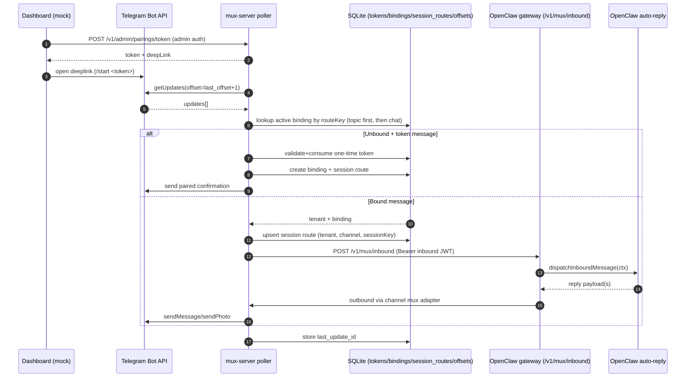
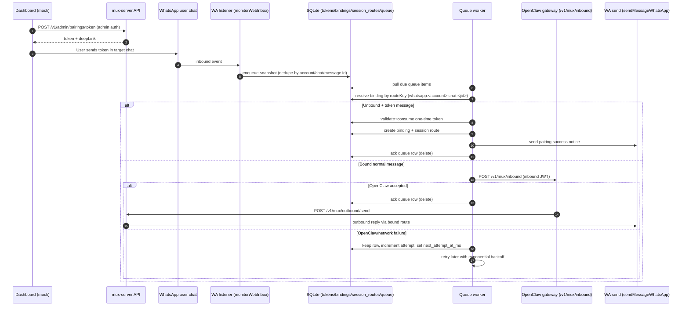

# Mux Server (Standalone)

This directory contains a standalone TypeScript mux server for staged rollout and local testing.

## Scope

- Implements `GET /health`
- Implements `GET /.well-known/jwks.json`
- Implements `POST /v1/instances/register`
- Implements `POST /v1/admin/pairings/token`
- Implements `GET /v1/pairings`
- Implements `POST /v1/pairings/claim`
- Implements `POST /v1/pairings/unbind`
- Implements `POST /v1/mux/outbound/send`
- Implements `GET /v1/mux/files/:channel` (file proxy for Telegram and WhatsApp media)
- Implements Telegram inbound polling + forwarding to OpenClaw `POST /v1/mux/inbound`
- Implements Discord inbound polling + forwarding to OpenClaw `POST /v1/mux/inbound`
- Implements WhatsApp inbound monitoring + forwarding to OpenClaw `POST /v1/mux/inbound`
- Supports Telegram outbound via Bot API:
  - `sendMessage` (text)
  - `sendPhoto` (image with optional caption)
- Supports Discord outbound via Bot API:
  - `POST /channels/{id}/messages` (text)
  - DM route via `POST /users/@me/channels` + channel message send
- Supports WhatsApp outbound via OpenClaw Web listener:
  - text and image sends through bound session route
- Supports idempotency via `Idempotency-Key`:
  - Same key + same payload: cached replay
  - Same key + different payload: `409`

## MVP Direction (Simplified)

- Keep one mux process for `1000-2000` users.
- Use one SQLite database for tenant authz, pairing, route bindings, and idempotency.
- Keep mux thin: route/authz checks + platform send/receive mapping only.
- No queue/bus or multi-region architecture in MVP.

## Architecture Placement

This repo now has 3 mux-related pieces:

1. `src/gateway/mux-http.ts`

- OpenClaw inbound adapter (`POST /v1/mux/inbound`)
- Validates mux-issued inbound JWT using JWKS (`GET /.well-known/jwks.json`)
- Normalizes inbound payload into OpenClaw message context

2. `src/channels/plugins/outbound/mux.ts`

- OpenClaw outbound client
- Calls `POST /v1/instances/register` to mint a runtime JWT
- Uses that runtime JWT for `/v1/mux/outbound/send`

3. `mux-server/src/server.ts`

- External mux service implementation (this directory)
- Telegram + Discord + WhatsApp outbound + inbound forwarding
- Shared payload contract helpers live in `src/channels/plugins/mux-envelope.ts` and are re-exported by `mux-server/src/mux-envelope.ts` so OpenClaw and mux-server stay in lockstep.

In short: OpenClaw inbound/outbound adapters are in `src/`; the standalone mux service is here.

For production wiring, see:

- `mux-server/JWT_INSTANCE_RUNTIME_DESIGN.md`
- `phala-deploy/UPDATE_RUNBOOK.md`

## Run

From repo root:

```bash
pnpm mux:server
```

Direct:

```bash
TELEGRAM_BOT_TOKEN="<bot-token>" \
MUX_REGISTER_KEY="<shared-register-key>" \
node --import tsx mux-server/src/server.ts
```

## Environment

- `TELEGRAM_BOT_TOKEN` (required): Telegram bot token.
- `DISCORD_BOT_TOKEN` (required for Discord transport): Discord bot token.
- `MUX_REGISTER_KEY` (optional): enables instance-centric runtime auth via `POST /v1/instances/register`.
- `MUX_JWT_PRIVATE_KEY` (optional): Ed25519 private key PEM for stable JWT signing across restarts.
- `MUX_API_KEY` (optional, legacy): seeds a single API-key tenant (`tenant-default`).
- `MUX_TENANTS_JSON` (optional, legacy): JSON array for multi-tenant API-key auth seed.
- `MUX_ADMIN_TOKEN` (optional): enables admin-only endpoints (for example `POST /v1/admin/pairings/token`, `GET /v1/admin/whatsapp/health`).
- `MUX_PUBLIC_URL` (optional): public base URL for proxy endpoints (e.g. `https://mux.example.com`). Defaults to `http://<MUX_HOST>:<MUX_PORT>`. Used to construct file proxy URLs in inbound attachment metadata.
- `MUX_HOST` (default `127.0.0.1`)
- `MUX_PORT` (default `18891`)
- `MUX_LOG_PATH` (default `./mux-server/logs/mux-server.log`)
- `MUX_DB_PATH` (default `./mux-server/data/mux-server.sqlite`)
- `MUX_IDEMPOTENCY_TTL_MS` (default `600000`)
- `MUX_PAIRING_CODES_JSON` (optional): JSON array to seed pairing codes for testing/bootstrap.
- `MUX_OPENCLAW_INBOUND_URL` (optional, legacy default tenant only): OpenClaw mux inbound URL.
- `MUX_OPENCLAW_INBOUND_TIMEOUT_MS` (default `15000`): request timeout for OpenClaw mux inbound.
- `MUX_OPENCLAW_ACCOUNT_ID` (default `default`): OpenClaw channel account id used for mux-routed inbound events (recommended: `mux`).
- `MUX_TELEGRAM_API_BASE_URL` (default `https://api.telegram.org`): Telegram API base URL.
- `MUX_DISCORD_API_BASE_URL` (default `https://discord.com/api/v10`): Discord API base URL.
- `MUX_TELEGRAM_POLL_TIMEOUT_SEC` (default `25`): Telegram long-poll timeout.
- `MUX_TELEGRAM_POLL_RETRY_MS` (default `1000`): backoff after poll errors.
- `MUX_TELEGRAM_BOOTSTRAP_LATEST` (default `true`): when enabled, skips historical backlog on cold start.
- `MUX_TELEGRAM_INBOUND_MEDIA_MAX_BYTES` (default `5000000`): max file size for Telegram inbound media attachments (all types: images, documents, video, audio, animation).
- `MUX_DISCORD_POLL_INTERVAL_MS` (default `2000`): Discord poll interval.
- `MUX_DISCORD_BOOTSTRAP_LATEST` (default `true`): when enabled, skips historical backlog on cold start.
- `MUX_DISCORD_INBOUND_MEDIA_MAX_BYTES` (default `5000000`): max file size for Discord inbound media attachments (all types). Note: Discord CDN URLs are passed through directly; this limit is not enforced at mux-server.
- `MUX_DISCORD_GATEWAY_DM_ENABLED` (default `true`): enable Discord Gateway `MESSAGE_CREATE` handling for DM pairing/inbound.
- `MUX_DISCORD_GATEWAY_GUILD_ENABLED` (default `true`): enable Discord Gateway `MESSAGE_CREATE` handling for guild + thread pairing/inbound.
- `MUX_DISCORD_GATEWAY_INTENTS` (optional): override Discord Gateway intents bitmask (defaults include DM + guild message intents when guild mode is enabled).
- `MUX_DISCORD_GATEWAY_RECONNECT_INITIAL_MS` (default `1000`): initial Discord Gateway reconnect backoff.
- `MUX_DISCORD_GATEWAY_RECONNECT_MAX_MS` (default `30000`): max Discord Gateway reconnect backoff.
- `MUX_WHATSAPP_ACCOUNT_ID` (default `default`): WhatsApp account id to monitor.
- `MUX_WHATSAPP_AUTH_DIR` (optional): WhatsApp auth directory; defaults to OpenClaw's default web auth dir.
- `MUX_WHATSAPP_INBOUND_MEDIA_MAX_BYTES` (default `5000000`): max file size for WhatsApp inbound media attachments (all types: images, documents, video, audio).
- `MUX_WHATSAPP_INBOUND_RETRY_MS` (default `1000`): reconnect backoff when WhatsApp listener closes.
- `MUX_TELEGRAM_BOT_USERNAME` (optional): enables Telegram deep link in pairing-token response.
- `MUX_PAIRING_TOKEN_TTL_SEC` (default `900`): default one-time pairing-token TTL in seconds.
- `MUX_PAIRING_TOKEN_MAX_TTL_SEC` (default `3600`): max allowed one-time pairing-token TTL.
- `MUX_PAIRING_SUCCESS_TEXT` (default `Paired successfully. You can chat now.`): message sent after token-based pairing succeeds.
- `MUX_PAIRING_INVALID_TEXT` (default `Pairing link is invalid or expired. Request a new link from your dashboard.`): message sent when token is invalid/reused/expired.
- `MUX_UNPAIRED_HINT_TEXT` (default `This chat is not paired yet. Open your dashboard and use a new pairing link.`): message sent when unpaired chat sends slash command (for example `/help`).

`MUX_TENANTS_JSON` format:

```json
[
  {
    "id": "tenant-a",
    "name": "Tenant A",
    "apiKey": "tenant-a-key",
    "inboundUrl": "http://127.0.0.1:18789/v1/mux/inbound",
    "inboundTimeoutMs": 15000
  },
  { "id": "tenant-b", "name": "Tenant B", "apiKey": "tenant-b-key" }
]
```

Notes:

- Instance-centric runtime auth is the recommended model:
  - OpenClaw registers itself via `POST /v1/instances/register` (shared `MUX_REGISTER_KEY`).
  - OpenClaw uses the returned runtime JWT for mux APIs (`/v1/pairings/*`, `/v1/mux/outbound/send`).
  - mux uses a separate short-lived inbound JWT for mux -> OpenClaw delivery; OpenClaw validates via JWKS.
- Inbound listeners are auto-enabled by capability:
- Telegram when `TELEGRAM_BOT_TOKEN` is set.
- Discord when `DISCORD_BOT_TOKEN` is set.
- WhatsApp when `<MUX_WHATSAPP_AUTH_DIR>/creds.json` exists.

### Dedicated OpenClaw Mux Account

To keep existing direct bots unchanged, run mux traffic through a separate OpenClaw account id:

- Set `MUX_OPENCLAW_ACCOUNT_ID=mux` in mux-server.
- In each tenant OpenClaw config, keep direct traffic on `default` and mux transport on `mux`.
- When `channels.<app>.accounts` exists, define `accounts.default.enabled=true` explicitly, or direct polling can stop.
- Keep `accounts.mux.enabled=false` so OpenClaw does not directly poll the mux account.

Example:

```json
{
  "gateway": {
    "http": {
      "endpoints": {
        "mux": {
          "enabled": true,
          "baseUrl": "https://mux.example.com",
          "registerKey": "mux-register-shared-key",
          "inboundUrl": "https://openclaw-host.example.com/v1/mux/inbound"
        }
      }
    }
  },
  "channels": {
    "telegram": {
      "enabled": true,
      "botToken": "telegram-direct-bot-token",
      "accounts": {
        "default": {
          "enabled": true
        },
        "mux": {
          "enabled": false,
          "mux": { "enabled": true }
        }
      }
    },
    "discord": {
      "enabled": true,
      "token": "discord-direct-bot-token",
      "accounts": {
        "default": {
          "enabled": true
        },
        "mux": {
          "enabled": false,
          "mux": { "enabled": true }
        }
      }
    },
    "whatsapp": {
      "enabled": true,
      "accounts": {
        "default": {
          "enabled": true
        },
        "mux": {
          "enabled": false,
          "mux": { "enabled": true }
        }
      }
    }
  }
}
```

How this works:

- direct inbound/outbound uses `default` account (legacy/non-mux behavior)
- mux inbound is forwarded by mux-server with `accountId=mux`
- mux outbound is selected only when OpenClaw context has `AccountId=mux`
- result: direct and mux traffic run side-by-side without touching each other

`MUX_PAIRING_CODES_JSON` format:

```json
[
  {
    "code": "PAIR-1",
    "channel": "telegram",
    "routeKey": "telegram:default:chat:-100123",
    "scope": "chat"
  }
]
```

## API Contract

### `GET /health`

- Response: `200 {"ok":true}`

### `POST /v1/mux/outbound/send`

Headers:

- `Authorization: Bearer <tenant_api_key>`
- Optional: `Idempotency-Key: <stable-request-id>`

Body:

```json
{
  "requestId": "uuid",
  "op": "send",
  "action": null,
  "channel": "telegram",
  "sessionKey": "agent:main:telegram:group:-100123:topic:2",
  "to": "-100123",
  "text": "hello",
  "mediaUrl": "https://... or Telegram file_id",
  "mediaUrls": ["https://..."],
  "replyToId": "123",
  "threadId": 2,
  "raw": null
}
```

Behavior:

- `channel` is required (`telegram`, `discord`, or `whatsapp`).
- `sessionKey` is required.
- `op` defaults to `send` when omitted.
- `op=action` currently supports `action=typing` (same endpoint, no separate transport contract required).
- For `op=send`, at least one of `text`, `mediaUrl`, or `mediaUrls` is required unless `raw` is provided.
- Destination is resolved from mux route mapping `(tenant, channel, sessionKey)`.
- `to` from request is ignored for Telegram and DM-bound Discord routes.
- If no route mapping exists, returns `403` with `code: "ROUTE_NOT_BOUND"`.
- Telegram: first media URL uses `sendPhoto` (with optional caption from `text`), extra media URLs are sent as additional `sendPhoto` messages.
- Discord: outbound sends text as `content` and media URLs as `embeds[].image.url` (no text+URL folding).
- WhatsApp: outbound route target is always resolved from route binding; first media item can carry caption from `text`, extra media items are sent as separate messages without caption.
- `threadId` maps to Telegram `message_thread_id`.
- `replyToId` maps to Telegram `reply_to_message_id`.
- Discord guild-bound routes validate that destination channel belongs to the bound guild.
- `raw` is channel-scoped passthrough data:
- `raw.telegram.body` is forwarded to Telegram API with route lock enforcement (`chat_id` overridden to bound route).
- `raw.discord.body` is forwarded to Discord message create API on the resolved bound channel.
- `raw.whatsapp` may provide `text`, `mediaUrl`, `mediaUrls`, and `gifPlayback`.

Transport contract:

- Transport layers preserve original text and provider payload structures.
- Parsing is allowed for validation/routing, but transport must not rewrite user text.
- Inbound envelopes include `event.kind` + top-level `raw` for unmodified channel payload preservation.
- Inbound attachments support all file types (images, documents, audio, video, animation). Previous image-only filtering has been removed.
- Attachments use `url` (proxy URL or direct CDN URL) instead of inline base64 `content`:
  - Telegram/WhatsApp: `url` points to `GET /v1/mux/files/:channel` proxy endpoint.
  - Discord: `url` is the direct Discord CDN URL (public, no proxy needed).
  - OpenClaw downloads raw bytes on demand via the URL, avoiding 33% base64 size bloat in the JSON envelope.

### `POST /v1/pairings/claim`

Headers:

- `Authorization: Bearer <tenant_api_key>`

Body:

```json
{
  "code": "PAIR-1",
  "sessionKey": "agent:main:telegram:group:-100123"
}
```

Response `200`:

```json
{
  "bindingId": "bind_...",
  "channel": "telegram",
  "scope": "chat",
  "routeKey": "telegram:default:chat:-100123",
  "sessionKey": "agent:main:telegram:group:-100123"
}
```

Notes:

- `sessionKey` is optional. If omitted, a binding is still created and mux will derive canonical session keys from inbound context.

### `POST /v1/admin/pairings/token`

Headers:

- `Authorization: Bearer <mux_admin_token>`

Body (recommended):

```json
{
  "openclawId": "<openclawId>",
  "inboundUrl": "https://<openclaw>/v1/mux/inbound",
  "inboundTimeoutMs": 15000,
  "channel": "telegram",
  "ttlSec": 900
}
```

Body (advanced: override derived sessionKey):

```json
{
  "openclawId": "<openclawId>",
  "channel": "telegram",
  "sessionKey": "agent:main:telegram:group:-100123",
  "ttlSec": 900
}
```

Notes:

- This is the recommended control-plane API for issuing one-time pairing tokens.
- Requires `MUX_ADMIN_TOKEN` configured on mux-server.
- If `inboundUrl` is provided, mux will upsert the OpenClaw inbound target for `openclawId` (useful after DB resets).

Response `200`:

```json
{
  "ok": true,
  "channel": "telegram",
  "token": "mpt_...",
  "expiresAtMs": 1770459999999,
  "startCommand": "/start mpt_...",
  "deepLink": "https://t.me/<bot>?start=mpt_..."
}
```

Behavior:

- Token is opaque, one-time, and tenant-scoped.
- `sessionKey` is optional. If omitted, mux derives a canonical `sessionKey` from the inbound route context at claim time.
- If `sessionKey` is provided, mux treats it as a preferred override. This is powerful, but can break thread/topic parity. See "Session Keys (OpenClaw Parity)" below.
- Telegram: user sends token to bot (manual token message or `/start <token>` deep link).
- Discord: token claim route is always derived from the inbound message context (DM/guild/thread); there is no token-time route lock.
- Discord supports DM and guild routes (`discord:default:dm:user:<userId>`, `discord:default:guild:<guildId>[:channel:<channelId>[:thread:<threadId>]]`).
- Discord guild thread claims can anchor the binding at channel scope while still creating thread-scoped sessions for each thread.
- WhatsApp: user sends token as a normal message in the target chat; mux binds that chat route to tenant/session.
- Mux binds route from the incoming chat/topic to this tenant and consumes token.
- The token message is not forwarded to OpenClaw; subsequent messages are forwarded.
- Invalid or reused tokens return a user-facing notice (configured by `MUX_PAIRING_INVALID_TEXT`).
- Unpaired slash commands (for example `/help`) return a pairing hint notice (configured by `MUX_UNPAIRED_HINT_TEXT`).

### Session Keys (OpenClaw Parity)

In mux mode, `sessionKey` is the stable conversation identity:

- mux-server forwards inbound to OpenClaw `/v1/mux/inbound` with `payload.sessionKey`.
- OpenClaw treats `sessionKey` as authoritative (it selects the agent and the session store key).
- mux-server resolves outbound destinations from `(tenant, channel, sessionKey)` route mappings.

Practical implications:

- Session keys must be stable and derived from the inbound route context (DM vs group, channel vs thread/topic).
- Reusing the same `sessionKey` for multiple routes will cause outbound ambiguity (last write wins).

Canonical session key shapes (current mux-server behavior):

- Telegram:
  - Direct chat: `agent:<agentId>:telegram:direct:<chatId>`
  - Group chat: `agent:<agentId>:telegram:group:<chatId>`
  - Forum topic: `agent:<agentId>:telegram:group:<chatId>:topic:<topicId>` (topicId is Telegram `message_thread_id`)
- Discord:
  - DM: `agent:<agentId>:discord:direct:<userId>`
  - Guild channel: `agent:<agentId>:discord:channel:<channelId>`
  - Guild thread: `agent:<agentId>:discord:channel:<threadId>` (Discord threads are channels)
- WhatsApp:
  - Direct chat: `agent:<agentId>:whatsapp:direct:<e164>`
  - Group chat: `agent:<agentId>:whatsapp:group:<groupJid>`

Notes:

- Derived session keys currently default to `agentId=main`.
- WhatsApp DM peer id uses E.164 (`+15551234567`) when available; group peer id uses the group JID (`120363...@g.us`).

### TODO: Agent-Targeted Pairing Tokens (Recommended Future Direction)

Problem:

- At token mint time, the control plane typically does not know the inbound sender ids (Telegram chat id, Discord user id, Discord channel/thread id, WhatsApp JID).
- Requiring route context to mint tokens is the wrong direction: pairing is about establishing auth between a user account in a messenger app and a tenant/agent, not about preselecting the exact route.
- Using `sessionKey` as a token-time override can silently break thread/topic parity by collapsing many routes into a single session key.

Proposal:

- Keep `POST /v1/admin/pairings/token` as a simple "mint a token" control-plane API.
- Add a first-class `agentId` (or `agentHint`) parameter and treat it as the pairing target.
- At claim time (incoming message containing token), derive the canonical session key from `(agentId, inbound route context)`:
  - Telegram topic: `agent:<agentId>:telegram:group:<chatId>:topic:<topicId>`
  - Discord DM: `agent:<agentId>:discord:direct:<userId>`
  - Discord guild channel/thread: `agent:<agentId>:discord:channel:<channelIdOrThreadId>`
- Keep a separate explicit escape hatch (if ever needed) like `sessionKeyOverride`, but make the default behavior preserve per-thread/per-channel session isolation.

### `GET /v1/pairings`

Headers:

- `Authorization: Bearer <tenant_api_key>`

Response `200`:

```json
{
  "items": [
    {
      "bindingId": "bind_...",
      "channel": "telegram",
      "scope": "chat",
      "routeKey": "telegram:default:chat:-100123"
    }
  ]
}
```

### `POST /v1/pairings/unbind`

Headers:

- `Authorization: Bearer <tenant_api_key>`

Body:

```json
{
  "bindingId": "bind_..."
}
```

Response `200`:

```json
{ "ok": true }
```

### `POST /v1/instances/register`

Headers:

- `Authorization: Bearer <mux_register_key>`

Body:

```json
{
  "openclawId": "oc_abcd1234...",
  "inboundUrl": "https://openclaw-host.example.com/v1/mux/inbound",
  "inboundTimeoutMs": 15000
}
```

Response `200`:

```json
{
  "ok": true,
  "openclawId": "oc_abcd1234...",
  "runtimeToken": "<jwt>",
  "expiresAtMs": 1770900000000,
  "tokenType": "Bearer"
}
```

Behavior:

- Upserts the instance by `openclawId` and updates its inbound target (`inboundUrl`).
- Mints a scoped runtime JWT for mux APIs (`/v1/pairings/*`, `/v1/mux/outbound/send`).

### `GET /.well-known/jwks.json`

Auth: none.

Behavior:

- Exposes mux JWT public keys so OpenClaw can verify mux-issued inbound JWTs.

### `GET /v1/admin/whatsapp/health`

Headers:

- `Authorization: Bearer <mux_admin_token>`

Response `200`:

```json
{
  "ok": true,
  "whatsapp": {
    "status": "listening",
    "inboundEnabled": true,
    "accountId": "default",
    "authDir": "/root/.openclaw/credentials/whatsapp/default",
    "authDirExists": true,
    "credsPath": "/root/.openclaw/credentials/whatsapp/default/creds.json",
    "creds": {
      "present": true,
      "sizeBytes": 1886,
      "mtimeMs": 1770930000000
    },
    "fileCounts": {
      "session": 1,
      "senderKey": 0,
      "preKey": 812,
      "deviceList": 3,
      "lidMapping": 4
    },
    "runtime": {
      "listenerActive": true,
      "lastListenerStartAtMs": 1770931000000,
      "lastListenerErrorAtMs": null,
      "lastInboundSeenAtMs": 1770931100000
    }
  }
}
```

Behavior:

- Reports whether WhatsApp credentials are present and readable.
- Reports runtime listener state from the live mux process.
- Requires `MUX_ADMIN_TOKEN` to be configured.

### `GET /v1/mux/files/:channel`

Auth: tenant runtime JWT (`Authorization: Bearer <runtime_jwt>`).

Supported channels:

- **`/v1/mux/files/telegram?fileId=<fileId>`**: Resolves the Telegram file via `getFile` API and streams raw bytes from `api.telegram.org/file/bot{token}/{path}`.
- **`/v1/mux/files/whatsapp?path=<encodedPath>`**: Streams a locally saved WhatsApp media file.

Response:

- `200` with `Content-Type` and `Content-Disposition` headers, body is raw file bytes.
- `400` if required query parameter is missing.
- `401` if JWT is invalid or missing.
- `404` if file is not found or channel is unsupported.
- `502` if upstream file fetch fails (Telegram API error, etc.).

Notes:

- Discord attachments use public CDN URLs and do not need a proxy endpoint.
- OpenClaw calls this endpoint (with its runtime JWT) to download attachment bytes on demand, rather than receiving base64-encoded content inline in the inbound JSON envelope.

## Reliability Notes

### Idempotency

- Current code stores idempotency entries in SQLite with tenant scope:
- key: `(tenantId, idempotencyKey)`
- compare: request fingerprint
- replay: cached status/body
- Duplicate keys survive process restart.

### Restart Behavior

From local restart drills:

- During restart windows, callers can see transport errors (`code=000`, empty reply, connection reset).
- Some requests may still be processed even if client did not receive a response.

Recommended caller contract:

1. Generate a stable request id per logical send.
2. Reuse it as `Idempotency-Key` on every retry.
3. Retry on network/5xx with backoff.
4. Treat unknown-ack windows as retriable, not hard-fail.

### Delivery Semantics Upgrade (Implemented)

Goal: avoid silent inbound message loss when OpenClaw forwarding fails.

Scope:

- Telegram inbound poller (offset-based)
- Discord inbound poller (offset-based)
- WhatsApp inbound listener (event callback based)

Behavior:

- A message is acknowledged only after one of these:
- forwarded to OpenClaw successfully
- intentionally consumed by mux (for example pairing token command)
- If forwarding fails, do not acknowledge that message.
- Retry failed messages in order.

Implementation checklist:

- [x] Telegram: replaced commit-in-finally offset flow with ack-safe commit flow
- [x] Telegram: stop processing newer updates after first failed forward
- [x] Discord: commit only the last acknowledged message id per binding
- [x] Discord: keep earlier successful messages committed even if a later message fails in the same batch
- [x] WhatsApp: added SQLite-backed pending inbound queue
- [x] WhatsApp: enqueue first, then forward worker marks done only on success
- [x] WhatsApp: retry queue items with backoff; do not drop on first failure
- [x] Logging: explicit `ack_committed` and `retry_deferred` events per channel
- [ ] Tests: add WhatsApp failure-then-retry regression test

Out of scope for this pass:

- Exactly-once guarantee end-to-end
- Distributed queue or multi-node delivery coordination
- Cross-region failover logic

## Telegram-Specific Notes

- `mediaUrl` accepts either an internet URL or Telegram `file_id`.
- Forum topics are preserved when `threadId` is provided.
- Replies can be pinned to parent message with `replyToId`.
- Inbound forwarding uses route bindings first (`topic` then chat fallback) and emits OpenClaw mux-inbound events with a stable `sessionKey`.
- Inbound media (images, documents, video, audio, animation) is forwarded as:
- `attachments[]` with `url` pointing to `GET /v1/mux/files/telegram?fileId=<fileId>` proxy endpoint
- `channelData.telegram.media[]` metadata always
- `body` remains original text/caption only (empty string when no text)
- `channelData.telegram.rawMessage` and `channelData.telegram.rawUpdate` preserve original Telegram payload

## Inbound Data Flow



Notes:

- Forwarding target is per-OpenClaw instance (`openclawId` -> `inboundUrl`, updated on register).
- Forwarding target is resolved dynamically from SQLite on each inbound forward.
- Inbound auth uses a mux-issued JWT per delivery; OpenClaw validates via JWKS.
- Telegram and Discord offsets are committed only after acked processing.
- WhatsApp inbound is persisted in SQLite queue and retried with backoff until acked.

## WhatsApp Data Flow



## OpenClaw Command Note

In Telegram + OpenClaw flows:

- `/help` is Telegram slash-command style.
- `!help` may be interpreted as command/bang syntax by OpenClaw.

## Future Work: Session Selection (Not Implemented Yet)

Current behavior is intentionally simple:

- pairing tokens are issued for a fixed OpenClaw target session (today: `agent:main:main`)
- `/bot_*` commands only cover pairing/unpairing and quick switch by token

Planned behavior:

- mux exposes a tenant-authenticated session-discovery endpoint under `/v1/mux/*`
  - example: `GET /v1/mux/sessions`
  - returns OpenClaw sessions visible to that tenant key
- dashboard flow lets user choose target session first, then requests pairing token for that session
- bot control commands can switch the current chat binding to another existing session without leaving chat
  - example command set:
    - `/bot_sessions` list available sessions
    - `/bot_use <session>` switch current chat to selected session
    - `/bot_status` show current binding target

Why this exists:

- removes hard dependency on a single session target
- keeps control-plane UX consistent across Telegram, Discord, and WhatsApp
- lets users move a chat between sessions without re-provisioning OpenClaw

Constraints for this future work:

- mux remains a thin router (no tenant business logic)
- auth remains instance-scoped (openclawId + mux-issued runtime JWT)
- no backward-compatibility layer is required before launch

## Tests

From repo root:

```bash
pnpm --dir mux-server typecheck
pnpm --dir mux-server test
```

Smoke checks (against a running mux server):

```bash
pnpm --dir mux-server smoke
```

Optional live outbound check:

```bash
MUX_REGISTER_KEY=replace-with-shared-register-key \
OPENCLAW_ID=replace-with-openclaw-id \
OPENCLAW_INBOUND_URL=https://openclaw-host.example.com/v1/mux/inbound \
MUX_SESSION_KEY='agent:main:telegram:group:-1003712260705:topic:2' \
MUX_EXPECT_STATUS=200 \
pnpm --dir mux-server smoke
```

Current test coverage (`mux-server/test/server.test.ts`):

- health endpoint responds
- instance register endpoint requires shared register key and returns runtime jwt metadata
- jwks endpoint responds
- outbound endpoint rejects unauthorized requests
- multi-tenant auth via `MUX_TENANTS_JSON`
- pairing claim/list/unbind flow
- duplicate pairing claim conflict handling
- instance register updates inbound target and forwards to latest inbound url
- outbound route resolution from `(tenant, channel, sessionKey)` mapping
- Telegram inbound forwarding to tenant inbound endpoint
- Telegram retry without offset advance on failed forward
- Telegram media-only inbound forwarding with attachment payload preservation
- Discord inbound forwarding with raw payload + media attachment preservation (URL passthrough)
- Discord retry without replaying already-acked earlier messages
- dashboard token pairing via `/start <token>` then forwarding subsequent messages
- idempotency replay + payload mismatch handling
- idempotency persistence across process restart

Envelope tests (`mux-server/test/mux-envelope.test.ts`):

- normalization of url-only, content-only, and dual (url+content) attachments
- rejection of attachments with neither content nor url
- Discord inbound envelope with url-based attachments
