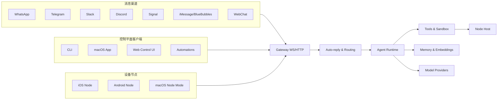

# OpenClaw 技术架构深度解析

本文基于仓库当前代码与内置文档，对 OpenClaw 的技术架构进行系统性拆解，覆盖控制平面、通道适配、会话与路由、Agent 运行时、工具与安全、存储与扩展等关键部分。

## 项目定位与总体目标

OpenClaw 是一套“多渠道个人 AI 助理”系统。它强调本地优先和私有控制，通过单一 Gateway 控制平面把多种消息渠道、客户端、工具与设备节点统一到一个可控的运行时中。核心思想是：

- Gateway 作为唯一控制平面，聚合消息与工具调用。
- 多通道接入与统一路由，让同一助理能在不同渠道工作。
- Agent 运行时负责模型调用、工具编排、会话与记忆。
- 设备节点扩展能力边界（摄像头、屏幕、通知等）。

## 总体架构概览

## 核心控制平面：Gateway

Gateway 是系统的中枢，负责维持通道连接、暴露 WebSocket API、提供事件流与控制 UI，并承载 Canvas/A2UI 的 HTTP 入口。

- 代码位置：`src/gateway/`
- WebSocket 协议与类型：`src/gateway/protocol/` 使用 TypeBox 定义 schema 并用于 JSON Schema 生成。
- HTTP 服务与控制 UI：`src/gateway/server-http.ts` 与 `src/gateway/control-ui.ts`。
- Canvas/A2UI host：`src/canvas-host/`，由 Gateway HTTP 端口提供服务。
- 关键能力：连接管理、鉴权、事件广播、配置加载、会话与工具调用的统一入口。

## 通道适配层（Channels）

OpenClaw 将不同消息渠道适配为统一的入站/出站语义，通道特性通过专用模块实现，通道共性由 `src/channels/` 提供。

- 通道共性逻辑：`src/channels/`（allowlist、typing、message routing、session 绑定等）。
- 主要通道模块：`src/discord/`、`src/slack/`、`src/telegram/`、`src/signal/`、`src/imessage/`、`src/whatsapp/`、`src/web/`。
- 扩展通道：`extensions/*`（如 Matrix、Zalo、Microsoft Teams 等）。

## 路由与会话模型

路由与会话决定了“消息归属哪个 Agent、落在哪个会话上下文”。这部分由 Gateway 管理，统一对外提供查询与控制接口。

- 路由核心：`src/routing/`。
- 会话逻辑：`src/sessions/` 与 `docs/concepts/session.md`。
- 会话存储位置：`~/.openclaw/agents/<agentId>/sessions/sessions.json` 与 `~/.openclaw/agents/<agentId>/sessions/<SessionId>.jsonl`。

## 自动回复与队列调度

OpenClaw 对入站消息采用队列化自动回复，以保证同一会话内串行执行、并减少工具与模型调用的竞争。

- 自动回复管线：`src/auto-reply/`。
- 队列设计说明：`docs/concepts/queue.md`。
- 关键特性：按会话 lane 串行，支持 `collect`/`steer`/`followup` 等队列模式。

## Agent 运行时与模型层

Agent 运行时提供统一的模型调用与工具编排能力，并内置多模型选择、失败回退、上下文管理与压缩等机制。

- 运行时实现：`src/agents/`。
- 运行时说明：`docs/concepts/agent.md`。
- 模型与鉴权逻辑：`src/agents/model-*`、`src/agents/auth-*`、`src/agents/models-config.*`。
- Provider 适配：`src/providers/`。

## 工具系统与安全沙箱

OpenClaw 内置工具系统（读写、执行、浏览器、节点能力等），并通过沙箱与审批机制控制风险。

- 工具定义与策略：`src/agents/pi-tools.*`、`src/agents/tool-*`、`src/agents/tool-policy.*`。
- 沙箱实现：`src/agents/sandbox/`。
- 执行审批：`src/gateway/exec-approval-manager.ts`。
- 设备能力代理：`src/node-host/`（用于调用节点侧命令）。

## 记忆与向量检索

OpenClaw 在内存系统中实现了嵌入生成、索引与检索，支持会话与文件的向量化搜索。

- 代码位置：`src/memory/`。
- 关键实现：`sqlite-vec` 与多 provider embedding 适配（`embeddings-*.ts`）。

## 媒体与浏览器能力

系统提供媒体解析、上传、转换、裁剪等能力，同时提供受控浏览器执行与截图。

- 媒体管线：`src/media/`。
- 浏览器控制：`src/browser/`，依赖 `playwright-core`。

## UI 与客户端

OpenClaw 包含多个客户端形态，统一通过 Gateway WS 接入。

- 控制 UI：`ui/` 与 `src/gateway/control-ui.ts`。
- macOS/iOS/Android 客户端：`apps/macos/`、`apps/ios/`、`apps/android/`。
- CLI：`src/cli/`，入口在 `src/entry.ts` 与 `openclaw.mjs`。

## 插件与扩展机制

OpenClaw 通过插件 SDK 与扩展包支撑不同渠道与功能扩展。

- 插件 SDK：`src/plugin-sdk/`。
- 扩展包：`extensions/*`。

## 构建、测试与发布

- 运行时：Node >= 22，TypeScript ESM（见 `package.json`）。
- 构建：`pnpm build`，核心打包使用 `tsdown`，产物在 `dist/`。
- 测试：`vitest`（`pnpm test`）。

## 关键目录速查表

- `src/`：核心实现（Gateway、Agent、Channels、工具、安全等）。
- `apps/`：原生客户端与节点（macOS/iOS/Android）。
- `ui/`：Web 控制台前端。
- `extensions/`：通道与功能扩展包。
- `docs/`：架构、配置与使用文档。
- `scripts/`：构建与发布脚本。
- `skills/`：内置技能。

## 参考文件

- `README.md`
- `docs/concepts/architecture.md`
- `docs/concepts/agent.md`
- `docs/concepts/session.md`
- `docs/concepts/queue.md`
- `src/gateway/`
- `src/agents/`
- `src/channels/`
- `src/auto-reply/`
- `src/memory/`
- `src/media/`
- `src/browser/`
- `src/node-host/`
- `src/plugin-sdk/`
- `extensions/`
