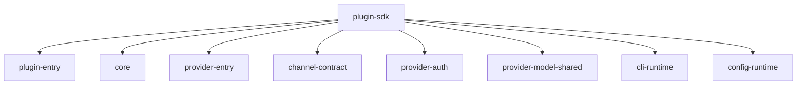
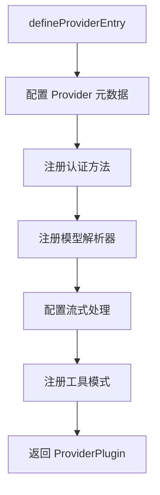
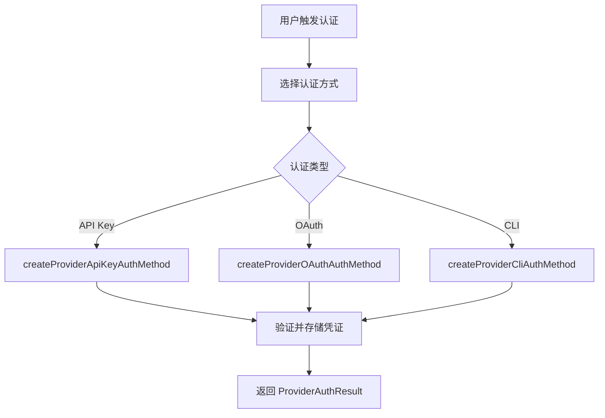
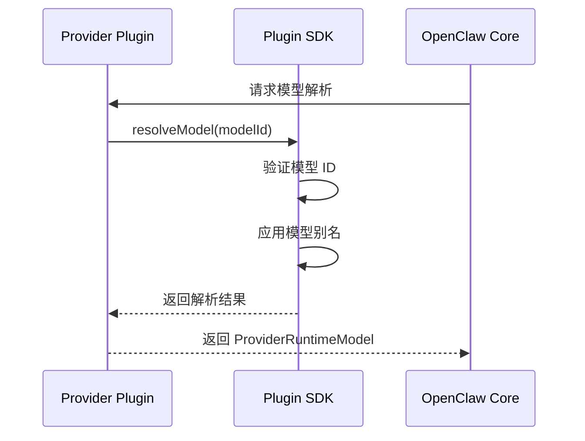
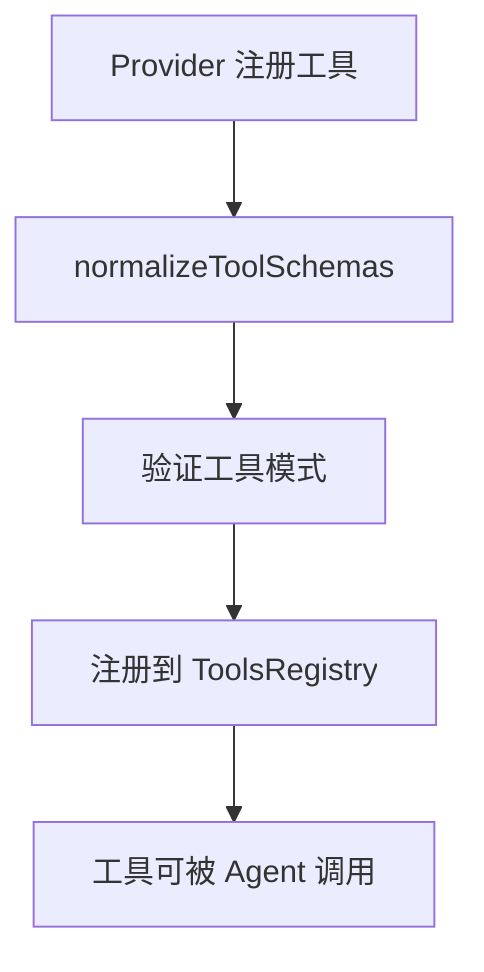
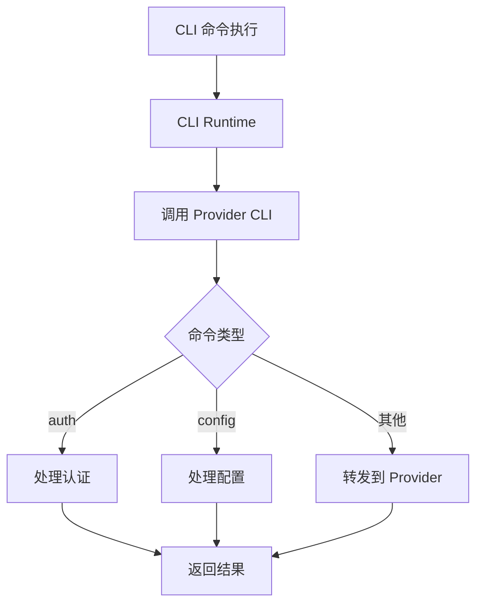

# OpenClaw Packages 共享包流程文档

## 概述

Packages 目录包含 OpenClaw 的核心共享包，供主应用和扩展插件使用。

## 1. 包结构

```
packages/
├── plugin-sdk/              # 插件 SDK
│   └── src/
│       ├── plugin-entry.ts    # 插件入口定义
│       ├── core.ts            # 核心 API
│       ├── provider-entry.ts  # Provider 入口
│       └── ...
├── memory-host-sdk/         # 记忆主机 SDK
│   └── src/
│       └── index.ts
└── plugin-package-contract/ # 插件包契约
    └── src/
        └── index.ts
```

## 2. Plugin SDK 架构

### 2.1 SDK 导出结构



### 2.2 插件入口定义 (plugin-entry.ts)

```typescript
// 定义插件入口函数类型
export interface PluginEntryDefinition {
  id: string;              // 插件唯一 ID
  name: string;            // 插件显示名称
  description?: string;    // 插件描述
  register: (api: OpenClawPluginApi) => Promise<PluginInstance> | PluginInstance;
}

// 插件实例接口
export interface PluginInstance {
  id: string;
  name: string;
  // Provider 相关
  provider?: ProviderPlugin;
  // Channel 相关
  channel?: ChannelPlugin;
  // 生命周期
  activate?: () => Promise<void>;
  deactivate?: () => Promise<void>;
}
```

### 2.3 Provider 插件流程



## 3. 核心 API (core.ts)

### 3.1 OpenClawPluginApi 结构

```typescript
// OpenClaw 插件 API 接口
export interface OpenClawPluginApi {
  // 配置相关
  config: ConfigRuntime;
  
  // 存储相关
  storage: StorageRuntime;
  
  // 日志相关
  logger: Logger;
  
  // 生命周期
  lifecycle: LifecycleHooks;
  
  // 工具注册
  tools: ToolsRegistry;
  
  // 资源访问
  resources: ResourcesRuntime;
}
```

## 4. Provider 认证流程

### 4.1 认证方法注册



### 4.2 认证结果结构

```typescript
export interface ProviderAuthResult {
  profiles: AuthProfile[];      // 认证配置文件列表
  defaultModel?: string;        // 默认模型
  notes?: string[];            // 提示信息
}

export interface AuthProfile {
  profileId: string;           // 配置 ID
  credential: Credential;      // 凭证信息
  expires?: number;            // 过期时间
}
```

## 5. 模型解析流程

### 5.1 模型解析时序



## 6. 工具注册流程

### 6.1 工具注册流程



## 7. CLI 运行时

### 7.1 CLI 集成流程



## 8. 包导出映射

| 包路径 | 导出内容 |
|-------|---------|
| `plugin-sdk/plugin-entry` | 插件入口定义和类型 |
| `plugin-sdk/core` | 核心 OpenClaw API |
| `plugin-sdk/provider-entry` | Provider 入口 |
| `plugin-sdk/provider-auth` | 认证方法 |
| `plugin-sdk/provider-model-shared` | 模型共享工具 |
| `plugin-sdk/cli-runtime` | CLI 运行时 |
| `plugin-sdk/config-runtime` | 配置运行时 |
| `plugin-sdk/channel-contract` | Channel 契约 |

## 9. 使用示例

```typescript
// extensions/anthropic/index.ts
import { definePluginEntry } from "openclaw/plugin-sdk/plugin-entry";
import { registerAnthropicPlugin } from "./register.runtime.js";

// 定义插件入口
export default definePluginEntry({
  id: "anthropic",
  name: "Anthropic Provider",
  description: "Bundled Anthropic provider plugin",
  // 注册函数接收 OpenClaw API
  register(api) {
    // 使用 api.config 访问配置
    // 使用 api.logger 记录日志
    // 使用 api.storage 存储数据
    return registerAnthropicPlugin(api);
  },
});
```

## 10. 关键文件

| 文件路径 | 职责 |
|---------|------|
| `packages/plugin-sdk/src/plugin-entry.ts` | 插件入口定义 |
| `packages/plugin-sdk/src/core.ts` | 核心 API |
| `packages/plugin-sdk/src/provider-entry.ts` | Provider 入口 |
| `packages/plugin-sdk/src/provider-auth.ts` | 认证接口 |
| `packages/plugin-sdk/src/provider-model-shared.ts` | 模型共享工具 |
