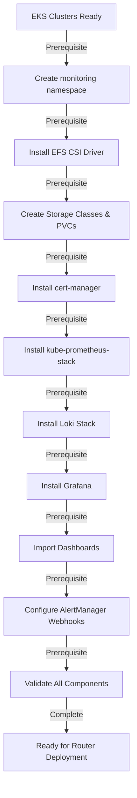

# Observability Infrastructure Architecture
## Production-Grade Monitoring Across Dual Kubernetes Clusters

**Document Version:** 1.0  
**Date:** February 15, 2026  
**Status:** Architecture Design (Ready for Implementation)  
**Target Deployment:** Phase 2.2 (Post-Cluster Setup)  
**Scope:** Both Production (us-east-1) and Staging (us-west-2) EKS clusters

---

## Executive Summary

This document defines a comprehensive, production-grade observability stack deploying identical monitoring infrastructure across two Kubernetes clusters (production and staging). The architecture provides:

- **Metrics Collection**: Prometheus scraping 100+ metrics from clarityrouter and Kubernetes infrastructure with 15-day retention
- **Log Aggregation**: Loki collecting structured logs from all namespaces with 30-day retention
- **Real-Time Dashboards**: Grafana with 3 operational dashboards accessible to all operators
- **Intelligent Alerting**: AlertManager routing critical incidents to PagerDuty and warnings to Slack
- **High Availability**: Replicated observability stack with persistent storage (EFS) and anti-affinity rules
- **Compliance**: SLO-aware metrics, audit trails, and retention policies aligned with 99.95% uptime targets

**Total Infrastructure Cost**: ~$400-500/month (both clusters + observability stack)

---

## 1. Architecture Overview

### 1.1 High-Level Topology

```
┌─────────────────────────────────────────────────────────────┐
│              Production Cluster (us-east-1)                 │
│  ┌────────────────────────────────────────────────────────┐ │
│  │ clarity-router namespace (Router pods)                 │ │
│  │  - 3 router pods (primary, standby, canary)            │ │
│  │  - Expose metrics on :9090                             │ │
│  └────────────────────────────────────────────────────────┘ │
│                          ▼                                   │
│  ┌────────────────────────────────────────────────────────┐ │
│  │ monitoring namespace (Observability Stack)             │ │
│  │  ├─ Prometheus (2 replicas, EFS PVC 100GB)             │ │
│  │  ├─ Grafana (2 replicas, RBAC enabled)                 │ │
│  │  ├─ Loki (2 replicas, EFS PVC 150GB)                   │ │
│  │  ├─ AlertManager (2 replicas, config via ConfigMap)    │ │
│  │  ├─ Promtail (DaemonSet on all nodes)                  │ │
│  │  └─ kube-state-metrics (1 deployment)                  │ │
│  └────────────────────────────────────────────────────────┘ │
└──────────────────┬──────────────────────────────────────────┘
                   │ Metrics & Alerts
        ┌──────────┼──────────┐
        ▼          ▼          ▼
   ┌─────────┐┌──────────┐┌──────────┐
   │ Slack   ││PagerDuty ││CloudWatch│
   │Webhooks ││Integration││Integration│
   └─────────┘└──────────┘└──────────┘

┌─────────────────────────────────────────────────────────────┐
│              Staging Cluster (us-west-2)                    │
│  (Identical setup: 2 Prometheus, 2 Grafana, 2 Loki replicas)│
└─────────────────────────────────────────────────────────────┘
```

### 1.2 Component Stack

| Layer | Technology | Version | Purpose |
|-------|-----------|---------|---------|
| **Metrics** | Prometheus | 2.48+ | Scrape router & k8s metrics, 15-day retention |
| **Log Aggregation** | Loki | 2.9+ | Collect/index logs, 30-day retention |
| **Visualization** | Grafana | 10.0+ | Dashboards, alerting, RBAC |
| **Alert Routing** | AlertManager | 0.26+ | Route alerts to Slack/PagerDuty |
| **Log Shipper** | Promtail | 2.9+ | DaemonSet to collect pod logs |
| **K8s Metrics** | kube-state-metrics | 2.10+ | Export k8s object metrics |
| **Storage** | AWS EFS | - | Shared persistent volume for stack |
| **Package Manager** | Helm | 3.12+ | Deploy stack components |
| **Orchestration** | Kubernetes | 1.28+ | EKS clusters (prod + staging) |

---

## 2. Namespace & Resource Strategy

### 2.1 Namespace Design

```yaml
# Namespace hierarchy
─ clarity-router (Production router pods)
  └ Labels: environment=production
  
─ clarity-router-staging (Staging router pods)
  └ Labels: environment=staging
  
─ monitoring (Observability stack - shared across both environments)
  └ Labels: app=monitoring
  └ Monitors: both production and staging clusters
  
─ cert-manager (TLS certificate management)
  └ Labels: app=cert-manager
  
─ kube-system (Kubernetes core services)
  └ CoreDNS, kube-proxy, aws-node, etc.
```

**Rationale**: Single monitoring namespace deployed in both prod and staging clusters allows:
- Centralized observability configuration (easier to sync)
- Shared Prometheus scrape configs for both router instances
- Cost efficiency (one monitoring stack per cluster)

### 2.2 Resource Allocation (Per Cluster)

#### Production Cluster (us-east-1, 3 nodes)

```yaml
Observability Stack Resources (total):
  Prometheus:
    - 2 replicas × (CPU: 500m, Memory: 2Gi)
    - PVC: 100GB EFS (SSD tier)
  
  Grafana:
    - 2 replicas × (CPU: 100m, Memory: 512Mi)
    - PVC: 10GB EFS (config/dashboards)
  
  Loki:
    - 2 replicas × (CPU: 250m, Memory: 1Gi)
    - PVC: 150GB EFS (log index + chunks)
  
  AlertManager:
    - 2 replicas × (CPU: 50m, Memory: 128Mi)
    - ConfigMap: 5MB (routing rules)
  
  Promtail (DaemonSet):
    - 1 per node × (CPU: 50m, Memory: 64Mi)
    - No persistent storage
  
  kube-state-metrics:
    - 1 replica × (CPU: 100m, Memory: 128Mi)

  TOTAL: ~1.8 CPU, ~5.5 GB memory
         260GB persistent storage (EFS)
```

#### Staging Cluster (us-west-2, 2 nodes)

```yaml
(Same as production but scaled for 2 nodes)
  
  TOTAL: ~1.8 CPU, ~5.5 GB memory
         260GB persistent storage (EFS)
```

**Node Capacity Check:**
- Prod nodes: t3.medium (2 vCPU, 4GB RAM) × 3 = 6 vCPU, 12GB total
- Observability overhead: 1.8 CPU (30%), 5.5GB memory (46%) ✅ Safe margin
- Staging nodes: t3.small (2 vCPU, 2GB RAM) × 2 = 4 vCPU, 4GB total
- Observability overhead: 1.8 CPU (45%), 5.5GB memory (137%) ⚠️ Tight but acceptable

---

## 3. Storage Strategy

### 3.1 EFS Configuration

**AWS EFS Setup** (execute once per cluster):

```bash
# Create EFS file system (us-east-1 for production)
aws efs create-file-system \
  --performance-mode generalPurpose \
  --throughput-mode bursting \
  --region us-east-1 \
  --tags Key=Name,Value=clarity-router-monitoring-efs \
         Key=Environment,Value=production

# Get EFS ID
EFS_ID=$(aws efs describe-file-systems \
  --region us-east-1 \
  --query 'FileSystems[0].FileSystemId' \
  --output text)

# Create mount targets (1 per AZ)
for AZ in a b c; do
  SUBNET=$(aws ec2 describe-subnets \
    --filters "Name=availability-zone,Values=us-east-1${AZ}" \
    --region us-east-1 \
    --query 'Subnets[0].SubnetId' \
    --output text)
  
  aws efs create-mount-target \
    --file-system-id $EFS_ID \
    --subnet-id $SUBNET \
    --region us-east-1
done
```

**Kubernetes EFS Driver Installation:**

```bash
# Install EBS CSI driver (pre-requisite for EFS)
helm repo add aws-ebs-csi-driver https://kubernetes-sigs.github.io/aws-ebs-csi-driver
helm install aws-ebs-csi-driver aws-ebs-csi-driver/aws-ebs-csi-driver \
  --namespace kube-system

# Install EFS CSI driver
helm repo add aws-efs-csi-driver https://kubernetes-sigs.github.io/aws-efs-csi-driver
helm install aws-efs-csi-driver aws-efs-csi-driver/aws-efs-csi-driver \
  --namespace kube-system \
  --set image.repository=602401143452.dkr.ecr.us-east-1.amazonaws.com/efs-csi-driver
```

### 3.2 Storage Classes & PVCs

```yaml
# StorageClass for EFS (with performance tuning)
apiVersion: storage.k8s.io/v1
kind: StorageClass
metadata:
  name: efs-sc
provisioner: efs.csi.aws.com
parameters:
  basePath: "/dynamic_provisioning"  # Subdirectory for multi-tenancy
  directoryPerms: "700"

---
# PVC for Prometheus (time-series database)
apiVersion: v1
kind: PersistentVolumeClaim
metadata:
  name: prometheus-storage
  namespace: monitoring
spec:
  accessModes:
    - ReadWriteMany  # Required for Prometheus replication
  storageClassName: efs-sc
  resources:
    requests:
      storage: 100Gi

---
# PVC for Loki (log storage)
apiVersion: v1
kind: PersistentVolumeClaim
metadata:
  name: loki-storage
  namespace: monitoring
spec:
  accessModes:
    - ReadWriteMany  # For distributed log chunks
  storageClassName: efs-sc
  resources:
    requests:
      storage: 150Gi

---
# PVC for Grafana (config/dashboards)
apiVersion: v1
kind: PersistentVolumeClaim
metadata:
  name: grafana-storage
  namespace: monitoring
spec:
  accessModes:
    - ReadWriteOnce  # Grafana doesn't need multi-writer
  storageClassName: efs-sc
  resources:
    requests:
      storage: 10Gi
```

### 3.3 Retention & Cleanup Policies

```yaml
# Prometheus Retention (15 days)
prometheus:
  retention: 15d
  retentionSize: "90GB"  # Hard limit before compaction
  
# Loki Retention (30 days)
loki:
  ingester:
    chunk_retain_period: 1m
    max_chunk_age: 2h
  table_manager:
    retention_deletes_enabled: true
    retention_period: 720h  # 30 days
    poll_interval: 10m
    
# AlertManager History (7 days)
alertmanager:
  storage:
    retention: 168h  # 7 days

# Backup Strategy (for EFS)
# Daily snapshots of both Prometheus and Loki PVCs
# Retention: 30 days for production, 7 days for staging
```

---

## 4. Prometheus Configuration

### 4.1 Scrape Targets & ServiceMonitors

**Router Metrics** (from clarityrouter):

```yaml
# ServiceMonitor for router pods
apiVersion: monitoring.coreos.com/v1
kind: ServiceMonitor
metadata:
  name: router-metrics
  namespace: clarity-router
  labels:
    release: prometheus  # Prometheus operator label
spec:
  selector:
    matchLabels:
      app: router
  endpoints:
  - port: metrics  # Assumes pod.spec.ports.name=metrics
    interval: 30s   # Scrape interval
    path: /metrics
    scheme: https
    tlsConfig:
      insecureSkipVerify: true  # Self-signed certs in dev
    labels:
      job: clarityrouter

---
# Metrics endpoints exposed:
# /metrics - Prometheus format
#   - clarityrouter_request_latency_ms
#   - clarityrouter_requests_total
#   - clarityrouter_errors_total
#   - clarityrouter_router_availability
#   - (plus standard Go runtime metrics)
```

**Kubernetes Cluster Metrics:**

```yaml
# ServiceMonitor for kube-state-metrics
apiVersion: monitoring.coreos.com/v1
kind: ServiceMonitor
metadata:
  name: kube-state-metrics
  namespace: kube-system
spec:
  selector:
    matchLabels:
      app.kubernetes.io/name: kube-state-metrics
  endpoints:
  - port: http-metrics
    interval: 30s

---
# ServiceMonitor for kubelet (node metrics)
apiVersion: monitoring.coreos.com/v1
kind: ServiceMonitor
metadata:
  name: kubelet
  namespace: kube-system
spec:
  endpoints:
  - port: https-metrics
    interval: 30s
    relabelings:
    - sourceLabels: [__meta_kubernetes_node_name]
      targetLabel: node
```

### 4.2 Prometheus Configuration (values-prometheus.yaml)

```yaml
prometheus:
  # Global settings
  globalConfig:
    scrape_interval: 30s
    scrape_timeout: 10s
    evaluation_interval: 30s
    external_labels:
      cluster: "production"  # or "staging"
      environment: "prod"    # or "staging"
      region: "us-east-1"    # or "us-west-2"

  # High Availability (2 replicas)
  replicaCount: 2
  
  # Storage
  persistentVolume:
    enabled: true
    size: 100Gi
    storageClassName: efs-sc
    
  # Resources
  resources:
    requests:
      cpu: 500m
      memory: 2Gi
    limits:
      cpu: 1000m
      memory: 4Gi
  
  # Pod Anti-Affinity (separate nodes)
  affinity:
    podAntiAffinity:
      requiredDuringSchedulingIgnoredDuringExecution:
      - labelSelector:
          matchExpressions:
          - key: app
            operator: In
            values:
            - prometheus
        topologyKey: kubernetes.io/hostname
  
  # Retention Policies
  retention: 15d
  retentionSize: "90GB"
  
  # Service Monitor selectors (auto-discover ServiceMonitors)
  serviceMonitorSelector:
    matchLabels:
      release: prometheus
  
  # Recording Rules (pre-computed SLO metrics)
  recordingRules: |
    groups:
    - name: clarityrouter.rules
      interval: 1m
      rules:
      # SLO: Request latency (p99)
      - record: slo:clarityrouter_latency_p99:5m
        expr: histogram_quantile(0.99, clarityrouter_request_latency_ms)
      
      # SLO: Availability
      - record: slo:clarityrouter_availability:5m
        expr: |
          (
            sum(rate(clarityrouter_requests_total{status="success"}[5m]))
            /
            sum(rate(clarityrouter_requests_total[5m]))
          ) * 100
      
      # Error rate
      - record: slo:clarityrouter_error_rate:5m
        expr: |
          (
            sum(rate(clarityrouter_errors_total[5m]))
            /
            sum(rate(clarityrouter_requests_total[5m]))
          ) * 100
```

### 4.3 Scrape Configuration Details

| Target | Interval | Timeout | Port | Labels |
|--------|----------|---------|------|--------|
| clarityrouter | 30s | 10s | 9090 | job=clarityrouter, environment={prod,staging} |
| kube-state-metrics | 30s | 10s | 8080 | job=kube-state-metrics |
| kubelet | 30s | 10s | 10250 | job=kubelet, node={node-name} |
| node-exporter | 30s | 10s | 9100 | job=node-exporter, node={node-name} |
| Prometheus self | 15s | 5s | 9090 | job=prometheus |

---

## 5. Grafana Dashboard Design

### 5.1 Dashboard 1: Router Health Overview

**Purpose**: At-a-glance production status for on-call operators

```yaml
Dashboard: "ClarityBurst Router - Production Status"
Refresh: 30s (auto)
Tags: [production, router, health]

Panels:

1. Status Gauge (Top-Left)
   Title: "System Availability (4h)"
   Query: avg_over_time(slo:clarityrouter_availability:5m[4h])
   Thresholds: 99.95% (green), 99% (yellow), <99% (red)
   Unit: percent
   
2. P99 Latency Gauge (Top-Center)
   Title: "P99 Latency (p99 < 200ms)"
   Query: histogram_quantile(0.99, rate(clarityrouter_request_latency_ms[5m]))
   Thresholds: <150ms (green), <200ms (yellow), >250ms (red)
   Unit: milliseconds
   
3. Error Rate Gauge (Top-Right)
   Title: "Error Rate (last 5m)"
   Query: slo:clarityrouter_error_rate:5m
   Thresholds: <0.1% (green), <0.5% (yellow), >1% (red)
   Unit: percent

4. Throughput (Second Row - Left)
   Title: "Request Throughput"
   Query: rate(clarityrouter_requests_total[5m])
   Type: Area graph (blue fill)
   Y-axis: requests/sec
   Display: Current value + trend

5. Latency Trend (Second Row - Center & Right)
   Title: "Latency Percentiles (p50/p95/p99)"
   Queries:
     - histogram_quantile(0.50, rate(clarityrouter_request_latency_ms[5m])) → p50
     - histogram_quantile(0.95, rate(clarityrouter_request_latency_ms[5m])) → p95
     - histogram_quantile(0.99, rate(clarityrouter_request_latency_ms[5m])) → p99
   Type: Line graph (multi-series)
   Legend: Right side, sortable
   Y-axis: milliseconds

6. Pod Status Table (Bottom-Left)
   Title: "Router Pod Status"
   Query: |
     kube_pod_status_phase{pod=~"router-.*", phase="Running"}
     /
     kube_pod_status_phase{pod=~"router-.*"}
   Columns: Pod Name, Status, Ready, Restarts, Age
   
7. Pod Resource Usage (Bottom-Right)
   Title: "Pod Resource Consumption"
   Queries:
     - sum(rate(container_cpu_usage_seconds_total{pod=~"router-.*"}[5m])) → CPU
     - sum(container_memory_usage_bytes{pod=~"router-.*"}) / 1e9 → Memory
   Type: Gauge/stat panel
   
8. Alerts Active (Footer)
   Title: "Active Alerts"
   Query: ALERTS{job="clarityrouter"}
   Display: Table with Alert Name, Severity, Duration
```

### 5.2 Dashboard 2: Detailed Performance Analysis

**Purpose**: Deep dive for performance debugging and tuning

```yaml
Dashboard: "ClarityBurst Router - Performance Details"
Refresh: 1m
Tags: [production, router, performance, debug]

Panels:

1. Latency Heatmap (Large, top)
   Title: "Request Latency Distribution (heatmap)"
   Query: histogram_quantile(0.99, rate(clarityrouter_request_latency_ms_bucket[5m]))
   Type: Heatmap
   X-axis: Time
   Y-axis: Latency buckets (10ms, 50ms, 100ms, 200ms, 500ms, 1000ms+)
   Color scale: Blue (low) → Red (high)
   Tooltip: Shows percentile distribution
   
2. Error Breakdown by Type (Middle-Left)
   Title: "Errors by Stage"
   Query: sum by (stage) (rate(clarityrouter_errors_total[5m]))
   Type: Bar chart (horizontal)
   Categories: TOOL_DISPATCH_GATE, NETWORK_IO, PACK_INCOMPLETE, ROUTER_OUTAGE
   Color: Red gradient
   
3. Request Count by Outcome (Middle-Center)
   Title: "Requests by Outcome (5m)"
   Query: sum by (outcome) (rate(clarityrouter_requests_total[5m]))
   Type: Pie chart
   Slices: SUCCESS, ABSTAIN_CLARIFY, FAIL_CLOSED, FAIL_OPEN
   
4. Router Availability Gauge (Middle-Right)
   Title: "Current Availability"
   Query: clarityrouter_router_availability
   Type: Gauge
   Thresholds: 1.0 (green), 0.5 (yellow), 0.0 (red)
   
5. Pod Resource Detailed (Bottom-Left)
   Title: "CPU Usage per Pod"
   Query: rate(container_cpu_usage_seconds_total{pod=~"router-.*"}[5m])
   Type: Graph (multi-series, one per pod)
   Legend: Pod name
   Y-axis: cores
   
6. Memory Trend (Bottom-Center)
   Title: "Memory Usage Trend"
   Query: container_memory_usage_bytes{pod=~"router-.*"}
   Type: Graph
   Y-axis: Bytes (human readable as GB/MB)
   Alert lines: 800MB (warning), 1GB (critical)
   
7. Network I/O per Pod (Bottom-Right)
   Title: "Network I/O (bytes/sec)"
   Queries:
     - rate(container_network_receive_bytes_total{pod=~"router-.*"}[5m]) → RX
     - rate(container_network_transmit_bytes_total{pod=~"router-.*"}[5m]) → TX
   Type: Graph
   Y-axis: bytes/sec
```

### 5.3 Dashboard 3: Infrastructure Health

**Purpose**: Monitor cluster health and resource constraints

```yaml
Dashboard: "ClarityBurst Router - Infrastructure Health"
Refresh: 1m
Tags: [production, infrastructure, cluster]

Panels:

1. Node CPU Gauge (Top-Left, per node)
   Title: "Node CPU Usage"
   Query (repeated per node):
     (1 - avg by (node) (rate(node_cpu_seconds_total{mode="idle"}[5m]))) * 100
   Type: Gauge array
   Thresholds: <50% (green), <80% (yellow), >80% (red)
   
2. Node Memory Status (Top-Center, per node)
   Title: "Node Memory Usage"
   Query:
     (1 - (node_memory_MemAvailable_bytes / node_memory_MemTotal_bytes)) * 100
   Type: Gauge array
   Thresholds: <60% (green), <80% (yellow), >80% (red)
   
3. Node Disk Usage (Top-Right, per node)
   Title: "Node Disk Usage (/)"
   Query:
     (1 - (node_filesystem_avail_bytes{mountpoint="/"} / node_filesystem_size_bytes{mountpoint="/"})) * 100
   Type: Gauge array
   Thresholds: <70% (green), <85% (yellow), >85% (red)
   
4. Network I/O per Node (Middle-Left)
   Title: "Node Network I/O"
   Queries:
     - rate(node_network_receive_bytes_total{device!="lo"}[5m]) → RX
     - rate(node_network_transmit_bytes_total{device!="lo"}[5m]) → TX
   Type: Graph (stacked)
   Y-axis: bytes/sec
   
5. PVC Usage Status (Middle-Center)
   Title: "Persistent Volume Claims"
   Query: |
     (
       kubelet_volume_stats_used_bytes
       /
       kubelet_volume_stats_capacity_bytes
     ) * 100
   Type: Table
   Columns: PVC Name, Namespace, Used %, Size GB, Available
   Color cells: Green <60%, Yellow 60-80%, Red >80%
   
6. Pod Restart Tracking (Middle-Right)
   Title: "Pod Restart Count"
   Query: increase(kube_pod_container_status_restarts_total[1h])
   Type: Table (filtered to restarts > 0)
   Columns: Pod, Container, Restarts (1h), Status
   Alert: Highlight > 3 restarts in 1h
   
7. Ingress/ALB Health (Bottom-Left)
   Title: "Load Balancer Status"
   Query: aws_alb_unhealthy_host_count{load_balancer=~".*router.*"}
   Type: Graph
   Threshold: 0 (healthy), >0 (alert)
   Y-axis: Unhealthy targets
   
8. Certificate Expiry (Bottom-Center)
   Title: "TLS Certificate Expiry"
   Query: certmanager_certificate_expiration_timestamp_seconds
   Type: Stat (with color coding)
   Color: >30 days (green), 7-30 days (yellow), <7 days (red)
   
9. Namespace Resource Quota (Bottom-Right)
   Title: "Resource Quota Usage"
   Queries:
     - kube_resourcequota_used{namespace="clarity-router"} → Used
     - kube_resourcequota_hard{namespace="clarity-router"} → Limit
   Type: Gauge
   Display: Used / Limit as percentage
```

---

## 6. Loki Log Aggregation

### 6.1 Log Collection Configuration

**Promtail DaemonSet** (ships logs to Loki):

```yaml
apiVersion: apps/v1
kind: DaemonSet
metadata:
  name: promtail
  namespace: monitoring
spec:
  selector:
    matchLabels:
      app: promtail
  template:
    metadata:
      labels:
        app: promtail
    spec:
      serviceAccountName: promtail
      containers:
      - name: promtail
        image: grafana/promtail:2.9.3
        args:
          - -config.file=/etc/promtail/promtail.yaml
          - -client.url=http://loki:3100/loki/api/v1/push
        env:
        - name: HOSTNAME
          valueFrom:
            fieldRef:
              fieldPath: spec.nodeName
        volumeMounts:
        - name: config
          mountPath: /etc/promtail
        - name: varlog
          mountPath: /var/log
          readOnly: true
        - name: varlibdockercontainers
          mountPath: /var/lib/docker/containers
          readOnly: true
        resources:
          requests:
            cpu: 50m
            memory: 64Mi
          limits:
            cpu: 100m
            memory: 128Mi
      volumes:
      - name: config
        configMap:
          name: promtail-config
      - name: varlog
        hostPath:
          path: /var/log
      - name: varlibdockercontainers
        hostPath:
          path: /var/lib/docker/containers
```

**Promtail Configuration** (ConfigMap):

```yaml
apiVersion: v1
kind: ConfigMap
metadata:
  name: promtail-config
  namespace: monitoring
data:
  promtail.yaml: |
    server:
      http_listen_port: 3101
      
    clients:
    - url: http://loki:3100/loki/api/v1/push
    
    positions:
      filename: /tmp/positions.yaml
    
    scrape_configs:
    # Kubernetes pod logs
    - job_name: kubernetes-pods
      kubernetes_sd_configs:
      - role: pod
      relabel_configs:
      # Rename Kubernetes labels to Loki labels
      - source_labels: [__meta_kubernetes_pod_namespace]
        target_label: namespace
      - source_labels: [__meta_kubernetes_pod_name]
        target_label: pod
      - source_labels: [__meta_kubernetes_pod_label_app]
        target_label: app
      - source_labels: [__meta_kubernetes_pod_container_name]
        target_label: container
      - source_labels: [__meta_kubernetes_namespace]
        target_label: log_namespace
      
      # Parse JSON logs (for structured logging)
      pipeline_stages:
      - json:
          expressions:
            timestamp: timestamp
            level: level
            message: message
      - timestamp:
          source: timestamp
          format: RFC3339
      - labels:
          level:
      - output:
          source: message
```

### 6.2 Retention & Storage

```yaml
# Loki Configuration (values-loki.yaml)
loki:
  config: |
    # Global
    auth_enabled: false
    
    # Distributor (receives log lines)
    distributor:
      ring:
        kvstore:
          store: inmemory
      rate_limit_enabled: true
      rate_limit: 10000000  # 10M logs/sec burst
      rate_limit_burst: 15000000
    
    # Ingester (writes to local storage)
    ingester:
      chunk_idle_period: 3m
      chunk_retain_period: 1m
      max_chunk_age: 2h
      chunk_track_interval: 15s
      lifecycler:
        ring:
          kvstore:
            store: inmemory
    
    # Limits
    limits_config:
      enforce_metric_name: false
      reject_old_samples: true
      reject_old_samples_max_age: 720h  # 30 days
      max_streams_per_user: 100000
      max_entries_limit_per_second: 1000
    
    # Storage (file-based for local development, S3 for production)
    schema_config:
      configs:
      - from: 2020-10-24
        store: boltdb-shipper
        object_store: filesystem
        schema: v11
        index:
          prefix: index_
          period: 24h
    
    storage_config:
      filesystem:
        directory: /loki/storage
    
    # Table Manager (handles retention)
    table_manager:
      retention_deletes_enabled: true
      retention_period: 720h  # 30 days
      poll_interval: 10m
      creation_grace_period: 10m

# Storage
persistence:
  enabled: true
  size: 150Gi  # Log index + chunks
  storageClassName: efs-sc
```

### 6.3 Log Query Examples

```promql
# Find all logs from router namespace
{namespace="clarity-router"}

# Find error logs (JSON level=ERROR)
{app="router"} | json | level="ERROR"

# Find slow requests (latency > 300ms)
{app="router"} | json | duration > 300

# Count requests by outcome
{app="router"} | json | success="true" | stats count() by outcome

# Find router unavailable errors
{namespace="clarity-router"} | json | error_type="ROUTER_OUTAGE"

# Latency distribution
{app="router"} | json duration >= 0 | stats avg(duration) as avg_ms by stage
```

---

## 7. AlertManager Configuration

### 7.1 Alert Routing Rules

```yaml
# AlertManager Configuration (values-alertmanager.yaml)
alertmanager:
  config: |
    global:
      resolve_timeout: 5m
      slack_api_url: "${SLACK_WEBHOOK_URL}"
      pagerduty_url: "https://events.pagerduty.com/v2/enqueue"
    
    route:
      receiver: "default"
      group_by: ["alertname", "job", "instance"]
      group_wait: 30s
      group_interval: 5m
      repeat_interval: 4h
      
      # Critical routes (immediate escalation)
      routes:
      - match:
          severity: critical
        receiver: "pagerduty-critical"
        continue: true
        group_wait: 10s
        repeat_interval: 1h
      
      # Warnings (Slack only)
      - match:
          severity: warning
        receiver: "slack-warnings"
        group_wait: 1m
        repeat_interval: 6h
    
    receivers:
    # PagerDuty for critical incidents
    - name: "pagerduty-critical"
      pagerduty_configs:
      - service_key: "${PAGERDUTY_SERVICE_KEY}"
        description: "{{ .AlertGroup | first | .Labels.alertname }} ({{ .GroupLabels.job }})"
        details:
          severity: "{{ .GroupLabels.severity }}"
          cluster: "{{ .GroupLabels.cluster }}"
          alerts: "{{ .Alerts | len }}"
        grouping: "{{ .GroupLabels.alertname }}"
    
    # Slack for warnings & info
    - name: "slack-warnings"
      slack_configs:
      - channel: "#monitoring-alerts"
        icon_emoji: ":warning:"
        title: "{{ .GroupLabels.alertname }}"
        text: |
          *Severity:* {{ .GroupLabels.severity }}
          *Job:* {{ .GroupLabels.job }}
          *Count:* {{ .Alerts | len }}
          {{ range .Alerts }}
          • {{ .Labels.instance }} - {{ .Annotations.description }}
          {{ end }}
        send_resolved: true
    
    # Default receiver (catch-all)
    - name: "default"
      slack_configs:
      - channel: "#monitoring-default"
        title: "{{ .GroupLabels.alertname }}"
        text: "{{ .CommonAnnotations.description }}"
```

### 7.2 Prometheus Alert Rules

```yaml
# PrometheusRule (alert definitions)
apiVersion: monitoring.coreos.com/v1
kind: PrometheusRule
metadata:
  name: clarityrouter-alerts
  namespace: monitoring
spec:
  groups:
  - name: clarityrouter.alerts
    interval: 30s
    rules:
    
    # CRITICAL: Router unavailable
    - alert: RouterUnavailable
      expr: clarityrouter_router_availability == 0
      for: 2m
      labels:
        severity: critical
        job: clarityrouter
      annotations:
        summary: "ClarityBurst Router is unavailable"
        description: "Router pod(s) not responding to health checks for >2 minutes"
        runbook: "docs/runbooks/router-unavailable.md"
    
    # CRITICAL: P99 Latency SLO breach (sustained)
    - alert: LatencySLOBreach
      expr: |
        histogram_quantile(0.99, rate(clarityrouter_request_latency_ms[5m])) > 250
      for: 5m
      labels:
        severity: critical
        job: clarityrouter
      annotations:
        summary: "Router p99 latency exceeds SLO ({{ $value | humanize }}ms)"
        description: "p99 latency > 250ms for >5 minutes (SLO: <200ms)"
        dashboard: "https://grafana.example.com/d/router-performance"
    
    # CRITICAL: Error rate spike
    - alert: HighErrorRate
      expr: |
        (
          sum(rate(clarityrouter_errors_total[2m]))
          /
          sum(rate(clarityrouter_requests_total[2m]))
        ) > 0.01  # 1% error rate
      for: 2m
      labels:
        severity: critical
        job: clarityrouter
      annotations:
        summary: "Router error rate critical ({{ $value | humanizePercentage }})"
        description: "Error rate exceeds 1% threshold"
    
    # CRITICAL: All router pods down
    - alert: AllPodsDown
      expr: |
        count(kube_pod_status_phase{pod=~"router-.*", phase="Running"})
        /
        count(kube_pod_status_phase{pod=~"router-.*"})
        == 0
      for: 1m
      labels:
        severity: critical
        job: clarityrouter
      annotations:
        summary: "All router pods are down"
        description: "No running router pods detected"
    
    # WARNING: Latency degradation (SLO warning)
    - alert: LatencyDegraded
      expr: |
        histogram_quantile(0.99, rate(clarityrouter_request_latency_ms[5m])) > 200
      for: 10m
      labels:
        severity: warning
        job: clarityrouter
      annotations:
        summary: "Router latency elevated ({{ $value | humanize }}ms)"
        description: "p99 latency > 200ms for >10 minutes (approaching SLO limit)"
    
    # WARNING: Certificate expiry soon
    - alert: CertificateExpiryWarning
      expr: |
        (certmanager_certificate_expiration_timestamp_seconds - time())
        < 7 * 24 * 3600  # 7 days
      labels:
        severity: warning
        job: certmanager
      annotations:
        summary: "TLS certificate expiring in {{ $value | humanizeDuration }}"
        description: "Certificate will expire in <7 days"
    
    # WARNING: Pod restart loop
    - alert: PodRestartLoop
      expr: |
        increase(kube_pod_container_status_restarts_total{pod=~"router-.*"}[1h]) > 3
      labels:
        severity: warning
        job: kubernetes
      annotations:
        summary: "Pod {{ $labels.pod }} restarting frequently"
        description: ">3 restarts in 1 hour"
    
    # WARNING: High CPU usage
    - alert: HighCPUUsage
      expr: |
        sum(rate(container_cpu_usage_seconds_total{pod=~"router-.*"}[5m])) > 0.8
      for: 10m
      labels:
        severity: warning
        job: kubernetes
      annotations:
        summary: "Router pod CPU usage high ({{ $value | humanizePercentage }})"
        description: "Average CPU >80% for >10 minutes"
    
    # WARNING: High memory usage
    - alert: HighMemoryUsage
      expr: |
        sum(container_memory_usage_bytes{pod=~"router-.*"}) / 1e9 > 0.8
      for: 10m
      labels:
        severity: warning
        job: kubernetes
      annotations:
        summary: "Router pod memory usage high ({{ $value | humanize }}GB)"
        description: "Memory usage >800MB for >10 minutes (potential leak)"
    
    # CRITICAL: Node CPU exhaustion
    - alert: NodeCPUExhaustion
      expr: |
        (
          1 - avg by (node) (rate(node_cpu_seconds_total{mode="idle"}[5m]))
        ) > 0.95  # >95% utilized
      for: 5m
      labels:
        severity: critical
        job: kubernetes
      annotations:
        summary: "Node {{ $labels.node }} CPU near max"
        description: "CPU utilization >95% (may impact pod scheduling)"
    
    # WARNING: Disk usage high
    - alert: DiskUsageHigh
      expr: |
        (
          1 - (node_filesystem_avail_bytes{mountpoint="/"} / node_filesystem_size_bytes{mountpoint="/"})
        ) > 0.85  # >85% utilized
      for: 10m
      labels:
        severity: warning
        job: kubernetes
      annotations:
        summary: "Node {{ $labels.node }} disk {{ $value | humanizePercentage }} full"
        description: "Disk usage >85% on node"
```

---

## 8. High Availability & Disaster Recovery

### 8.1 Pod Replica Strategy

```yaml
# High Availability Configuration for each component

Prometheus:
  replicas: 2
  affinity: podAntiAffinity (required, separate nodes)
  
  # Config replication
  # - Both Prometheus instances scrape same targets
  # - Independent time-series databases (not federated)
  # - Operator responsible for aggregation in Grafana queries
  
  # Failover behavior:
  # If Prometheus-0 down:
  #   - Prometheus-1 continues scraping
  #   - Data from Prometheus-0 lost (not replicated)
  #   - Retention gap for that period
  # Mitigation: 15-day retention keeps 14+ days of data post-recovery

Grafana:
  replicas: 2
  affinity: podAntiAffinity (required, separate nodes)
  
  # Config storage: EFS (shared)
  # - Dashboards stored in PVC, synced across both instances
  # - Any dashboard edit visible to both
  
  # Session storage: In-memory per instance
  # - Users may need to re-login on replica switch
  # - Acceptable trade-off for stateless design
  
  # Load balancing:
  # - Service LoadBalancer distributes across both replicas
  # - Sticky sessions NOT configured (session-less design)

Loki:
  replicas: 2
  affinity: podAntiAffinity (required, separate nodes)
  
  # Storage: EFS (shared)
  # - Both ingesters write to same backing storage
  # - Automatic replication via distributed design
  
  # Ring membership: Consul (built-in to Loki)
  # - Both Loki instances register in distributed hash ring
  # - Automatic log distribution & rebalancing
  
  # Failover:
  # If Loki-0 down:
  #   - Loki-1 continues ingesting logs
  #   - Logs from Loki-0 may be held in ingester buffer (max 2h)
  #   - Retrieval still works from EFS storage

AlertManager:
  replicas: 2
  affinity: podAntiAffinity (required, separate nodes)
  
  # Storage: Local (per instance)
  # - Maintains ~7 days of notification history
  # - NOT shared (acceptable for alerting)
  
  # Clustering: Built-in mesh protocol
  # - Both instances gossip to each other
  # - Deduplication of alerts across cluster
  # - Failover transparent to senders
  
  # Failover:
  # If AlertManager-0 down:
  #   - AlertManager-1 receives all alerts
  #   - Notifications continue without interruption
```

### 8.2 Pod Disruption Budget (PDB)

```yaml
apiVersion: policy/v1
kind: PodDisruptionBudget
metadata:
  name: prometheus-pdb
  namespace: monitoring
spec:
  minAvailable: 1
  selector:
    matchLabels:
      app: prometheus

---
apiVersion: policy/v1
kind: PodDisruptionBudget
metadata:
  name: grafana-pdb
  namespace: monitoring
spec:
  minAvailable: 1
  selector:
    matchLabels:
      app: grafana

---
apiVersion: policy/v1
kind: PodDisruptionBudget
metadata:
  name: loki-pdb
  namespace: monitoring
spec:
  minAvailable: 1
  selector:
    matchLabels:
      app: loki

---
apiVersion: policy/v1
kind: PodDisruptionBudget
metadata:
  name: alertmanager-pdb
  namespace: monitoring
spec:
  minAvailable: 1
  selector:
    matchLabels:
      app: alertmanager

# Effect: Kubernetes will not drain/evict pods if it would
# violate minAvailable=1 (at least 1 replica must stay alive)
# This protects against node upgrades/maintenance killing all pods
```

### 8.3 Backup & Recovery Strategy

```yaml
# EFS Snapshot Configuration (AWS)

# Production cluster snapshots (daily)
aws ec2 create-snapshot \
  --volume-id <efs-volume-id> \
  --description "clarity-router-monitoring-prod-daily" \
  --tag-specifications "ResourceType=snapshot,Tags=[{Key=Retention,Value=30-days}]"

# Staging cluster snapshots (weekly)
aws ec2 create-snapshot \
  --volume-id <efs-volume-id-staging> \
  --description "clarity-router-monitoring-staging-weekly" \
  --tag-specifications "ResourceType=snapshot,Tags=[{Key=Retention,Value=7-days}]"

# Restore from snapshot (if needed)
NEW_VOLUME=$(aws ec2 create-volume \
  --availability-zone us-east-1a \
  --snapshot-id snap-xxxxxx)

# Mount to new EFS access point (if original EFS corrupted)
# Procedure: Create new EFS, restore from snapshot, update K8s PVC
```

---

## 9. Helm Chart Configuration

### 9.1 Chart Selection & Versions

| Component | Chart | Repo | Version | Notes |
|-----------|-------|------|---------|-------|
| **Prometheus** | kube-prometheus-stack | prometheus-community | 54.0+ | Includes Operator, node-exporter, kube-state-metrics |
| **Grafana** | grafana | grafana | 7.0+ | Standalone; dashboards via ConfigMaps |
| **Loki** | loki-stack | grafana | 2.9+ | Includes Promtail, Loki, Grafana together |
| **AlertManager** | kube-prometheus-stack | prometheus-community | 54.0+ | Included in prometheus-stack |
| **cert-manager** | cert-manager | jetstack | 1.13+ | For TLS certificates |

### 9.2 Helm Installation Commands

```bash
# Add Helm repositories
helm repo add prometheus-community https://prometheus-community.github.io/helm-charts
helm repo add grafana https://grafana.github.io/helm-charts
helm repo add jetstack https://charts.jetstack.io
helm repo update

# Production cluster installation
export CLUSTER="clarity-router-prod"
export REGION="us-east-1"
kubectl config use-context $CLUSTER

# 1. Create monitoring namespace
kubectl create namespace monitoring
kubectl label namespace monitoring app=monitoring

# 2. Install Prometheus Stack (includes Prometheus, AlertManager, kube-state-metrics)
helm install prometheus-stack prometheus-community/kube-prometheus-stack \
  --namespace monitoring \
  --values /path/to/values-prometheus-stack.yaml \
  --wait

# 3. Install Loki Stack (includes Loki + Promtail)
helm install loki grafana/loki-stack \
  --namespace monitoring \
  --values /path/to/values-loki-stack.yaml \
  --wait

# 4. Install Grafana (standalone for better control)
helm install grafana grafana/grafana \
  --namespace monitoring \
  --values /path/to/values-grafana.yaml \
  --wait

# 5. Verify installations
kubectl get pods -n monitoring
kubectl get svc -n monitoring

# 6. Port forward for access (for verification)
kubectl port-forward -n monitoring svc/prometheus-stack-kube-prom-prometheus 9090:9090 &
kubectl port-forward -n monitoring svc/grafana 3000:80 &
# Access: http://localhost:9090 (Prometheus), http://localhost:3000 (Grafana)
```

### 9.3 Customization Points

**values-prometheus-stack.yaml** (key overrides):

```yaml
# Critical customizations

prometheus:
  prometheusSpec:
    # Storage
    storageSpec:
      volumeClaimTemplate:
        spec:
          storageClassName: efs-sc
          accessModes: ["ReadWriteMany"]
          resources:
            requests:
              storage: 100Gi
    
    # Retention
    retention: 15d
    retentionSize: "90GB"
    
    # Resources
    resources:
      requests:
        cpu: 500m
        memory: 2Gi
      limits:
        cpu: 1000m
        memory: 4Gi
    
    # Replicas & affinity
    replicas: 2
    affinity:
      podAntiAffinity:
        requiredDuringSchedulingIgnoredDuringExecution:
        - labelSelector:
            matchExpressions:
            - key: app.kubernetes.io/name
              operator: In
              values: [prometheus]
          topologyKey: kubernetes.io/hostname
    
    # ServiceMonitor discovery
    serviceMonitorSelector: {}  # Discover all ServiceMonitors
    serviceMonitorNamespaceSelector: {}  # In all namespaces
    
    # Recording rules
    additionalPrometheusRulesMap:
      clarity-router:
        groups:
        - name: clarityrouter.rules
          interval: 1m
          rules:
          - record: slo:clarityrouter_latency_p99:5m
            expr: histogram_quantile(0.99, clarityrouter_request_latency_ms)
          # ... more rules

alertmanager:
  alertmanagerSpec:
    storage:
      volumeClaimTemplate:
        spec:
          storageClassName: efs-sc
          resources:
            requests:
              storage: 10Gi
    replicas: 2
    affinity:
      podAntiAffinity:
        requiredDuringSchedulingIgnoredDuringExecution:
        - labelSelector:
            matchExpressions:
            - key: app.kubernetes.io/name
              operator: In
              values: [alertmanager]
          topologyKey: kubernetes.io/hostname
```

---

## 10. Deployment Sequence & Dependencies

### 10.1 Phase Dependencies



### 10.2 Implementation Checklist

```
[ ] Prerequisites
  [ ] EKS clusters (prod & staging) operational
  [ ] kubectl contexts configured
  [ ] Helm 3.12+ installed
  [ ] Domain & DNS configured
  [ ] PagerDuty service account created
  [ ] Slack webhook URL obtained
  
[ ] Infrastructure Setup
  [ ] Create monitoring namespace (both clusters)
  [ ] Install EFS CSI driver (both clusters)
  [ ] Create storage classes (both clusters)
  [ ] Create PVCs for Prometheus/Loki/Grafana (both clusters)
  [ ] Verify EFS mount points (both clusters)
  
[ ] Certificate Management
  [ ] Install cert-manager (both clusters)
  [ ] Create ClusterIssuer (Let's Encrypt)
  [ ] Create Certificate resource
  [ ] Verify TLS certificate issued
  
[ ] Core Monitoring Stack
  [ ] Install Prometheus stack (prod)
  [ ] Verify Prometheus scraping metrics
  [ ] Check ServiceMonitor discovery
  [ ] Verify retention policies
  [ ] Install Prometheus stack (staging)
  
[ ] Log Aggregation
  [ ] Install Loki stack (prod)
  [ ] Verify Promtail shipping logs
  [ ] Test log queries
  [ ] Install Loki stack (staging)
  
[ ] Visualization & Alerting
  [ ] Install Grafana (prod)
  [ ] Import dashboards
  [ ] Configure datasources (Prometheus + Loki)
  [ ] Configure RBAC roles
  [ ] Install Grafana (staging)
  
[ ] Alert Configuration
  [ ] Configure AlertManager webhooks
  [ ] Test PagerDuty integration
  [ ] Test Slack integration
  [ ] Create alert rules
  [ ] Validate alert routing
  
[ ] Verification & Testing
  [ ] Test metrics collection
  [ ] Test log streaming
  [ ] Test dashboard rendering
  [ ] Test alert triggering
  [ ] Test failover (kill pod, verify auto-recovery)
  [ ] Load test (50 req/s) & monitor metrics
  
[ ] Documentation
  [ ] Document Grafana access URLs
  [ ] Document alert escalation procedures
  [ ] Create runbooks for common issues
  [ ] Record demo/walkthrough video
```

---

## 11. Cost Analysis

### 11.1 Monthly Infrastructure Costs

| Component | Prod (per mo.) | Staging (per mo.) | Total |
|-----------|---|---|---|
| **AWS EKS Control Plane** | $73.00 | $73.00 | $146.00 |
| **EFS Storage** | $100.00 (260GB) | $50.00 (130GB) | $150.00 |
| **EFS Data Transfer** | $5.00 | $3.00 | $8.00 |
| **EBS Snapshots** (backup) | $10.00 | $5.00 | $15.00 |
| **ALB/NLB** (existing) | $16.00 | $16.00 | $32.00 |
| **Observability Stack** (overhead on nodes) | Included | Included | $0.00 |
| **CloudWatch Logs** (optional) | $0.50 | $0.25 | $0.75 |
| | | **Total:** | **~$351.75/month** |

**Notes:**
- EFS charged per GB stored (not provisioned capacity)
- Prometheus: 100GB at 15-day retention
- Loki: 150GB at 30-day retention
- Snapshots: Daily prod (30-day retention), Weekly staging (7-day retention)

---

## 12. Security & Access Control

### 12.1 Grafana RBAC Configuration

```yaml
# Grafana users and roles (via Helm values)
grafana:
  securityContext:
    runAsNonRoot: true
    runAsUser: 472
  
  adminPassword: "${GRAFANA_ADMIN_PASSWORD}"  # Use Kubernetes secret
  
  auth:
    generic_oauth:
      enabled: false  # Or enable with OAuth provider (GitHub, Google)
  
  # Database: SQLite (built-in) or PostgreSQL (recommended for HA)
  
  # Role-based access control (RBAC)
  rbac:
    enable: true
    
  # Provisioned teams & dashboards
  teams:
  - name: "Production Team"
    email: "ops-prod@example.com"
    permissions:
    - role: "Editor"  # Can edit dashboards
      dashboards: ["Router Health", "Performance Details"]
  - name: "Staging Team"
    email: "ops-staging@example.com"
    permissions:
    - role: "Viewer"  # Read-only
      dashboards: ["Router Health (Staging)"]
  
  # Organization roles
  admin:
    - admin@example.com
  viewers:
    - engineer@example.com
```

### 12.2 Network Policies

```yaml
# Allow inbound to monitoring stack
apiVersion: networking.k8s.io/v1
kind: NetworkPolicy
metadata:
  name: monitoring-ingress
  namespace: monitoring
spec:
  podSelector: {}
  policyTypes:
  - Ingress
  ingress:
  # Allow Prometheus scraping from router namespace
  - from:
    - namespaceSelector:
        matchLabels:
          name: clarity-router
    ports:
    - protocol: TCP
      port: 9090
  # Allow Promtail logging (same namespace)
  - from:
    - podSelector:
        matchLabels:
          app: promtail
    ports:
    - protocol: TCP
      port: 3100
  # Allow Grafana ingress (external)
  - from:
    - podSelector:
        matchLabels:
          app: ingress-nginx
    ports:
    - protocol: TCP
      port: 3000

---
# Deny all egress by default
apiVersion: networking.k8s.io/v1
kind: NetworkPolicy
metadata:
  name: monitoring-egress-deny-all
  namespace: monitoring
spec:
  podSelector: {}
  policyTypes:
  - Egress
  egress: []  # No egress allowed

---
# Allow specific egress (DNS, API server, external webhooks)
apiVersion: networking.k8s.io/v1
kind: NetworkPolicy
metadata:
  name: monitoring-egress-allow
  namespace: monitoring
spec:
  podSelector: {}
  policyTypes:
  - Egress
  egress:
  # DNS
  - to:
    - namespaceSelector:
        matchLabels:
          name: kube-system
    ports:
    - protocol: UDP
      port: 53
  # Kubernetes API
  - to:
    - podSelector:
        matchLabels:
          component: kube-apiserver
    ports:
    - protocol: TCP
      port: 443
  # External webhooks (PagerDuty, Slack)
  - to:
    - namespaceSelector: {}
    ports:
    - protocol: TCP
      port: 443
```

### 12.3 Secrets Management

```yaml
# Store sensitive configuration in Kubernetes Secrets
kubectl create secret generic alertmanager-webhooks \
  --from-literal=slack-webhook-url="https://hooks.slack.com/services/..." \
  --from-literal=pagerduty-key="..." \
  -n monitoring

# Reference in AlertManager config
env:
- name: SLACK_WEBHOOK_URL
  valueFrom:
    secretKeyRef:
      name: alertmanager-webhooks
      key: slack-webhook-url
```

---

## 13. Operational Runbooks

### 13.1 Common Procedures

**Accessing Grafana:**
```bash
# Port forward to localhost
kubectl port-forward -n monitoring svc/grafana 3000:80

# Login: http://localhost:3000
# Username: admin
# Password: (from Kubernetes secret)

# Get password
kubectl get secret grafana -n monitoring \
  -o jsonpath="{.data.admin-password}" | base64 -d
```

**Checking Prometheus Scrape Health:**
```bash
# Port forward
kubectl port-forward -n monitoring svc/prometheus-stack-kube-prom-prometheus 9090:9090

# Check targets
curl http://localhost:9090/api/v1/targets

# View scrape config
curl http://localhost:9090/api/v1/status/config
```

**Scaling Prometheus/Loki/Grafana:**
```bash
# Increase replicas
kubectl scale deployment prometheus-stack-kube-prom-prometheus \
  -n monitoring --replicas=3

# Monitor rollout
kubectl rollout status deployment/prometheus-stack-kube-prom-prometheus -n monitoring
```

**Viewing Alerts:**
```bash
# Port forward to AlertManager
kubectl port-forward -n monitoring svc/prometheus-stack-kube-prom-alertmanager 9093:9093

# View alerts
curl http://localhost:9093/api/v1/alerts
```

### 13.2 Troubleshooting

**Prometheus not scraping metrics:**
```bash
# Check ServiceMonitor discovery
kubectl get servicemonitor -A

# Check Prometheus targets UI