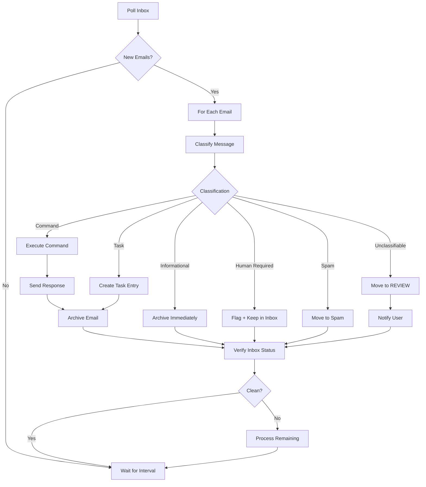

# Agent Email Inbox Management Protocol - Implementation Plan

## Overview

This plan creates a comprehensive email inbox management protocol for FrankOS AI agents. The protocol defines clear operational rules, classification logic, and repeatable procedures - essentially a "runbook for a junior system administrator" that the AI agent can follow.

## Current State Analysis

The existing `skills/email-listener` skill provides:
- IMAP polling with configurable intervals
- Message classification (command, normal, unauthorized, confirmation, freeform)
- Command prefix detection (TIM:)
- Basic cleanup (move to trash / delete)
- SMTP response sending

**What's Missing:**
- Formal inbox hygiene rules (target: 0-3 emails)
- Folder structure management (Commands, Tasks, Archive, Notifications)
- Inbox status verification step after processing
- Task creation integration with external systems (Obsidian)
- Clear "clean inbox" definition and enforcement
- Agent response templates

---

## Implementation Tasks

### T001: Create Agent Inbox Management Runbook Module

Create `skills/email-listener/src/inbox-manager.ts` containing:

1. **AgentInstructions interface** - Structured prompt for the AI agent
2. **InboxStatus type** - Count of unread, flagged, total emails
3. **InboxCleanlinessTarget** - Configuration for inbox thresholds
4. **getInboxStatus()** - Query current inbox state
5. **verifyInboxClean()** - Validate inbox meets cleanliness criteria
6. **InboxManager class** - Main orchestrator

### T002: Add Folder Management Functions

Create `skills/email-listener/src/folder-manager.ts` with:

1. **FolderStructure type** - Define expected folders
2. **ensureFolderStructure()** - Create required folders if missing
3. **moveToFolder()** - Move email to specific folder
4. **getFolderStats()** - Get email counts per folder
5. Supported folders: Inbox, Commands, Tasks, Archive, Notifications, Spam, REVIEW

### T003: Add Task Creation Integration

Create `skills/email-listener/src/task-creator.ts` with:

1. **TaskTemplate interface** - Standard task format
2. **createTaskFromEmail()** - Convert email to task entry
3. **ObsidianTaskFormatter** - Format tasks for Obsidian vault
4. **TaskSource tracking** - Tag tasks with "email" source
5. Support integration with OpenClaw task system

### T004: Enhance Message Classification

Update `skills/email-listener/src/classify_message.ts`:

1. Add new classification categories from protocol:
   - Command (TIM: prefix)
   - Task (requires work/follow-up)
   - Informational (newsletters, notifications)
   - Human Required (needs response)
   - Spam
   - Junk System Mail
2. Add classification action mapping
3. Add priority scoring for "Human Required" items

### T005: Create Agent Instructions Documentation

Create `skills/email-listener/AGENT-INBOX-MANAGEMENT.md`:

The runbook document containing:
- Definition of clean inbox
- Processing loop workflow
- Classification table with actions
- Folder structure rules
- Inbox hygiene rules
- Verification step
- Error handling procedures
- Example agent instructions

### T006: Integrate with Main Index

Update `skills/email-listener/src/index.ts`:

1. Import and initialize inbox manager
2. Add inbox status check to poll cycle
3. Integrate folder management on startup
4. Add verification step after processing

---

## File Changes Summary

| File | Action |
|------|--------|
| `skills/email-listener/src/inbox-manager.ts` | Create |
| `skills/email-listener/src/folder-manager.ts` | Create |
| `skills/email-listener/src/task-creator.ts` | Create |
| `skills/email-listener/src/classify_message.ts` | Enhance |
| `skills/email-listener/src/index.ts` | Integrate |
| `skills/email-listener/AGENT-INBOX-MANAGEMENT.md` | Create |

---

## Mermaid Diagram: Email Processing Flow



---

## Classification Action Mapping

| Category | Action | Destination |
|----------|--------|--------------|
| Command | Execute + Respond + Archive | Commands folder |
| Task | Create task + Archive | Tasks folder |
| Informational | Archive | Archive folder |
| Human Required | Flag + Keep unread | Inbox |
| Spam | Move to spam | Spam folder |
| Junk System Mail | Archive | Archive folder |
| Unclassifiable | Move to REVIEW | REVIEW folder |

---

## Inbox Hygiene Rules

1. **Never leave processed mail in the inbox**
2. **Archive aggressively**
3. **Only leave items requiring human attention**
4. **No unread messages allowed** (except human-required)
5. **Inbox target: 0-3 emails**

---

## Verification Step Output

After each processing cycle:

```
Inbox Status Check
==================
Unread emails: 0
Flagged emails: 1
Inbox count: 1

Status: CLEAN
```

If inbox > threshold:
```
Status: NEEDS PROCESSING
Inbox count: 5 (threshold: 3)
```

---

## Integration Points

1. **OpenClaw Agent** - Forward freeform emails for processing
2. **Obsidian** - Create task entries in vault
3. **IMAP/SMTP** - Email communication via existing skill
4. **Logging** - Track all classification decisions

---

## Success Criteria

- Inbox maintained at 0-3 emails
- All emails classified within 5 minutes of receipt
- No processed emails left in inbox
- Clear audit trail of classification decisions
- Task creation for actionable items
