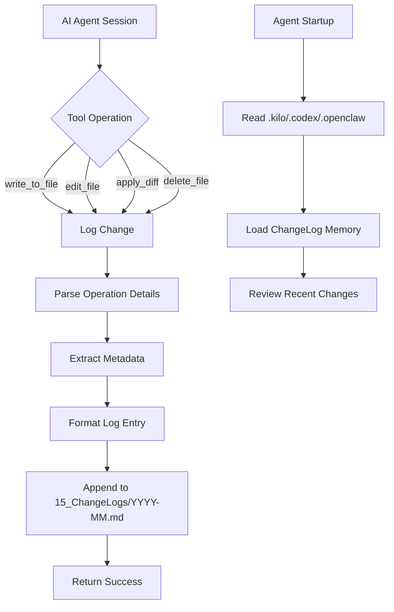

# AI Agent Change Logging System - Implementation Plan

## Overview

This plan implements a comprehensive change logging system for AI Agents (OpenClaw, Kilo Code, Codex) to track significant file modifications in real-time within the myVault second brain.

## Design Decisions Summary

| Decision | Choice |
|----------|--------|
| Scope | Significant/completed changes only |
| Storage | `15_ChangeLogs/` directory |
| Format | Markdown (Obsidian-friendly) |
| Timing | Immediately after each tool use |
| Agents | Kilo Code, Codex, OpenClaw |

## System Architecture



## File Structure

```
myVault/
├── 15_ChangeLogs/              # NEW: Change log directory
│   ├── 2026-03.md             # Monthly log files
│   ├── 2026-04.md
│   └── README.md              # Change log documentation
├── 14_Schemas/
│   └── change-log.schema.json # NEW: Schema for change entries
├── 11_Agents/
│   ├── Log-Minder-Agent.md    # UPDATED: Add ChangeLogs access
│   └── OpenClaw-Agent.md      # NEW: OpenClaw agent spec
├── .kilo                      # UPDATED: Add ChangeLogs to startup
├── .codex                     # UPDATED: Add ChangeLogs to startup
└── .openclaw                  # NEW: OpenClaw startup config
```

## Change Log Entry Format

Each change entry will be appended to the monthly markdown file in this format:

```markdown
## 2026-03-04T16:44:51Z | agent=kilo-code | session=abc123

**File:** `src/commands/deploy.ts`  
**Operation:** modify  
**Lines:** 45-67  
**Project:** OpenClaw Deployment Fix  

**Reason:**  
Fixed deployment configuration to handle edge case where environment variables were not properly loaded during container startup.

---
```

## Implementation Tasks

### Phase 1: Infrastructure Setup

**T001 - Create myVault directory structure (15_ChangeLogs/)**
- Create `C:\Users\fjventura20\myVault\15_ChangeLogs\`
- Add `.gitkeep` or README for directory documentation

**T002 - Create change-log.schema.json in 14_Schemas/**
- Define JSON Schema for change log entries
- Include all fields: timestamp, agent, file, operation, lines, reason, project, session

**T003 - Create .openclaw startup config file**
- Mirror structure of `.kilo` and `.codex`
- Include ChangeLogs in `read_on_every_startup` section
- Reference existing agent specs and constitutions

**T004 - Update .kilo config**
- Add `15_ChangeLogs/README.md` to startup reads
- Add reference to latest monthly log file

**T005 - Update .codex config**
- Same updates as T004 for Codex agent

### Phase 2: Template and Documentation

**T006 - Create monthly log file template**
- File: `15_ChangeLogs/2026-03.md`
- Include header with summary stats
- Add example entries as documentation

**T013 - Update Log Minder Agent spec**
- Add `15_ChangeLogs/` to Allowed Directories
- Document change log review responsibilities

**T014 - Create OpenClaw Agent spec**
- Create `11_Agents/OpenClaw-Agent.md`
- Define role and ChangeLogs access

### Phase 3: Implementation

**T007 - Create helper module for change log operations**
- Location: `src/infra/change-logger.ts`
- Functions:
  - `initializeChangeLog()` - Ensure monthly file exists
  - `logChangeEntry(entry: ChangeLogEntry)` - Append entry
  - `getCurrentSessionId()` - Extract from environment
  - `detectAgentName()` - Identify current agent

**T008 - Implement logChangeEntry function**
- Accept all required fields as parameters
- Format as markdown entry
- Append to appropriate monthly file
- Handle file locking for concurrent access

**T009 - Integrate into file write operations**
- Hook into `write_to_file` tool
- Extract file path, content length
- Prompt for reason/context
- Call `logChangeEntry()`

**T010 - Integrate into file edit operations**
- Hook into `edit_file` tool
- Capture old_string/new_string diff stats
- Calculate lines affected
- Call `logChangeEntry()`

**T011 - Integrate into file diff operations**
- Hook into `apply_diff` tool
- Capture line ranges from diff
- Call `logChangeEntry()`

### Phase 4: Testing and Validation

**T012 - Create example change log entry**
- Manually create test entry
- Verify format renders correctly in Obsidian
- Confirm all fields present

**T015 - Test end-to-end workflow**
- Make test file change
- Verify entry appears in 15_ChangeLogs/
- Confirm agent startup reads ChangeLogs

## Key Design Principles

1. **Non-intrusive**: Logging happens transparently without disrupting agent workflow
2. **Human-readable**: Markdown format for easy review in Obsidian
3. **Structured**: Consistent format with all required metadata
4. **Scalable**: Monthly file rotation prevents single file from growing too large
5. **Agent-aware**: Each agent identifies itself and maintains separate session tracking

## Success Criteria

- [ ] Every significant file change is logged within 1 second
- [ ] Change logs are readable in Obsidian with proper formatting
- [ ] All agents (Kilo, Codex, OpenClaw) read ChangeLogs on startup
- [ ] Log entries contain all 8 required fields
- [ ] Monthly files auto-create on first write
- [ ] Concurrent writes from multiple agents don't corrupt files

## Notes

- Significant changes are defined as: file writes, edits, diffs, and deletes
- Line numbers captured from diff operations when available
- Session ID extracted from environment or generated uniquely
- Project context inferred from file path or provided by agent
- All timestamps in ISO 8601 UTC format
