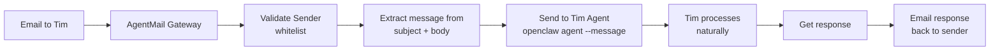

# Tim Email Interface - Freeform Messaging

## Overview
Turn Tim's email address into a direct messaging channel. Any email from a whitelisted sender gets forwarded to Tim agent, and his response comes back via email.

## User Experience

**Send email to:** `timsmail@agentmail.to`

**Email can contain:**
- Subject: Anything (or blank)
- Body: Any message - "Tim, can you check if I have any new tasks?" or "What's on my calendar today?"

**Tim responds** via email with his answer.

## Architecture



## Implementation Steps

### T001: Simplify Message Processing
- Remove command parsing requirements
- Accept ANY email from whitelisted sender
- Combine subject + body as the message to Tim

### T002: Add Agent Forwarding
- Use `openclaw agent --message "<message>" --agent tim`
- This sends the message to Tim agent for natural processing
- Capture the agent's response

### T003: Add Email Response
- Send response email back to original sender
- Format: Subject = "Re: [original subject]", Body = Tim's response

### T004: Add Processing Status
- Send immediate "Tim received your message" acknowledgment
- Then send final response when Tim completes

## Files to Modify
- `services/agentmail-gateway.js` - Main logic
- `config/agent_email.json` - Config (already done)

## Configuration
```json
{
  "agent_name": "tim",
  "enable_freeform": true,
  "message_timeout_ms": 120000
}
```

## Security
- Only whitelisted email addresses can message Tim
- Rate limiting still applies (5/hour, 20/day)
- All messages logged for debugging
