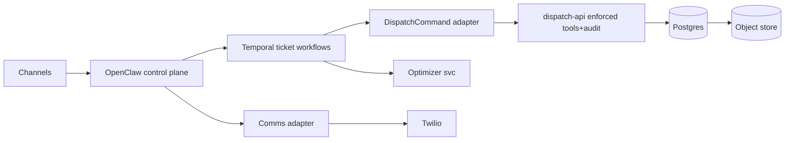
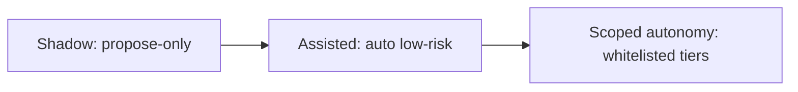

# Real Dispatch vNext proposal

## Executive summary

Enabled connectors: **github**. The repo already enforces the right autonomy invariants: **closed toolset → dispatch-api**, fail-closed validation, **Idempotency-Key replay**, correlation IDs in timeline/audit, evidence-gated closeout, and ops kill-switches (`/ops/autonomy/*`). vNext: keep that **enforced data plane**, and add a **durable autonomy control plane** with **Temporal (TS)** orchestrating holds/approvals/reschedules as _workflows_ that call dispatch-api via the existing tools-plugin bridge (Activities). Temporal is the best Node/TS fit (official Node support incl. 22). citeturn2search0

## Recommended architecture



Standardize tracing on **W3C `traceparent`/`tracestate`** (OTel default), mapping to current `x-trace-id` for backward compatibility. citeturn4search0turn5search0 Use Vault for DB dynamic creds + auditability. citeturn6search3

## Plugin map and scorecard

| Layer                 | vNext pick                       | Swap point               |
| --------------------- | -------------------------------- | ------------------------ |
| Durable orchestration | Temporal                         | workflow-per-ticket      |
| Optimization          | OR-Tools → Timefold              | OptimizationInput/Output |
| Agent control flow    | OpenClaw (+LangGraphJS optional) | “decision step” module   |
| Comms                 | Twilio → Fonoster/FreeSWITCH     | CommsEnvelope            |

citeturn2search6turn2search1turn3search7turn3search2turn3search0turn3search6

| Candidate | TS fit | Ops | Why                                                          |
| --------- | -----: | --: | ------------------------------------------------------------ |
| Temporal  |      5 |   3 | TS SDK + workflow sandbox citeturn2search0                |
| Cadence   |      2 |   3 | CNCF sandbox; Go/Java-first citeturn2search2turn7search0 |

## Roadmap, rollout, and contracts



Backlog (AC = acceptance criteria):

1. **DispatchCommand adapter v1**: AC idempotent retries; 409 mismatch surfaced; correlation + traceparent propagated end-to-end. citeturn4search0turn5search0
2. **Temporal ticket workflow v0**: AC hold→confirm→release/rollback modeled as timers+signals; crash-replay safe; no direct DB writes. citeturn2search0
3. **Optimizer “recommend” service**: AC VRPTW/time-windows supported; outputs ranked assignments + explanations; only writes via dispatch-api. citeturn2search6turn2search1
4. **Comms adapter v0**: AC every inbound/outbound becomes ticket timeline evidence; optional Twilio compliance/audit signals captured. citeturn3search6turn4search2

```ts
export type DispatchCommand = {
  toolName: string;
  ticketId?: string;
  actor: { id: string; role: string; type: "HUMAN" | "AGENT" | "SERVICE" | "SYSTEM" };
  requestId: string;
  correlationId: string;
  traceparent?: string;
  tracestate?: string;
  token?: string;
  payload?: unknown;
};
export type OptimizationInput = {
  tickets: any[];
  techs: any[];
  horizon: { start: string; end: string };
};
export type OptimizationOutput = {
  proposals: Array<{
    ticketId: string;
    techId: string;
    start: string;
    end: string;
    score: number;
    reasons: any[];
  }>;
  meta: { engine: string; runId: string };
};
export type CommsEnvelope = {
  channel: "sms" | "voice" | "email";
  direction: "inbound" | "outbound";
  peer: string;
  ticketId?: string;
  correlationId: string;
  raw: any;
  normalized?: any;
  providerMeta?: any;
};
```

Assumptions: Node 22+ stays baseline; dispatch-api endpoints/headers remain as in current bridge; Postgres+object-store deployment exists; OpenClaw remains the channel/session/runtime layer.
