# Cinematic Scroll

<a href="https://mustbesimo.github.io/cinematic-scroll-skill/">
  <picture>
    <source media="(prefers-color-scheme: dark)" srcset="assets/banner-dark_v2.png">
    <source media="(prefers-color-scheme: light)" srcset="assets/banner-light_v2.png">
    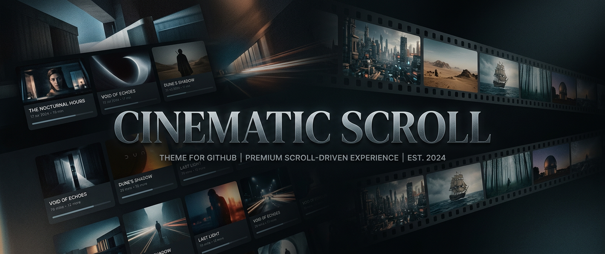
  </picture>
</a>

👉 **[Visit the live landing page](https://mustbesimo.github.io/cinematic-scroll-skill/)** — it adapts to your GitHub theme. Dark mode → **Petroleum Editorial**. Light mode → **Swiss Museum**. Toggle either finish on the site.

<a href="https://mustbesimo.github.io/cinematic-scroll-skill/examples/renaissance/">
  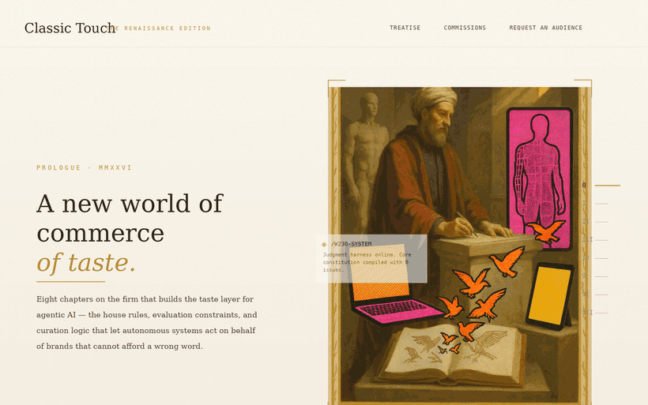
</a>

<sub>↑ The <b>motion</b> is the skill — pinned chapters, multi-depth parallax, mask/stagger title reveals, a tracking index rail. The <b>look</b> is whatever you ask for. This clip happens to be a Renaissance editorial; the same grammar drives a brutalist drop, a neon Gen-Z launch, a noir game page, or your brand. <a href="https://mustbesimo.github.io/cinematic-scroll-skill/examples/renaissance/">Scroll it live →</a></sub>

**A free, open-source Agent Skill (Claude · Cursor · Hermes · OpenClaw) for building cinematic, scroll-driven websites in any visual style.** Describe the aesthetic — palette, mood, references — and get pinned chapters, multi-depth parallax, 3D tilt, and full release pages art-directed to match. The cinematic *motion* is the constant; the *look* is yours.

> **License:** MIT — free for any use, personal or commercial.  
> **Status:** Developed from working demos and production-informed patterns, then released as open source. Provided as-is; no active maintenance commitment. Issues and PRs welcome.

Built by [Simone Leonelli](https://w230.net) · [simone@w230.net](mailto:simone@w230.net)

---

## Get started — two paths

Pick how you want to build:

**Mode A: Single scroll section** — one runnable `.html` file, no build step, no keys. Perfect for a hero chapter or one-off section.  
**Mode B: Full release site** — complete Next.js project, tested templates, optional AI image generation pipeline. Best for product launches and multi-chapter stories.

---

## Install

Installation varies by platform. See [`COMPATIBILITY.md`](./COMPATIBILITY.md) for detailed step-by-step instructions for Claude, Cursor, Hermes, and OpenClaw, plus troubleshooting.

**Quick start:** After installing, describe what you want to build in chat — see [`examples/PROMPTS.md`](./examples/PROMPTS.md) for 20+ copy-paste examples across aesthetic worlds.

---

## Live examples — five scrollable worlds, one grammar

Same engine, deliberately clashing aesthetics — five **single, build-free `index.html` files** (GitHub-Pages-native) running the skill's **Mode A** grammar: vanilla JS on `requestAnimationFrame` with optional GSAP/ScrollTrigger enhancements. All five retain a dependency-free core; Noir, Luxe, and Pop progressively enhance one showcase beat with deferred GSAP + ScrollTrigger (loaded from CDN with vanilla fallback). All five render fully with **zero image files** (CSS-only placeholders that upgrade when you add stills). Proof the look is a variable, not a default.

<table>
  <tr>
    <td width="50%" valign="top">
      <a href="https://mustbesimo.github.io/cinematic-scroll-skill/examples/renaissance/"></a>
    </td>
    <td width="50%" valign="top">
      <a href="https://mustbesimo.github.io/cinematic-scroll-skill/examples/studio/">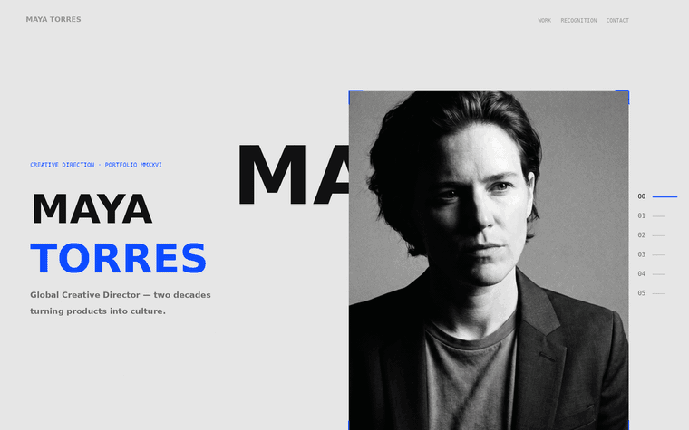</a>
    </td>
  </tr>
  <tr>
    <td width="50%" valign="top">
      <a href="https://mustbesimo.github.io/cinematic-scroll-skill/examples/renaissance/"><b>① Renaissance editorial →</b></a><br>
      <sub>Warm, classical, ornate. Oil-painting heroes, gold↔oxblood morph, serif display. Mirrors the production edition at <a href="https://www.w230.net/reinassence">w230.net/reinassence</a>. <a href="./examples/renaissance/">Source</a>.</sub>
    </td>
    <td width="50%" valign="top">
      <a href="https://mustbesimo.github.io/cinematic-scroll-skill/examples/studio/"><b>② Brutalist creative-director →</b></a><br>
      <sub>Cold, modern, severe. Giant grotesk type, monochrome + electric-blue accent, grey↔ink morph, scroll-driven 3D camera. A fictional CD portfolio in the spirit of spare Swiss-editorial sites. <a href="./examples/studio/">Source</a>.</sub>
    </td>
  </tr>
</table>

<table>
  <tr>
    <td width="33%" valign="top">
      <a href="https://mustbesimo.github.io/cinematic-scroll-skill/examples/noir/">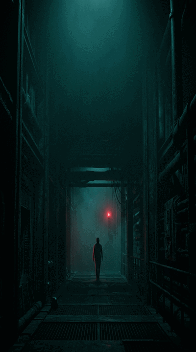</a>
    </td>
    <td width="33%" valign="top">
      <a href="https://mustbesimo.github.io/cinematic-scroll-skill/examples/luxe/"></a>
    </td>
    <td width="33%" valign="top">
      <a href="https://mustbesimo.github.io/cinematic-scroll-skill/examples/pop/">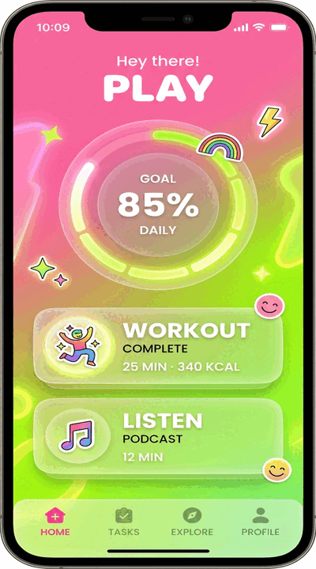</a>
    </td>
  </tr>
  <tr>
    <td width="33%" valign="top">
      <a href="https://mustbesimo.github.io/cinematic-scroll-skill/examples/noir/"><b>③ Sci-fi noir →</b></a><br>
      <sub>Studio <b>VANTASCOPE</b>, title <b>HOLLOW STAR</b>. Near-black void, deep-teal fog, crimson edge-light, film grain. 4 chapters, scroll-linked 3D camera, vertical mask-wipe title reveals. <a href="./examples/noir/">Source</a>.</sub>
    </td>
    <td width="33%" valign="top">
      <a href="https://mustbesimo.github.io/cinematic-scroll-skill/examples/luxe/"><b>④ Quiet luxury →</b></a><br>
      <sub>Maison <b>SOLENNE</b>. Warm ivory + sand, muted cognac accent, thin-serif display, vast negative space. 220vh pins, ~3% background drift, letter-spacing-scrub reveals. <a href="./examples/luxe/">Source</a>.</sub>
    </td>
    <td width="33%" valign="top">
      <a href="https://mustbesimo.github.io/cinematic-scroll-skill/examples/pop/"><b>⑤ Gen-Z pop →</b></a><br>
      <sub>App <b>BLOOM</b>. Candy-pink + electric-lime gradients, bold rounded type, fast parallax, floating CSS phone-UI. <a href="./examples/pop/">Source</a>.</sub>
    </td>
  </tr>
</table>

**Same motion grammar; any aesthetic.** These five show different visual directions the skill can art-direct — change the copy, palette, and references, and the same engine produces any world you describe. This isn't an exhaustive list of *styles* (the styling is infinite). It's a proof that the cinematic *motion* is the constant, and the *look* is whatever you ask for.

### Aesthetic directions

Beyond these five live examples, the skill can art-direct itself into any visual world. Below are six concept *style directions* to illustrate the range:

<table>
  <tr>
    <td width="33%">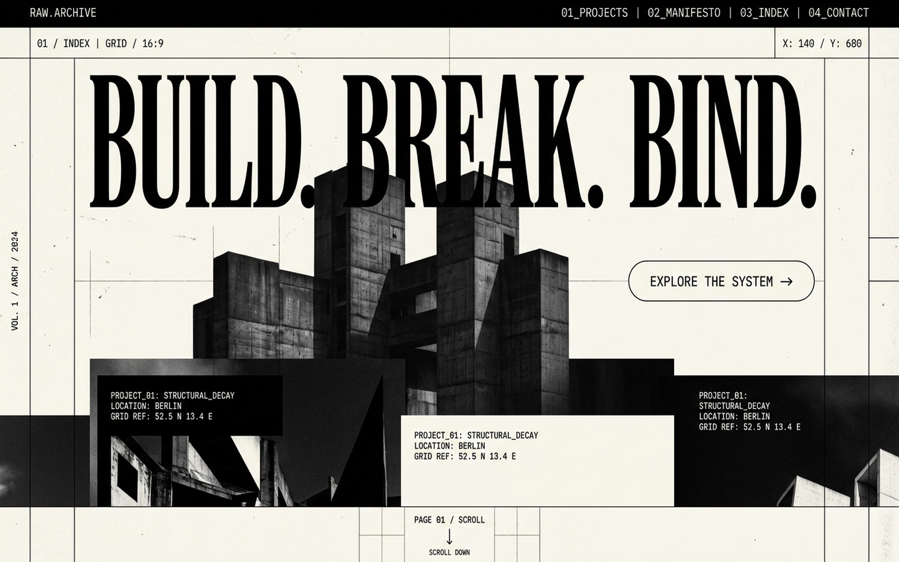<br><sub><b>Brutalist</b> — stark, grid-driven</sub></td>
    <td width="33%">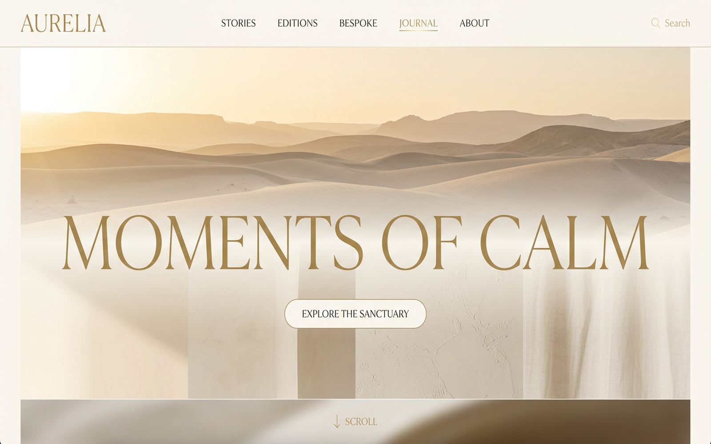<br><sub><b>Quiet luxury</b> — earth palette, space</sub></td>
    <td width="33%">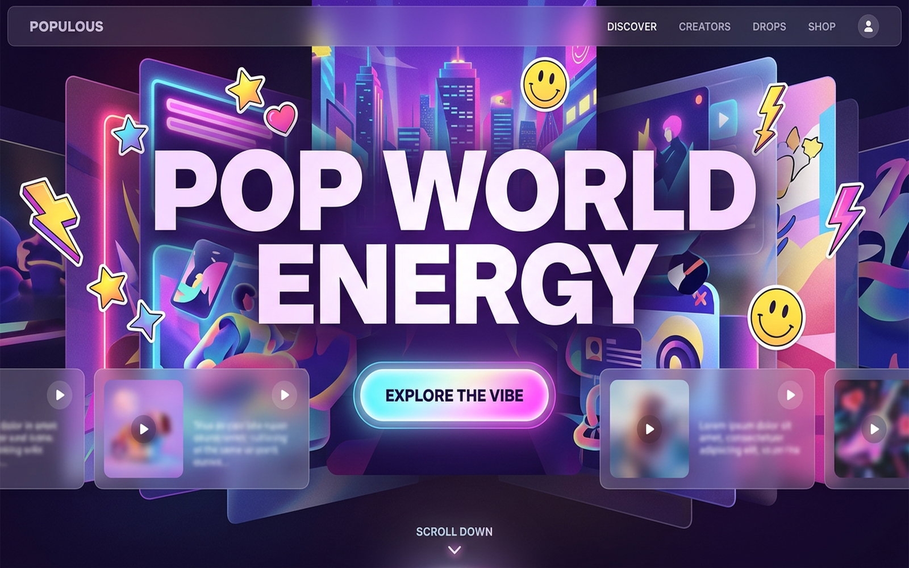<br><sub><b>Pop</b> — neon, playful</sub></td>
  </tr>
  <tr>
    <td width="33%">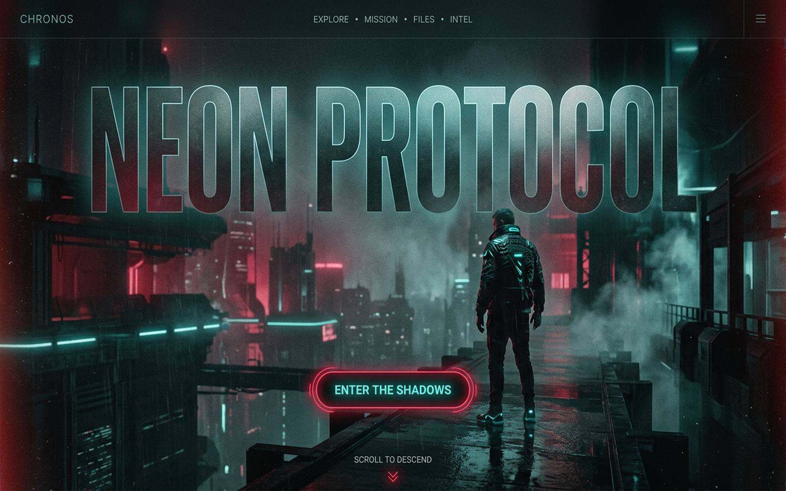<br><sub><b>Sci-fi noir</b> — teal, edge-lit</sub></td>
    <td width="33%">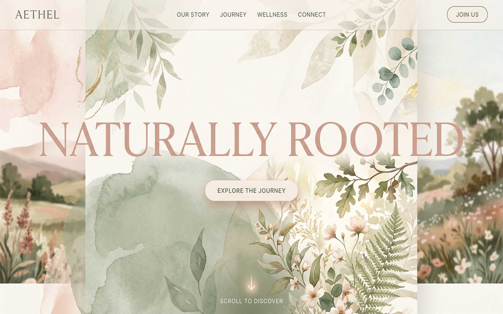<br><sub><b>Wellness</b> — blush, painterly</sub></td>
    <td width="33%">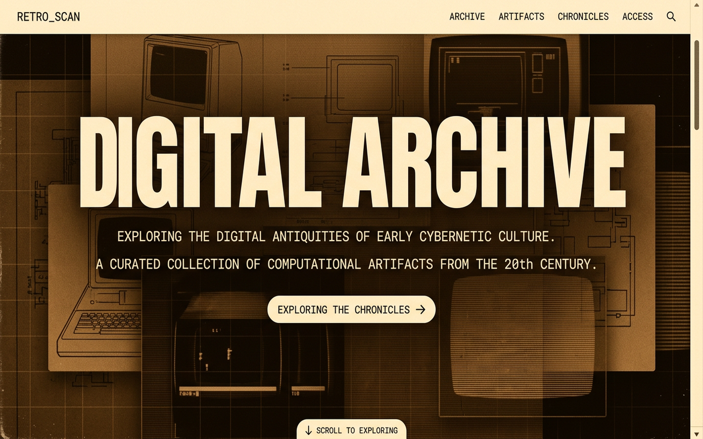<br><sub><b>Retro archive</b> — amber, analogue</sub></td>
  </tr>
</table>

<sub>Six style directions generated by the skill's own [fal.ai](https://fal.ai) pipeline (or bring your own images / go CSS-only at $0). These are concept stills that show possible aesthetic ranges — the five live examples above are the scrollable proofs.</sub>

### Running locally

```bash
python3 -m http.server 8099   # then open /examples/renaissance/ · /studio/ · /noir/ · /luxe/ · /pop/
```

**Under the motion, every chapter ships with:**

| | |
|---|---|
| **Cinematic depth** | 5–7 parallax layers per chapter, perspective camera, dolly-back transitions |
| **Editorial type** | Oversized titles with word-stagger / clip-path mask / letter-spacing-scrub reveals |
| **Atmosphere morphs** | Backgrounds crossfade between chapter color-worlds as you scroll |
| **Image pipeline** | Optional: fal.ai-generated heroes (FLUX.2, Nano Banana, Imagen); required: bring your own images or render CSS-only visuals. Generated assets remain subject to your input rights and model-provider terms — review output before commercial deployment. |
| **Bulletproof basics** | Reduced-motion fallback, iOS video safety, mobile-stacked layout, transform/opacity-only core hot paths; optional GSAP showcase enhancements in selected examples; no WebGL required. Validate performance on target devices before production. |

---

## Quickstart

### Mode A — instant scroll section
> *"Use cinematic-scroll to build a self-contained HTML pinned hero chapter for [YOUR BRAND]. Include a progress HUD."*

You get one runnable `.html` file. Open it. Done.

### Mode B — full release site
> *"Use cinematic-scroll to scaffold a complete Shopify-Editions-tier release page for [YOUR PRODUCT IN ONE LINE]. Demo mode first — do not require my fal.ai key. Copy all bundled templates verbatim. 8 chapters. Finish with the exact commands to run."*

Then, in the scaffolded project:

```bash
npm install
npm run dev
```

Open `http://localhost:3000` — a full 8-chapter cinematic page, CSS-only visuals, **zero AI setup**.

Want real generated chapter art? Add your own [fal.ai](https://fal.ai) key and run the command below. Generation cost varies by model and resolution — see `MODELS.md` and current fal.ai pricing before running a batch.

```bash
npm run setup        # interactive key wizard → writes .env.local
npm run generate     # generates all chapter heroes into public/generated/
```

Full walkthrough: [`examples/GETTING_STARTED.md`](./examples/GETTING_STARTED.md). Model menu + costs: [`MODELS.md`](./MODELS.md).

---

## What's in the box

```
cinematic-scroll-skill/
├── SKILL.md                  # the agent contract (Mode A + Mode B). For Claude, not humans.
├── README.md                 # you are here
├── LICENSE                   # MIT
├── manifest.json             # skill metadata (free)
├── MODELS.md                 # fal.ai model menu, costs, when-to-use
├── examples/
│   ├── PROMPTS.md            # 20+ trigger prompts across aesthetic worlds
│   ├── GETTING_STARTED.md    # fal.ai setup, troubleshooting, queue+webhook
│   ├── KNOWN_ISSUES.md       # QA log of real failure modes + fixes
│   ├── renaissance/          # Mode A example — warm classical editorial
│   ├── studio/               # Mode A example — brutalist creative-director portfolio
│   ├── noir/                 # Mode A example — sci-fi noir (VANTASCOPE)
│   ├── luxe/                 # Mode A example — quiet luxury (Maison Solenne)
│   └── pop/                  # Mode A example — Gen-Z pop (BLOOM)
└── templates/nextjs/         # tested, copy-verbatim Next.js App Router project
    ├── app/ (+ api/fal/*, generate-edition-asset)
    ├── components/ (ChapterScene, ChapterDemoVisual, EditionsPage, SmoothScrollProvider)
    ├── lib/ (editions-manifest, fal-*, prompt-contract, use-lenis, use-device)
    ├── scripts/ (setup.mjs, generate-chapter-assets.mjs)
    └── package.json, tailwind.config.ts, tsconfig.json, …
```

## Peer dependencies (in the consuming app)

```bash
npm install choreo-3d framer-motion gsap @gsap/react lenis @fal-ai/client @fal-ai/server-proxy
```

The motion primitives target the [`choreo-3d`](https://www.npmjs.com/package/choreo-3d) package, with a built-in **vanilla fallback** (sticky + IntersectionObserver + rAF) for sandboxes where npm packages can't be installed — identical math, same keyframes.

**On GSAP:** as of the 2025 Webflow acquisition, [GSAP is 100% free](https://gsap.com/) — every former Club plugin included (SplitText, ScrollSmoother, ScrollTrigger, MorphSVG…), commercial use too. The Next.js build (Mode B) uses **ScrollTrigger + SplitText** for pinning and title reveals; the standalone demos retain a **vanilla rAF core** with optional deferred GSAP enhancements in selected showcase beats (loaded from CDN with vanilla fallback). This means Mode A files run from `file://` with zero build, and gracefully fall back to CSS-only rendering if the CDN is unavailable. For low-level GSAP help, pair this with the official [`greensock/gsap-skills`](https://github.com/greensock/gsap-skills) — that skill teaches the GSAP API; this one teaches the cinematic system on top.

---

## Originality & legal

The reference direction is Shopify Editions, used **only** as an art-direction benchmark — chaptered release storytelling. The skill never copies Shopify's assets, logos, copy, source, or exact compositions, and never bakes readable UI text into generated images or imitates a named living artist. Generated assets may be used subject to fal.ai, model-provider and input-rights terms. Review output before commercial deployment.

## License

MIT © 2026 Simone Leonelli — see [LICENSE](./LICENSE).

Built something with it? I'd genuinely love to see it: **simone@w230.net**
</content>
</invoke>
