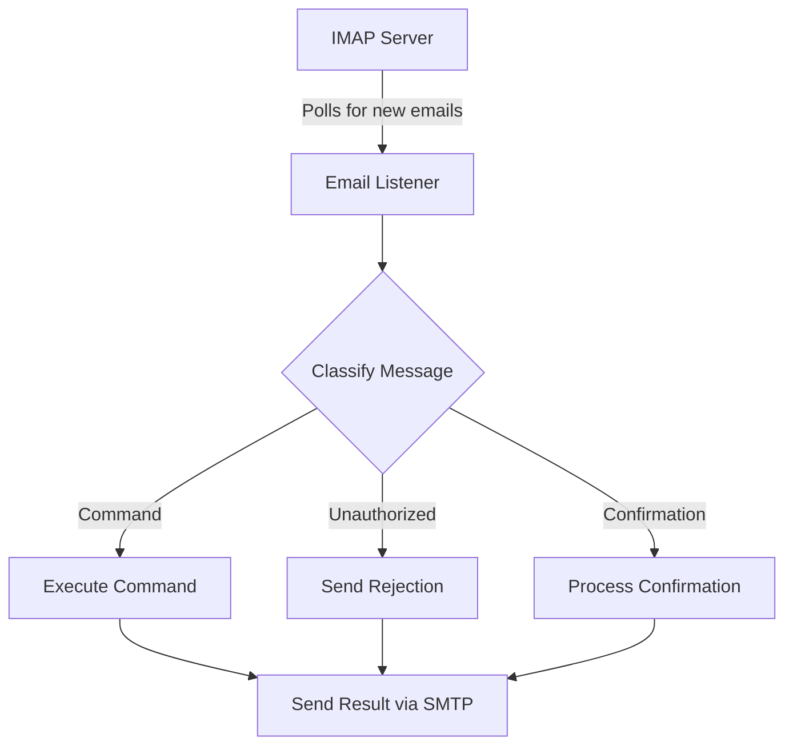

# Email Listener Skill

Provides email-based remote command interface for Tim (Guardian Agent).

## Overview

The Email Listener skill enables Tim to receive and execute commands via email. It polls an IMAP inbox for new emails, classifies them as commands or normal messages, and executes authorized commands while sending responses back via SMTP.

## Features

- **IMAP Polling**: Connects to any IMAP-compatible email server to receive commands
- **SMTP Responses**: Sends command results back to the sender via email
- **Security Controls**: Sender whitelist, command prefix requirement, confirmation protocol
- **Command System**: Built-in commands for system status, security audits, agent management

## Architecture



## Configuration

### Environment Variables

| Variable                             | Description                      | Default                                                           |
| ------------------------------------ | -------------------------------- | ----------------------------------------------------------------- |
| `FRANKOS_EMAIL_IMAP_HOST`            | IMAP server hostname             | `imap.example.com`                                                |
| `FRANKOS_EMAIL_IMAP_PORT`            | IMAP server port                 | `993`                                                             |
| `FRANKOS_EMAIL_IMAP_SECURE`          | Use TLS/SSL                      | `true`                                                            |
| `FRANKOS_EMAIL_IMAP_USER`            | IMAP username                    | -                                                                 |
| `FRANKOS_EMAIL_IMAP_PASSWORD`        | IMAP password                    | -                                                                 |
| `FRANKOS_EMAIL_ALLOWED_SENDERS`      | Comma-separated allowed senders  | -                                                                 |
| `FRANKOS_EMAIL_REQUIRE_CONFIRMATION` | Commands requiring confirmation  | `DELETE,RESTART,SHUTDOWN`                                         |
| `FRANKOS_EMAIL_CONFIRMATION_TIMEOUT` | Confirmation timeout (ms)        | `300000`                                                          |
| `FRANKOS_EMAIL_POLLING_INTERVAL`     | Polling interval (ms)            | `300000`                                                          |
| `FRANKOS_EMAIL_POLLING_ENABLED`      | Enable polling                   | `true`                                                            |
| `FRANKOS_EMAIL_ENABLED_COMMANDS`     | Comma-separated enabled commands | `STATUS,SECURITY_AUDIT,CHECK_UPDATES,MEMORY_COMPACT,AGENT_STATUS` |

### JSON Configuration

You can also provide a JSON configuration file:

```json
{
  "imap": {
    "host": "imap.gmail.com",
    "port": 993,
    "secure": true,
    "user": "tim@frankos.local",
    "password": "your-app-password"
  },
  "security": {
    "allowedSenders": ["admin@frankos.local"],
    "requireConfirmation": ["DELETE", "RESTART", "SHUTDOWN"],
    "confirmationTimeout": 300000
  },
  "polling": {
    "intervalMs": 300000,
    "enabled": true
  },
  "commands": {
    "enabled": [
      "STATUS",
      "SECURITY_AUDIT",
      "CHECK_UPDATES",
      "MEMORY_COMPACT",
      "AGENT_STATUS"
    ],
    "disabled": []
  }
}
```

## Usage

### Starting the Email Listener

```typescript
import { initialize, start, stop, getStatus } from "./src/index.js";

// Initialize with optional config path
await initialize("/path/to/config.json");

// Start polling
start();

// Check status
const status = getStatus();
console.log(status);

// Stop when done
stop();
```

### Sending Commands via Email

To send a command, email the configured inbox with:

1. Subject or body must start with `TIM:`
2. Command name in uppercase
3. Optional arguments

**Examples:**

```
Subject: TIM: STATUS

Subject: TIM: AGENT_STATUS

Subject: TIM: SECURITY_AUDIT

Subject: TIM: CHECK_UPDATES

Subject: TIM: MEMORY_COMPACT
```

### Confirmation Protocol

Commands marked as high-risk require confirmation. When you send such a command:

1. You receive a confirmation request email
2. Reply with `CONFIRM`, `YES`, `APPROVE`, or `EXECUTE` in the subject or body
3. The command executes within 5 minutes of the confirmation request

## Available Commands

| Command          | Description        | Risk Level |
| ---------------- | ------------------ | ---------- |
| `STATUS`         | Get system status  | Safe       |
| `SECURITY_AUDIT` | Run security audit | Safe       |
| `CHECK_UPDATES`  | Check for updates  | Safe       |
| `MEMORY_COMPACT` | Compact memory/GC  | Medium     |
| `AGENT_STATUS`   | Get agent status   | Safe       |
| `PING`           | Test connectivity  | Safe       |

## Security

- **Sender Allowlist**: Only emails from configured senders are processed
- **Command Prefix**: Commands must start with `TIM:` to prevent accidental execution
- **Confirmation Protocol**: High-risk commands require explicit confirmation
- **Timeout**: Confirmation requests expire after 5 minutes

## Integration

This skill can be loaded as part of the Tim agent startup sequence:

```typescript
import { loadSkill } from "@openclaw/skill-sdk";

await loadSkill("email-listener", {
  config: {
    /* ... */
  },
});
```

## Dependencies

- `imap-simple` - IMAP client for receiving emails
- `nodemailer` - SMTP client for sending responses
