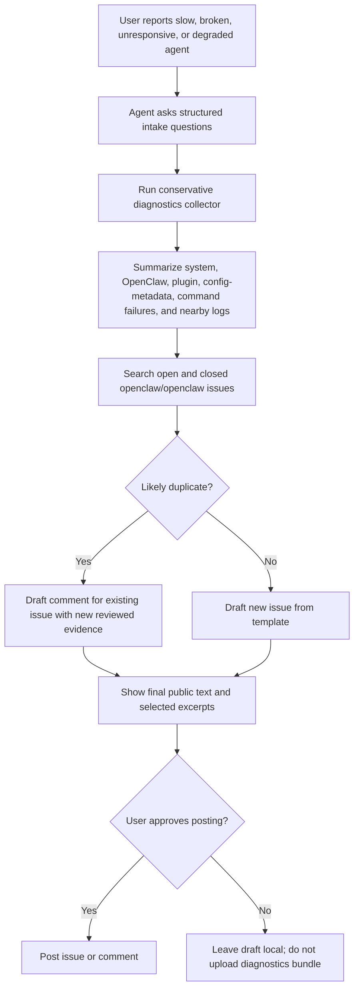

# File OpenClaw Agent Bug

## Goal

Turn vague reports like "my agent is slow," "it stopped responding," or "it is not as smart" into a privacy-safe GitHub issue that maintainers can triage. Prioritize concrete runtime evidence over speculation.

Suggested public handoff text:

```text
Give this to your agent: Use $file-openclaw-agent-bug to collect conservative OpenClaw diagnostics, search for similar openclaw/openclaw issues, and draft a triage-ready bug report. Do not post secrets, raw credentials, full config files, private prompts, or unreviewed logs.
```

## Scenarios

Use this skill for reports like:

- "My agent is slow" or responses suddenly take much longer than before.
- "My agent is broken" or stalls, times out, exits early, or never returns.
- "It is not as smart" or appears to lose tools, context, planning quality, or model/provider routing.
- "Tools are missing" or the agent cannot call tools that should be available.
- "It stopped responding after an update" or after changing config, auth, models, plugins, MCP servers, gateway settings, or workspace instructions.
- "A plugin made it worse" or a plugin is installed but disabled, failing validation, or changing runtime behavior.
- "It only fails in this workspace/thread" or only through a specific entrypoint such as CLI, desktop UI, Telegram, or browser.

Example handoff prompts a user might give their agent:

```text
Use $file-openclaw-agent-bug. OpenClaw got much slower after I installed a plugin yesterday. Collect conservative diagnostics, search for similar issues, and draft the GitHub issue for my approval.
```

```text
Use $file-openclaw-agent-bug. My agent says tools are unavailable in this workspace, but they worked in a new install. Please capture config/plugin differences and draft an issue without posting private logs.
```

```text
Use $file-openclaw-agent-bug. Since the last update, the desktop UI starts a run but the agent never responds. Gather the minimal evidence maintainers need and check for duplicate issues first.
```

## Flow



## Workflow

1. Capture the symptom before collecting data.
   - Ask these intake questions and record the answers before running diagnostics:
     - What exact prompt, command, or UI action failed?
     - What did you expect the agent to do?
     - What happened instead, including latency, hangs, messages, missing tools, or weaker reasoning?
     - When did it last work correctly, and when did it start failing?
     - Does it reproduce in a new thread, new workspace, retry, or after disabling suspect plugins?
     - Which model, provider, auth profile, workspace, and entrypoint were selected?
     - What changed recently: OpenClaw update, config edit, plugin install, auth change, OS update, network/proxy change?
     - May I collect a conservative local diagnostics bundle and search public issues?
   - Classify the symptom as latency, no response, weaker reasoning, missing tools, crash, auth failure, plugin failure, config mismatch, or unknown.

2. Collect a conservative diagnostics bundle.
   - Prefer the bundled script from this skill directory. Run it by absolute path if your current working directory is not the skill directory:

```bash
bash /path/to/file-openclaw-agent-bug/scripts/collect-openclaw-diagnostics.sh --output ./openclaw-diagnostics
```

- If the script cannot run, manually collect equivalent evidence: OpenClaw version/status, OS, Node/package manager versions, active config, plugin list, recent logs, and relevant command output.
- Default output is intentionally conservative: it records config metadata rather than raw config content, skips global `/tmp`, and summarizes git/env state.
- Use `--include-private-config`, `--include-tmp-logs`, or `--include-git-details` only after explaining the risk and getting explicit user approval.
- Inspect every generated file before sharing. Redaction is a defense-in-depth helper, not permission to post blindly.

3. Compare config against baseline.
   - Use native OpenClaw commands when available, such as status, config file, config validate, or any supported config dump/list/diff command. If a command does not exist, say so in the issue.
   - State the baseline contract explicitly:
     - Baseline used: release defaults / current main defaults / clean profile / unknown.
     - Evidence: command output, file metadata, or repo/version source.
     - Unavailable because: command missing, command failed, install too old, no repo checkout, or unknown.
   - Highlight only meaningful non-defaults: provider/model routing, auth profile, gateway/transport settings, sandbox/approval mode, timeout settings, MCP/tool configuration, memory/context settings, plugin enablement, workspace overrides, and AGENTS/SKILL overlays.
   - Do not paste full private config when a summarized diff will explain the risk.

4. List plugins and extensions.
   - Include installed plugins, active plugins, versions or source paths, validation errors, recent changes, and whether the issue reproduces with suspect plugins disabled.
   - Separate "installed" from "active" and "loaded successfully" from "failed validation."

5. Capture logs around the incident.
   - Prefer a window from roughly 10 minutes before the user noticed the issue through 10 minutes after.
   - Include gateway logs, UI/desktop logs, provider/API errors, plugin validation errors, session-run errors, tool-call failures, and timeout or heartbeat messages.
   - Quote compact excerpts. Do not include unrelated conversations, credentials, personal data, or huge raw logs.

6. Search for similar issues before filing.
   - Read `references/similar-issue-search.md`.
   - Search open and closed issues in `openclaw/openclaw` using symptom words, exact errors, plugin names, provider/model names, and log phrases.
   - Record exact queries, result counts, top candidate issues, and the duplicate decision in the issue body.
   - If a match exists, draft a comment for that issue with the new evidence or link it as related. Draft a new issue only when the failure is materially distinct or the existing issue lacks the needed evidence.

7. Draft the issue and get posting approval.
   - Use `references/issue-template.md`.
   - Produce the completed issue body first, including the reviewed excerpt list and explicit unknowns.
   - Do not upload the full diagnostics directory to GitHub. Paste only selected, reviewed, redacted excerpts.
   - If GitHub access is configured, file with `gh issue create -R openclaw/openclaw` or the available GitHub tool only after the user approves the final body and attachment/excerpt list. Otherwise, produce the completed issue body for the user to post.
   - Title pattern: `[diagnostics] Agent <symptom> on <platform/provider/plugin>`.
   - Include links to similar issues, the diagnostics summary, command failures, and explicit unknowns.

## Privacy Rules

- Never post raw API keys, OAuth tokens, cookies, session tokens, bearer headers, private prompts, private conversation contents, or full unreviewed config files.
- Default to draft-only public output until the user approves the final issue body after diagnostics collection.
- Never attach the full diagnostics bundle to a public issue; quote only necessary redacted excerpts.
- Redact usernames, emails, organization names, hostnames, and absolute home paths when they are not necessary for debugging.
- Do not restart services, disable plugins, edit config, or delete state unless the user explicitly approves that action.
- Mark evidence as "observed" and hypotheses as "suspected." Do not overclaim root cause from a symptom report.

## Resources

- `scripts/collect-openclaw-diagnostics.sh`: Best-effort local collector for conservative system, OpenClaw, plugin, config-metadata, and log evidence. Requires `bash` and `perl`; `openclaw`, `gh`, `node`, `npm`, `pnpm`, `git`, `systemctl`, and `launchctl` are optional.
- `references/issue-template.md`: Issue body template.
- `references/similar-issue-search.md`: Search queries and duplicate-linking guidance.

## Final Draft Checklist

Before asking the user to approve posting, verify the draft has a clear title, impact, reproduction status, baseline source, plugin/config summary, selected redacted log excerpts, command failures, duplicate-search decision, and an explicit sanitization review status.
