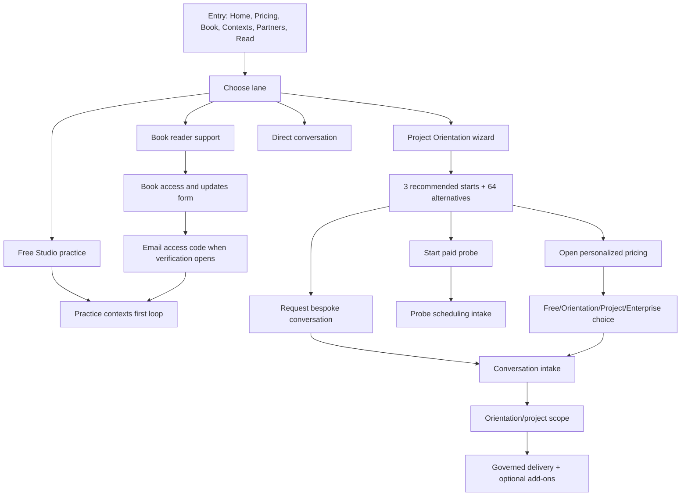

# Spryng Site Flow Map v3 (Internal Strategy, Not Public Nav)

Updated: February 26, 2026
Scope: `stage.spryng.io` + `activesensemaking.com` coherence
Intent: Audience-first architecture, conversion clarity, and brand-safe positioning

## Review Findings (Severity-Ordered)

1. Internal artifacts were exposed in public navigation.

- `site-flow-map` and `return-review` read like internal operating docs when exposed as customer nav destinations.
- This undermines brand confidence for public-sector, nonprofit, and executive buyers.
- **Action taken this pass:** removed both from top-level nav/footer/start links and redirected:
  - `/site-flow-map` -> `/start`
  - `/return-review` -> `/docs/where-to-start`

2. Core conversion pages are strong but still text-dense at first glance.

- Home, pricing, and wizard-results all carry defensible language, but decision makers still face heavy reading before choosing a path.
- This is a clarity risk, not a strategy risk.

3. Audience pathways are partially encoded in logic, but not yet consistently surfaced in UX labels.

- Government/nonprofit thresholds are modeled in wizard/pricing recommendation logic.
- Equivalent audience-specific framing is not yet consistently visible in top-level entry copy.

4. Book flow is coherent now, but still has one secondary duplicate page.

- Canonical reader journey is now `/designing-sensemaking-studies`.
- `/docs/studio-book-plan` remains as a short duplicate surface.

5. Partner and certification pathways are materially improved.

- Distinct conversation intents now route with separate query params and intake prefills.
- Stewardship posture is clearer than prior versions.

## Brand Guardrails (Non-Negotiable)

1. Category: Spryng is the governed sensemaking platform for consequential decisions.
2. Promise boundary: no guarantee claims on participation, response rates, or outcomes.
3. Procurement-first reality: governance confidence before feature language.
4. Method posture: exemplars and pattern briefs, not prescriptive templates.
5. Reader posture: method-first support, optional implementation path.

## Public Navigation Architecture

### Current public nav (after this pass)

- About
- Configurations
- Resources
- Products and Pricing
- CTA: Project Orientation
- CTA: Request a conversation
- Login

### Explicitly internal/not-nav

- Site flow map
- Return review framework as standalone top-level page
- Internal strategy docs and routing diagnostics

### Target nav direction (next cleanup pass)

1. About

- Trust, governance, team, platform

2. Start Here

- Path qualifier + quick audience lanes

3. Practice

- Contexts, book reader path, learning resources

4. Projects

- Orientation, project path, conversation

5. Enterprise

- Controls, diligence docs, readiness pathway

6. Partners

- Certification, Leap, stewardship partnership

## Main Journey Spine (Current)

## Audience Flow Map (All 12 Lanes)

| Audience                                        | Best entry                        | Primary first action                             | Confidence artifact shown                            | Escalation path                                              |
| ----------------------------------------------- | --------------------------------- | ------------------------------------------------ | ---------------------------------------------------- | ------------------------------------------------------------ |
| Individual learner                              | Home or contexts                  | Start Free Studio practice                       | Practice guardrails + first-loop framing             | Orientation when authority/risk appears                      |
| Book buyer                                      | Designing Sensemaking Studies     | Join release updates, then verify when open      | Clear verification + activation steps                | Orientation or project conversation                          |
| Educator/cohort lead (thought leadership niche) | Book page + contexts              | Reader-enabled Sensemaking Studio path           | Studio Free vs Sensemaking Studio comparison         | Orientation when cohort work becomes governed/organizational |
| Consultant/facilitator                          | Wizard + pricing + partners       | Run orientation/wizard and select lane           | 3 recommendations + governance confidence language   | Partner/stewardship conversation                             |
| Org team exploring                              | Home + wizard                     | Complete orientation reflection                  | Context-at-a-glance + top 3 starts                   | Probe kickoff or bespoke conversation                        |
| Exec/board                                      | Pricing + request conversation    | Conversation-led scope                           | Orientation acceptance criteria and readiness packet | High-stakes orientation -> project                           |
| Risk/ethics/compliance lead                     | Wizard/pricing/legal              | High-stakes orientation recommendation           | Trust/governance and participant sourcing docs       | Enterprise controls if required                              |
| Enterprise procurement                          | Pricing + legal docs              | Enterprise conversation (no public fixed price)  | Control-evidence links and readiness packet          | Enterprise enablement + project rollout                      |
| Partner-led client work (thinking partner)      | Certification -> Leap -> Partners | Partnership conversation with intent preset      | Stewardship boundaries + pathway docs                | Pilot/steward partnership packaging                          |
| Returning project owner                         | Login / conversation follow-up    | Continue project or expand                       | Existing governance posture and add-on clarity       | Renew/expand/enterprise                                      |
| Returning participant                           | Invite/Journally lane             | Continue reflective participation                | Consent and continuity boundaries                    | Pool/continuity pathways                                     |
| Public policy/community sponsor                 | Contexts + wizard + pricing       | Orientation-first with community-safe boundaries | Sourcing/consent guardrails and no-broker stance     | Project with Insider/ERI where needed                        |

## Key Conversion Pages (Current Quality)

| Route                                          | Role in conversion                   | Current state                                                   |
| ---------------------------------------------- | ------------------------------------ | --------------------------------------------------------------- |
| `/`                                            | First trust + positioning            | Strong proof signals; still dense in hero body                  |
| `/wizard` / `/Sensemaking-Project-Orientation` | Qualify posture, risk, authority     | Strong question design and framing                              |
| Wizard results                                 | Convert to action                    | Strong recommendation model; lower section can be simplified    |
| `/pricing`                                     | Packaging and procurement confidence | Strong structure and estimator; still copy-heavy                |
| `/contexts`                                    | Low-friction practice entry          | Good bridge to book and orientation                             |
| `/designing-sensemaking-studies`               | Reader hub                           | Strong anchor flow, clear verification lock behavior            |
| `/request-conversation`                        | Unified intake                       | Supports nav/orientation/probe variants with scheduling context |
| `/partners`                                    | Partnership conversion               | Clear stewardship framing and linked pathways                   |
| `/legal/trust-governance`                      | Diligence trust layer                | Mature tone and defensible IP/governance language               |
| `/legal/participant-sourcing`                  | Sourcing clarity                     | Strong anti-broker positioning and lane definitions             |

## Wizard and Recommendation Engine (Operational)

### Inputs

- 11 questions: intent, posture, population, safety, exposure, interaction, pace, authority, outcomes, boundaries.

### Outputs

1. Three strategic recommendations (one each lane):

- Governance-forward start
- Probe start
- Bespoke governed project path

2. Tactical alternatives:

- Ranked alternatives from all 64 contexts/cards.

3. Pricing handoff:

- Query params include audience, recommended step, orientation track, sizing hints, and risk posture signals.

### Coverage status

- `cards.metadata.json`: 64 cards
- `cards.coverage.report.json`: 64/64 with witness combinations

## Pricing and Commercial Structure (Publicly Represented)

### Always-present strategic products

1. Free Studio
2. Orientation
3. Project (starts at 2500+ pathway framing in pricing copy)
4. Enterprise (custom quote)

### Implemented commercial logic

- Project includes 2 Admin seats (no extra charge).
- Orientation has low-risk and high-stakes tracks.
- Publishing credit represented as negative value.
- Journally tiers:
  - first 30 users: `$20/user/month`
  - 31-150 users: `$16/user/month`
  - 151+ users: `$12/user/month`
- Project-scoped Insider Pool:
  - included with published projects (intro)
  - otherwise `$1,500/project/year`
- Org-scoped Insider Pool:
  - `$6,000/year` up to 3,000
  - `+$1,200` per additional 1,000
- ERI:
  - Base `$1,500/project/year`
  - Advanced `$3,000/project/year`

## Book Buyer and Reader-Enabled Studio Flow

### Canonical route

- `/designing-sensemaking-studies`

### Current behavior

1. Purchase links visible (Amazon, Palgrave).
2. Release updates use same-page anchored form.
3. Verification fields are visible-for-preview but locked until pre-order opens.
4. Verification success path states: code + setup instructions via email.
5. User enables Sensemaking Studio from Studio Free account using access code.

### Current date framing

- Pre-order expected: Summer 2026

### Stable anchors for sister-site linking

- `#book-path`
- `#sensemaking-studio`
- `#toc`
- `#book-notify`

## Conversation Form and CRM Plumbing

### Form behavior

- `request-conversation` supports variants: nav, orientation, probe.
- Probe mode enforces scheduling availability and probe terms acceptance.
- Probe copy includes realistic cadence:
  - scheduling in 1-4 weeks after payment
  - client owns outreach/story collection
  - first review is threshold-dependent

### Data routing

- Book form -> `/api/spryng-care/book-notify/`
- Conversation/partner forms -> `/api/spryng-care/intake/route/`
- Local queue fallback if endpoint unavailable
- Book note includes `support_inbox=support@spryng.io`

## ActiveSensemaking.com Coherence

### Current role split

- `activesensemaking.com`: method-first, neutral conceptual framing
- `spryng.io`: implementation, orientation, pricing, governance, intake

### Current linkage quality

- Good: anchored links into reader sections on Spryng
- Good: method-neutral ownership disclosure exists
- Gap: should keep language consistent around "reader guide" vs "book buyer path"

## Site Possibilities Not Fully Exploited Yet

1. Audience entry pages that compress complexity for each lane.

- `/for/educators-and-cohort-leads`
- `/for/executives`
- `/for/public-policy`

2. Better "next action" cards by lane on home and pricing.

- Keep only one dominant CTA per lane, one secondary CTA.

3. A procurement starter packet landing page.

- single page that links security/privacy/governance docs in one clear narrative order.

4. Stronger returning-user lane.

- Dedicated return paths for project owners and participants rather than generic login handoff.

5. Partner economic alignment page (guardrailed).

- Keep terms high-level, avoid public rate-card exposure.

6. Simplified first-screen density.

- Home and pricing above-fold copy compression pass.

## Gaps to Cover Next (Execution Backlog)

1. Home: compress hero content and tighten the first decision action.
2. Wizard results: keep top recommendations visually dominant; collapse deep details.
3. Pricing: reduce explanatory repetition; foreground lane choice language.
4. Book: finalize single-source rule by redirecting `/docs/studio-book-plan` when ready.
5. URL cleanup: normalize orientation route casing with lowercase canonical path.
6. Automated anchor QA between `activesensemaking.com` and `spryng.io`.

## Changes Applied In This Pass

1. Removed `site-flow-map` from header/resources and footer/resources.
2. Removed `return-review` from header/resources and footer/resources.
3. Updated `/start` quick links to remove internal-doc links.
4. Redirected:

- `/site-flow-map` -> `/start`
- `/return-review` -> `/docs/where-to-start`

5. Updated this internal file as the canonical strategy map.

## Source Files Reviewed

- `/Users/rdy/Websites/public-front.spryng.io/spryng-angular/src/app/app.routes.ts`
- `/Users/rdy/Websites/public-front.spryng.io/spryng-angular/src/app/shared/components/header/header.component.ts`
- `/Users/rdy/Websites/public-front.spryng.io/spryng-angular/src/app/shared/components/footer/footer.component.ts`
- `/Users/rdy/Websites/public-front.spryng.io/spryng-angular/src/app/pages/home/home.component.html`
- `/Users/rdy/Websites/public-front.spryng.io/spryng-angular/src/app/pages/wizard/components/wizard-results/wizard-results.component.ts`
- `/Users/rdy/Websites/public-front.spryng.io/spryng-angular/src/app/pages/pricing/pricing.component.ts`
- `/Users/rdy/Websites/public-front.spryng.io/spryng-angular/src/app/pages/designing-sensemaking-studies/designing-sensemaking-studies.component.html`
- `/Users/rdy/Websites/public-front.spryng.io/spryng-angular/src/app/shared/components/book-notify-section/book-notify-section.component.ts`
- `/Users/rdy/Websites/public-front.spryng.io/spryng-angular/src/app/shared/components/request-conversation-section/request-conversation-section.component.ts`
- `/Users/rdy/Websites/public-front.spryng.io/spryng-angular/src/app/core/services/crm-lead.service.ts`
- `/Users/rdy/Websites/public-front.spryng.io/spryng-angular/src/app/pages/wizard/data/cards.metadata.json`
- `/Users/rdy/Websites/public-front.spryng.io/spryng-angular/src/app/pages/wizard/data/cards.coverage.report.json`
- `/Users/rdy/Websites/activesensemaking.com/book/index.md`
- `/Users/rdy/Websites/activesensemaking.com/read/index.md`
- `/Users/rdy/Websites/activesensemaking.com/_includes/home/infrastructure.html`
- `/Users/rdy/Websites/activesensemaking.com/_data/navigation.yml`
