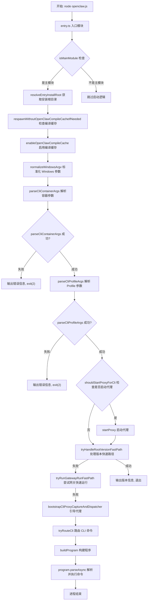
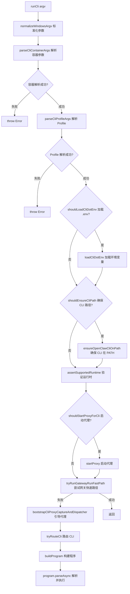
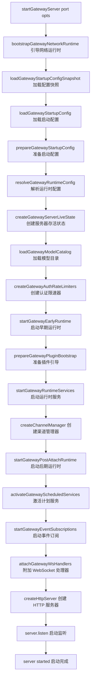
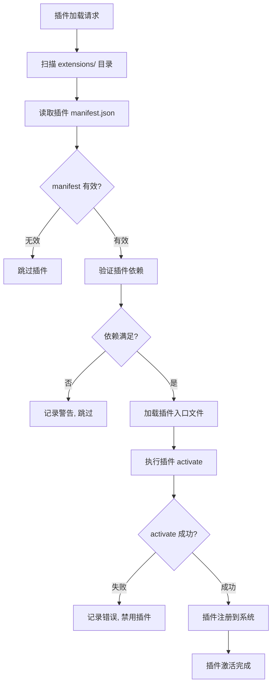
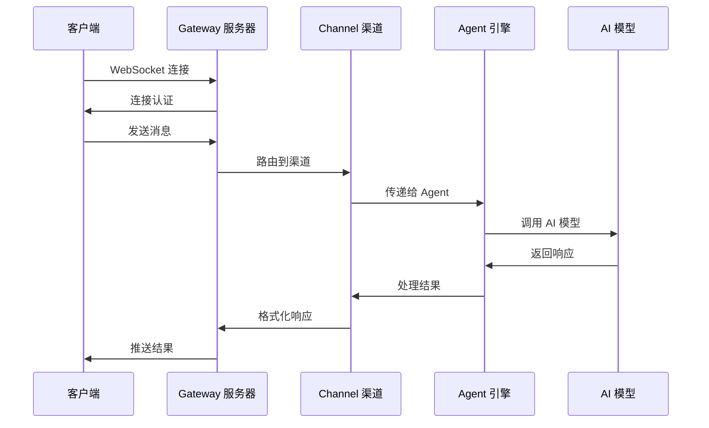

# OpenClaw 核心模块流程文档

## 概述

本文档详细说明 OpenClaw 项目核心模块的架构和执行流程。

## 1. 应用启动流程 (entry.ts)

### 1.1 启动入口流程图



### 1.2 entry.ts 代码注释

```typescript
// 1. 导入 Node.js 原生模块
import process from "node:process";  // Node.js 进程模块
import { fileURLToPath } from "node:url";  // URL 转文件路径工具
import { formatUncaughtError } from "./infra/errors.js";  // 错误格式化

// 2. 核心基础设施导入
import { runFatalErrorHooks } from "./infra/fatal-error-hooks.js";  // 运行致命错误钩子
import { isMainModule } from "./infra/is-main.js";  // 判断是否为主模块

// 3. 安装未处理异常/拒绝处理器
installUnhandledRejectionHandler();  // 设置全局未处理 Promise 拒绝处理器

// 4. 监听未捕获异常事件
process.on("uncaughtException", (error) => {
  // 判断异常是否已被处理
  if (isUncaughtExceptionHandled(error)) return;
  
  // 判断是否为良性异常
  if (isBenignUncaughtExceptionError(error)) {
    console.warn("[openclaw] Non-fatal uncaught exception:", formatUncaughtError(error));
    return;
  }
  
  // 输出致命异常并运行致命错误钩子
  console.error("[openclaw] Uncaught exception:", formatUncaughtError(error));
  for (const message of runFatalErrorHooks({ reason: "uncaught_exception", error })) {
    console.error("[openclaw]", message);
  }
  // 恢复终端状态并退出
  restoreTerminalState("uncaught exception", { resumeStdinIfPaused: false });
  process.exit(1);
});

// 5. 运行 CLI 主入口
void runLegacyCliEntry(process.argv).catch((err) => {
  console.error("[openclaw] CLI failed:", formatUncaughtError(err));
  for (const message of runFatalErrorHooks({ reason: "legacy_cli_failure", error: err })) {
    console.error("[openclaw]", message);
  }
  restoreTerminalState("legacy cli failure", { resumeStdinIfPaused: false });
  process.exit(1);
});
```

## 2. CLI 主运行流程 (cli/run-main.ts)

### 2.1 CLI 路由流程图



### 2.2 runCli 代码注释

```typescript
// CLI 主运行函数
export async function runCli(argv: string[] = process.argv) {
  // Step 1: 标准化 Windows 命令行参数
  const originalArgv = normalizeWindowsArgv(argv);
  
  // Step 2: 创建启动追踪器
  const startupTrace = createGatewayCliMainStartupTrace(originalArgv);
  
  // Step 3: 解析容器参数 (Docker/Podman)
  const parsedContainer = parseCliContainerArgs(originalArgv);
  if (!parsedContainer.ok) throw new Error(parsedContainer.error);
  
  // Step 4: 解析 Profile 参数 (开发/生产环境)
  const parsedProfile = parseCliProfileArgs(parsedContainer.argv);
  if (!parsedProfile.ok) throw new Error(parsedProfile.error);
  
  // Step 5: 应用 Profile 环境变量
  if (parsedProfile.profile) applyCliProfileEnv({ profile: parsedProfile.profile });
  
  // Step 6: 尝试在容器中运行
  const containerTarget = maybeRunCliInContainer(originalArgv);
  if (containerTarget.handled) return;
  
  // Step 7: 加载 .env 文件 (如果存在)
  if (shouldLoadCliDotEnv()) await loadCliDotEnv({ quiet: true });
  
  // Step 8: 标准化环境变量
  normalizeEnv();
  
  // Step 9: 确保 OpenClaw CLI 在 PATH 中
  if (shouldEnsureCliPath(normalizedArgv)) ensureOpenClawCliOnPath();
  
  // Step 10: 验证支持的运行时
  assertSupportedRuntime();
  
  // Step 11: 启动代理 (如果需要)
  if (shouldStartProxyForCli(normalizedArgv)) {
    const [{ getRuntimeConfig }, { startProxy }] = await Promise.all([
      import("../config/io.js"),
      import("../infra/net/proxy/proxy-lifecycle.js"),
    ]);
    proxyHandle = await startProxy(config?.proxy ?? undefined);
  }
  
  // Step 12: 尝试网关快速路径
  if (await tryRunGatewayRunFastPath(normalizedArgv, startupTrace)) return;
  
  // Step 13: 引导 CLI 代理
  await bootstrapCliProxyCaptureAndDispatcher(startupTrace);
  
  // Step 14: 路由 CLI 命令
  const { tryRouteCli } = await import("./route.js");
  if (await tryRouteCli(normalizedArgv)) return;
  
  // Step 15: 构建并解析主程序
  const program = await buildProgram();
  await program.parseAsync(parseArgv);
}
```

## 3. 网关服务器流程 (gateway/server.impl.ts)

### 3.1 Gateway 启动流程图



### 3.2 Gateway 服务器核心代码注释

```typescript
// Gateway 服务器启动主函数
export async function startGatewayServer(
  port = 18789,  // 默认端口 18789
  opts: GatewayServerOptions = {},
): Promise<GatewayServer> {
  // Step 1: 引导网关网络运行时
  bootstrapGatewayNetworkRuntime();
  
  // Step 2: 设置环境变量 - 端口号
  process.env.OPENCLAW_GATEWAY_PORT = String(port);
  
  // Step 3: 创建启动追踪器
  const startupTrace = createGatewayStartupTrace();
  
  // Step 4: 加载配置快照
  const startupConfigLoad = await startupTrace.measure("config.snapshot", () =>
    loadGatewayStartupConfigSnapshot({ minimalTestGateway, log, measure: startupTrace.measure })
  );
  
  // Step 5: 准备网关启动配置
  const { config, statWriter } = await startupTrace.measure("config.load", () =>
    prepareGatewayStartupConfig({
      snapshot: startupConfigLoad.snapshot,
      minimalTestGateway,
      log,
    })
  );
  
  // Step 6: 解析网关运行时配置
  const runtimeConfig = await startupTrace.measure("config.runtime", () =>
    resolveGatewayRuntimeConfig(config)
  );
  
  // Step 7: 创建网关服务器存活状态
  const liveState = await startupTrace.measure("liveState", () =>
    createGatewayServerLiveState({ config, log })
  );
  
  // Step 8: 加载 AI 模型目录
  await startupTrace.measure("modelCatalog", () =>
    loadGatewayModelCatalog({ force: false })
  );
  
  // Step 9: 创建认证限速器
  const { rateLimiter, browserRateLimiter } = createGatewayAuthRateLimiters(
    runtimeConfig.auth?.rateLimit
  );
  
  // Step 10: 启动早期运行时
  await startupTrace.measure("earlyRuntime", () =>
    startGatewayEarlyRuntime({ config: runtimeConfig, log, liveState })
  );
  
  // Step 11: 准备插件引导
  const pluginBootstrap = await startupTrace.measure("plugin.prepare", () =>
    prepareGatewayPluginBootstrap({ config: runtimeConfig, log })
  );
  
  // Step 12: 启动运行时服务
  await startupTrace.measure("runtimeServices", () =>
    startGatewayRuntimeServices({ config: runtimeConfig, liveState, log })
  );
  
  // Step 13: 创建渠道管理器
  const channelManager = await startupTrace.measure("channels", () =>
    createChannelManager({ config: runtimeConfig, liveState })
  );
  
  // Step 14: 启动后期运行时
  await startupTrace.measure("postAttachRuntime", () =>
    startGatewayPostAttachRuntime({ config: runtimeConfig, liveState, log })
  );
  
  // Step 15: 激活计划服务 (Cron 任务)
  await startupTrace.measure("scheduledServices", () =>
    activateGatewayScheduledServices({ config: runtimeConfig, liveState })
  );
  
  // Step 16: 启动事件订阅
  await startupTrace.measure("eventSubscriptions", () =>
    startGatewayEventSubscriptions({ config: runtimeConfig, liveState })
  );
  
  // Step 17: 附加 WebSocket 处理器
  await startupTrace.measure("wsHandlers", () =>
    attachGatewayWsHandlers({ config: runtimeConfig, liveState, rateLimiter })
  );
  
  // Step 18: 创建并启动 HTTP 服务器
  const server = createHttpServer(runtimeConfig, liveState);
  await new Promise<void>((resolve) => server.listen(port, resolve));
  
  return { close: async () => {/* 关闭逻辑 */}} ;
}
```

## 4. 插件系统流程 (plugins/)

### 4.1 插件加载流程图



## 5. 消息处理流程

### 5.1 消息流转图



## 6. 模块依赖关系

```
┌──────────────────────────────────────────────────────────────┐
│                      entry.ts                                │
│                   (应用入口点)                                │
└─────────────────────────┬────────────────────────────────────┘
                          │
                          ▼
┌──────────────────────────────────────────────────────────────┐
│                      index.ts                                │
│                    (主模块导出)                                │
└─────────────────────────┬────────────────────────────────────┘
                          │
                          ▼
┌──────────────────────────────────────────────────────────────┐
│                    cli/run-main.ts                           │
│                   (CLI 主运行逻辑)                            │
└─────────────────────────┬────────────────────────────────────┘
                          │
          ┌───────────────┼───────────────┐
          ▼               ▼               ▼
    ┌──────────┐   ┌────────────┐   ┌──────────┐
    │  config  │   │  gateway/   │   │ plugins/ │
    │ (配置)   │   │ (网关核心)  │   │ (插件)   │
    └──────────┘   └──────┬─────┘   └────┬─────┘
                          │               │
                          ▼               ▼
                   ┌────────────────┐  ┌───────────┐
                   │ server.impl.ts │  │ extensions│
                   │ (网关服务器)    │  │ (扩展模块) │
                   └────────────────┘  └───────────┘
```

## 7. 关键文件索引

| 文件路径 | 职责 |
|---------|------|
| `src/entry.ts` | 应用入口，进程初始化 |
| `src/index.ts` | 主模块导出 |
| `src/cli/run-main.ts` | CLI 主运行逻辑 |
| `src/gateway/server.impl.ts` | Gateway 服务器实现 |
| `src/gateway/server.ts` | Gateway 服务器导出 |
| `src/plugins/` | 插件系统 |
| `src/channels/` | 渠道抽象层 |
| `src/agents/` | Agent 引擎核心 |
| `src/config/` | 配置系统 |
| `src/library.ts` | 库模式导出 |
