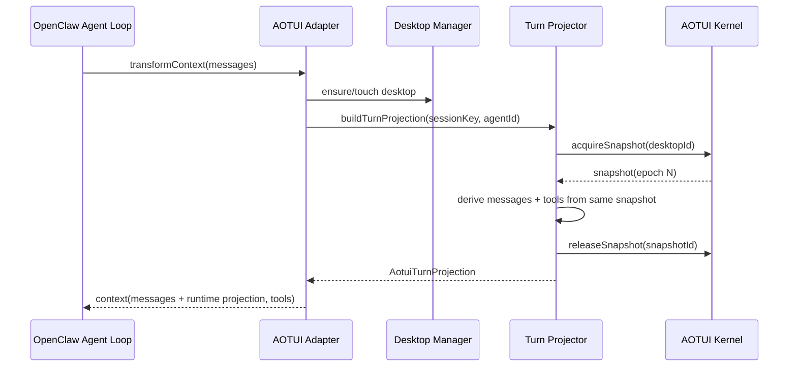

# OpenClaw x AOTUI Technical RFC

## 0. Relationship to the principles document

This RFC operationalizes the rules in `OPENCLAW_AOTUI_DESIGN_PRINCIPLES.md`.

The principles document defines the immutable architectural stance.
This RFC defines:

- how the current integration should be interpreted
- what target architecture OpenClaw should converge to
- what concrete abstractions and code paths should exist
- what must be fixed, removed, or constrained
- how the system should evolve without violating the principles

If this RFC conflicts with the principles document, the principles document wins.

## 1. Status of the current integration

OpenClaw already contains a functioning AOTUI integration layer.

Current entry points:

- runtime bootstrap: `src/aotui/runtime.ts`
- kernel service: `src/aotui/kernel-service.ts`
- session-to-desktop binding: `src/aotui/session-desktop-manager.ts`
- agent adapter: `src/aotui/agent-adapter.ts`
- snapshot projector: `src/aotui/projector.ts`
- gateway startup: `src/gateway/server.impl.ts`
- agent run install path: `src/agents/pi-embedded-runner/run/attempt.ts`
- session reset sync path: `src/commands/agent.ts`

This means the integration is no longer hypothetical.
The system already has:

- a gateway-scoped AOTUI runtime
- session-bound desktops
- per-run adapter installation
- snapshot-to-messages projection
- snapshot-to-tools projection
- tool routing back into the AOTUI kernel

The question is no longer "should OpenClaw integrate AOTUI".
The question is:

How should OpenClaw harden, constrain, and evolve this integration so it becomes a durable subsystem rather than a fragile adapter?

## 2. Architectural thesis

The integration should be interpreted as follows:

- OpenClaw is the only orchestrator.
- AOTUI is a stateful runtime surface for agent-facing apps.
- AOTUI is not durable truth storage.
- AOTUI is a volatile operational scratchpad.
- Semantic continuity survives compaction.
- Full UI continuity does not need to survive compaction.

In practical terms:

- OpenClaw owns the agent loop, transcript, compaction, policy, and config.
- AOTUI owns live app execution, live tool surfacing, and live state projection.
- The LLM sees AOTUI as part of its current world, not as the canonical session archive.

This is the only framing that remains stable under scale.

If AOTUI is treated as permanent state, token costs climb until the system fights itself.
If AOTUI is treated as disposable world state with semantic carryover, the system can remain fast, compressible, and recoverable.

## 3. Why this architecture is correct

### 3.1 The real bottleneck is not CPU or memory, but model cognition budget

In a classical app stack, UI state is cheap.
In an agent system, UI state becomes expensive the moment it is projected into the model context.

This changes the economics:

- richer UI state means higher cognition cost
- higher cognition cost means earlier compaction
- earlier compaction means more information loss risk

Therefore the system must optimize for semantic density, not state completeness.

### 3.2 Human operators do not maintain implicit boundaries

Any design that depends on people remembering:

- where app policy comes from
- what survives reset
- whether idle lifecycle is real
- whether injected context is transcript truth

will rot.

So the architecture must encode its own boundaries:

- one control plane
- one authority
- explicit compaction behavior
- explicit state-loss assumptions

### 3.3 Systems survive by rebuilding cheap things and preserving expensive things

Cheap things:

- derived panels
- temporary views
- expanded trees
- transient file details
- internal app working state

Expensive things:

- current task semantics
- current active object/resource
- current constraints
- current execution intent
- capability policy

The correct system preserves the expensive and rebuilds the cheap.

## 4. Scope

This RFC covers:

- OpenClaw-side AOTUI runtime ownership
- session/desktop identity model
- tool and message projection model
- compaction behavior
- app policy/config ownership
- state-loss model for AOTUI apps
- rollout and validation plan

This RFC does not attempt to redesign upstream AOTUI runtime internals.
Where upstream changes are useful, they are noted, but OpenClaw-side boundaries remain the focus.

## 5. Non-goals

This RFC explicitly does not aim to:

- preserve the full AOTUI internal tree across compaction
- make AOTUI a second transcript layer
- keep every AOTUI app installed for every agent
- retain hidden in-memory app internals across turns
- solve all future multi-channel capability scoping in phase 1
- preserve dead lifecycle code for hypothetical future use

## 6. Current-state diagnosis

The current integration is directionally correct but structurally incomplete.

### 6.1 Things that are already correct

#### A. Gateway-scoped runtime ownership

`src/gateway/server.impl.ts` starts one gateway-level AOTUI runtime via `startAotuiGatewayRuntime()`.

This is correct.

Reason:

- one runtime per run would destroy continuity
- one runtime per session would multiply cold starts and control complexity
- a gateway-scoped runtime allows a shared kernel while still keeping session-bound desktops

#### B. Session-bound desktop concept

`src/aotui/session-desktop-manager.ts` binds desktops to normalized `sessionKey`.

This is correct.

Reason:

- `sessionKey` is the stable continuity anchor
- `runId` is not
- retry loops and model fallbacks should not create new worlds

#### C. Adapter-based integration

`src/aotui/agent-adapter.ts` installs into the agent as a transform/tool adapter.

This is correct.

Reason:

- it preserves OpenClaw's execution authority
- it avoids invasive changes to the core runner
- it keeps AOTUI as a bounded integration layer

### 6.2 Things that are wrong or incomplete

#### A. Reset path loses identity fidelity

`src/aotui/runtime.ts` currently calls `resetDesktop()` without preserving the full binding packet.
`src/aotui/session-desktop-manager.ts` recreates the desktop from partial data.

This is unacceptable for `agentId`.

It may be acceptable for `workspaceDir` in the new machine-scope model, but not for identity-bearing metadata.

#### B. Tools and messages are sampled from different snapshots

`src/aotui/agent-adapter.ts` independently acquires snapshots for tools and messages.

This violates the one-turn-one-world rule.

#### C. App registry authority is external

`src/aotui/kernel-service.ts` uses `AppRegistry.loadFromConfig()`.

This leaves actual capability exposure partly controlled by external config instead of OpenClaw.

That creates drift and makes the system operationally dishonest.

#### D. Idle lifecycle exists in code but not as a reliable subsystem

`src/aotui/session-desktop-manager.ts` contains idle suspend/destroy logic.
But if the sweep loop is not a real running subsystem, the lifecycle feature is fictional.

Fictional lifecycle code must not remain.

#### E. Runtime/system text is currently projected as user messages

`src/aotui/projector.ts` currently emits system-like information with `role: "user"`.

This is semantically wrong.

#### F. Unused runtime config surface exists

The AOTUI integration exposes runtime options that are not fully productized.

Unused config surface weakens clarity and should be removed until real.

## 7. Target architecture

The target OpenClaw x AOTUI architecture should be composed of six layers.

### 7.1 Layer 1: Runtime Service

Responsibility:

- own the gateway-scoped AOTUI kernel
- manage lifecycle
- expose desktop manager and execution kernel

Concrete component:

- `AotuiKernelService`

Current file:

- `src/aotui/kernel-service.ts`

Required property:

- runtime ownership is singular and process-local to the gateway

### 7.2 Layer 2: Desktop Identity and Session Binding

Responsibility:

- map canonical OpenClaw session identity to one AOTUI desktop identity
- preserve identity metadata across resets and recreations
- expose touch/resume/destroy operations

Concrete component:

- `SessionDesktopManager`

Current file:

- `src/aotui/session-desktop-manager.ts`

Required property:

- identity packets are not truncated

### 7.3 Layer 3: Policy Resolution

Responsibility:

- decide which AOTUI apps an agent is allowed to use
- decide which apps are installed into a desktop
- decide projection policy defaults

Concrete target component:

- `AotuiPolicyResolver`

This does not yet exist as a first-class abstraction.
It should be introduced.

### 7.4 Layer 4: Turn Projection

Responsibility:

- acquire one snapshot epoch
- derive both messages and tools from that same epoch
- apply projection budget policy
- return one atomic turn-facing representation

Concrete target component:

- `AotuiTurnProjector`

This should replace today's split "build messages" and "build tools" sampling.

### 7.5 Layer 5: Agent Adapter

Responsibility:

- install transform context
- install tools
- route tool calls
- keep OpenClaw agent integration bounded to one object

Concrete component:

- `OpenClawAgentAdapter`

Current file:

- `src/aotui/agent-adapter.ts`

Required property:

- no direct orchestration authority

### 7.6 Layer 6: Reinitialization Coordinator

Responsibility:

- define what happens to AOTUI state when OpenClaw compacts context
- reinitialize every app on the desktop back to its initial state when policy says so
- preserve only the behavior required by the principles document

Concrete target component:

- `AotuiReinitializationCoordinator`

This does not yet exist as a first-class abstraction.
It should be introduced.

## 8. Proposed data model

### 8.1 Desktop binding packet

OpenClaw must treat desktop binding as a complete identity packet, not as a loose bag of optional fields.

Proposed shape:

```ts
export type AotuiDesktopBinding = {
  sessionKey: string;
  sessionId?: string;
  agentId: string;
  parentSessionKey?: string;
  threadId?: string;
  channelId?: string;
  accountId?: string;
};
```

Rules:

- `sessionKey` is the stable world identity
- `agentId` is mandatory for policy, attribution, and future budget logic
- reset must preserve this packet unless there is a semantically explicit world change

### 8.2 Agent app policy

OpenClaw needs an explicit policy record for app exposure.

Proposed shape:

```ts
export type AotuiAgentPolicy = {
  apps: string[];
  projection?: {
    roleForSystemInstruction?: "system" | "developer";
    maxViewStatesPerTurn?: number;
    includeDesktopState?: boolean;
  };
  compaction?: {
    clearAppState?: boolean;
  };
};
```

This is agent-first.
Session/channel refinement can be layered later only when truly needed.

### 8.3 Atomic turn projection

OpenClaw needs a one-shot projection object.

Proposed shape:

```ts
export type AotuiTurnProjection = {
  snapshotId: string;
  createdAt: number;
  messages: AgentMessage[];
  tools: AgentTool[];
  bindings: Map<string, AotuiToolBinding>;
};
```

Rules:

- one turn -> one snapshot epoch
- messages and tools are siblings, not separately sampled artifacts
- the adapter installs one projection, not two unrelated products

## 9. Config authority

### 9.1 Required policy

AOTUI app installation and projection policy must move fully into OpenClaw config.

The exact config shape may still evolve, but the authority boundary must not.

Illustrative shape:

```yaml
aotui:
  enabled: true
  agentApps:
    main:
      apps:
        - "@agentina/aotui-ide"
      projection:
        roleForSystemInstruction: system
        includeDesktopState: true
        maxViewStatesPerTurn: 4
      compaction:
        clearAppState: true
```

This RFC does not require this exact YAML shape.
It requires the capability source of truth to live in OpenClaw config and nowhere else.

### 9.2 Hard rule

The kernel service must not silently load app policy from an external non-OpenClaw global config.

That control plane must be removed or wrapped by an OpenClaw-owned resolver.

## 10. Request and runtime lifecycle

### 10.1 Gateway startup

At gateway startup:

1. OpenClaw starts one AOTUI kernel service.
2. OpenClaw initializes app policy sources from OpenClaw config.
3. OpenClaw does not install all apps into all desktops eagerly.

Reason:

- eager global installation is wasteful
- capability should be agent-scoped
- desktops should be cheap until actually used

### 10.2 Session sync

At session creation or reuse:

1. OpenClaw resolves canonical `sessionKey`.
2. OpenClaw resolves agent identity.
3. OpenClaw ensures the desktop exists for that session.
4. OpenClaw preserves the full binding packet across reset.

### 10.3 Per-turn projection

At each model turn:

1. Adapter ensures the desktop is ready.
2. Adapter requests one atomic projection from the turn projector.
3. The projector acquires one snapshot.
4. The projector derives both messages and tools from that snapshot.
5. Adapter replaces old AOTUI-injected runtime messages with the new ones.
6. Adapter replaces tool surface with base tools + current AOTUI tools.

Mermaid view:



### 10.4 Tool call routing

When a projected AOTUI tool is called:

1. Adapter resolves the binding from the active projection.
2. Adapter acquires desktop lock.
3. Adapter executes the AOTUI operation on that desktop.
4. Adapter releases the lock.

This preserves OpenClaw as caller and AOTUI as execution target.

## 11. Projection semantics

### 11.1 Message roles

System-like content emitted from AOTUI must not use `role: "user"`.

At minimum:

- `systemInstruction` should be emitted as `system`-equivalent runtime context
- desktop/view markup should remain clearly distinct from user-authored messages

The exact carrier may be:

- `system`
- a future internal runtime wrapper

But it must not pretend to be user intent.

### 11.2 Projection budget order

Projection should be budgeted in this order:

1. active app and active view first
2. current desktop state second
3. additional surfaced views only if still worth the tokens
4. historical or redundant runtime fragments never by default

The system must optimize for relevance density, not exhaustiveness.

### 11.3 Projection is current-state projection, not replay

The AOTUI projector should expose the latest relevant world.
It should not replay historical UI evolution.

## 12. Compaction model

### 12.1 Design stance

OpenClaw compaction is allowed to reinitialize the apps on a desktop back to their initial state.

This is not a fallback.
This is a deliberate behavior.

Reason:

- AOTUI is a working surface
- long-lived task continuity should survive via language summary and fresh reinjection
- full UI continuity is too expensive to treat as sacred

### 12.2 What survives compaction

Compaction survival model:

- transcript summary preserves current active work semantics
- next-turn reinjection preserves desktop/app identity and entry points
- app working state itself may be reinitialized away

This means OpenClaw does not need a separate structured AOTUI compaction-summary artifact as a baseline requirement.

### 12.3 What the compaction summary must preserve

The summary must preserve:

- the current active app
- the current active view
- the current active object or resource
- the task state
- the operative constraints
- the intended next step

This is not optional.
If summary quality is poor, app reinitialization becomes destructive.

### 12.4 What is explicitly not guaranteed to survive

The system should not guarantee survival of:

- hidden subtree state
- temporary derived panels
- stale internal detail views
- invisible app-local caches
- arbitrary internal component state

### 12.5 Proposed compaction-triggered reinitialization abstraction

OpenClaw should introduce a first-class coordinator:

```ts
export interface AotuiReinitializationCoordinator {
  reinitializeDesktopApps(input: {
    sessionKey: string;
    sessionId?: string;
    agentId: string;
    reason: "context_compaction" | "manual_reset";
  }): Promise<void>;
}
```

Behavior:

- if compaction policy says desktop apps should be reinitialized, reset each app back to its initial state
- preserve desktop identity, app identities, and re-entry surface
- exact internal mechanism may vary

The mechanism is implementation detail.
The semantics are not.

### 12.6 Acceptable implementation strategies for app reinitialization

Any of the following are acceptable if they preserve the semantics above:

- app-level reinitialization hook
- dismounting non-root working views
- restarting app-local state while preserving desktop/app installation
- desktop-local app reload without changing session identity

What is not acceptable:

- silent destruction of the entire continuity model
- losing agent identity
- losing app availability policy
- making post-compaction re-entry depend on hidden state

## 13. App contract for OpenClaw-integrated AOTUI apps

Every app integrated through this model must be designed under a state-loss assumption.

### 13.1 Hard app rules

Apps must assume:

- the app can be reinitialized after compaction
- hidden in-memory state is not durable
- only surfaced active-state semantics can reasonably survive

### 13.2 What apps must do

Apps should:

- expose critical current state through active views
- expose critical resource identifiers explicitly
- treat derived panels as rebuildable
- keep re-entry pathways obvious

### 13.3 What apps must not assume

Apps must not assume:

- hidden component state survives
- every open detail view survives
- every prior navigation tree survives
- compaction is rare enough to ignore

## 14. Idle lifecycle policy

OpenClaw should make one of two choices, and only one:

### Option A: delete idle lifecycle now

If idle suspend/destroy is not actively managed by a real scheduler, remove:

- idle options
- idle state branch
- idle-specific tests and promises

This is the preferred option unless the team is ready to productize lifecycle management immediately.

### Option B: productize it fully

If idle lifecycle is wanted, then OpenClaw must add:

- a real sweep driver
- truthful state transitions
- observability
- tests for suspend/resume/destroy correctness

Half-real lifecycle is forbidden.

## 15. Observability and diagnostics

OpenClaw should expose enough telemetry to answer the following questions without guesswork:

1. Which desktop did this session use?
2. Which apps were installed for this agent?
3. Which snapshot epoch produced this turn's tools and messages?
4. Was this turn projected from one snapshot or multiple?
5. How many prompt tokens came from AOTUI projection?
6. Did compaction reinitialize desktop apps?
7. Could the agent successfully re-enter useful work after compaction?

Minimal diagnostics to add:

- desktop id + session key mapping logs
- projection snapshot id logs
- AOTUI projection message/tool counts
- token contribution estimates for AOTUI projection
- compaction action logs for desktop-app reinitialization

## 16. Security and control implications

The dangerous failure mode here is not code execution.
The dangerous failure mode is capability confusion.

That happens when:

- users do not know which apps are actually exposed
- policy comes from more than one place
- the model sees tools it should not have
- state survives or disappears unpredictably

Therefore:

- app exposure must be policy-driven
- policy must be OpenClaw-owned
- state loss must be explicit and designed-for

## 17. Required changes from the current codebase

These changes are required for the architecture in this RFC to be true.

### 17.1 Preserve identity packet on reset

Files affected:

- `src/aotui/runtime.ts`
- `src/aotui/session-desktop-manager.ts`

Required change:

- `resetDesktop()` must accept or reconstruct the full identity packet, not only `sessionId`

### 17.2 Replace split sampling with atomic turn projection

Files affected:

- `src/aotui/agent-adapter.ts`
- `src/aotui/projector.ts`

Required change:

- messages and tools must be built from the same acquired snapshot

### 17.3 Move app registry authority into OpenClaw config

Files affected:

- `src/aotui/kernel-service.ts`
- OpenClaw config layer

Required change:

- app installation must come from OpenClaw policy, not external implicit registry config

### 17.4 Remove or productize idle lifecycle

Files affected:

- `src/aotui/session-desktop-manager.ts`
- runtime startup/scheduling path

Required change:

- delete dead lifecycle paths or wire a real scheduler

### 17.5 Fix runtime instruction role semantics

Files affected:

- `src/aotui/projector.ts`

Required change:

- stop projecting runtime/system content as user messages

### 17.6 Remove unused runtime config surface

Files affected:

- `src/aotui/types.ts`
- `src/aotui/runtime.ts`
- startup paths

Required change:

- remove options that are not truly supported

### 17.7 Introduce explicit reinitialization coordinator

Files affected:

- new `src/aotui/compaction-coordinator.ts` or equivalent
- compaction integration path in OpenClaw runner

Required change:

- compaction must have an explicit AOTUI-state policy hook

## 18. Required upstream runtime capabilities

The following capabilities are not strictly required to continue shipping OpenClaw-side hardening work.

They are required if the team wants the OpenClaw x AOTUI architecture to remain clean over time instead of gradually degrading into host-side hacks.

These requests are directed at the AOTUI runtime and SDK layer, not the OpenClaw integration layer.

### 18.1 Desktop-level app reinitialization primitive

Required capability:

The runtime should expose a host-callable primitive that reinitializes every app on a desktop back to its initial state without destroying desktop identity or app installation identity.

Illustrative API:

```ts
kernel.reinitializeDesktopApps(desktopId, {
  preserve: {
    desktopIdentity: true,
    installedApps: true,
    rootSurface: true,
  },
  reason: "context_compaction",
});
```

The exact method name is negotiable.
The semantics are not.

Required semantics:

- do not destroy the desktop
- do not create a new desktop identity
- do not uninstall and reinstall apps as a side effect
- reinitialize each app back to its initial state
- preserve enough root-level surface for re-entry

Why this is needed:

- OpenClaw cannot safely infer every app's internal state topology
- desktop destroy/recreate is too destructive for normal compaction
- app-specific host hacks do not scale and will fragment the architecture

Without this primitive, the host is forced into two bad options:

1. destroy and recreate the desktop, which is too coarse
2. learn each app's private reset semantics, which destroys framework boundaries

### 18.2 App-level reinitialization lifecycle hook

Required capability:

The SDK should expose a formal app-level lifecycle hook for compaction-triggered reinitialization.

Illustrative API:

```ts
createTUIApp({
  ...,
  onReinitialize(ctx) {
    // reset app state to initial state
    // preserve re-entry surface
  },
});
```

The exact hook name is negotiable.
The semantics are not.

Required semantics:

- runtime can invoke it during desktop-app reinitialization
- app authors can reset transient working state intentionally
- app authors can preserve root-level re-entry pathways intentionally
- host does not need to understand app-private state structure

Why this is needed:

- only app authors know which state is transient versus semantically important
- a runtime-only blind reset will always be more destructive than necessary
- if the framework does not provide a formal hook, app authors will route around the framework with implicit pseudo-durable state

That workaround behavior is predictable.
Humans optimize locally.
When the framework lacks an official survival path, they invent hidden ones.
That is how long-term framework rot begins.

### 18.3 Host-owned explicit app installation API

Required capability:

The runtime or registry layer should expose a host-owned explicit app loading/install path that does not depend on global user config as the effective source of truth.

Illustrative API:

```ts
const registry = new AppRegistry();
await registry.loadFromEntries([
  { package: "@agentina/aotui-ide", version: "..." },
  { package: "@scope/other-app", version: "..." },
]);

await registry.installSelected(desktop, ["@agentina/aotui-ide"], { dynamicConfig });
```

Again, the exact API is negotiable.
The semantics are not.

Required semantics:

- host explicitly controls which apps are loadable
- host explicitly controls which apps are installed into a given desktop
- effective capability surface is no longer inferred from ambient global runtime config

Why this is needed:

- a split control plane always drifts
- drift destroys operability faster than explicit bugs do
- capability ambiguity is fatal in agent systems because it changes both behavior and cost surface

This is not a cosmetic control issue.
It is a long-term truth-management issue.

If OpenClaw config says one thing while a global runtime config says another, the system no longer has a stable answer to:

- what tools the model should see
- what apps should exist
- why token cost changed
- why two machines behave differently

### 18.4 Priority order of upstream requests

If only one upstream capability can be added soon, it should be the desktop-level app reinitialization primitive.

Priority order:

1. desktop-level app reinitialization primitive
2. app-level `onReinitialize` lifecycle hook
3. host-owned explicit app installation API

Reason:

- without (1), OpenClaw compaction coordination remains structurally coarse
- without (2), apps cannot participate gracefully and will either over-preserve or over-lose state
- without (3), control-plane drift remains a long-term systems risk

### 18.5 What does not need upstream runtime changes

The following integration fixes are correctly owned by OpenClaw and do not require runtime changes:

- preserving identity packet across reset on the OpenClaw side
- one-turn-one-snapshot projection in the OpenClaw adapter
- role semantics for projected runtime messages
- OpenClaw-side projection budgeting

The runtime should not be changed just because the host previously sampled it poorly.
Those responsibilities belong to the host adapter.

## 19. Rollout plan

This should land in phases.

### Phase 1: Make the current integration truthful

Ship:

- identity packet preservation
- one-turn-one-snapshot projection
- role semantics fix
- remove dead idle code or fully disable it
- remove unused runtime config surface

Goal:

- eliminate architectural lies

### Phase 2: Move authority into OpenClaw config

Ship:

- agent-first app policy in OpenClaw config
- app installation resolver
- removal of external hidden control plane

Goal:

- eliminate capability drift

### Phase 3: Introduce explicit reinitialization coordinator

Ship:

- app reinitialization policy
- post-compaction re-entry semantics
- logging and tests

Goal:

- align compaction behavior with the principles document

### Phase 4: Budget and diagnostics hardening

Ship:

- AOTUI projection budget telemetry
- projection token contribution reporting
- re-entry success diagnostics

Goal:

- make the system operable at scale

## 20. Testing strategy

At minimum, the following tests must exist.

### Identity and lifecycle

- desktop reset preserves `agentId`
- session reuse keeps the same desktop identity model
- idle behavior is either absent or fully correct

### Turn projection

- one turn gets tools and messages from the same snapshot id
- old AOTUI injected messages are replaced cleanly
- runtime/system messages are not emitted as user intent

### Policy

- only agent-allowed apps are installed
- no hidden external app config changes the visible capability surface

### Compaction

- compaction can reinitialize desktop apps
- active-work continuity survives via summary + reinjection
- post-compaction re-entry remains possible

## 21. Done criteria

The OpenClaw x AOTUI architecture is considered aligned when all of the following are true:

- OpenClaw config fully determines AOTUI app exposure
- desktops are bound to canonical session identity
- resets preserve agent identity
- one turn uses one snapshot epoch for both tools and messages
- runtime/system projection is semantically distinct from user intent
- compaction has an explicit AOTUI policy and may reinitialize desktop apps
- app authors are expected to design for state loss
- diagnostics make projection and compaction behavior observable

## 22. One-paragraph summary

OpenClaw should treat AOTUI as a gateway-owned, session-bound, agent-facing runtime surface that exposes live state and tools to the model but does not own durable truth; the system must preserve semantic continuity, allow `appState` reclamation during compaction, derive one turn from one snapshot epoch, and keep all capability and lifecycle authority inside OpenClaw rather than in hidden external control planes.
