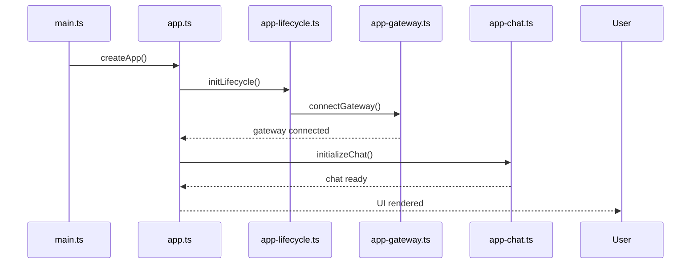
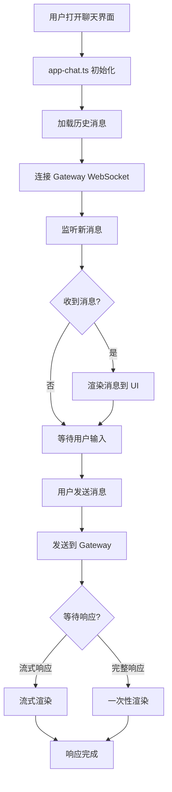
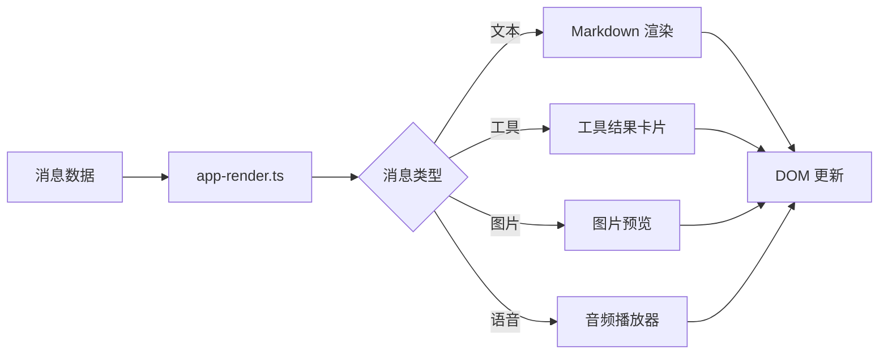
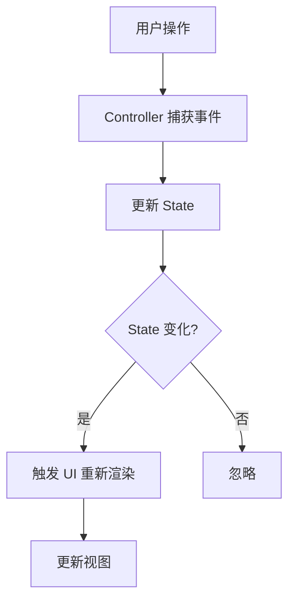
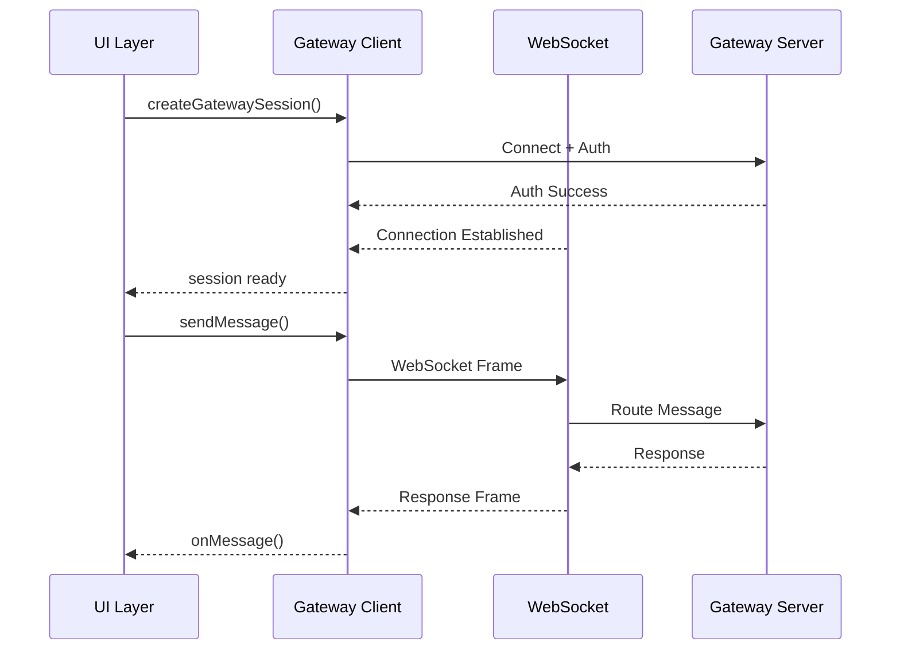
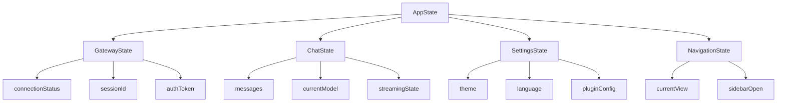

# OpenClaw UI 模块流程文档

## 概述

UI 模块是 OpenClaw 的前端界面模块，基于 Web 技术构建，负责用户交互和界面展示。

## 1. UI 模块结构

```
ui/
├── index.html          # HTML 入口
├── package.json        # 包配置
├── vite.config.ts      # Vite 配置
├── public/            # 静态资源
├── src/
│   ├── main.ts         # 主入口
│   ├── styles/         # 样式文件
│   ├── i18n/          # 国际化
│   ├── types/          # 类型定义
│   └── ui/             # UI 组件
│       ├── app.ts      # 应用主组件
│       ├── app-chat.ts # 聊天界面
│       ├── app-settings.ts # 设置界面
│       ├── chat/       # 聊天组件
│       ├── components/ # UI 组件
│       ├── controllers/# 控制器
│       └── views/      # 视图
```

## 2. 应用启动流程

### 2.1 启动时序图



## 3. 主要界面组件

### 3.1 聊天界面流程 (app-chat.ts)



### 3.2 消息渲染流程



## 4. 控制器架构

### 4.1 控制器列表

| 控制器 | 功能 |
|-------|------|
| `ChatModelRefController` | 模型选择管理 |
| `ChatScrollController` | 滚动位置管理 |
| `RealtimeTalkController` | 实时语音对话 |
| `ToolStreamController` | 工具流处理 |
| `SettingsRefreshController` | 设置刷新 |

### 4.2 控制器流程



## 5. Gateway 连接流程

### 5.1 WebSocket 连接时序



## 6. 应用状态管理

### 6.1 状态架构



## 7. 关键文件

| 文件路径 | 职责 |
|---------|------|
| `ui/src/main.ts` | 应用入口点 |
| `ui/src/ui/app.ts` | 应用主组件 |
| `ui/src/ui/app-chat.ts` | 聊天界面 |
| `ui/src/ui/app-settings.ts` | 设置界面 |
| `ui/src/ui/gateway.ts` | Gateway 客户端封装 |
| `ui/src/ui/app-lifecycle.ts` | 应用生命周期 |
| `ui/src/ui/storage.ts` | 本地存储管理 |
| `ui/src/ui/theme.ts` | 主题管理 |

## 8. Vite 配置

```typescript
// vite.config.ts
export default defineConfig({
  server: {
    port: 3000,  // 开发服务器端口
    proxy: {
      // API 请求代理到 Gateway
      "/api": {
        target: "http://localhost:18789",
        changeOrigin: true,
      },
    },
  },
  build: {
    outDir: "dist",  // 输出目录
    sourcemap: true,  // 生成 sourcemap
  },
});
```
