# Operator1 Database Schema

## Entity Relationship Diagram

```mermaid
erDiagram
    %% Core Config
    op1_config {
        int id PK
        text raw_json5
        int written_at
    }

    core_schema_version {
        int version PK
        int applied_at
        text description
    }

    core_settings {
        text scope PK
        text key PK
        text value_json
        int updated_at
    }

    %% Auth System
    auth_credentials {
        text provider PK
        text account_id PK
        text credentials_json
        int expires_at
        int updated_at
    }

    op1_auth_profiles {
        text profile_id PK
        text type
        text provider
        text credential_json
        text email
        text metadata_json
        int created_at
        int updated_at
    }

    op1_auth_profile_last_good {
        text provider PK
        text profile_id
    }

    op1_auth_profile_order {
        text provider PK
        text profile_ids_json
    }

    op1_auth_profile_usage {
        text profile_id PK
        text stats_json
    }

    %% Channel System
    channel_dc_state {
        text key PK
        text scope PK
        text value_json
        int updated_at
    }

    channel_tg_state {
        text account_id PK
        text key PK
        text value_json
        int updated_at
    }

    op1_channel_allowlist {
        text channel PK
        text account_id PK
        text sender_id PK
        int added_at
    }

    op1_channel_pairing {
        text channel PK
        text account_id PK
        text sender_id PK
        text code
        text created_at
        text last_seen_at
        text meta_json
    }

    op1_channel_thread_bindings {
        text binding_key PK
        text channel_type
        text account_id
        text thread_id
        text channel_id
        text target_kind
        text target_session_key
        text agent_id
        text label
        text bound_by
        int bound_at
        int last_activity_at
        int idle_timeout_ms
        int max_age_ms
        text webhook_id
        text webhook_token
        text extra_json
    }

    %% Cron System
    cron_jobs {
        text job_id PK
        text job_json
        int enabled
        int created_at
        int updated_at
    }

    cron_runs {
        int id PK
        text job_id FK
        text status
        text summary
        text error
        int delivered
        text delivery_status
        text delivery_error
        text session_id
        text session_key
        int run_at_ms
        int duration_ms
        int next_run_at_ms
        text model
        text provider
        text usage_json
        int started_at
        int finished_at
    }

    %% Device/Node Pairing
    op1_device_pairing_paired {
        text device_id PK
        text data_json
        int updated_at
    }

    op1_device_pairing_pending {
        text request_id PK
        text device_id
        text data_json
        int created_at
    }

    op1_node_pairing_paired {
        text node_id PK
        text data_json
        int updated_at
    }

    op1_node_pairing_pending {
        text request_id PK
        text node_id
        text data_json
        int created_at
    }

    %% Team System
    op1_team_registry {
        text team_id PK
        text name
        text status
        text config_json
        int created_at
        int updated_at
        text leader
        text leader_session
        int completed_at
    }

    op1_team_members {
        int id PK
        text team_id FK
        text agent_id
        text role
        int joined_at
        text session_key
        text state
    }

    op1_team_messages {
        int id PK
        text team_id FK
        text agent_id
        text role
        text content
        text metadata_json
        int created_at
        text message_id
        text from_agent
        text to_agent
        text read_by_json
    }

    op1_team_tasks {
        text task_id PK
        text team_id FK
        text title
        text status
        text assigned_to
        int priority
        text result_json
        int created_at
        int updated_at
        text description
        text blocked_by_json
    }

    %% Session System
    session_entries {
        text agent_id PK
        text session_key PK
        text session_id
        text session_file
        text channel
        text last_channel
        text last_to
        text last_account_id
        text last_thread_id
        text delivery_context_json
        text origin_json
        text display_name
        text group_name
        text model
        text department
        int created_at
        int updated_at
        text extra_json
    }

    op1_subagent_runs {
        text run_id PK
        text child_session_key
        text requester_session_key
        text requester_display_key
        text requester_origin_json
        text task
        text cleanup
        text label
        text model
        text workspace_dir
        int run_timeout_seconds
        text spawn_mode
        int created_at
        int started_at
        int ended_at
        text outcome_json
        int archive_at_ms
        int cleanup_completed_at
        int cleanup_handled
        text suppress_announce_reason
        int expects_completion_message
        int announce_retry_count
        int last_announce_retry_at
        text ended_reason
        int wake_on_descendant_settle
        text frozen_result_text
        int frozen_result_captured_at
        text fallback_frozen_result_text
        int fallback_frozen_result_captured_at
        int ended_hook_emitted_at
        text attachments_dir
        text attachments_root_dir
        int retain_attachments_on_keep
        text team_run_id
        int spawn_retry_count
        text agent_id
    }

    %% Workspace
    workspace_state {
        text workspace_id PK
        text workspace_path
        text agent_id
        text state_json
        int updated_at
    }

    %% ClawHub
    op1_clawhub_catalog {
        text workspace_id PK
        text skill_slug PK
        text version
        text metadata_json
        text preview_json
        int installed_at
        int updated_at
    }

    op1_clawhub_locks {
        text workspace_id PK
        text skill_slug PK
        text lock_version
        text lock_data_json
        int locked_at
    }

    %% Sandbox
    op1_sandbox_browsers {
        text container_name PK
        text data_json
        int updated_at
    }

    op1_sandbox_containers {
        text container_name PK
        text data_json
        int updated_at
    }

    %% Security
    security_exec_approvals {
        text approval_id PK
        text agent_id
        text kind
        text pattern
        text scope
        text session_key
        text approved_by
        int last_used_at
        text last_used_command
        text last_resolved_path
        int created_at
        int expires_at
    }

    %% Delivery
    delivery_queue {
        text queue_id PK
        text payload_json
        text status
        int attempts
        int max_attempts
        int next_attempt_at
        int last_attempted_at
        int created_at
        int delivered_at
        int failed_at
        text error
    }

    %% Relationships
    cron_jobs ||--o{ cron_runs : "triggers"
    op1_team_registry ||--o{ op1_team_members : "has"
    op1_team_registry ||--o{ op1_team_messages : "receives"
    op1_team_registry ||--o{ op1_team_tasks : "assigns"
    op1_auth_profiles ||--o| op1_auth_profile_usage : "tracks"
    op1_auth_profiles ||--o| op1_auth_profile_last_good : "last_used"
    op1_device_pairing_pending ||--o| op1_device_pairing_paired : "becomes"
    op1_node_pairing_pending ||--o| op1_node_pairing_paired : "becomes"
    session_entries ||--o{ op1_subagent_runs : "spawns"
    workspace_state ||--o{ op1_clawhub_catalog : "installs"
    workspace_state ||--o{ op1_clawhub_locks : "locks"
```

## Table Groups

### 🔐 Authentication (5 tables)

| Table                      | Purpose                 |
| -------------------------- | ----------------------- |
| auth_credentials           | OAuth/API keys          |
| op1_auth_profiles          | Profile definitions     |
| op1_auth_profile_last_good | Last successful profile |
| op1_auth_profile_order     | Profile ordering        |
| op1_auth_profile_usage     | Usage statistics        |

### 📡 Channels (5 tables)

| Table                       | Purpose         |
| --------------------------- | --------------- |
| channel_dc_state            | Discord state   |
| channel_tg_state            | Telegram state  |
| op1_channel_allowlist       | Allowed senders |
| op1_channel_pairing         | Pairing codes   |
| op1_channel_thread_bindings | Thread bindings |

### ⏰ Scheduling (2 tables)

| Table     | Purpose         |
| --------- | --------------- |
| cron_jobs | Job definitions |
| cron_runs | Run history     |

### 👥 Teams (4 tables)

| Table             | Purpose              |
| ----------------- | -------------------- |
| op1_team_registry | Team definitions     |
| op1_team_members  | Team membership      |
| op1_team_messages | Inter-agent messages |
| op1_team_tasks    | Task assignments     |

### 📱 Device/Node (4 tables)

| Table                      | Purpose          |
| -------------------------- | ---------------- |
| op1_device_pairing_paired  | Paired devices   |
| op1_device_pairing_pending | Pending pairings |
| op1_node_pairing_paired    | Paired nodes     |
| op1_node_pairing_pending   | Pending nodes    |

### 💬 Sessions (2 tables)

| Table             | Purpose           |
| ----------------- | ----------------- |
| session_entries   | Session metadata  |
| op1_subagent_runs | Subagent tracking |

### 📦 Workspace (1 table)

| Table           | Purpose         |
| --------------- | --------------- |
| workspace_state | Workspace state |

### 🧩 ClawHub (2 tables)

| Table               | Purpose          |
| ------------------- | ---------------- |
| op1_clawhub_catalog | Installed skills |
| op1_clawhub_locks   | Version locks    |

### 🐳 Sandbox (2 tables)

| Table                  | Purpose            |
| ---------------------- | ------------------ |
| op1_sandbox_browsers   | Browser containers |
| op1_sandbox_containers | Sandbox containers |

### 🔒 Security (1 table)

| Table                   | Purpose          |
| ----------------------- | ---------------- |
| security_exec_approvals | Exec permissions |

### 📨 Delivery (1 table)

| Table          | Purpose       |
| -------------- | ------------- |
| delivery_queue | Message queue |

### ⚙️ Core (3 tables)

| Table               | Purpose             |
| ------------------- | ------------------- |
| op1_config          | Main config (JSON5) |
| core_schema_version | Migration version   |
| core_settings       | Settings key-value  |

---

**Total: 32 tables** (excluding sqlite_sequence)
